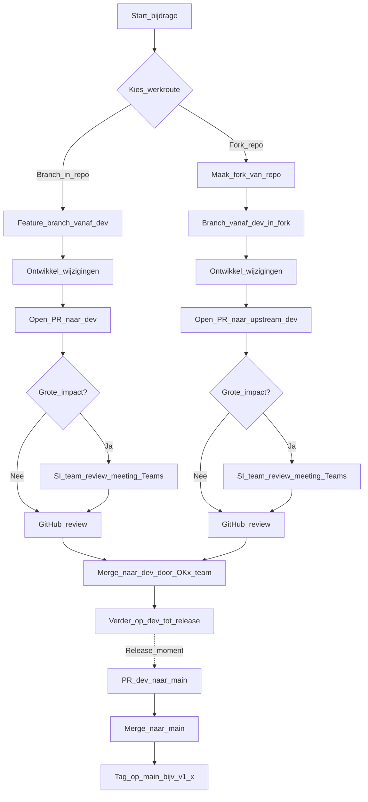

## Bijdragen aan OKx-meta

Deze repository is een knowledge base die team OKx maintaint. Leveranciers, instellingen en geinteresseerden kunnen 24/7 federatief en asynchroon bijdragen via issues en pull requests (PR's).

### Waar werken we nu aan? (samenhang)

Voordat je een issue of PR opent, is het nuttig te weten **waar** deze repo voor dient: we bouwen **keteninzicht** en **MOKA-gestuurde koppelvlakuitwerking** op — richting **technische specificaties** (o.a. berichten, modellen, **OEAPI** waar passend), zodat werk **gericht** blijft en we **lokale maxima** in één koppelvlak vermijden.

- **Actuele plaat en prioriteit** (welke informatiestromen tellen mee): [`doc/OKx_Projectoverzicht.md`](doc/OKx_Projectoverzicht.md) — *Hoofdplaat OKx informatiestromen*.
- **Ketenconcept** (wat de stromen doen, invoer voor specs): [`doc/OKx_Informatiesstromen.md`](doc/OKx_Informatiesstromen.md).
- **ArchiMate-model** met o.a. MOKA-view **`01. Onderwijsvisie vertalen naar onderwijsaanbod - Basis Model`** en het **informatiemodel** in hetzelfde koppelvlak: [`architecture/model/model.archimate`](architecture/model/model.archimate) — lees [`doc/OKx_Informatiestromen-ArchiMate-en-MOKA-view.md`](doc/OKx_Informatiestromen-ArchiMate-en-MOKA-view.md) voor waar je die views opent.
- **Architectuurbesluiten (ADR’s)**: [`architecture/dr/README.md`](architecture/dr/README.md).

Uitgebreider en voor nieuwe bijdragers: sectie *Waar draait deze repository om?* in [`doc/Bijdragen-voor-beginners.md`](doc/Bijdragen-voor-beginners.md).

### Waar meld je wat? (kort)

- **OKx-kern** (ketenfundament, informatiestromen, ArchiMate/MOKA-views): open een issue/PR in deze repo.
- **Klein/vroeg koppelvlakinitiatief** (bijv. start met minimaal 2 instellingen + 2 leveranciers): neem contact op met **MOKA** en werk volgens **AMIGO** (`https://www.edustandaard.nl/amigo/aanpak/`) met “**OEAPI, tenzij**”. Voor richtlijnen: [`moka-koppelvlakspecificaties/guidelines/OKx-guidelines-v01-09-25.md`](moka-koppelvlakspecificaties/guidelines/OKx-guidelines-v01-09-25.md).
- **Naar standaard/afsprakenstelsel (OKx/MOKA)**: om te komen tot een (sector)standaard en afsprakenstelsel volgens de **OKx guidelines**, moet een initiatief aantoonbaar **breder gedragen** zijn: **meer dan 1 instelling én meer dan 1 leverancier** moeten aangehaakt zijn (minimaal 2+2).

### Governance

- Iedereen mag issues openen en PR's indienen.
- Alleen OKx-teamleden mergen PR's.
- Team OKx begeleidt de uitbouw en bewaakt samenhang en richting.
- Een kerngroep OKx komt periodiek bij elkaar om prioriteiten en richting te geven aan verander-initiatieven op basis van GitHub issues, milestones en PR's (milestones worden handmatig beheerd).

### Wat hoort waar

- ArchiMate model: `architecture/model/model.archimate`
- ADR's (decision records): `architecture/dr/`
- Meetings (notulen + optioneel transcript): `architecture/meetings/`
- OKx context: `doc/` en `img/`
- OKE uitwerkingen: `OKE/`
- MOKA template (onderdeel van OKx): `moka-koppelvlakspecificaties/`
- Agent-artifacten (projectaanvraag / featureplan / ontwerpdocument via Cursor): `architecture/agent-artifacts/` — zie `architecture/agent-artifacts/README.md`

### Workflow (kort)

1. Start met een issue (vraag, voorstel, meeting follow-up, ADR-voorstel).
2. Werk het uit in een PR met concrete wijzigingen.
3. Link in de PR naar het issue (Fixes #123 / See also #456).
4. Als het een architectuurbesluit is: voeg of wijzig een ADR in `architecture/dr/` en link naar notulen/issues.

### Branchingstrategie & Pull Requests

- **`main`**: stabiele **release**-lijn — officiële stand; **tags** (bijv. `v1.0.0`) markeren release-momenten.
- **`dev`**: integratie van werk voor de **volgende release**; hier komen feature-PR’s op.
- **Feature branches** (`feature/…`): vertrek vanaf **`dev`**; PR richting **`dev`**.
- **Release**: wanneer `dev` klaar is voor een oplevering, gaat een PR **`dev` → `main`**, daarna eventueel een **git tag** op `main`.
- **Hotfixes** (klein, direct op release): branch vanaf **`main`**, PR naar **`main`**, en wijzigingen ook terug naar **`dev`** zodat die gelijk blijft.

**Bijdragen via branch (in deze repo)**:

- `git checkout dev` → `git pull` → nieuwe branch `feature/…` → na afloop **PR naar `dev`**.
- Review via GitHub; **merge** door OKx-teamleden.

**Bijdragen via fork**:

- Zelfde flow, maar PR naar **upstream `dev`** (of **`main`** alleen bij afgesproken hotfix).

**Grote impact** (richtlijn): architectuurwijzigingen, grote scope-/richtingwijzigingen, of wijzigingen die (templates/specificaties) “breaking” maken.

- **Bij grote impact**: PR’s gaan altijd gepaard met een review met het **SI-team** in een fysieke/digitale **Teams meeting** (naast de normale GitHub review).

#### Flow (branch of fork, met `dev` en `main`)

Uitgebreide uitleg voor beginners (Git, GitHub, Cursor, epics/issues, sprints): [`doc/Bijdragen-voor-beginners.md`](doc/Bijdragen-voor-beginners.md) — bewust **in de repo** (niet op de GitHub Wiki), i.v.m. mogelijke migratie naar bijv. self-hosted GitLab.

### Ontwerpprincipes

Zie [`architecture/docs/principes.md`](architecture/docs/principes.md) (design first, OEAPI als voorkeur tenzij strategisch anders).

### Meetings vastleggen

We werken federatief en asynchroon. Meetings worden daarom vastgelegd in de repo. Zie [`doc/Privacy-meetings-en-transcriptie.md`](doc/Privacy-meetings-en-transcriptie.md) voor **opname, AI-transcriptie** en het **publieke** karakter van bijdragen.

1. Vastleggen: opname en/of ruwe aantekeningen.
2. Transcriberen: optioneel transcript opslaan in `architecture/meetings/YYYY/YYYY-MM-DD-onderwerp-transcript.md`.
3. Samenvatten: notulen opslaan in `architecture/meetings/YYYY/YYYY-MM-DD-onderwerp.md` met links naar issues/ADR's.

### Templates

- Issue templates: `.github/ISSUE_TEMPLATE/`
- PR template: `.github/PULL_REQUEST_TEMPLATE.md`
- ADR template: `architecture/dr/template.md`
- Notulen template: `architecture/meetings/template-notulen.md`

