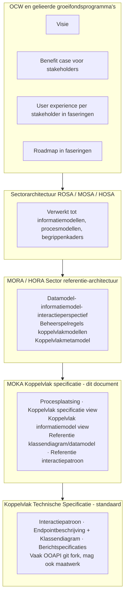
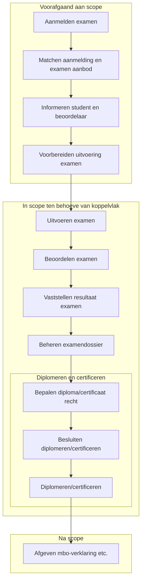
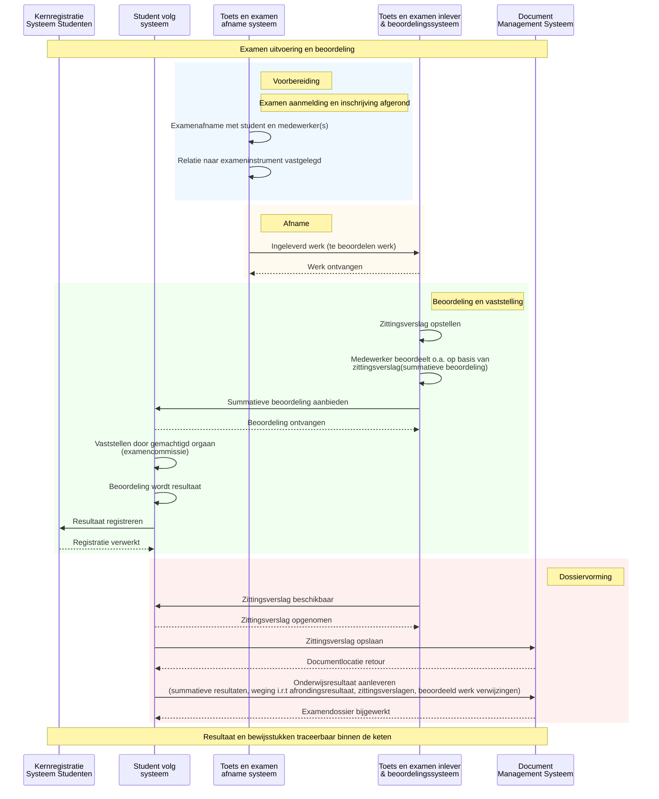

<!-- ===================== -->
<!-- Titelpagina -->
<!-- ===================== -->
# MOKA Koppelvlak Specificatie – Voorbeelduitwerking -  Digitaal Examineren - Subdomein: Examen uitvoering en beoordeling

## Examen uitvoering en beoordeling

**Versie:** v20260316  
**Datum:** 2026-03-16  
**Status:** Concept  
**Auteur:** Niek Derksen  
**Organisatie:** MOKA Werkgroep

---

### Documentdoel

Dit document is een **voorbeelduitwerking** van de [MOKA Koppelvlak Specificatie Template](KoppelvlakSpecificatieTemplate.md). Het beschrijft het koppelvlak voor een deel van de procesketen Examineren en diplomeren/certificeren (uitvoeren examen tot en met beoordelen en diplomeren), opdat het gebruikt kan worden voor **strategische duiding** of ter **adaptie/implementatie** van logische of technische implementaties. De context van deze uitwerking is **digitale examinering**.

---

<!-- ===================== -->
<!-- Versiehistorie -->
<!-- ===================== -->

## Versiehistorie

| Versie | Datum       | Auteur        | Wijziging |
|------:|------------|---------------|-----------|
| v20260204  | 2026-02-04| Niek Derksen  | Initiële versie van deze koppelvlak specificatie t.b.h.v. MOKA werkgroep Demo i.h.k.v. Klus 43 voortgangsupdate |
| v20260316 | 2026-03-16 | Niek Derksen | Verwerking feedback van MOKA reviewgroep op koppelvlak specificatie document v20260204, i.h.k.v. Klus 43. |

---

<!-- ===================== -->
<!-- Inhoudsopgave -->
<!-- ===================== -->

## Inhoudsopgave

- [MOKA Koppelvlak Specificatie – Voorbeelduitwerking -  Digitaal Examineren - Subdomein: Examen uitvoering en beoordeling](#moka-koppelvlak-specificatie--voorbeelduitwerking----digitaal-examineren---subdomein-examen-uitvoering-en-beoordeling)
  - [Examen uitvoering en beoordeling](#examen-uitvoering-en-beoordeling)
    - [Documentdoel](#documentdoel)
  - [Versiehistorie](#versiehistorie)
  - [Inhoudsopgave](#inhoudsopgave)
  - [1. Inleiding](#1-inleiding)
  - [2. Beheerketen en plaatsing](#2-beheerketen-en-plaatsing)
  - [3. AMIGO-aanpak en modeltalen](#3-amigo-aanpak-en-modeltalen)
  - [4. MORA procesplaatsing](#4-mora-procesplaatsing)
  - [5. MOKA Koppelvlak specificatie](#5-moka-koppelvlak-specificatie)
    - [5.2 Viewpointbeschrijving](#52-viewpointbeschrijving)
    - [5.3 Metamodel](#53-metamodel)
    - [5.4 MOKA Koppelvlak specificatie View](#54-moka-koppelvlak-specificatie-view)
    - [5.5 MOKA Koppelvlak informatiemodel view](#55-moka-koppelvlak-informatiemodel-view)
    - [5.6 Referentie klassendiagram](#56-referentie-klassendiagram)
    - [5.7 Referentie interactiepatroon](#57-referentie-interactiepatroon)
    - [5.7.1 Interactiepatronen en messaginggedrag (optioneel)](#571-interactiepatronen-en-messaginggedrag-optioneel)
    - [5.8 Gerelateerde implementaties en specificaties](#58-gerelateerde-implementaties-en-specificaties)

---

## 1. Inleiding

Deze voorbeelduitwerking volgt de structuur van de [MOKA Koppelvlak Specificatie Template](KoppelvlakSpecificatieTemplate.md). Het beschrijft het koppelvlak voor het deelgebied Examen uitvoering en beoordeling binnen de MORA procesketen Examineren. Gegevensuitwisseling en verantwoordelijkheden tussen referentiecomponenten worden eenduidig gepositioneerd, zodat implementaties hierop terug te leiden zijn.

---

## 2. Beheerketen en plaatsing

Dit document staat in de beheerketen tussen de sectorreferentie-architectuur (MORA/HORA) en de technische koppelvlakspecificatie. De sector kanaliseert met dit document de vraagstelling en doelbinding van koppelvlakken. **In de context van dit document: digitale examinering.**

**Figuur 2.1:** Beheerketen tot standkoming koppelvlak specificaties (domein-agnostisch)

Bron: [Beheerketen voor tot standkoming koppelvlak specificaties](../img/Beheerketen%20voor%20tot%20standkoming%20koppelvlak%20specificaties.jpg).

---

## 3. AMIGO-aanpak en modeltalen

Voor de MOKA metamodelering hanteren we een expliciete ontkoppeling tussen conceptuele en logische modellen. In ArchiMate modelleren we maximaal twee lagen diep in dataobjecten (conceptueel). Verdieping van structuur en relaties vindt plaats in UML/ERD en sequentiediagrammen.

**Figuur 3.1:** AMIGO modellenmatrix (bronafbeelding)  
**View:** AMIGO modellenmatrix  
**Viewpoint:** Modellenmatrix (AMIGO niveaus van modellen en modeltalen)  
**Legenda:** Conceptueel, Logisch, Technisch; inhoudslijn van onderwijsbreed naar inrichting.

| MOKA view | AMIGO kolom | AMIGO rij | Toelichting |
|-----------|-------------|-----------|-------------|
| MOKA koppelvlak specificatie view | Toepassingsgebied | Conceptuele modellen (ketenprocesmodel/-scenario) | Brug tussen conceptuele ketenlogica en scope van het koppelvlak. |
| MOKA informatiemodel view | Toepassingsgebied | Conceptuele modellen (informatiemodel) | Conceptuele informatieobjecten en relaties binnen het toepassingsgebied. |
| MOKA referentie klassendiagram | Inrichting | Logische modellen (inrichtingsgegevensmodel) | UML/ERD detaillering van gegevensstructuur en attributen. |
| MOKA interactiepatroon view | Inrichting | Logische modellen (interactiespecificatie) | Logische interacties tussen componenten als basis voor berichtspecificatie. |

**Referentie:** [AMIGO-methodiek v1.1.0](https://www.edustandaard.nl/app/uploads/2025/10/AMIGO-methodiek-1.1.0-1.pdf)

---

## 4. MORA procesplaatsing

De volledige procesketen **Examineren** (inclusief diplomeren en certificeren) is beschreven in MORA: [Procesketen Examineren](https://mora.mbodigitaal.nl/index.php/Procesketen_Examineren). Binnen deze keten gebruiken we voor deze koppelvlak specificatie het volgende deel: **uitvoeren examen** tot en met **diplomeren en certificeren**, inclusief de subprocesstappen (voorbereiden uitvoering examen, uitvoeren examen, beoordelen examen, vaststellen resultaat examen, bepalen diploma/certificaat recht, besluiten diplomeren/certificeren, diplomeren/certificeren).

**Figuur 4.1:** Procesketengebied indicatie binnen MORA hoofdprocesmodel  
**View:** Procesketengebied MORA  
**Viewpoint:** Procesplaatsing (ArchiMate Business Process view)  
**Legenda:** Business Process, Grouping.

De processtappen in het paars aan de bovenkant van de MOKA koppelvlak specificatie view (figuur 5.2) bepalen wat voor dit koppelvlak als *in scope* wordt beschouwd. In MORA is **Diplomeren en certificeren** een overkoepelende processtap waaronder vallen: diploma of certificaat recht bepalen, besluiten om te diplomeren of certificeren, en diplomeren/certificeren. **Afgeven mbo-verklaring** valt buiten scope (na scope).

Onderstaand diagram werkt de in-scope processtappen uit; de overkoepelende stap Diplomeren en certificeren is als subgraph met de drie sub-stappen weergegeven:

**Figuur 4.2:** MORA procesketen Examineren – in-scope deel gelijk aan paarse processtappen MOKA view (verdiepende stap)  
**View:** Procesketen Examineren (in-scope)  
**Viewpoint:** Procesplaatsing (ArchiMate Business Process view)  
**Legenda:** Business Process, Grouping.

---

## 5. MOKA Koppelvlak specificatie

In dit hoofdstuk staan de samenhang tussen procesplaatsing, metamodel en concrete views centraal. De figuren (views) worden gebruikt om het referentiekader van het koppelvlak vast te leggen en bespreekbaar te maken.

---

### 5.2 Viewpointbeschrijving

Voor het geheel van de MOKA-views in dit document geldt de volgende viewpointbeschrijving.

| Onderdeel | Invulling |
|-----------|-----------|
| **Doel** | Eenduidig inzicht geven in de keten, informatieobjecten, referentiecomponenten en hun interactie voor het koppelvlak Examen uitvoering en beoordeling; richting geven aan ontwerp en implementatie. |
| **Concerns** | Welke processen en informatieobjecten in scope zijn; welke MORA-componenten betrokken zijn; hoe gegevens en beoordelingsresultaten stromen; hoe resultaten en bewijsstukken in het examendossier terechtkomen. |
| **Scope** | Deel van de MORA procesketen Examineren: uitvoeren examen tot en met diplomeren/certificeren; de vijf MORA-referentiecomponenten (Toets- en examenafname systeem, Toets- en examen inlever- en beoordelingssysteem, Studentvolgsysteem, Document Management Systeem, Kernregistratie Systeem Studenten). |
| **Gebruikte modeltaal** | Conceptueel: ArchiMate (max. twee lagen diep in dataobjecten). Logisch: UML/ERD voor klassendiagram; Mermaid voor sequentiediagrammen. |
| **Relevante objecttypen/relaties** | Student, Examenafname, Medewerker, Zittingsverslag (gegevensgroeptypes als interne subcontainers), Te beoordelen werk, Summatieve beoordeling, Summatief resultaat, Onderwijsresultaat, Examendossier; relaties participatesIn, hasMinutes, produces, assessedBy, leadsTo, aggregatedInto, recordedIn. |
| **Verantwoording** | Deze views sluiten aan op de AMIGO modellenmatrix (conceptueel en logisch) en op MORA; zij vormen de brug tussen ketenlogica en technische berichtspecificatie. |

---

### 5.3 Metamodel

Het metamodel legt de basisrelaties vast tussen de kernobjecten en hun context in MORA en MOKA. Dit voorkomt interpretatieverschillen bij het gebruik van het koppelvlak.

**Figuur 5.1:** MORA en MOKA metamodel met toelichting  
**View:** MORA en MOKA metamodel  
**Viewpoint:** Conceptueel metamodel (ArchiMate concept view)  
**Viewpointbeschrijving:** Doel – basisrelaties kernobjecten; Concerns – eenduidigheid; Scope – MORA/MOKA; Modeltaal – ArchiMate; Legenda – Business Object, Data Object, Application Component, Association, Realization.

---

### 5.4 MOKA Koppelvlak specificatie View

Deze view visualiseert de keten en de belangrijkste informatieobjecten binnen het koppelvlakgebied. Het geeft inzicht in de hoofdstructuur van de uitwisseling.

**Figuur 5.2:** MOKA koppelvlak specificatie view  
**View:** MOKA koppelvlak specificatie view  
**Viewpoint:** Koppelvlak view (ArchiMate Application Cooperation view)  
**Legenda:** Application Component, Application Service, Data Object, Flow, Access. Rode Business Objects of relaties verwijzen naar momenteel niet bestaande MORA InformatieObjecten.  
**Positionering:** Deze view ligt op het snijvlak van conceptueel en logisch en vormt de brug tussen ArchiMate en de detailmodellen.

---

### 5.5 MOKA Koppelvlak informatiemodel view

Het informatiemodel beschrijft de kernobjecten en hun relaties die relevant zijn voor het koppelvlak. Dit is de basis voor semantische eenduidigheid. In het datamodel (deze view) komen gegevensgroepen en gegevensgroeptypes voor; het referentie klassendiagram (sectie 5.6) is daar semantisch op uitgelijnd.

**Figuur 5.3:** Koppelvlak specifiek informatiemodel view  
**View:** Koppelvlak specifiek informatiemodel view  
**Viewpoint:** Informatiemodel (ArchiMate Information Structure view)  
**Legenda:** Business Object, Data Object, Association, Composition. Rode Business Objects of relaties verwijzen naar momenteel niet bestaande MORA InformatieObjecten.

**Machine-leesbaar informatiemodel overzicht**

Het informatiemodel (deze view) is uitgewerkt in een machine-leesbaar overzicht per objecttype: **informatieobject**, **dataobject (gegevensgroep)** met relatie naar informatieobject, en **dataobject (gegevensgroeptype)** met relatie naar bovenliggende gegevensgroep. Dit overzicht wordt gebruikt om het referentieklassendiagram (sectie 5.6) op consistentie te controleren.

- **Bestand:** [InformatiemodelOverzicht.json](InformatiemodelOverzicht.json)
- **OKE-koppeling:** Voor gegevensgroeptypes en attributen uit de OKE MBO-toetsafname specificatie (Nederlandse vertaling) zie [OKE Gegevensgroeptypes overzicht](OKE_Gegevensgroeptypes_Overzicht.md).

*Geef aan als dit overzicht compleet is; daarna wordt het referentieklassendiagram op inconsistenties met dit informatiemodel gecontroleerd en zo nodig aangepast.*

---

### 5.6 Referentie klassendiagram

Het referentie klassendiagram concretiseert de informatieobjecten in een eenduidige objectrepresentatie en is **semantisch uitgelijnd met het datamodel** (gegevensgroepen en gegevensgroeptypes) zoals in de informatiemodel view (figuur 5.3). Gegevensgroeptypes uit het informatiemodel worden *niet* als aparte klassen met een "subdivide"-relatie weergegeven, maar als **interne subcontainers** binnen het betreffende object (zelfde benaming als in de informatiemodel view). De belangrijkste referentie-attributen zijn waar mogelijk aangevuld met **OKE MBO-toetsafname**-attributen (Nederlandse vertaling); zie [OKE Gegevensgroeptypes overzicht](OKE_Gegevensgroeptypes_Overzicht.md) voor de volledige mapping. Elk informatieobject is uitgewerkt met de **exacte gegevensgroeptype-namen** uit het informatiemodel (InformatiemodelOverzicht.json); onder elk gegevensgroeptype staan de bijbehorende referentie-attributen. De koppeling tussen informatiemodel en klassendiagram is daarmee semantisch 1-op-1.

```mermaid
classDiagram
    class Student {
      --
      StudentNaam
      voornaam : string
      achternaam : string
      voorvoegsel : string
      weergavenaam : string
      roepnaam : string
      legitimatieNaam : string
      --
      StudentNummer
      primaireCode : IdentifierEntry
      --
      StudentOpleidingId
      opleidingsaanbodId : uuid-string
      opleidingsprogrammaId : uuid-string
      --
      OnderwijsprogrammaRegioStudentId
      codeType : string
      code : string
    }

    class Medewerker {
      --
      MedewerkerId
      persoonId : uuid-string
      primaireCode : IdentifierEntry
      --
      DeelnameRolBinnenMedewerker
      rol : string
      organisatieId : uuid-string
      status : string
    }

    class Beoordelaar {
      --
      BeoordelaarNaam
      weergavenaam : string
      voornaam : string
      achternaam : string
      --
      OnderwijskwalificatieBevoegdBeoordelaar
      codeType : string
      code : string
    }

    class Examenafname {
      --
      AfnameNaamEnAanduiding
      aanbodId : uuid-string
      primaireCode : IdentifierEntry
      naam : LanguageTypedString[]
      afkorting : string
      --
      AfnameOnderwijslogistiekeContext
      locatieCode : string
      organisatieId : uuid-string
      onderwijstaal : string
      --
      ExamenWindowRelaties
      startDatumTijd : datetime-string
      eindDatumTijd : datetime-string
      duur : string
      --
      RelatieTotOpleidingen
      componentId : uuid-string
      opleidingsaanbodId : uuid-string
      opleidingsdeelId : uuid-string
    }

    class Zittingsverslag {
      zittingsverslagId : uuid-string
      naam : string
      omschrijving : LanguageTypedString[]
      aangemaaktOp : datetime-string
      --
      VerslagTotStandkoming
      toelichting : string
      onregelmatigheden : string
      --
      RelatieTotOpsteller
      medewerkerId : uuid-string
      --
      RelatieTotExamenAfname
      examenZittingId : uuid-string
      --
      documenten : Document[]
    }

    class Document {
      documentId : uuid-string
      documentType : string
      documentNaam : string
    }

    class TeBeoordelenWerk {
      --
      IndieningsGegevens
      koppelingId : uuid-string
      status : string
      rol : string
      indieningsmoment : datetime-string
      --
      WerkAanduiding
      weergave : string
      omschrijving : string
      --
      BeoordelingsContext
      persoonId : uuid-string
      aanbodId : uuid-string
    }

    class ExamenDeelname {
      --
      RelatieTotStudent
      persoonId : uuid-string
      --
      AanwezigheidsIndicatie
      aanwezigheid : string
      --
      RelatieTotExamenAfnameContext
      aanbodId : uuid-string
      koppelingId : uuid-string
    }

    class SummatieveBeoordeling {
      --
      BeoordelingsOordeelIndicatie
      status : string
      geslaagd : string
      --
      BeoordelingsOordeelSpecificatie
      score : string
      ruweScore : integer
      maxRuweScore : integer
      --
      MetaDateringOpmaakEnBeoordelingsDatum
      resultaatDatum : date-string
      toetsDatum : datetime-string
      vastgesteld : boolean
      --
      RelatieTotBeoordelaar
      beoordelaarId : uuid-string
      --
      RelatieTotTeBeoordelenWerk
      koppelingId : uuid-string
      --
      documenten : Document[]
    }

    class SummatiefResultaat {
      --
      ResultaatSamenstelling
      resultaatId : uuid-string
      score : string
      ruweScore : integer
      maxRuweScore : integer
      geslaagd : boolean
      --
      ResultaatAfnameTijdvak
      toetsDatum : datetime-string
      uitgevoerdeZittingNaam : string
      --
      ResultaatVaststelling
      resultaatDatum : date-string
      vastgesteldOp : datetime-string
      status : string
    }

    class Onderwijsresultaat {
      --
      RelatieTotOnderwijsProgramma
      opleidingsprogrammaId : uuid-string
      opleidingsaanbodId : uuid-string
      --
      RelatieTotSummatiefResultaat
      gerelateerdeResultaten : SummatiefResultaat[]
      --
      RelatieTotBeoordeeldWerk
      koppelingIds : uuid-string[]
      --
      RelatieTotExamenDossier
      examendossierId : uuid-string
      --
      weging : float
      afrondingsresultaat : float
      status : string
      vastgelegdOp : datetime-string
    }

    class Examendossier {
      --
      DossierIdentificatie
      examendossierId : uuid-string
      dossiernummer : string
      --
      OnderwijsprogrammaContext
      opleidingsaanbodId : uuid-string
      cohort : string
      locatie : string
      --
      OnderwijsresultaatRegistratie
      onderwijsresultaatOverzicht : Onderwijsresultaat[]
      --
      DossierBeheerContext
      status : string
      aangemaaktOp : datetime-string
    }

    Student "1" -- "1..N" ExamenDeelname : RelatieTotStudent
    Examenafname "1" -- "1..N" ExamenDeelname : RelatieTotExamenAfnameContext
    ExamenDeelname "1..N" -- "0..*" TeBeoordelenWerk : produces
    ExamenDeelname "1" -- "0..*" SummatieveBeoordeling : leadsTo
    ExamenDeelname "1" -- "0..1" SummatiefResultaat : leadsTo
    ExamenDeelname "1" -- "0..1" Examendossier : leadsTo

    Examenafname "1" -- "0..*" Zittingsverslag : hasMinutes
    Zittingsverslag "1" --> "1" Medewerker : RelatieTotOpsteller
    Zittingsverslag "1" --> "1" Examenafname : RelatieTotExamenAfname
    Zittingsverslag "0..*" -- "0..*" Document : documenten

    Examenafname "1" -- "1..N*" TeBeoordelenWerk : produces
    TeBeoordelenWerk "1" -- "1..N" SummatieveBeoordeling : RelatieTotTeBeoordelenWerk
    SummatieveBeoordeling "1" --> "1..N" Beoordelaar : RelatieTotBeoordelaar
    SummatieveBeoordeling "0..*" -- "0..*" Document : documenten

    ExamenDeelname "0..*" -- "0..*" SummatieveBeoordeling : participatesIn
    ExamenDeelname "1" -- "0..*" SummatiefResultaat : leadsTo
    SummatieveBeoordeling "1..N" -- "1" SummatiefResultaat : leadsTo
    SummatiefResultaat "1" --> "1" Medewerker : establishedBy
    ExamenDeelname "0..*" -- "0..1" Examendossier : leidtTot

    SummatiefResultaat "1..*" -- "1" Onderwijsresultaat : RelatieTotSummatiefResultaat
    Onderwijsresultaat "0..N" -- "1" Examendossier : OnderwijsresultaatRegistratie
```

**Figuur 5.4:** Referentie klassendiagram (uitgelijnd met datamodel, OKE-attributen NL)  
**View:** MOKA referentie klassendiagram  
**Viewpoint:** Referentie klassendiagram (UML/ERD, logisch gegevensmodel)  
**Legenda:** UML class diagram; gegevensgroeptypes als interne secties waar van toepassing; attribuutnamen in het Nederlands, gebaseerd op informatiemodel en [OKE MBO-toetsafname specificatie](https://www.edustandaard.nl/app/uploads/2024/09/OKE-MBO-toetsafname-specs-v1.0_20240909conceptversie.pdf). BevoegdheidsRol ontbreekt (komt niet in informatiemodel voor).

---

### 5.7 Referentie interactiepatroon

Het onderstaande interactiepatroon is gebaseerd op de informatieobjecten uit het informatiemodel en het referentie klassendiagram. Het diagram is implementatie-onafhankelijk en positioneert de uitwisseling tussen de referentiecomponenten.

**Referentiecomponenten in scope:**
- Toets en examen afname systeem
- Toets en examen inlever & beoordelingssysteem  
- Student volg systeem (SVS)
- Document Management Systeem (DMS)
- Kernregistratie Systeem Studenten (KRS)

**Figuur 5.5:** Interactiepatroon tussen referentiecomponenten en informatieobjecten  
**View:** MOKA interactiepatroon view (sequencediagram)  
**Viewpoint:** Interactiepatroon (ArchiMate Application Process/Flow view)  
**Legenda:** Application Component, Flow, Data Object, Triggering.

---

### 5.7.1 Interactiepatronen en messaginggedrag (optioneel)

Bij technische uitwerking van het interactiepatroon kunnen **messaging patterns** worden toegepast. Zie [Enterprise Integration Patterns – Messaging](https://www.enterpriseintegrationpatterns.com/patterns/messaging/Messaging.html) voor de volledige taal.

- **Happy flow:** Verwacht gedrag is dat berichten synchroon of asynchroon worden uitgewisseld met duidelijke bevestigingen (bijv. Request-Reply, Return Address). Componenten reageren met "verwerkt", "ontvangen" of retourneren een documentlocatie.
- **Unhappy flow (suggesties):** Bij fouten of uitval kunnen o.a. de volgende patterns worden overwogen: **Guaranteed Delivery** (berichten persistent maken tot aflevering), **Dead Letter Channel** (mislukte berichten apart verwerken), **Idempotent Receiver** (dubbele berichten veilig verwerken), of queue’en met retry. Dit is geen verplichte norm voor het koppelvlak; wel een referentie voor implementaties die robuustheid vereisen.

---

### 5.8 Gerelateerde implementaties en specificaties

Voor meer informatie omtrent het koppelvlakprofiel en gerelateerde implementaties:

- Raadpleeg het [externe API-profiel (specificatie v5)](https://github.com/NetwerkExamineringDigitalisering/NED-OOAPI/tree/main/specification/v5) voor de technische uitwerking.
- Raadpleeg het [externe koppelvlakspecificatiedocument (conceptversie 1.0, 9 september 2024, PDF)](https://www.edustandaard.nl/app/uploads/2024/09/OKE-MBO-toetsafname-specs-v1.0_20240909conceptversie.pdf) voor informatiestromen en uitwisselingen.

Deze documenten bevatten de actuele technische specificaties en koppelvlakeisen voor externe implementaties.

Dit document is een voorbeelduitwerking van de [MOKA Koppelvlak Specificatie Template](KoppelvlakSpecificatieTemplate.md).

---

<!-- Einde document -->
