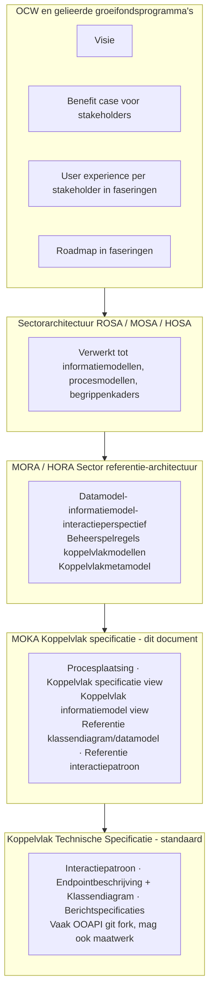

# MOKA Koppelvlak Specificatie – Template

**Versie:** [invullen]  
**Datum:** [invullen]  
**Status:** [invullen]  
**Auteur:** [invullen]  
**Organisatie:** MOKA Werkgroep

---

## Documentdoel (template)

Dit document is een **template** ter invulling en richtinggevend voor het beschrijven van sectorkoppelvlakken. Het is bedoeld voor gebruik door de sector en door instellingen die koppelvlakken willen specificeren in lijn met MORA en MOKA. Het template bevat geen domeinspecifieke invulling; vul per sectie in volgens de instructies.

---

## Versiehistorie

| Versie | Datum       | Auteur        | Wijziging |
|--------|-------------|---------------|-----------|
| [invullen] | [invullen] | [invullen] | [invullen] |

---

## Inhoudsopgave

1. [Documentdoel (template)](#documentdoel-template)
2. [Versiehistorie](#versiehistorie)
3. [Inhoudsopgave](#inhoudsopgave)
4. [Design keuzes en modeleringsstrategie (handleiding)](#3-design-keuzes-en-modeleringsstrategie-handleiding)
5. [Beheerketen en plaatsing](#4-beheerketen-en-plaatsing)
6. [AMIGO-aanpak en modeltalen](#5-amigo-aanpak-en-modeltalen)
7. [MORA procesplaatsing](#6-mora-procesplaatsing)
8. [MOKA Koppelvlak specificatie – Viewpointbeschrijving](#7-moka-koppelvlak-specificatie--viewpointbeschrijving)
9. [Metamodel](#8-metamodel)
10. [MOKA Koppelvlak specificatie View](#9-moka-koppelvlak-specificatie-view)
11. [MOKA Koppelvlak informatiemodel view](#10-moka-koppelvlak-informatiemodel-view)
12. [Referentie klassendiagram](#11-referentie-klassendiagram)
13. [Referentie interactiepatroon (sequencediagram)](#12-referentie-interactiepatroon-sequencediagram)
14. [Optioneel: Interactiepatronen en messaginggedrag](#13-optioneel-interactiepatronen-en-messaginggedrag)
15. [Gerelateerde implementaties en specificaties](#14-gerelateerde-implementaties-en-specificaties)
16. [Referentie voorbeelduitwerking](#15-referentie-voorbeelduitwerking)

---

## 3. Design keuzes en modeleringsstrategie (handleiding)

Deze paragraaf beschrijft de design keuzes die ten grondslag liggen aan het template. Pas u deze modelleringsstrategie toe, dan gelden onderstaande uitgangspunten.

| Design keuze | Toelichting |
|--------------|-------------|
| **Ontkoppeling conceptueel – logisch – technisch** | Conceptuele modellen (ArchiMate, max. twee lagen diep in dataobjecten) beschrijven *wat* er is en welke relaties; logische modellen (UML/ERD, referentieklassendiagram) concretiseren objecten en attributen voor uitwisseling; technische specificaties (endpoint, berichten) zijn implementatie. Het template houdt deze lagen bewust gescheiden zodat bronnen (MORA) en implementaties (OOAPI/maatwerk) kunnen wisselen zonder het koppelvlakconcept te wijzigen. |
| **Informatiemodel ↔ referentieklassendiagram: 100% uitlijning** | Het koppelvlak informatiemodel view (gegevensgroepen, gegevensgroeptypes, dataobjecten) is de bron van waarheid. Het referentieklassendiagram gebruikt **exact dezelfde benaming** voor gegevensgroeptypes en modelleert ze als **interne subcontainers** (secties) binnen het betreffende object, *niet* als aparte klassen met een "subdivide"-relatie. Aan die subcontainers worden de referentie-attributen gekoppeld. Zo wordt de verdiepende werking van het klassendiagram afgedwongen en blijft semantische eenduidigheid gewaarborgd. |
| **Geen objecttypen in het klassendiagram die niet in het informatiemodel staan** | Alleen objecttypen en relaties die in de informatiemodel view voorkomen, horen in het referentieklassendiagram. Controleer bij elke klasse en relatie op overeenkomst met het informatiemodel; verwijder of pas aan wat daar niet in staat. |
| **View vs. viewpoint** | Per diagram: **view** = het concrete diagram of de plaat; **viewpoint** = het kader (doel, concerns, scope, modeltaal, legenda). Houd deze termen consistent; verwar ze niet met "view" in de zin van informatiemodel view. |
| **Beheerketen en diagram** | Het beheerketen-diagram (sectie 4) moet **exact overeenkomen** met de voorbeelduitwerking (zelfde lagen: OCW/groeifonds → sectorarchitectuur → MORA/HORA → MOKA → technische specificatie). U mag een ArchiMate-plaat of een ander diagram gebruiken, maar de inhoud en volgorde moeten gelijk zijn. |
| **MORA procesplaatsing: eerst gebied, dan keten** | Eerst de figuur van het procesketengebied binnen het MORA hoofdprocesmodel; daarna als verdiepende stap een diagram van de procesketen met in-scope markering (bijv. "In scope ten behoeve van koppelvlak"). |
| **Referentie-interactiepatroon** | Alleen MORA-referentiecomponenten en -terminologie; objecten uit het referentieklassendiagram; implementatie-onafhankelijk (geen concrete API- of berichtnamen). |

---

## 4. Beheerketen en plaatsing

**Instructie:** Leg kort uit waar dit document staat in de beheerketen: van OCW/groeifondsvisie via sectorarchitectuur (ROSA/MOSA/HOSA) en MORA/HORA naar de MOKA koppelvlak specificatie, en vandaar naar de Koppelvlak Technische Specificatie. Doel: de lezer begrijpt de interpretatie, plaatsing en eventuele voorgaande bronnen van het document.

U kunt een ArchiMate-plaat of een diagram in een andere modeltaal gebruiken; in de referentie voorbeelduitwerking wordt onderstaand diagram gebruikt – het moet **exact overeenkomen** met de voorbeelduitwerking (zelfde lagen en inhoud). Referentie naar de bronafbeelding:

Onderstaand diagram (domein-agnostisch) is letterlijk overgenomen uit de voorbeelduitwerking:

---

## 5. AMIGO-aanpak en modeltalen

**Instructie:** Leg de AMIGO modellenmatrix kort uit (scheidslijn conceptueel vs. logisch vs. technisch). Gebruik onderstaande AMIGO-modellenmatrix als afbeelding en voeg een mappingtabel toe waarmee de MOKA-views aan AMIGO-kolom/rij worden gerelateerd. Licht toe welke modeltaal per type product wordt gebruikt (ArchiMate, UML/ERD, Mermaid, berichtspecificatie).

**Figuur:** AMIGO modellenmatrix – positionering conceptueel / logisch / technisch.

- **Conceptueel:** ArchiMate (max. twee lagen diep in dataobjecten).
- **Logisch/inrichting:** UML/ERD voor gegevensstructuur en klassendiagrammen.
- **Interacties:** Mermaid sequentiediagrammen richting berichtspecificatie.

| MOKA view | AMIGO kolom | AMIGO rij | Toelichting |
|------------|-------------|-----------|-------------|
| [invullen] | [invullen] | [invullen] | [invullen] |

**Referentie:** [AMIGO-methodiek v1.1.0](https://www.edustandaard.nl/app/uploads/2025/10/AMIGO-methodiek-1.1.0-1.pdf)

---

## 6. MORA procesplaatsing

**Instructie:** Beschrijf de **volledige** relevante MORA-procesketen (geef een link naar de MORA-procesketen, bijv. [Procesketen Examineren](https://mora.mbodigitaal.nl/index.php/Procesketen_Examineren)) en omlijn daarbinnen **welk deel** in scope is voor dit koppelvlak (welke (sub)processtappen).

1. **Eerst:** plaats de figuur van het **procesketengebied binnen het MORA hoofdprocesmodel** (ArchiMate-plaat of afbeelding van MORA).
2. **Daarna:** als verdiepende stap een diagram (bijv. Mermaid) van de **volledige procesketen met duidelijke markering van het in-scope deel** (bijv. groepen "Voorafgaand aan scope", "In scope ten behoeve van koppelvlak", "Na scope"). Het diagram moet leesbaar zijn en exact aansluiten op de voorbeelduitwerking.

*[Placeholder: Tekst + figuur procesketengebied MORA + diagram procesketen met in-scope deel gemarkeerd]*

---

## 7. MOKA Koppelvlak specificatie – Viewpointbeschrijving

**Instructie:** Vul voor het geheel van de MOKA-views hier één overkoepelende viewpointbeschrijving in. Gebruik de term **view** voor elk concreet diagram of elke plaat, en **viewpoint** voor het kader (type, doel, concerns, scope, modeltaal). De **viewpointbeschrijving** is de invulling van onderstaande velden. Houd view en viewpoint consistent; niet door elkaar halen bij andere diagrammen.

Per (type) view:

| Onderdeel | Invulling |
|-----------|-----------|
| **Doel** | [Waarom deze view; welk beslissingsvraagstuk] |
| **Concerns** | [Welke vragen/keuzes worden adresseerd] |
| **Scope** | [Wat valt wel/niet in de view] |
| **Gebruikte modeltaal** | [ArchiMate / UML/ERD / Mermaid; niveau] |
| **Relevante objecttypen/relaties** | [Kernobjecten en relaties uit informatiemodel/objectdiagram] |
| **Verantwoording** | [Waarom deze view op deze plek in het document] |

---

## 8. Metamodel

**Instructie:** Plaats de view (afbeelding of diagram) van het metamodel dat de basisrelaties tussen kernobjecten en hun context in MORA en MOKA vastlegt. Conceptueel niveau; in ArchiMate maximaal twee lagen diep in dataobjecten. In de voorbeelduitwerking wordt onderstaande afbeelding gebruikt – u kunt dezelfde of een equivalent gebruiken.

*[Viewpoint + Legenda invullen: View = naam van het diagram; Viewpoint = type (bijv. ArchiMate concept view); Viewpointbeschrijving = doel, concerns, scope, modeltaal, legenda.]*

---

## 9. MOKA Koppelvlak specificatie View

**Instructie:** Plaats de view die de keten en de belangrijkste informatieobjecten binnen het koppelvlakgebied visualiseert. Deze view ligt op het snijvlak van conceptueel en logisch.

*[Placeholder: Figuur + Viewpoint + Legenda. Consistente benaming: view = diagramnaam, viewpoint = kader.]*

---

## 10. MOKA Koppelvlak informatiemodel view

**Instructie:** Plaats de view van het informatiemodel (kernobjecten en relaties). De gegevensgroepen en gegevensgroeptypes uit dit datamodel moeten semantisch terugkomen in het referentie klassendiagram (zie sectie 11).

*[Placeholder: Figuur + Viewpoint + Legenda.]*

---

## 11. Referentie klassendiagram

**Instructie:** Concretiseer de informatieobjecten in een eenduidige objectrepresentatie (UML/ERD-stijl, bijv. Mermaid classDiagram). **Designkeuze – koppeling informatiemodel en referentieklassendiagram:** het informatiemodel (gegevensgroepen en gegevensgroeptypes) is **100% semantisch gekoppeld** aan het referentieklassendiagram. Gegevensgroeptypes worden *niet* als aparte klassen met een "subdivide"-relatie weergegeven, maar als **interne subcontainers** (secties) binnen het betreffende object, met **exact dezelfde benaming** als in de informatiemodel view; per subcontainer de relevante referentie-attributen. Daarmee wordt de verdiepende werking van het klassendiagram afgedwongen en blijft één-op-één-uitlijning met het datamodel gewaarborgd. Controleer het klassendiagram op overeenkomst met het informatiemodel: objecttypen die niet in het informatiemodel voorkomen (bijv. BevoegdheidsRol) horen niet in het referentieklassendiagram.

*[Placeholder: Mermaid classDiagram of referentie naar afbeelding + Viewpoint + Viewpointbeschrijving.]*

---

## 12. Referentie interactiepatroon (sequencediagram)

**Instructie:** Geef een Mermaid sequenceDiagram met de MORA-referentiecomponenten in scope. Benoem interacties én reacties (verwerkt, ontvangen, documentlocatie retour, etc.). Gebruik alleen MORA-terminologie en objecten uit het klassendiagram; implementatie-onafhankelijk.

*[Placeholder: Lijst referentiecomponenten + Mermaid sequenceDiagram + View + Viewpoint + Viewpointbeschrijving.]*

---

## 13. Optioneel: Interactiepatronen en messaginggedrag

**Instructie (optioneel):** Beschrijf kort welke messaging patterns van toepassing kunnen zijn (bijv. Message Channel, Request-Reply, Guaranteed Delivery, Dead Letter Channel; zie [Enterprise Integration Patterns – Messaging](https://www.enterpriseintegrationpatterns.com/patterns/messaging/Messaging.html)). Onderscheid **happy flow** (verwacht gedrag, bevestigingen) en **unhappy flow** (bijv. queue’en, retry, Dead Letter Channel, Idempotent Receiver) als suggestie; geen verplichte norm.

*[Placeholder: Korte tekst + eventueel verwijzing naar EIP.]*

---

## 14. Gerelateerde implementaties en specificaties

**Instructie:** Vermeld links naar technische specificaties, API-profielen of koppelvlakdocumenten die als implementatie of uitwerking van dit koppelvlak kunnen dienen. Geen terminologie uit die documenten overnemen in de hoofdtekst.

*[Placeholder: Lijst met links en korte omschrijving.]*

---

## 15. Referentie voorbeelduitwerking

Zie voor een uitgewerkt voorbeeld van een MOKA koppelvlak specificatie:

**[Koppelvlakspecificatie – Examen uitvoering en beoordeling](KoppelvlakSpecificatieDocument.md)**

Dat voorbeeld beschrijft een deel van de procesketen Examineren en diplomeren/certificeren (uitvoeren examen tot en met beoordelen en diplomeren) en dient voor strategische duiding of adaptie/implementatie van logische/technische implementaties (digitale examinering).

---

<!-- Einde template -->
