> created: "2026-04-14T15:00:00+02:00"  
> updated: "2026-05-01T14:40:00+02:00"  
> human_authors: "Niek Derksen (Architect OKx)"  
> notes: "Human-in-the-loop: auteurs keuren inhoud goed vóór merge. Zevende iteratie — bijgewerkte referentie-interactiepatronen, aanvullingen op sequentiediagrammen Curriculum-ontwerp ↔ OC ↔ Planning, bredere negenvlaks-mapping van specificatie/aanbod/association, bijgewerkte resource- en CSP-input opgenomen."

# OKx OEAPI Consumer Profiel — Technische Specificatie en implementatieverzoek

## Inleiding

## 1. Profielbeschrijving

### 1.1 Waarom OKx?

OKx is een afspraakstelsel om onderwijs op de lange termijn **flexibeler** te maken, zonder dat iedere instelling en leverancier opnieuw dezelfde vertaalslag hoeft te doen. De kern is dat studenten onderwijs op verschillende manieren moeten kunnen volgen en combineren, terwijl instellingen het onderwijs nog steeds **organiseerbaar** moeten houden.

De Npuls-leerroutes (hoofdstuk 3) maken dit concreet. Ze beschrijven varianten zoals regulier, versneld (bijv. met vrijstellingen/EVC), personaliseren binnen de instelling, personaliseren over de instellingsgrens (binnen sector) en modulair studeren (vrije keuze, bundelen, stapelen). In alle varianten komt dezelfde vraag terug:

- Hoe vindt een student passend onderwijsaanbod?
- Hoe maken we zichtbaar *wat* het onderwijs is én *hoe* het georganiseerd wordt (tijd, leervorm, ruimte, expertise, middelen)?
- Hoe kunnen planning en roostering bepalen of het uitvoerbaar is (capaciteit, mensen en middelen)?
- Hoe leggen we keuze/intekening/inschrijving en voortgang vast, zodat het herleidbaar en overdraagbaar blijft?

### 1.2 Wat maken koppelvlakken mogelijk?

Koppelvlakken maken het mogelijk dat systemen in de keten dezelfde kerninformatie **op dezelfde manier** uitwisselen. Daarmee kan een onderwijscatalogus aanbod vindbaar en vergelijkbaar maken, kan een planningssysteem haalbaarheid berekenen en capaciteit terugkoppelen, en kan een roostersysteem het onderwijs in tijdsloten en toewijzingen omzetten. Zonder deze afspraken blijft flexibilisering beperkt tot losse pilots en lokale interpretaties.

### 1.3 MBO eerst, uiteindelijk sector-overstijgend

Dit profiel is in eerste instantie gericht op het **mbo**, omdat het direct aansluit op het werk van OKx in de mbo-keten en omdat de use-cases rond keuze, planning, roostering en modulair aanbod daar het meest urgent en concreet zijn. Tegelijk moet het profiel op termijn **sector-overstijgend** en **nationaal** kunnen werken, zodat onderwijsaanbod en leerresultaten uitwisselbaar worden over instellingen en (waar passend) over sectoren heen.

`TO-DO allignment initiatieven benoemen? Klus 53 MBO-Digitaal -> Allginment MORA-HORA basis voor informatiemodel`

### 1.4 Wat is dit profiel?

Een OEAPI **consumer profiel** (`consumerKey: "okx"`) waarmee de **Onderwijscatalogus (OC)** — als centrale referentiecomponent — haar informatiestromen verrijkt met een **complete onderwijsspecificatie**. Niet alleen *wat* er geleerd wordt, maar ook *hoe*, *waarmee*, *door wie*, *waar* en *hoe lang* — op elk niveau van de hiërarchie.

Dit profiel maakt maximaal gebruik van het **recursieve OEAPI-datamodel** en voegt een gestructureerd specificatie-object toe waar de kern onvoldoende is. Het resultaat is bruikbaar voor:

- **Studenten** die top-down (nominaal programma) of bottom-up (zelf samenstellen) kiezen
- **Planners** die moeten bepalen of de instelling een onderwijswens kan realiseren
- **Onderwijs ontwerpers** die opleidingen en gerelateerde onderwijsprogramma's als curriculum pontwerpen en vragen om verdieping binnen de Onderwijs Catalogus
- **Onderwijsontwikkelaars** die grofmazige onderwijsspecificaties binnnen een curriculum, specificeren tot planbare en uitvoerbare onderwijsspecificaties voor onderwijsprofessionals.
- **Andere instellingen** die aanbod willen ontvangen en verwerken (interoperabiliteit)

**OEAPI-broncode wordt niet aangepast.** Signaleringen leiden tot OEAPI change requests.

## 2. Projectcontext, doelstellingen en aanpak

Dit hoofdstuk beschrijft eerst **waarom** OKx dit profiel vraagt (doelstellingen), welke **implicaties** dat heeft, en welke **aanpak** we gebruiken om tot herbruikbare specificaties te komen. Pas daarna positioneren we de Onderwijscatalogus (OC) als ontwerpkeuze in de keten.

### 2.1 Projectdoelstellingen OKx

OKx werkt toe naar de volgende resultaten (bron: projectplan OKx v202506):

1. Komen tot **gezamenlijke taal** en **standaarden** voor gegevensuitwisseling die een **scala aan flexibilisering** mogelijk maken.
2. Komen tot **functionele** en **technische gegevensuitwisseling** voor het mbo, hbo en wo die **studentmobiliteit** ondersteunen.
3. Pilot studentmobiliteit starten bij mbo: **implementatie en realisatie van de digitale koppelingen**, eventueel met gebruik van bestaande SURF-diensten.

### 2.2 Implicaties

Deze doelstellingen brengen twee implicaties met zich mee:

1. **Werken onder architectuur**: we sluiten aan op (sectorale en nationale) architectuurkaders, zodat afspraken herbruikbaar en uitlegbaar blijven.
2. **Werken met en streven naar sectorstandaarden**: we gebruiken waar mogelijk bestaande standaarden en brengen gaps terug als change requests (in plaats van lokale varianten te “verharden”).

Onderstaande schets maakt dit visueel: ROSA als knooppunt van architectuurkennis, met sectorale referentiearchitecturen (waaronder MORA voor het mbo).

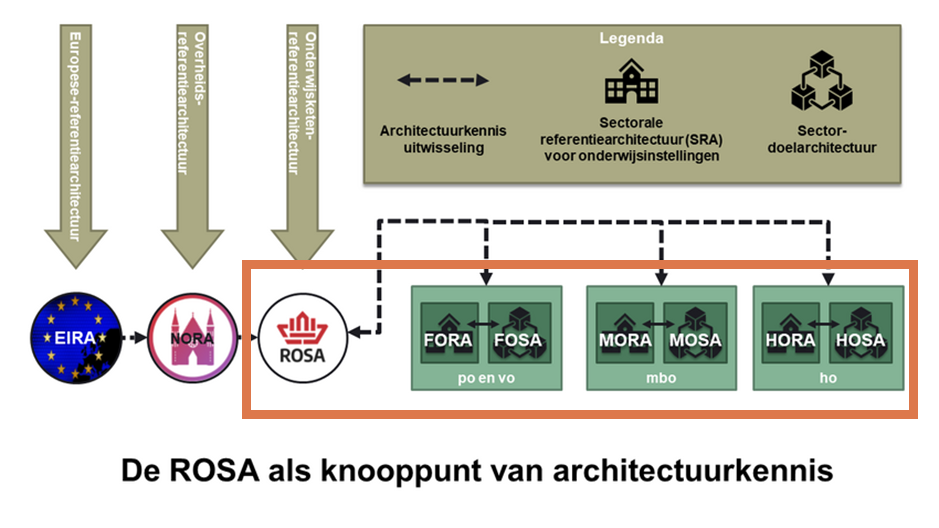

### 2.3 Projectaanpak (AMIGO)

Om tot bouwbare specificaties te komen hanteren we de AMIGO-aanpak, zoals beschreven door Edustandaard. Zie [AMIGO aanpak](https://www.edustandaard.nl/amigo/aanpak/).

AMIGO leidt stapsgewijs tot een **afsprakenset** (bouwbare uitwisselspecificatie), door scenario’s te verhelderen en die te vertalen naar gegevens, interacties en uiteindelijk bericht- en interfacespecificaties. De stappen worden soms iteratief doorlopen: keuzes in bericht of interface kunnen aanleiding zijn om scenario, gegevens of interacties aan te scherpen.

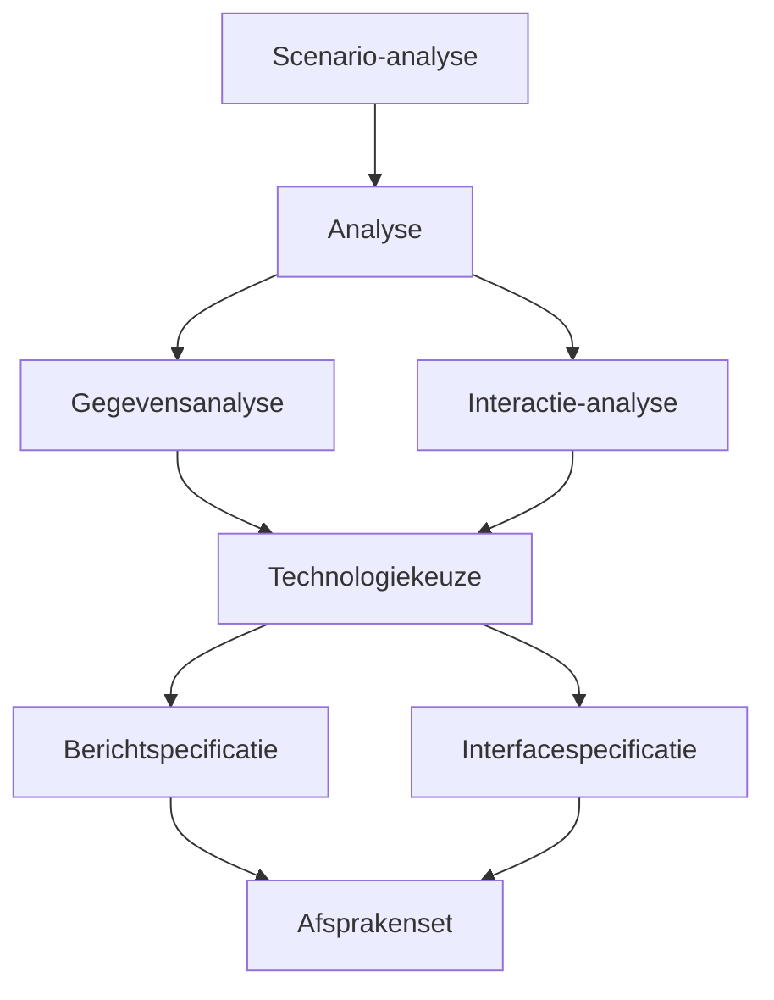
```mermaid
flowchart TD
  scenarioAnalyse[Scenario-analyse] --> analyses[Analyse]
  analyses --> gegevensAnalyse[Gegevensanalyse]
  analyses --> interactieAnalyse[Interactie-analyse]
  gegevensAnalyse --> technologieKeuze[Technologiekeuze]
  interactieAnalyse --> technologieKeuze
  technologieKeuze --> berichtSpecificatie[Berichtspecificatie]
  technologieKeuze --> interfaceSpecificatie[Interfacespecificatie]
  berichtSpecificatie --> afsprakenSet[Afsprakenset]
  interfaceSpecificatie --> afsprakenSet
```

**Brug naar scenario-analyse:** de volgende stap in dit document is de scenario-analyse. In hoofdstuk 3 starten we daarom bij de leerroutes van Npuls (zie [Leerroutes wendbaar georganiseerd onderwijs](https://npuls.nl/kennisbank/leerroutes-wendbaar-georganiseerd-onderwijs)). Het overzicht staat hieronder als bijlage bij de scenario’s.

## 3. Kaderstellende specificatie

### 3.1 Npuls programma context

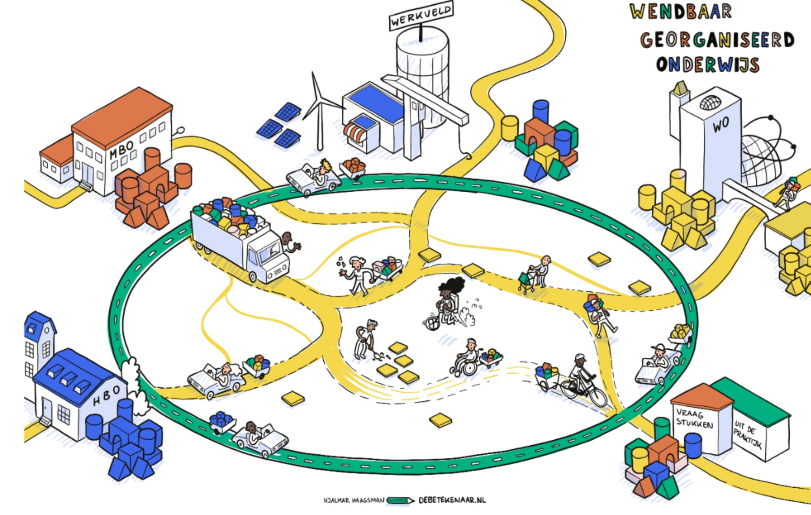

We kennen nu al de gangbare groene route. Hiermee kun je als student van het mbo naar het hbo, en van het hbo naar het wo bewegen, of direct vanuit het mbo, hbo of wo naar het werkveld.

Maar naast de bestaande groene route maken we in het vervolgonderwijs meer mogelijk: leerroutes die dwars door het mbo, hbo en wo gaan. We willen leerroutes mogelijk maken die dwars door het mbo, hbo en wo gaan, waarbij de lerende — zowel de initiële student als de leven lang lerende — regie heeft op haar eigen leerroute.

Die leerroutes zijn divers en kwalitatief van aard, waarbij de lerende een drempelvrij traject heeft. Dat kan op eigen tempo, gepersonaliseerd (binnen de instelling, buiten de instelling of over de sectoren heen) en modulair - een leven lang.

### 3.2 Scenario-analyse — kaderstellende scenario's per leerroute

In deze paragraaf werken we de 9 leerroutes uit als **kaderstellende scenario’s**: ze vormen de basis voor de concrete scenario’s en procesbeschrijvingen die we later verder detailleren.

Npuls beschrijft de leerroutes primair vanuit het (eerste) studentenperspectief. Voor implementatie binnen het onderwijskundige en onderwijslogistieke domein is dat niet voldoende: om een leerroute te realiseren zijn ook onderwijskundige beschrijvingen, toetsing en onderwijslogistiek nodig. Daarom koppelen we per leerroute expliciet:

- **Wat** wordt geleerd (kwalificatiekader / beoogde leeruitkomsten)
- **Hoe** het wordt aangeleerd: (leervorm, begeleiding, studielast i.d.v. Studie Belastingsuren (SBU) Begeleidde onderwijstijd (BOT), Onbegeleidde onderwijstijd (OOT) en Flexibele uren, onderwijsspecificaties op werkproces- en lesniveau)
- **Hoe** toetsing en bewijsvoering werken (toets-/examenvorm en scope)

Deze zaken referen aan **Onderwijsspecificatie**.

- **Hoe** de onderwijsspecificatie organiseerbaar is (planning/roostering binnen beperkte tijd en **mensen en middelen**)

Dit concept refereert aan **Onderwijsaanbod**.

- **Hoe** het geplande aanbod door studenten en instellingsmedewerkers daadwerkelijk gevolgd, beoordeeld en geadministreerd wordt.

Dit concept refereert aan **Onderwijsaanbod verbintenis**.

### 3.2.1 De Npuls Leerroutes

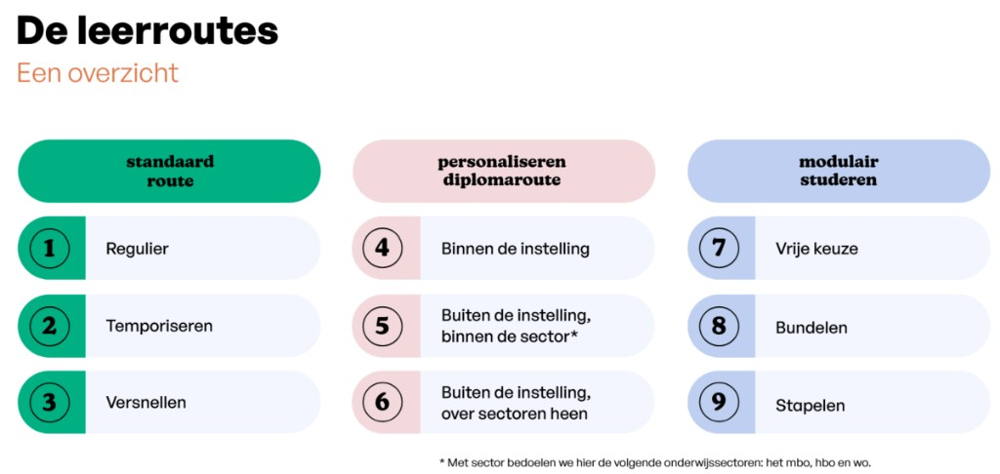

De 9 leerroutes zijn:

- **Standaard route**: (1) Regulier, (2) Temporiseren, (3) Versnellen
- **Personaliseren diplomaroute**: (4) Binnen de instelling, (5) Buiten de instelling, binnen de sector, (6) Buiten de instelling, over sectoren heen
- **Modulair studeren**: (7) Vrije keuze, (8) Bundelen, (9) Stapelen

*Met sector bedoelen we hier de volgende onderwijssectoren: het mbo, hbo en wo.*

#### 3.2.1.1 Leerroute 1 — Regulier

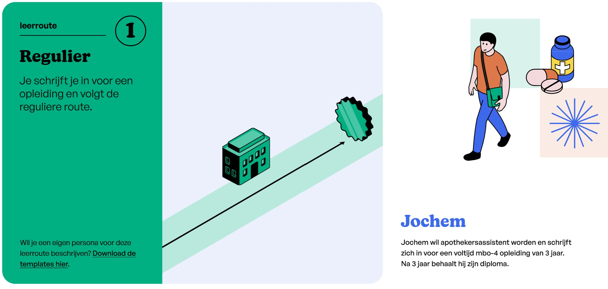
#### 3.2.1.1 Wat betekent “regulier studeren”?

##### 3.2.1.1 De student beleving - De Student Journey
Vanuit studentperspectief lijkt regulier studeren eenvoudig: een student orienteerd zich op basis van gepubliceerd onderwijsaanbod van instellingen. Ziet hij of zij iets wat passend voelt? Dan meld de student zich aan voor een door de instelling voorgeschreven en aangeboden opleiding. Daarna volgt de onderwijs intake. Zijn de verwachtingen en de vaardigheden van de student een match met de verwachtingen van de instelling? Dan wordt de student ingeschreven op de aangeboden opleiding. Waarna het de intentie voor de student is om de route die de instelling vooraf ontworpen heeft in zijn totaliteit te volgen. Op keuzedelen na wordt de route niet individueel samengesteld, maar institutioneel voorbereid.

##### Keuzedelen

De keuzedelen worden van te voren als beschikbaar aanbod gepubliceerd en getoond aan de student tijdens zijn/haar aanbod oriëntatie. Daarna volgen 2 opties, afhankelijk van beleidskeuzes van de instelling:

Naarmate de student zijn route aflegt, wordt de voortgang van de student gemonitord en de keuze van keuzedelen gefaciliteerd. Zodra de geplande **keuzedeelruimte** dichterbij komt, mag een student zijn/haar geprioriteerde keuzedeel-voorkeurslijst samenstellen. Hierin staat op nummer 1 het keuzedeel met de hoogste voorkeur van de student, en op een hoger volgnummer $x$ (waarbij $x>1$), de keuzedelen met lagere prioriteit.

De student **meldt** zich vervolgens aan op een keuzedeel. Bij deze aanmelding legt de student *per keuzedeelprioriteit* de voorkeur(s) voor de periode in zijn of haar **onderwijsprogramma** vast.

**Voorbeeld keuzedeel prioriteitenlijst:**

| Voorkeur  | Keuzedeel                            | Onderwijsperiode   | Onderwijslocatie         |
|-----------|--------------------------------------|--------------------|--------------------------|
| 1         | Ondernemerschap in de zorg           | Semester 2         | Locatie A                |
| 2         | Duurzame technologie                 | Semester 1         | Locatie B                |
| 3         | Digitale vaardigheden                | Semester 2 of 3    | Locatie A of Locatie C   |


In deze lijst geeft de student aan dat 'Ondernemerschap in de zorg' het meest gewenste keuzedeel is, gevolgd door 'Duurzame technologie', enzovoorts. Per keuzedeel kan optioneel ook de gewenste volgorde van periodes aangegeven worden, zodat de planning hiermee rekening kan houden. De **onderwijslocatie** kan ook een praktijklocatie, *hub* of private- of publieke instelling zijn.

Wanneer de student **niet** het gewenste keuzedeel op de voorkeurs **onderwijslocatie** en/of voorkeurs **onderwijsperiode**, dan **moet** de student op een andere onderwijslocatie kunnen oriënteren op meer passende keuzedelen.

Als er geen passend aanbod (combinatie keuzedeel en/of onderwijsperiode en/of onderwijslocatie) is voor de student, dan blijft de geplande keuzedeelruimte oningevuld.

In essentie betekent dit dat de student **studievertraging** oploopt, aangezien afgeronde keuzedelen onderdeel zijn van het kwalificatiekader binnen het MBO.

Wanneer een passende combinatie van keuzedeel en/of onderwijsperiode en/of onderwijslocatie, voor de student gevonden kan worden. Wordt de keuzedeel aanmelding, omgezet in een inschrijving. Aan een keuzedeel zijn kosten verbonden. Hierbij wordt een contractuele **betalingsverplichting** aangegaan tussen de onderwijsinstelling en de student. Schrijft de student zich uit voor het keuzedeel, dan blijft de betalingsvertplichting voor de student in stand. De kosten van een keuzedeel zijn vaak gerelateerd aan voor de student benodigde leermiddelen voor deelname aan het keuzedeel.

Er kan ten alle tijden maar één keuzedeel gevolgd worden binnen geplande keuzedeelruimte, en daarmee dus precies één actieve inschrijving bestaan voor keuzedelen.

Inactieve inschrijvingen, zoals geannuleerd keuzedeel aanbod van een keuzedeel (dankzij de aanbieder), zijn wel mogelijk.

##### Wanneer kiest een student keuzedelen?

De **aanmelding** voor keuzedelen wordt vast gelegd naarmate de in het **onderwijsprogramma** geplande *keuzdeelruimte* dichterbij komt. De keuze van de student wordt uiterlijk een vast gestelde periode $t$ van te voren vastgelegd.

OF

- De **aanmelding** voor de keuzedelen van de student worden tijdens de onderwijsintake vast gelegd en **niet** meer gewijzigd.

OF

- De **aanmelding** voor de keuzedelen van de student worden tijdens de onderwijsintake vast gelegd als voorlopige keuze, maar naarmate de ontwikkeling van de student vordert, gewijzigd.

Samenvattend:
De door Jochem te volgen route, zoals vastgelegd in het **onderwijsprogramma** is voorspelbaar. Het onderwijs is al uitgewerkt als samenhangend programma, is al gepland voor aanvang van de opleiding (periodes, capaciteit, groepen) en daarna, wanneer het geplande moment dichterbij komt, wordt het onderwijs geroosterd (tijdsloten en toewijzingen). 

*Figuur - Student Journey Regulier - Proces studentbeleving regulier studeren*

**Leeswijzer diagram.** Rechthoeken zijn **processtappen**; ruiten zijn **beslismomenten**; **gele ronde bollen** zijn vastgelegde **informatie-objecten** op het moment dat een **aanmelding** formeel is vastgelegd of is omgezet naar een **inschrijving** (contractuele plaatsing). Voor keuzedelen geldt: maximaal **één actieve inschrijving** per geplande **keuzedeelruimte** in het **onderwijsprogramma**. Bij instellingsbeleid *voorlopige keuze bij intake* (stap 8e) volgt gate **8f**: zolang de prioritering niet meer past, heroriënteert de student en past hij de **keuzedeel-aanmelding** aan (gele bol wordt bijgewerkt) voordat het proces via gate 9 verdergaat.

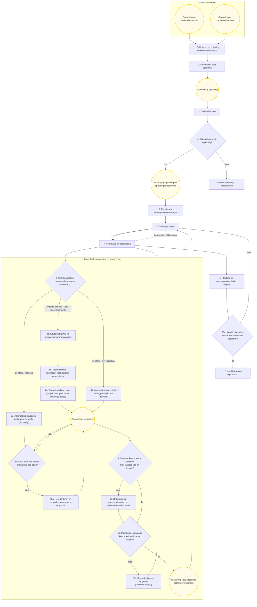
```mermaid
flowchart TB
  subgraph publicatie["Aanbod zichtbaar"]
    gepubliceerdAanbod(("Gepubliceerd onderwijsaanbod"))
    gepubliceerdKeuzedeelAanbod(("Gepubliceerd keuzedeelaanbod"))
  end

  orienteren["1. Oriënteren op opleiding en keuzedeelaanbod"]
  aanmeldenOpleiding["2. Aanmelden voor opleiding"]
  aanmeldingOpleiding(("Aanmelding opleiding"))
  intake["3. Onderwijsintake"]
  matchOpleiding{"4. Match student en opleiding?"}
  inschrijvingOpleiding(("Inschrijving opleiding en opleidingsprogramma"))
  geenMatch["Geen inschrijving / heroriëntatie"]

  roosterOntvangen["5. Rooster en leeromgeving ontvangen"]
  onderwijsVolgen["6. Onderwijs volgen"]
  voortgang["7. Voortgang en begeleiding"]

  subgraph keuzedeelProces["Keuzedeel: aanmelding en inschrijving"]
    momentKeuzedeel{"8. Instellingsbeleid: wanneer keuzedeel-aanmelding?"}
    keuzedeelruimteNadert["8a. Keuzedeelruimte in onderwijsprogramma nadert"]
    samenstellenVoorkeurslijst["8b. Geprioriteerde keuzedeel-voorkeurslijst samenstellen"]
    aanmeldenKeuzedeel["8c. Aanmelden keuzedeel (per prioriteit: periode en onderwijslocatie)"]
    aanmeldingKeuzedeelIntakeVast["8d. Aanmelding keuzedeel vastleggen bij intake (definitief)"]
    aanmeldingKeuzedeelIntakeVoorlopig["8e. Aanmelding keuzedeel vastleggen bij intake (voorlopig)"]
    prioriteringNogGoed{"8f. Staat deze keuzedeel-prioritering nog goed?"}
    herprioriterenKeuzedeel["8f-a. Heroriënteren en keuzedeel-aanmelding aanpassen"]
    aanmeldingKeuzedeel(("Aanmelding keuzedeel"))
    voorkeurHaalbaar{"9. Gewenst keuzedeel op voorkeurs-onderwijsperiode en -locatie?"}
    herorienterenLocatie["9a. Oriënteren op keuzedeelaanbod op andere onderwijslocatie"]
    passendAanbod{"10. Passende combinatie keuzedeel, periode en locatie?"}
    keuzedeelruimteLeeg["10a. Keuzedeelruimte oningevuld (studievertraging)"]
    inschrijvingKeuzedeel(("Inschrijving keuzedeel incl. betalingsverplichting"))
  end

  toetsen["11. Toetsen en examengelegenheden volgen"]
  kwalificatieAfgerond{"11a. Kwalificatiekader-onderdeel voldoende afgerond?"}
  kwalificeren["12. Kwalificeren en diplomeren"]

  gepubliceerdAanbod --> orienteren
  gepubliceerdKeuzedeelAanbod --> orienteren
  orienteren --> aanmeldenOpleiding --> aanmeldingOpleiding --> intake --> matchOpleiding
  matchOpleiding -->|Ja| inschrijvingOpleiding
  matchOpleiding -->|Nee| geenMatch
  inschrijvingOpleiding --> roosterOntvangen --> onderwijsVolgen --> voortgang

  voortgang --> momentKeuzedeel
  momentKeuzedeel -->|Uiterlijk periode t vóór keuzedeelruimte| keuzedeelruimteNadert
  keuzedeelruimteNadert --> samenstellenVoorkeurslijst --> aanmeldenKeuzedeel --> aanmeldingKeuzedeel
  momentKeuzedeel -->|Bij intake, niet wijzigbaar| aanmeldingKeuzedeelIntakeVast --> aanmeldingKeuzedeel
  momentKeuzedeel -->|Bij intake, voorlopig| aanmeldingKeuzedeelIntakeVoorlopig --> prioriteringNogGoed
  prioriteringNogGoed -->|Ja| aanmeldingKeuzedeel
  prioriteringNogGoed -->|Nee| herprioriterenKeuzedeel --> aanmeldingKeuzedeel --> prioriteringNogGoed

  aanmeldingKeuzedeel --> voorkeurHaalbaar
  voorkeurHaalbaar -->|Nee| herorienterenLocatie --> passendAanbod
  voorkeurHaalbaar -->|Ja| passendAanbod
  passendAanbod -->|Nee| keuzedeelruimteLeeg
  passendAanbod -->|Ja| inschrijvingKeuzedeel
  keuzedeelruimteLeeg --> voortgang

  voortgang --> toetsen --> kwalificatieAfgerond
  kwalificatieAfgerond -->|Ja| kwalificeren
  kwalificatieAfgerond -->|Nee| onderwijsVolgen
  onderwijsVolgen --> voortgang
  voortgang -.begeleiding of bijsturing.- onderwijsVolgen
  inschrijvingKeuzedeel --> onderwijsVolgen

  classDef infoObject fill:#fffbe6,stroke:#efd600,stroke-width:2px,color:#333;
  class aanmeldingOpleiding,inschrijvingOpleiding,aanmeldingKeuzedeel,inschrijvingKeuzedeel,gepubliceerdAanbod,gepubliceerdKeuzedeelAanbod infoObject;
```

**Wanneer wordt aanmelding inschrijving?**

| Moment | Van (aanmelding) | Naar (inschrijving) | Voorwaarde |
| --- | --- | --- | --- |
| **Opleiding** | `Aanmelding opleiding` (geel) na stap 2 | `Inschrijving opleiding en opleidingsprogramma` (geel) na positieve intake-match | Match tussen student en instelling op opleiding/programma |
| **Keuzedeel** | `Aanmelding keuzedeel` (geel) na vastlegging voorkeuren | `Inschrijving keuzedeel` (geel) na gate 10 | Passende combinatie van keuzedeel, **onderwijsperiode** en **onderwijslocatie**; daarna contractuele **betalingsverplichting**. Bij geen passend aanbod blijft de **keuzedeelruimte** leeg (mogelijke studievertraging). Maximaal **één actieve** keuzedeel-inschrijving per keuzedeelruimte; geannuleerd aanbod kan leiden tot **inactieve** inschrijving. |

##### 3.3.1.2 De Instellingsbeleving - De Instellingsjourney

Vanuit organisatieperspectief is regulier studeren juist een gecoordineerde ketenprestatie van meerdere actoren. Onderwijsontwerpers vertalen het kwalificatiekader naar opleidings- en onderwijsspecificaties. Onderwijsontwikkelaars detailleren die tot leergelegenheden, lessen en toetsing. Planners en roosteraars maken het uitvoerbaar binnen mensen en middelen. Coaches en SLB'ers begeleiden instroom en plaatsing. Docenten, examinatoren en examenbeoordelaars voeren onderwijs en toetsing uit. "Regulier" betekent dus niet dat er weinig hoeft te gebeuren, maar dat de student een stabiele route ziet omdat de instelling vooraf veel afstemming heeft georganiseerd.

###### 3.3.1.2.1 De onderwijsinstelling

Daarom staan we stil bij de organisatie inrichting achter deze leerroute en haar actoren.

*Figuur - Organogram en actoren van een onderwijsinstelling binnen de context van 'regulier' studeren*


```mermaid
flowchart TB
  instelling["Instelling"]

  subgraph onderwijsdomeinen["Onderwijsdomeinen"]
    subgraph domeinVerzorging["Domein Verzorging"]
      teamVerzorgingA["Onderwijsteam Verzorging A"]
      teamVerzorgingB["Onderwijsteam Verzorging B"]
    end

    subgraph domeinTechniek["Domein Techniek"]
      teamTechniekA["Onderwijsteam Techniek A"]
      teamTechniekB["Onderwijsteam Techniek B"]
    end

    subgraph domeinEconomie["Domein Economie"]
      teamEconomieA["Onderwijsteam Economie A"]
    end
  end

  subgraph representatieveTeamstructuur["Opbouw van een onderwijsteam"]
    teamleider["Teamleider"]
    docenten["Docenten"]
    onderwijsontwerpers["Onderwijsontwerpers"]
    onderwijsontwikkelaars["Onderwijsontwikkelaars"]
    onderwijslogistiekExpertTeam["Onderwijslogistiek expert (per onderwijsteam)"]
  end

  subgraph strategischOnderwijsLogistiekTeam["Strategische bedrijfsvoering"]
    onderwijslogistiekExpertCentraal["Onderwijslogistiek expert (centraal)"]
    planners["Planners"]
    roosteraars["Roosteraars"]
  end

  subgraph teamOnderwijsbegeleiding["Team Onderwijsbegeleiding"]
    coaches["Coaches"]
    slbers["SLB'ers"]
  end

  subgraph teamOnderwijsondersteuning["Team Onderwijsondersteuning"]
    bpvBegeleiders["BPV- / Praktijkbegeleiders"]
    examinatoren["Examinatoren"]
    surveillanten["Surveillanten"]
  end

  subgraph examencommissie["Examencommissie"]
    voorzitterExamencommissie["Voorzitter"]
    secretarisExamencommissie["Secretaris"]
    ledenUitOpleidingsteams["Leden uit verschillende opleidingsteams"]
  end

  instelling --> onderwijsdomeinen
  instelling --> strategischOnderwijsLogistiekTeam
  instelling --> teamOnderwijsbegeleiding
  instelling --> teamOnderwijsondersteuning
  instelling --> examencommissie
  instelling --> Student

  teamVerzorgingA -.zelfde teamopbouw.-> representatieveTeamstructuur
  teamVerzorgingB -.zelfde teamopbouw.-> representatieveTeamstructuur
  teamTechniekA -.zelfde teamopbouw.-> representatieveTeamstructuur
  teamTechniekB -.zelfde teamopbouw.-> representatieveTeamstructuur
  teamEconomieA -.zelfde teamopbouw.-> representatieveTeamstructuur
  teamVerzorgingA -.leden leveren.-> ledenUitOpleidingsteams
  teamVerzorgingB -.leden leveren.-> ledenUitOpleidingsteams
  teamTechniekA -.leden leveren.-> ledenUitOpleidingsteams
  teamTechniekB -.leden leveren.-> ledenUitOpleidingsteams
  teamEconomieA -.leden leveren.-> ledenUitOpleidingsteams

  teamleider --> docenten
  teamleider --> onderwijsontwerpers
  teamleider --> onderwijsontwikkelaars
  teamleider --> onderwijslogistiekExpertTeam

  onderwijslogistiekExpertCentraal --> planners
  onderwijslogistiekExpertCentraal --> roosteraars
  planners --- roosteraars
  onderwijslogistiekExpertTeam -.afstemming met centrale logistiek.-> onderwijslogistiekExpertCentraal
  coaches --- slbers
  bpvBegeleiders --- examinatoren
  examinatoren --- surveillanten
  voorzitterExamencommissie --> secretarisExamencommissie
  voorzitterExamencommissie --> ledenUitOpleidingsteams
```

###### 3.3.1.2.2 De procesbeleving achter 'regulier' onderwijs van een Instelling

Zoals de [MORA - de referentiearchitectuur voor het mbo](https://mora.mbodigitaal.nl/index.php/Hoofdpagina) laat zien, is "regulier onderwijs verzorgen" niet één los proces maar een samenhang van hoofdprocessen die samen een school laten werken. Om regulier onderwijs mogelijk te maken moet een instelling niet alleen onderwijs **ontwikkelen**, maar ook studenten **informeren, aanmelden, intake en plaatsen**, onderwijs **plannen en roosteren**, onderwijs **verzorgen en begeleiden**, examinering **vaststellen en uitvoeren**, en uiteindelijk **diplomeren**. Wat voor de student voelt als een voorspelbare route, is voor de instelling dus het resultaat van een veel bredere procesketen. Daarvoor heeft de MORA een aantal procesketens beschreven, zie:

*Figuur - Hoofdprocesmodel MORA 2.6 - 12-05-26*
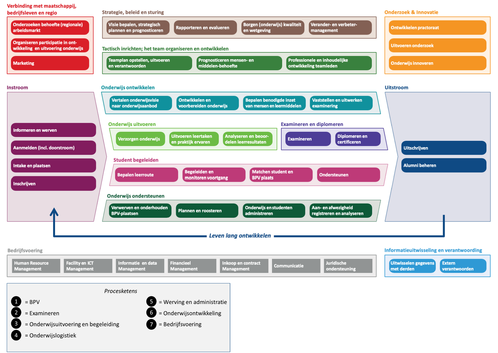

Hier sluit **§2.2 implicatie 1 - werken onder architectuur** direct op aan. Door aan te sluiten op MORA beschrijven we deze keten niet als een lokale werkwijze van één school of team, maar als een herbruikbaar en uitlegbaar architectuurkader voor het mbo. Dat helpt om duidelijk te maken **welke processen, rollen, informatieobjecten en applicaties samenhangen**, en voorkomt dat OKx een eigen parallelle werkelijkheid beschrijft naast de sectorarchitectuur. Voor deze specificatie is MORA daarmee het referentiekader om uit te leggen wat een instelling organisatorisch en procesmatig moet doen voordat "regulier studeren" voor een student überhaupt mogelijk wordt.

**Welke processen moet een onderwijsinstelling faciliteren om 'regulier' studeren te realiseren?**
Procesketen 3, Onderwijsuitvoering en begeleiding:

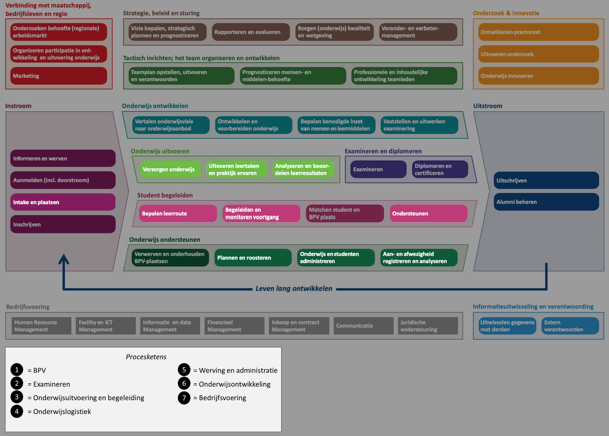

Procesketen 4, Onderwijslogistiek:

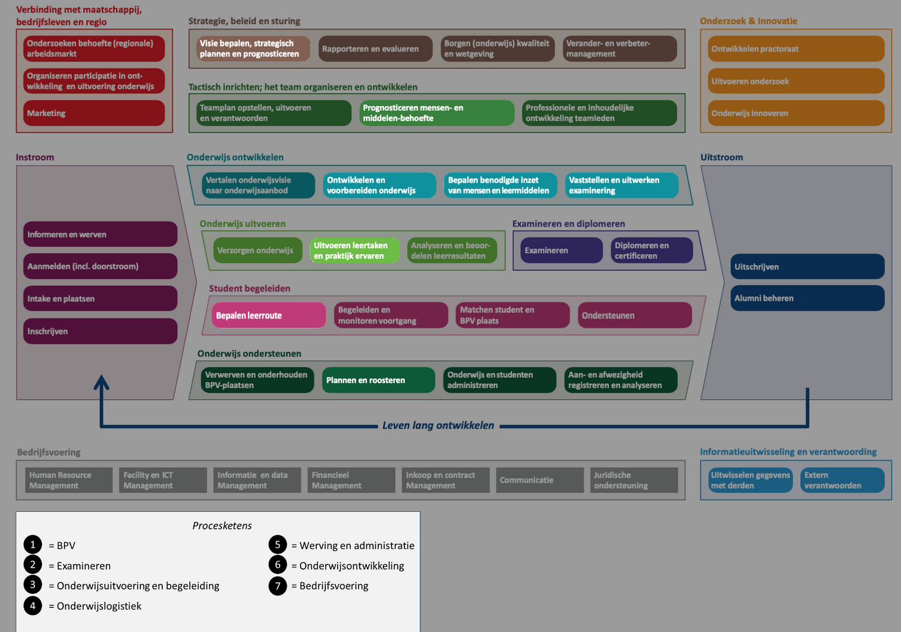

Procesketen 6, onderwijsontwikkeling:

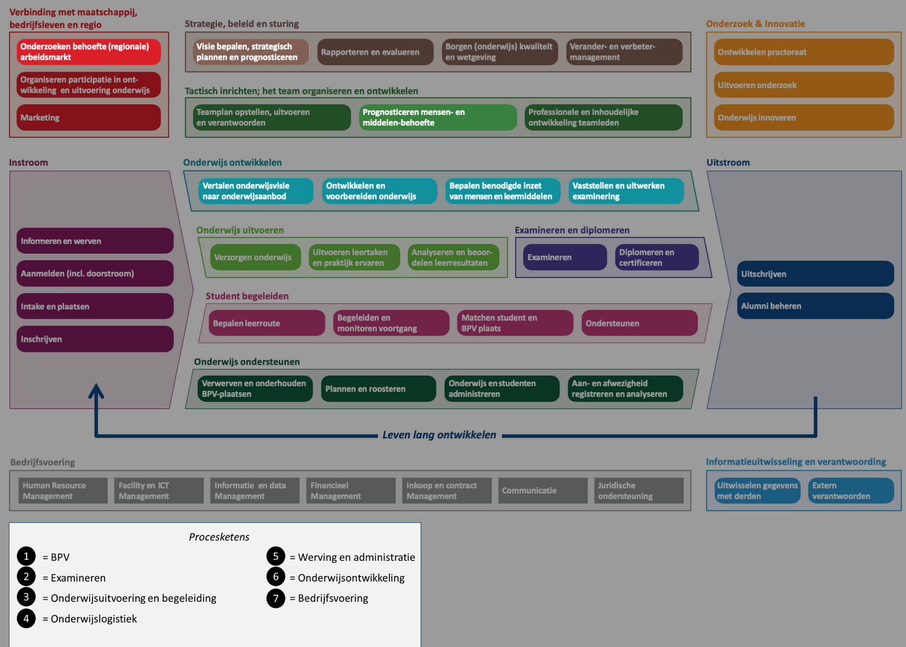


**De Instellingsjourney**
De MORA beschrijft dus betrokken procesketens, maar het complete proces vergt integratie van de losse ketens. De integratie van deze procesketens in de context van verschillende  **Student Journeys**, heet  binnen deze specificatie de **"Instellings Journey"**.

In verhalende vorm ziet die instellingsjourney er als volgt uit. Wanneer een instelling besloten heeft vanuit strategische kaders om een opleiding te geven, gaat de instelling over tot onderwijsontwerp. Een instelling maakt het volgen van een reguliere opleiding mogelijk door het kwalificatiekader te analyseren en te vertalen naar een grofmazig onderwijs- en examenontwerp. Dat ontwerp wordt gepubliceerd en door planning omgezet naar planbaar aanbod: er wordt bepaald of het onderwijs met beschikbare mensen en middelen uitvoerbaar is, in welke perioden het kan plaatsvinden, voor hoeveel studenten, en onder welke condities. Pas daarna kan de student zich op dat aanbod oriënteren, zich aanmelden, intake doorlopen en op een opleiding en opleidingsprogramma geplaatst worden.

Vanaf dat moment verschuift de aandacht van ontwerp naar uitvoering. De instelling werkt leergelegenheden, lessen en toetsspecificaties verder uit, zet planbaar aanbod om in geroosterd aanbod en schrijft student en docent in op concrete onderwijs- en examengelegenheden. Tijdens de uitvoering wordt onderwijs verzorgd, wordt voortgang begeleid en worden toetsmomenten georganiseerd. Aan het eind van de keten volgt de formele examenafname, beoordeling, vaststelling door de examencommissie en uiteindelijk kwalificering en diplomering. Wat voor de student voelt als een reguliere leerroute, is voor de instelling dus een samenhangende keten van ontwerp, logistiek, begeleiding, uitvoering en examinering.

**Instellings Journey in fasen**
1. **Kwalificatiekader analyseren en grofmazig ontwerpen**: de instelling vertaalt kwalificatiedossier, kerntaken, werkprocessen en keuzedeelruimte naar opleidingsspecificatie, onderwijsspecificaties, toetsvormen en een eerste examenplan.
2. **Publiceren en planbaar maken**: de grofmazige onderwijs- en examenspecificaties worden gepubliceerd, waarna de planner haalbaarheid bepaalt en deze omzet naar planbaar aanbod met perioden, capaciteit, groepen en examengelegenheden.
3. **Instroom, intake en plaatsing**: de student oriënteert zich op het gepubliceerde en planbare aanbod, meldt zich aan, doorloopt intake, kiest opleiding en programma, en legt waar nodig keuzedelen vast in het persoonlijke programma. Keuzedelen zijn een **verplicht** onderdeel van mbo-opleidingen en worden afgesloten met een **examen**. **Bron**: [SBB — Keuzedelen](https://www.s-bb.nl/onderwijs/kwalificatiestructuur/keuzedelen/).  
4. **Detailleren, roosteren en inschrijven**: de instelling werkt leergelegenheden en toetsspecificaties fijnmazig uit, zet planbaar aanbod om in geroosterd aanbod, en schrijft student en docent in op de concrete onderwijs- en examengelegenheden.
5. **Onderwijs uitvoeren en voortgang begeleiden**: de student volgt het geroosterde onderwijs, de docent verzorgt het onderwijs, plant toetsmomenten in de uitvoering en houdt de formatieve voortgang bij.
6. **Examineren, vaststellen en diplomeren**: examengelegenheden worden voorbereid en uitgevoerd, examens beoordeeld, resultaten vastgesteld door de examencommissie en uiteindelijk vertaald naar kwalificering en diplomering.

Onderstaand figuur is een *conceptuele* model weergave van de door OKx geobserveerde IST situatie van dit proces. **Gele ronde bollen** zijn informatie-objecten (o.a. **aanmelding** en **inschrijving**); keuzedeel-aanmelding wordt **inschrijving keuzedeel** zodra een passende combinatie van keuzedeel, onderwijsperiode en onderwijslocatie is gevonden (zie §3.2.1.1).


```mermaid
flowchart TB
  subgraph onderwijsontwerperVooraf["Onderwijsontwerper (vooraf)"]
    analyseerKwalificatiekader["Analyseren Kwalificatie kader (Kwalificatiedossier/CROHO/CREBO/Keuzedelen)"]
    kwalificatieKader(("Kwalificatie, Kerntaken, Werkprocessen"))
    beschrijfOpleidingsspecificatie["Opleidingsspecificatie beschrijven (Grofmazig ontwerp) op basis van kerntaken (nominaal programma + keuzedeelruimte)"]
    instantieerOnderwijsspecificaties["Onderwijsspecificaties instantiëren op basis van kerntaken en koppelen aan opleidingspecificatie"]
    publiceerOpleidingsspecificatie["Opleidingsspecificatie met onderliggende onderwijsspecificaties publiceren"]
    beschrijfToetsvormen["Toetsvorm(en) beschrijven"]
  end

  subgraph onderwijsontwikkelaar["Onderwijsontwikkelaar"]
    detailleerOnderwijsspecificaties["Onderwijsspecificaties beschrijven en detailleren (fijnmazige onderwijsontwikkeling) op basis van werkprocessen en Leertaken"]
    detailleerLeergelegenheid["Leergelegenheid instantiëren,  beschrijven en detailleren op basis van Leertaken"]
    beschrijfToetsspecificatie["Toetsspecificatie op basis van toetsvorm beschrijven"]
  end

  subgraph plannerInstelling["Planner (instelling)"]
    bepaalHaalbaarheid["Haalbaarheid bepalen (mensen en middelen, alle opleidingen)"]
    maakPlanbaarAanbod["Planbaar aanbod maken (periodes, capaciteit, groepen) (incl. examengelegenheid)"]
  end

  subgraph studentOrientatie["Student"]
    orienteerOpGeplandAanbod["Orienteren (op opleidingsspecificatie + gepland aanbod + keuzedeelaanbod)"]
    meldAanOpGeplandAanbod["Aanmelden op gepland aanbod"]
  end

  subgraph slbEnStudent["StudieLoopbaanBegeleider + Student"]
    voerIntakeUit["Intake"]
    kiesOpleidingEnProgramma["Opleiding en opleidingsprogramma kiezen"]
    momentKeuzedeelBeleid{"Instellingsbeleid: moment keuzedeel-aanmelding?"}
    legKeuzedeelVoorkeurslijst["Geprioriteerde keuzedeel-voorkeurslijst samenstellen"]
    meldAanKeuzedeel["Aanmelden keuzedeel (periode en onderwijslocatie per prioriteit)"]
    legKeuzedeelAanmeldingIntake["Keuzedeel-aanmelding bij intake vastleggen (definitief)"]
    legKeuzedeelAanmeldingVoorlopig["Keuzedeel-aanmelding bij intake vastleggen (voorlopig)"]
    aanmeldingKeuzedeel(("Aanmelding keuzedeel"))
    passendKeuzedeelAanbod{"Passende combinatie keuzedeel, periode en locatie?"}
    inschrijvingKeuzedeel(("Inschrijving keuzedeel"))
  end

  subgraph roosteraar["Roosteraar"]
    roosterAanbod["Roosteren"]
    geroosterdAanbod(("Geroosterd Aanbod - Leergelegenheid (reeks aan lessen)"))
    schrijfInOpGeroosterdAanbod["Inschrijven student en docent op geroosterd aanbod"]
    inschrijvingGeroosterdAanbod(("Inschrijving student en docent op geroosterd onderwijsaanbod (waaronder examengelegenheid)"))
  end

  subgraph docent["Docent"]
    voerOnderwijsUit["Onderwijs Uitvoeren"]
    planToetsgelegenheidTijdensLes["Toetsgelegenheid plannen tijdens geroosterde lessen"]
    toetsStudent["Toetsen"]
    houdFormatieveVoortgangBij["Formatieve voortgang student bijhouden"]
  end

  subgraph studentUitvoering["Student"]
    volgOnderwijs["Onderwijs volgen"]
    volgToetsgelegenheid["Toetsgelegenheid volgen"]
    volgExamengelegenheid["Examengelegenheid volgen"]
  end

  subgraph examinator["Examinator"]
    bereidExamengelegenheidVoor["Geplande examengelegenheid voorbereiden"]
    voerExamengelegenheidUit["Examengelegenheid uitvoeren/begeleiden"]
  end

  subgraph examenbeoordelaar["Examenbeoordelaar"]
    beoordeelGemaaktExamen["Door student gemaakt examen beoordelen"]
  end

  subgraph examencommissieVaststelling["Examencomissie"]
    stelExamenbeoordelingVast["Examen beoordeling vaststellen"]
    kwalificeerEnDiplomeer["Kwalificeren en Diplomeren"]
    kwalificeringEnDiplomering(("Kwalificering en diplomering"))
  end

  subgraph examencommissieOntwerp["Examencommissie"]
    examenplan(("Examenplan"))
    examenspecificaties(("Examenspecificatie(s)"))
    examenInstrumenten(("Examen Instrument(en) en Examen materiaal"))
    stelExamenplanEnSpecificatiesOp["Opstellen Examenplan en examen specificaties op basis van werkprocessen"]
    bepaalBenodigdeExamenInstrumenten["Bepalen benodigde examen instrumenten"]
    bepaalBenodigdExamenMateriaal["Bepalen Benodigd Examen materiaal"]
    besluitInkopenOfConstrueren["Besluiten inkopen of construeren"]
    koopExamenInstrumentenIn["Inkopen Examen instrumenten"]
    construeerExamenInstrumenten["Construeren Examen instrumenten"]
    stelExamenspecificatieEnInstrumentenVast["Vaststellen examen specificatie, examen materiaal en instrumenten"]
  end

  grofmazigeSpecificaties(("Grofmazige Opleidings- / onderwijs- en examenspecificaties"))
  planbaarOnderwijsaanbod(("Planbaar Onderwijsaanbod (incl. examengelegenheid)"))
  aanmeldingGeplandAanbod(("Aanmelding voor Opleiding en gepland aanbod"))
  inschrijvingGeplandAanbod(("Inschrijving op geplande opleidings- en opleidingsprogramma aanbod"))
  onderwijsresultaat(("Onderwijsresultaat"))


  kwalificatieKader --> stelExamenplanEnSpecificatiesOp
  stelExamenplanEnSpecificatiesOp --> examenplan
  stelExamenplanEnSpecificatiesOp --> examenspecificaties
  examenspecificaties --> bepaalBenodigdeExamenInstrumenten
  bepaalBenodigdeExamenInstrumenten --> bepaalBenodigdExamenMateriaal --> besluitInkopenOfConstrueren
  besluitInkopenOfConstrueren --> koopExamenInstrumentenIn
  besluitInkopenOfConstrueren --> construeerExamenInstrumenten
  koopExamenInstrumentenIn --> examenInstrumenten
  construeerExamenInstrumenten --> examenInstrumenten
  examenInstrumenten --> stelExamenspecificatieEnInstrumentenVast
  stelExamenspecificatieEnInstrumentenVast --> grofmazigeSpecificaties

  examenplan --> bepaalHaalbaarheid
  analyseerKwalificatiekader --> kwalificatieKader --> beschrijfOpleidingsspecificatie --> instantieerOnderwijsspecificaties --> beschrijfToetsvormen --> publiceerOpleidingsspecificatie --> grofmazigeSpecificaties
  grofmazigeSpecificaties --> bepaalHaalbaarheid --> maakPlanbaarAanbod --> planbaarOnderwijsaanbod
  planbaarOnderwijsaanbod --> detailleerOnderwijsspecificaties --> detailleerLeergelegenheid --> beschrijfToetsspecificatie --> inschrijvingGeplandAanbod
  planbaarOnderwijsaanbod --> orienteerOpGeplandAanbod --> meldAanOpGeplandAanbod --> aanmeldingGeplandAanbod
  aanmeldingGeplandAanbod --> voerIntakeUit --> kiesOpleidingEnProgramma --> momentKeuzedeelBeleid
  momentKeuzedeelBeleid -->|Keuzedeelruimte nadert| legKeuzedeelVoorkeurslijst --> meldAanKeuzedeel --> aanmeldingKeuzedeel
  momentKeuzedeelBeleid -->|Bij intake, definitief| legKeuzedeelAanmeldingIntake --> aanmeldingKeuzedeel
  momentKeuzedeelBeleid -->|Bij intake, voorlopig| legKeuzedeelAanmeldingVoorlopig --> aanmeldingKeuzedeel
  aanmeldingKeuzedeel --> passendKeuzedeelAanbod
  passendKeuzedeelAanbod -->|Ja| inschrijvingKeuzedeel --> inschrijvingGeplandAanbod
  passendKeuzedeelAanbod -->|Nee: keuzedeelruimte oningevuld| inschrijvingGeplandAanbod
  kiesOpleidingEnProgramma --> inschrijvingGeplandAanbod
  inschrijvingGeplandAanbod --> roosterAanbod --> geroosterdAanbod --> schrijfInOpGeroosterdAanbod --> inschrijvingGeroosterdAanbod
  inschrijvingGeroosterdAanbod --> voerOnderwijsUit
  voerOnderwijsUit --> planToetsgelegenheidTijdensLes --> toetsStudent --> houdFormatieveVoortgangBij --> voerOnderwijsUit
  inschrijvingGeroosterdAanbod --> volgOnderwijs --> volgToetsgelegenheid --> volgExamengelegenheid --> volgOnderwijs
  volgToetsgelegenheid --> onderwijsresultaat
  toetsStudent --> onderwijsresultaat
  maakPlanbaarAanbod --> volgExamengelegenheid --> voerExamengelegenheidUit
  maakPlanbaarAanbod --> bereidExamengelegenheidVoor --> voerExamengelegenheidUit
  voerExamengelegenheidUit --> beoordeelGemaaktExamen --> stelExamenbeoordelingVast --> onderwijsresultaat --> kwalificeerEnDiplomeer --> kwalificeringEnDiplomering

  %% Class definitions volgens opdracht
  %% Plannen en roosteren stappen (groen)
  class bepaalHaalbaarheid,maakPlanbaarAanbod,planbaarOnderwijsaanbod,roosterAanbod,geroosterdAanbod,schrijfInOpGeroosterdAanbod,inschrijvingGeroosterdAanbod greenStep;

  %% Toets- en examenstappen (paars)
  class beschrijfToetsvormen,bescrijfToetsspecificatie,planToetsgelegenheidTijdensLes,toetsStudent,volgToetsgelegenheid,volgExamengelegenheid,bereidExamengelegenheidVoor,voerExamengelegenheidUit,beoordeelGemaaktExamen,stelExamenbeoordelingVast,examenplan,examenspecificaties,examenInstrumenten,stelExamenplanEnSpecificatiesOp,bepaalBenodigdeExamenInstrumenten,bepaalBenodigdExamenMateriaal,besluitInkopenOfConstrueren,koopExamenInstrumentenIn,construeerExamenInstrumenten,stelExamenspecificatieEnInstrumentenVast,kwalificeerEnDiplomeer,kwalificeringEnDiplomering purpleStep;

  %% Alle bollen geel
  class kwalificatieKader,geroosterdAanbod,inschrijvingGeroosterdAanbod,grofmazigeSpecificaties,planbaarOnderwijsaanbod,aanmeldingGeplandAanbod,inschrijvingGeplandAanbod,aanmeldingKeuzedeel,inschrijvingKeuzedeel,onderwijsresultaat,examenplan,examenspecificaties,examenInstrumenten,kwalificeringEnDiplomering yellowNode;

  %% Ook stappen die instantiëren als bol worden getekend zoals geroosterdAanbod
  %% Mogelijk andere bollen buiten de subgraphs
  
  classDef greenStep fill:#cbf7d7,stroke:#258b45,stroke-width:2px,color:#222;
  classDef purpleStep fill:#e0dcfa,stroke:#7a3ff7,stroke-width:2px,color:#332;
  classDef yellowNode fill:#fffbe6,stroke:#efd600,stroke-width:2px,color:#333;

  class kiesOpleidingEnProgramma freeze;
```


###### 3.3.1.2.4 Scenario's binnen deze leerroute

Binnen deze leerroute speelt zich niet maar één scenario af. De beschrijving hierboven laat de **nominale beleving** van regulier studeren zien: de student volgt de route zoals de instelling die heeft ontworpen, gepland en geroosterd. In de praktijk kan diezelfde student binnen precies zo'n regulier traject alsnog met verschillende incidenten te maken krijgen. De leerroute blijft dan **regulier**, maar de feitelijke voortgang van de student wijkt tijdelijk af van het bedoelde pad.

De belangrijkste scenario's binnen deze leerroute zijn:

- **Happy flow / nominaal verloop**: alles gaat goed. De student volgt het programma zoals ontworpen, gepland en geroosterd. Er treden geen noemenswaardige verstoringen op, toetsen worden volgens verwachting afgelegd, en de student doorloopt de route in het bedoelde tempo.

- **Incidenteel temporiseren**: de student loopt tijdelijk achter door een gebeurtenis in de uitvoering. Denk aan ziekte, persoonlijke omstandigheden, gemiste lessen, onvoldoende voortgang of een toetsmoment dat niet in een keer wordt behaald. De route blijft regulier, maar de student moet onderdelen later volgen, herkansen of opnieuw laten inplannen.
- **Incidenteel versnellen**: de student blijkt sneller door bepaalde onderdelen heen te gaan dan vooraf verwacht. Dat kan komen doordat een student eerder vaardigheden oppakt, sneller formatieve doelen behaalt of ruimte krijgt om eerder aan een toetsmoment deel te nemen. Ook dan blijft de route regulier, maar de student beweegt zich op onderdelen sneller door dezelfde keten.
- **Incidenteel versnellen en temporiseren**: de student loopt op het ene onderdeel voor en op het andere onderdeel achter. Bijvoorbeeld: theorie gaat sneller dan gepland, maar praktijk, BPV of een specifiek werkproces vraagt juist meer tijd. In dat geval ontstaat een gemengd beeld waarin de student nog steeds binnen de reguliere leerroute valt, maar de voortgang per onderdeel niet meer overal gelijk oploopt.

De `happy flow` en de incidentele varianten van temporiseren, versnellen en hybride voortgang zijn niet uniek voor leerroute 1. Ze zijn in feite van toepassing op **elke leerroute** in dit document. Ook binnen temporiseren, versnellen, personaliseren of modulair studeren kunnen studenten onderweg in nominaal tempo doorlopen, incidenteel vertragen, incidenteel versnellen of beide tegelijk ervaren. Daarnaast kent iedere leerroute ook eigen, route-specifieke scenario's. Voor leerroute 1 is \"wisselen van opleiding en behaalde resultaten meenemen\" daarvan een belangrijk voorbeeld.

**Overige scenario's specifiek voor leerroute 1**
- **Wisselen van opleiding en behaalde resultaten meenemen**: een student volgt eerst een deel van de reguliere route, besluit daarna over te stappen naar een andere opleiding of een ander regulier programma, en wil eerder behaalde resultaten meenemen. Dit scenario raakt niet alleen de studentbeleving, maar vooral de vraag hoe resultaten, vrijstellingen, voortgang en passende herplaatsing overgedragen en opnieuw geïnterpreteerd worden binnen de instelling.

Deze leerroute volgt een **sterk aanbod-gestuurd model met hybride kenmerken**: het onderwijsaanbod wordt grotendeels vooraf ontwikkeld en gepland. Studenten schrijven zich in op vaste programma’s. Alleen bij uitzonderingen (zoals incidenteel temporiseren of incidenteel versnellen) wijkt men van de hoofdroute af en kan bij op aanvraag aanvullend aanbod worden georganiseerd. Vanwege de statische aard van het onderwijsontwerp, is er voldoende behoefte nodig voor extra aanbod vanuit de studentenpopulatie. Er kan dus vaak niet aan individuele aanvragen vanuit studenten voldaan worden.

Veel instelling binnen Nederland hanteren dit Onderwijsaanbod model. `TO-DO: specificeren hoeveel?`

Schematisch is deze scenario opbouw als volgt weer te geven:


```mermaid
flowchart TD
  npulsRoutes["Npuls leerroutes"] --> leerroute1["Leerroute 1 - Regulier"]
  npulsRoutes --> overigeLeerroutes["Leerroute ..."]
  npulsRoutes --> leerroute9["Leerroute 9 - Vrije keuze"]

  leerroute1 --> lr1HappyFlow["Happy flow / nominaal verloop"]
  leerroute1 --> lr1Temporiseren["Incidenteel temporiseren"]
  leerroute1 --> lr1Versnellen["Incidenteel versnellen"]
  leerroute1 --> lr1Hybride["Incidenteel temporiseren en versnellen"]
  leerroute1 --> lr1Switch["Na verstreken studieduur wisselen en behaalde resultaten meenemen"]
  leerroute1 --> overigeRouteSpecifiek["Overige route-specifieke scenario's"]


  overigeLeerroutes --> overigeHappyFlow["Happy flow / nominaal verloop"]
  overigeLeerroutes --> overigeTemporiseren["Incidenteel temporiseren"]
  overigeLeerroutes --> overigeVersnellen["Incidenteel versnellen"]
  overigeLeerroutes --> overigeHybride["Incidenteel temporiseren en versnellen"]
  overigeLeerroutes --> overigeRouteSpecifiek["Overige route-specifieke scenario's"]

  leerroute9 --> lr9HappyFlow["Happy flow / nominaal verloop"]
  leerroute9 --> lr9Temporiseren["Incidenteel temporiseren"]
  leerroute9 --> lr9Versnellen["Incidenteel versnellen"]
  leerroute9 --> lr9Hybride["Incidenteel temporiseren en versnellen"]
  leerroute9 --> lr9Overig["Overige route-specifieke scenario's"]
```

De uitwerking en specificatie van de scenario's volgt in `HOOFDSTUK X`.

###### 3.3.1.2.5 Betrokken informatie bij proces

De begrippen in onderstaande tabel vullen het begrippenkader uit paragraaf 2.1 aan. Eerder is beschreven dat een leerroute niet alleen over het studentperspectief gaat, maar ook over drie samenhangende vragen: **wat** geleerd wordt, **hoe** dat onderwijs als specificatie wordt ontworpen, **hoe** dat ontwerp organiseerbaar wordt gemaakt als aanbod, en **hoe** dat aanbod uiteindelijk door studenten en medewerkers daadwerkelijk gevolgd en geadministreerd wordt. De tabel hieronder zet die begrippen om in een vaste set informatie-objecten, zodat scenario's, informatiestromen en koppelvlakken steeds over dezelfde bouwstenen spreken.

Samengevat:

| Vraag                                        | Concept                | Doel/toelichting                                                                                                   |
|----------------------------------------------|------------------------|--------------------------------------------------------------------------------------------------------------------|
| Wat wordt geleerd?                           | Onderwijsspecificatie  | Kwalificatiekader / beoogde leeruitkomsten, kerntaken, werkprocessen, leeruitkomsten                              |
| Hoe wordt het aangeleerd?                    | Onderwijsspecificatie  | Leervorm, begeleiding, studielast (BOT/OOT), uitwerking op werkproces- en leergelegenheid niveau                               |
| Hoe werken toetsing en bewijsvoering?        | Onderwijsspecificatie  | Toets-/examenvorm en scope                                                                                         |
| Hoe is het organiseerbaar?                   | Onderwijsaanbod        | Planning/roostering binnen tijd en beschikbare mensen & middelen; daadwerkelijke uitvoerbaarheid van het ontwerp   |
| Hoe wordt het gevolgd/beoordeeld/geadmineerd?| Onderwijsverbintenis   | Werkelijke deelname door student/medewerker, beoordeling, administratie van deelname/resultaten                   |

De volgende tabel is daarmee de brug tussen het **begrippenkader** en het **gegevensmodel**. Het begrippenkader zegt *welke concepten we moeten onderscheiden*; de informatie-objecten maken zichtbaar *welke objecten daarbij horen, op welk niveau van het kwalificatiekader ze bestaan, en hoe ze zich tot elkaar verhouden*. Zo wordt bijvoorbeeld duidelijk dat `Onderwijsspecificatie` niet hetzelfde is als `Onderwijsaanbod`, en dat `Onderwijsverbintenis` weer iets anders is dan het aanbod zelf: het is de relatie tussen student of medewerker en een concreet aanbod.

| **1. Kwalificatiekader**                                                                     | **2. Onderwijsspecificatie**       | **3. Onderwijsaanbod**                                                                                                         | **4. Onderwijsverbintenis**                  | **5. Onderwijsresultaat**                            |
| -------------------------------------------------------------------------------------------- | ---------------------------------- | ------------------------------------------------------------------------------------------------------------------------------ | -------------------------------------------- | ---------------------------------------------------- |
| `Kwalificatiedossier`                                                                        | `Opleidingsspecificatie`           | `Opleidingsaanbod`                                                                                                             | `Opleidingsverbintenis`                      | `Opleidingsresultaat`                                |
| `Kwalificatie`                                                                               | `Opleidingsprogramma-specificatie` | `Opleidingsprogramma-aanbod`                                                                                                   | `Opleidingsprogramma-verbintenis`            | `Opleidingsprogramma-resultaat`                      |
| `Kerntaak`                                                                                   | `Onderwijseenheid-specificatie`    | `Onderwijseenheid-aanbod`                                                                                                      | `Onderwijseenheid-verbintenis`               | `Onderwijseenheid-resultaat`                         |
| `Werkproces`                                                                                 | `Leeronderdeel-specificatie`       | `Leergelegenheid` | `Lesgelegenheid verbintenis` | `Lesgelegenheid verbintenis resultaat` |
| *n.v.t. binnen kwalificatiekader - eigen beleid instelling*                                                                   | `Lesspecificatie`                  | `Lesgelegenheid` | `Lesgelegenheid verbintenis` | `Lesgelegenheid verbintenis resultaat` |

**Cardinaliteit (normatief voor dit profiel):**

- `Kwalificatiedossier (1..*) Kwalificatie`
- `Kwalificatie (1..*) Kerntaak`
- `Kerntaak (1..*) Werkproces`
- `Werkproces (1..*) Leeruitkomst` (summatief)
- `Leeruitkomst (0..*) Onderwijseenheid` / `Leeronderdeel` / `Toetsonderdeel` (dezelfde LO kan over meerdere onderdelen verdeeld zijn; onderdelen kunnen meerdere LO's dekken)
- `Leeruitkomst (0..*) Lesuitkomst` (formatief; DAG/boom-structuur)
- `Opleidingsspecificatie (1..*) Opleidingsprogramma-specificatie`
- `Opleidingsprogramma-specificatie (1..*) Onderwijseenheid-specificatie`
- `Onderwijseenheid-specificatie (1..*) Leeronderdeel-specificatie`
- `Leeronderdeel-specificatie (0..*) Lesspecificatie`
- `Opleidingsspecificatie (0..*) Opleidingsaanbod`; elk `Opleidingsaanbod` instantieert precies `1` `Opleidingsspecificatie`
- `Opleidingsprogramma-specificatie (0..*) Opleidingsprogramma-aanbod`; elk `Opleidingsprogramma-aanbod` instantieert precies `1` `Opleidingsprogramma-specificatie`
- `Onderwijseenheid-specificatie (0..*) Onderwijseenheid-aanbod`; elk `Onderwijseenheid-aanbod` instantieert precies `1` `Onderwijseenheid-specificatie`
- `Leeronderdeel-specificatie (0..*) Leergelegenheid`; elke `Leergelegenheid` instantieert precies `1` `Leeronderdeel-specificatie`
- `Lesspecificatie (0..*) Lesgelegenheid`; elke `Lesgelegenheid` instantieert precies `1` `Lesspecificatie`
- `Persoon (0..*) Onderwijsverbintenis`; elke `Onderwijsverbintenis` hoort bij precies `1` persoon en precies `1` aanbodobject
- `Opleidingsaanbod` / `Opleidingsprogramma-aanbod` / `Onderwijseenheid-aanbod` / `Leergelegenheid` / `Lesgelegenheid` `(0..*) Onderwijsverbintenis`
- Elke `Onderwijsverbintenis` heeft precies `1` actuele statuswaarde (`Association.state`); aanvullende resultaat-/bewijsregistraties zijn optioneel en daarom `Onderwijsverbintenis (0..*) aanvullend resultaatrecord`

De tabel is daarmee niet bedoeld als extra abstractielaag naast de scenario's, maar juist als hun vaste referentiepunt. Wanneer in dit document gesproken wordt over kwalificatiedossier, kerntaak, werkproces, leergelegenheid, toetsgelegenheid, verbintenis of resultaat, dan verwijzen die termen steeds naar deze informatie-objecten en hun positie in het geheel.

**Voetnoot.** OKx richt zich in dit profiel primair tot de diepte van het beschrijven van de **werkproceslaag**. De entiteit *leergelegenheid* (groep van lessen) leidt uiteindelijk tot individueel geroosterde lessen. Binnen geroosterde lessen kunnen op hun beurt geneste lessen voorkomen; in toekomstige iteraties moeten ook deze recursief volgens dit datamodel gemodelleerd kunnen worden. Dit geldt eveneens voor diepere sublagen zoals een *lessenreeks* of specifieke leeractiviteiten binnen een les. Dit erkent expliciet dat onder een *leergelegenheid* of *lessenreeks* nog een hiërarchie van leeronderdelen kan bestaan, met directe impact op bottom-up en top-down aggregatie van onderwijsspecificaties, aanbod en verbintenissen.

###### 3.3.1.2.3 Het plan en rooster proces

**Plannen** en **roosteren** zijn de stappen waarin de instelling het onderwijsontwerp organiseerbaar en uitvoerbaar maakt als respectievelijk **planbaar** en **geroosterd** `onderwijsaanbod` (zie de instellingsjourney, fasen 2 en 4, in §3.3.1.2.2). In de keten gaat het daarbij om het samenbrengen van veel feitelijke en beleidsmatige randvoorwaarden tot één samenhangende logistieke beslissing die voor alle betrokken actoren houdbaar moet zijn.

###### 3.3.1.2.3.1 Constraint Satisfaction Problem (CSP)

 Een CSP bestaat uit **variabelen** (wat moet nog beslist worden?), **domeinen** (welke waarden zijn per variabele toegestaan?) en **constraints** (welke combinaties zijn wel of niet toegestaan?). Een *oplossing* is een toewijzing van waarden aan alle variabelen waarbij alle constraints gelijktijdig gelden. Plannen en roosteren zijn in deze zin archetypische CSP’s: variabelen zijn bijvoorbeeld keuzes voor perioden, groepsindelingen, les- of examensloten, docent- of lokaaltoewijzingen; domeinen zijn beschikbare tijdvakken, teams, zalen en capaciteit; constraints vangen harde eisen (geen dubbele docent, maximaal aantal studenten per ruimte, examenregels, sequenties in het programma) en zachtere voorkeuren (spreiding over de week, voorkeurteams, reistijd) af. Zie voor de algemene definitie en eigenschappen onder meer de samenvatting op Wikipedia over [Constraint satisfaction problems](https://en.wikipedia.org/wiki/Constraint_satisfaction_problem).

###### 3.3.1.2.3.2  Keten en informatie als constraint-bron.
Hoe vollediger en consistenter de **procesketen vóór en naast** planning en roostering de benodigde feiten levert, hoe beter het CSP-model de werkelijkheid representeert. Ontbrekende of tegenstrijdige informatie uit bijvoorbeeld `onderwijsspecificatie`, capaciteitsbeeld, groeps- en inschrijfgegevens, docent- en locatiedata, of examenregels levert geen “magisch betere algoritmes”, maar leegtes die algoritmes opvullen met aannames of heuristieken — met instabiele of onwerkbare roosters tot gevolg. Daarmee is **standaardisatie en tijdige beschikbaarheid** van keteninformatie (zoals beschreven rond het vlakkenmodel in §3.3.1.2.5) een randvoorwaarde voor kwaliteit van planning en roostering, niet alleen een integratie-uitdaging.

###### 3.3.1.2.3.3 Complexiteit en beheer in de praktijk

Voor realistische formuleringen van een rooster is het vinden van een haalbare oplossing (laat staan een optimale) **rekenkundig zwaar**: het behoort tot de klasse van **NP-moeilijke (NP-Hard)** beslissingsproblemen. Cooper en Kingston tonen in *The complexity of timetable construction problems* aan dat al onder sterk vereenvoudigde aannames rooster-constructie **NP-compleet** is — een standaardreferentie in het veld van geautomatiseerd roosteren (*Practice and Theory of Automated Timetabling; Springer LNCS*, o.a. [DOI 10.1007/3-540-61794-9_66](https://doi.org/10.1007/3-540-61794-9_66)). Daarmee is “alles digitaal dus oplosbaar” misleidend: praktische systemen gebruiken **heuristieken**, **decompositie**, **tijdslimieten** en **mensen** die voorkeuren en uitzonderingen sturen. Het proces blijft daarom **grotendeels handmatig te finetunen** (weging van zachte constraints, beleidskeuzes bij conflicten, herplannen bij verstoring).

###### 3.3.1.2.3.4 Controle van een voorgestelde oplossing

Los van het *zoeken* naar een oplossing staat het **verifiëren** van een concreet voorstel (een kandidaat-rooster of plan): voor elke constraint kan typisch in polynomiale tijd (redelijk tijdsbestek) in het aantal constraints en variabelen worden gecontroleerd of die constraint geschonden wordt. Een planner of roosteraar kan daardoor **relatief snel** beoordelen of een voorstel “op papier klopt” — ook al was het *vinden* van dat voorstel zelf tijdsintensief en complex. In de praktijk wisselen tool-ondersteunde conceptplannen en menselijke beoordeling elkaar daarom af.

###### 3.3.1.2.3.5 Het Plan en rooster proces uitgetekend

Onderstaand proces diagram is een weerspiegeling van hoe het plannen en roosteren procesmatig conceptueel weergegeven kan worden.

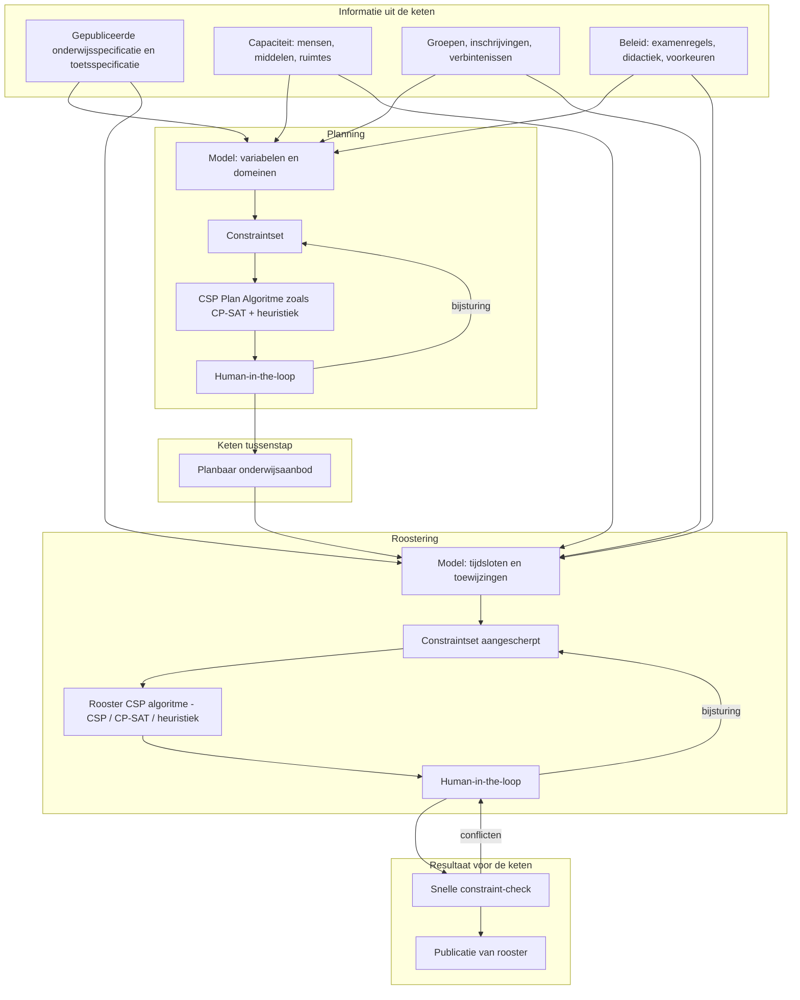
```mermaid
flowchart TB
  subgraph keten["Informatie uit de keten"]
    OCspec["Gepubliceerde onderwijsspecificatie en toetsspecificatie"]
    cap["Capaciteit: mensen, middelen, ruimtes"]
    groep["Groepen, inschrijvingen, verbintenissen"]
    beleid["Beleid: examenregels, didactiek, voorkeuren"]
  end

  subgraph plan["Planning"]
    pModel["Model: variabelen en domeinen"]
    pConstr["Constraintset"]
    pSolve["CSP Plan Algoritme zoals CP-SAT + heuristiek"]
    pHitl["Human-in-the-loop"]
  end

  subgraph tussen["Keten tussenstap"]
    planbaar["Planbaar onderwijsaanbod"]
  end

  subgraph rooster["Roostering"]
    rModel["Model: tijdsloten en toewijzingen"]
    rConstr["Constraintset aangescherpt"]
    rSolve["Rooster CSP algoritme - CSP / CP-SAT / heuristiek"]
    rHitl["Human-in-the-loop"]
  end

  subgraph resultaat["Resultaat voor de keten"]
    verify["Snelle constraint-check"]
    pubOC["Publicatie van rooster"]
  end

  groep --> pModel
  OCspec --> pModel
  cap --> pModel
  beleid --> pModel
  pModel --> pConstr --> pSolve --> pHitl
  pHitl -->|bijsturing| pConstr
  pHitl --> planbaar
  planbaar --> rModel
  OCspec --> rModel
  groep --> rModel
  cap --> rModel
  beleid --> rModel
  rModel --> rConstr --> rSolve --> rHitl
  rHitl -->|bijsturing| rConstr
  rHitl --> verify
  verify -->|conflicten| rHitl
  verify --> pubOC
```

###### 3.3.1.2.3.6 Persoon, groep en constraint — informatie-overzicht

Het procesdiagram in §3.3.1.2.3.5 groepeert keteninvoer in vier blokken. Onderstaande **informatietabel** zegt per blok **welk inzicht** nodig is in **personen** (`Persoon`: student of medewerker), **groepen** (clusters, cohorten, kandidatenlijsten, pools) en **constraints** (harde en zachte grenzen) voordat een CSP-model betrouwbaar kan draaien.

| **Bron-blok (diagram §3.3.1.2.3.5)** | **Primair inzicht** | **`Persoon` (student / medewerker)** | **Groep / cluster / populatie** | **Constraintdimensie (voorbeelden)** |
| --- | --- | --- | --- | --- |
| **OCspec** (onderwijs- en toetsspecificatie) | welke leer- en toetsmomenten bestaan en in welke volgorde of samenhang ze georganiseerd worden | welke uitvoerende rollen (docent, afnemer, …) inhoudelijk nodig zijn; welke voorzieningen per moment | welke cohorten dezelfde route of parallel delen | harde: examen- en opleidingsregels, verplichte contacttijd, volgorde-eisen; zacht: didactische spreiding |
| **groep** (inschrijvingen, verbintenissen) | *wie* aanbod volgt en met welke omvang en samenstelling | student-`Persoon` met status, begeleidings- of examenflags | klas / cohort, werkgroep, kandidatenlijst; geaggregeerde **skill-vraag** van de populatie | harde: max. groepsgrootte, lock op cohort, minimale bezetting; zacht: homogene werkgroep |
| **cap** (mensen, middelen, ruimtes) | *waarmee* en *waar* uitvoering mogelijk is binnen fysieke en contractuele grenzen | medewerker-`Persoon` met contract, bevoegdheid, roosterbare uren, reistijd | team-, docenten- of surveillant-pool; piek rond examens | harde: dubbele docent/lokaal verboden, capaciteit zaal/middel; zacht: voorkeurslokaal, workload-spreiding |
| **beleid** (examenregels, didactiek, voorkeuren) | *welke randvoorwaarden* buiten het “puur inhoudelijke” model vallen of als kosten/weging in het CSP gaan | individuele ontheffingen, voorkeuren begeleider; beleidsrollen | instroom- en kwaliteitsdoelen, inclusie-afspraken, werkveldafspraken | harde: wettelijke en examencommissie-kaders; zacht: strategische spreiding, voorkeurteams |

**Denkraam: persoon, rollen en skills.** Naast de onderwijsdata die elders in dit document wordt gemodelleerd, is voor **planning en roostering** een **complementair denkpatroon** nodig dat direct met **mensen** en **wat zij kunnen en willen** werkt. In dat denkpatroon is elke **`Persoon`** — **student** of **medewerker** — iemand met **skills**: een samenstel van **vaardigheden**, **kennis** en **inzichten** (inclusief formele bevoegdheden waar dat speelt). Bij **instroom** heeft een student typisch al een skill-profiel en een **leerwens**: welke skills hij of zij verder wil **ontwikkelen** binnen de gekozen **leerroute** en de scenario's die daarbij horen. Een **medewerker** heeft evenzo een skill-profiel, uitgedrukt via **functie en titel** (docent, SLB'er, praktijkbegeleider, examinator, …): die titels zijn **koppelvlakken** naar HR en contract, maar **inhoudelijk** gaat het om **welk skill-pakket** iemand kan **aanbieden** in onderwijs, begeleiding, praktijk of examen.

**Skill-vraag en skill-aanbod.** Groepen zijn in dit denkpatroon **clusters van personen** die qua skill-vector op elkaar lijken of dezelfde **aan te bieden** onderwijs- of begeleidingsbehoefte delen. Tegelijk zoekt de instelling naar het **snijpunt** van (a) **skill-vraag** — wat moet deze populatie **kunnen** na het traject — en (b) **skill-aanbod** — welke medewerkers en welke leer- en praktijkomgeving kunnen dat **leveren**. Dat snijpunt is direct te vertalen naar **harde en zachte constraints** in een CSP: harde grenzen (bevoegdheid ontbreekt, geen docent beschikbaar, zaal te klein) en zachte voorkeuren (vaste teamdag, voorkeurdocent, spreiding SLB).

**Reële wereld en strategie.** Daarbovenop liggen constraints die niet “in het hoofd” van één persoon zitten maar de **realiteit van de instelling** vormen: **beperkte tijd** (roosteruren, openingstijden, BPV-vensters), **beperkt geld en capaciteit** (FTE, vervanging, materiaal, collegegeld- of bekostigingskaders), **facilitaire grenzen** (aantal werkplaatsen, labtypes, reisafstand), en **strategische doelen** (doorstroom, inclusie, werkveldafspraken). Die vlakken bepalen **wat er überhaupt in het model mag** voordat een planner of roosteraar een CSP draait.

**Planning en roostering.** Binnen die totale constraintset voeren **planning** en **roostering** het zoeken naar haalbare toewijzingen uit (CSP: §3.3.1.2.3.1; complexiteit en beheer: §3.3.1.2.3.3–§3.3.1.2.3.4; procesdiagram: §3.3.1.2.3.5): variabelen en domeinen komen uit **tijd en ruimte**, **skill-match**, en **populatie-clusters**; de **human-in-the-loop** stappen wegen zachte constraints en beleidsafwegingen. Het procesdiagram in §3.3.1.2.3.5 blijft geldig: *groep* leest hier vooral als **skill-groepering en inschrijf-/cohortrealiteit**, *cap* als **tijd/middelen/facilitair**, *beleid* als **strategie en regels**.

| **Hoofdtype `Persoon`** | **Rol of functietitel (voorbeelden; koppelbaar aan HR)** | **Skills-profiel** (vaardigheden, kennis, inzichten; bevoegdheden waar van toepassing) | **Als constraint geformuleerd** (skill-vraag / skill-aanbod; typisch plan vs rooster) |
| --- | --- | --- | --- |
| **Student** | student / deelnemer aan programma | **Startsituatie** bij instroom; **leerdoelen** als gewenste skill-ontwikkeling binnen leerroute en scenario | **Skill-vraag:** welke skills moeten in het traject **worden opgebouwd**; groeperen in cohort of werkgroep met vergelijkbare vraagvector; harde grenzen uit examen- en opleidingsregels (**Plan**); max. belasting per dag/week (**Rooster**) |
| **Medewerker** | docent (theorie/praktijk), teamcoördinator | vakinhoud, didactiek, toets- en beoordelingsbekwaamheid | **Skill-aanbod:** welke onderwijs- en toetsmomenten kunnen worden bemand; matching met gevraagde leeruitkomst-skills; **beschikbaarheid** en max. uren (**Rooster**); teamspreiding (**Plan**, zacht) |
| **Medewerker** | SLB'er, studiecoach | coachende vaardigheden, route-inzicht, signalering, verwijzen | **Skill-aanbod:** begeleidingscapaciteit (caseload); **zacht:** voorkeurskoppeling met studentgroep; tijdvensters naast lesrooster (**Rooster**) |
| **Medewerker** | praktijkbegeleider, BPV-begeleider | werkveldkennis, praktijkassessment, veiligheid, werkpleknorm | **Skill-aanbod:** uren en trips naar werkveld; **reële wereld:** reis- en clusterafspraken met bedrijven; beperkte parallelle BPV-plaatsen (**Plan** + **Rooster**) |
| **Medewerker** | examinator, surveillant, afnemer, tweede corrector | examenbekwaamheid, integriteit, correctie-inzicht | **Skill-aanbod:** piek rond examenperiodes; verhouding surveillanten/kandidaten; geen belangenverstrengeling (**Rooster**, deels harde regel) |
| **Medewerker** | onderwijsondersteuning, facilitair, ICT-ondersteuning | operationele skills (materiaal, digitaal, logistiek) | **Skill-aanbod:** beschikbaarheid voor opbouw en ondersteuning; koppeling aan zaal- en middelen-constraints (**Plan** / **Rooster**) |
| **Cluster (aggregaat)** | cohort, werkgroep, team, “pool” | **geaggregeerde** skill-vraag of -aanbod over meerdere personen | **Constraint:** doorsnede van populatie-vraag en beschikbaar aanbod; klassen- of werkgroepsgrootte; minimale teamdekking (**Plan**); conflictvrije slottoewijzing (**Rooster**) |

| **Reële-wereldvlak** | **Voorbeelden van constraints** | **Meest zichtbaar in** |
| --- | --- | --- |
| **Tijd en beschikbaarheid** | lesdagen, vakanties, examenweken, cao-uren, nacht- of weekendbeperkingen, reistijd | **Rooster** (slots); kaders en blokken in **Plan** |
| **Middelen, geld en capaciteit** | FTE-plafonds, vervangingsbudget, materiaal- en licentiebudget, onderhoudsvensters werkplaats | vooral **Plan**; harde grenzen in **Rooster** zodra concreet |
| **Facilitair en materieel** | zaaltypes, werkplaats-capaciteit, veiligheid, AV, inventaris per vak | **Plan** (wat is organiseerbaar) en **Rooster** (concrete toewijzing) |
| **Strategie en beleid** | instroomdoelen, inclusie, werkveldafspraken, kwaliteitsagenda, examenregeling | **beleid**-input in het diagram; vertaalt naar zachte en harde constraints in beide fasen |

**Leeswijzer.** De eerste tabel koppelt **diagramblokken** aan **informatie-inzicht** over personen, groepen en constraints. De verdiepingstabel met rollen en skills beschrijft **hoe planners en roosteraars redeneren**; zij **vervangt geen** gegevensmodel uit §3.3.1.2.5. Technische koppeling naar registers: **student-`Persoon`** en inschrijfcontext typisch in **KRS**; **medewerker-`Persoon`**, contract en basisrol in **HR / identiteit**; skills als **uitbreiding op het profiel** in die bronnen of in een **competentie- / skillservice** — zolang er **één waarheid per feit** blijft.

###### 3.3.1.2.6 Betrokken systemen bij gegevensuitwisseling


###### 3.3.1.2.6.1 Applicatiecomponenten op de plaat — doelen, gegevens en interacties (start gegevens- en interactieanalyse)

**Doel.** Dit blok start de **gegevensanalyse** en de **interactieanalyse** voor *Leerroute 1 — regulier, geen inhoudelijke keuze* op kaderniveau. We benoemen welke **applicatiecomponenten** op de informatiestromenplaat hierboven voorkomen, **wat zij doen** in deze keten, welke **anti-patronen / tegengestelde doelen** vermeden moeten worden, en welke **informatie** rond hen leeft. De taal is bewust **conceptueel** (geen API- of berichtdetail): we gebruiken het begrippenkader uit §3.2 — *kwalificatiekader*, *onderwijsspecificatie*, *onderwijsaanbod* (planbaar en geroosterd), *onderwijsverbintenis*, *onderwijsresultaat*. De koppeling naar OEAPI-objecten op de uitwisselrelaties wordt **niet** hier gelegd; daarvoor is de ArchiMate-informatiestromenplaat (zie §12.2 e.v.) en de berichtspecificatie-stap van AMIGO (§2.3) bedoeld.

**Leeswijzer op de plaat.** De plaat kent **twee delen**: *Onderwijsontwikkeling* (inrichting van het nominale aanbod) en *Onderwijsuitvoering* (student studeert). De **OKE**-positionering (oranje stippellijn) markeert waar resultaten vanuit uitvoeringssystemen richting het volgsysteem **bemiddeld** kunnen worden; de plaat schrijft dat niet hard voor — instellingen kunnen die positionering anders kiezen. Op deze plaat staat **geen studiekeuzesysteem (SKS)**: oriëntatie en aanmelding lopen voor dit scenario via de instellingscommunicatie en het **intakesysteem**. Waar later in dit document SKS wel voorkomt (bijv. bij flexibelere routes), is dat een **andere** rol in een **andere** plaat; voorkom hier dus rol-vermenging.

####### 3.3.1.2.6.1.1 Componenten en hun doel — wat hoort hier wel en niet thuis

| Component (zoals op plaat) | Hoofddoel in dit scenario | Wat dit systeem **niet** doet (rolafbakening) | Welke informatie hier ontstaat of leeft (conceptueel) |
| --- | --- | --- | --- |
| **Curriculum-ontwerptool** | `Onderwijsspecificaties` **maken en muteren** op alle niveaus (van opleiding tot `leeronderdeel`/les en toetsvorm). Publiceert naar de **Onderwijscatalogus**. | Geen kalender; geen rooster; geen registratie van personen of resultaten. | `Onderwijsspecificaties` op de niveaus van het kwalificatiekader; toetsvormen; relaties naar leeruitkomsten. |
| **Onderwijscatalogus (OC)** | **Eén plek** waar de instelling `onderwijsspecificaties` en `onderwijsaanbod` (planbaar en geroosterd) **publiceert en consistent houdt** voor andere systemen. | Geen ontwerptool, geen rooster, geen leeromgeving, geen studentregister — de OC **deelt en verwijst**, ze **bezit** de inhoud niet. | Gepubliceerde `onderwijsspecificatie`; gepubliceerd `onderwijsaanbod` (planbaar en geroosterd). |
| **Planningssysteem** | Vertaalt `onderwijsspecificatie` naar **planbaar `onderwijsaanbod`**: perioden, capaciteit, groepen, randvoorwaarden in mensen en middelen. Voedt de OC met dit planbare aanbod. | Geen `onderwijsspecificatie`; geen beheerder van persoonsgegevens. | Planbaar `onderwijsaanbod`; groepen; capaciteitsbeeld; verzoek tot detaillering of correctie van specificatie. |
| **Roostersysteem** | Maakt **geroosterd `onderwijsaanbod`**: concrete tijdsloten, lokalen, docenten op les- en `leergelegenheden` (en `examengelegenheden`). | Geen ontwerper; geen capaciteitsbeleid (dat is planning); kopieert geen volledige specificatie (leest uit OC). | Geroosterd `aanbod`; `lesgelegenheden`, `leergelegenheden`, `examengelegenheden`. |
| **Intakesysteem** | **Aanmelding en intake** verwerken: oriëntatie-uitkomst, geschiktheidsgesprek, voorlopige plaatsing; bij positieve uitkomst overdracht aan KRS. | Geen kwalificatie-/examenadministratie; geen rooster; geen `onderwijsaanbod`-publicatie. | Aanmeldgegevens; intake-uitkomst; voorlopig plaatsingsbesluit. |
| **Kernregistratie studenten (KRS)** | **Bron van waarheid** voor persoon en formele `onderwijsverbintenis` (plaatsing op opleiding/programma en groep). Levert wat andere systemen nodig hebben voor deelname, bekostiging en rechtmatigheid. | Geen ontwerptool; geen leeromgeving; geen vaststelling examencommissie; geen aanbodpublicatie. | Persoon; programmaplaatsing; groepslidmaatschap; onderwijsverbintenis met aanbod. |
| **Studentbegeleidingssysteem** | **SLB-/coachdata** en afspraken bij dezelfde persoon en plaatsing; ondersteunt de student in de leerroute. | Geen tweede persoonsregister; geen examenregistratie; geen rooster. | Begeleidingsdossier, afspraken en signalen — gekoppeld aan persoon uit KRS. |
| **Leermanagementsysteem (LMS)** | **Uitvoering van het onderwijs**: `leer- en lesgelegenheden` verzorgen op basis van `onderwijsspecificatie` + rooster + ingeschreven studenten; vastleggen van **deelname** en **formatieve voortgang**. | Geen beheer of wijziging van `opleidings`-, `opleidingsprogramma`-, `onderwijseenheid`-`specificaties`; geen vaststelling examencommissie; geen capaciteitsplanning van de instelling. | Lesuitvoering en content-referenties; deelname en formatieve voortgang; doorgifte van feiten richting volgsysteem. |
| **Aanwezigheidsregistratie** | **Aanwezigheid** op geroosterde `gelegenheden` vastleggen en doorgeven naar uitvoering en voortgangsbeeld. | Geen beoordelaar; geen inschrijver; geen planner. | Aanwezigheidsfeiten per geroosterd `aanbodverbintenis` of `gelegenheidsverbintenis` en persoon. |
| **Toets- en examenplanning** | **Toets-/examenaanbod** klaarzetten op basis van `toetsspecificatie` en `geroosterd aanbod` (incl. kandidaten). | Geen LMS-content; geen vaststelling examencommissie; geen onderwijsontwerp. | Geplande toets-/examengelegenheden en kandidaatlijsten. |
| **Toets- en examenafname** | **Afname** van toetsen/examens; afnameresultaten en kandidaat-koppeling doorgeven aan het volgsysteem. | Geen `toetsspecificatie` ontwerper; geen beheer van persoon; geen formele vaststelling (ondersteunt alleen). | Afnameresultaten en attempts; kandidaatuitkomsten richting volgsysteem. |
| **Studentvolgsysteem (SVS)** | **Voortgang en resultaat** vastleggen tegen de `onderwijsspecificatie`; **studiepadadministratie** tot kwalificering. Gebruikt de OC als referentiekader voor de specificatie. | Geen ontwerper; geen LMS-content; geen rooster; geen examenplanner. | `Onderwijsresultaten` per `onderwijsverbintenis`; voortgangsbeeld over de leerroute. |

####### 3.3.1.2.6.1.2 Bron-, lees- en bewerkrollen t.o.v. informatie-objecten

De vorige tabel beschrijft **doelen** en **rolafbakening**. Hieronder staat dezelfde set systemen in termen van het **vlakkenmodel** uit §3.2: welk systeem **bron van waarheid** is voor welke objecten (ketenbreed), wat het **alleen consumeert**, en wat het **muteert of aanmaakt** (inclusief doorlevering naar een andere bron). *Bron* betekent hier: het systeem waar de keten voor dat object op vertrouwt zodra het in productie staat (na publicatie waar dat van toepassing is). *Bewerkt* omvat ook **publiceren naar OC** of **doorgeven aan SVS/KRS** — dat zijn schrijfacties op de keten, ook als het doelsysteem daarna bron wordt.

| Systeem | Bron van waarheid voor (informatie-objecten) | Leest (consumeert) | Bewerkt / schrijft |
| --- | --- | --- | --- |
| **Curriculum-ontwerptool** | Bron van `opleidingsspecificatie`, `onderwijseenheidspecificatie`. | Kwalificatiekader en referenties (extern/beleid); desgevraagd de actuele gepubliceerde `onderwijsspecificaties`  uit **OC** bij herziening. | Mutaties op `onderwijsspecificaties` (opleiding t/m leeronderdeel, les, toetsonderdeel/toetsvorm); publicatie naar **OC**. |
| **Onderwijscatalogus (OC)** | **Ketenbreed gepubliceerde** gedetaileerde (fijnmazige) `onderwijsspecificaties`, specifiek de `leeronderdeel specificatie`; **ketenbreed gepubliceerd** planbaar `onderwijsaanbod` voor consumptie door de keten. | Publicatie- en mutatie-events van geautoriseerde bronnen (curriculumtool, planning). | Catalogusbeheer: versies, consistentie, beschikbaar maken voor afnemers (geen onderwijskundige ontwerprol). |
| **Planningssysteem** | **Planbaar onderwijsaanbod** in de zin van *planningsconstructie* totdat dit in **OC** is gepubliceerd; daarna is **OC** de bron voor wat de keten leest. | `Onderwijsspecificatie` en reeds gepubliceerd aanbod uit **OC**; persoons-, rol-, skill- en reële-wereldconstraintdata (zie §3.3.1.2.3.6). | `Planbaar onderwijsaanbod`; groepen en capaciteitsbeeld; verzoeken tot specificatie-aanpassing; **publicatie/mutatie van planbaar aanbod naar OC**. |
| **Roostersysteem** | **Geroosterd onderwijsaanbod** als *roosterconstructie* totdat dit in **OC** is gepubliceerd; daarna is **OC** de bron voor de keten. | `Onderwijsspecificatie` en planbaar aanbod uit **OC**; deelnemers-, skill- en reële-wereldconstraintdata (zie §3.3.1.2.3.6). | `Lesgelegenheid`, `Leergelegenheid`, `Examengelegenheid` (concrete slots, locaties, docenten); **publicatie/mutatie van geroosterd aanbod naar OC**. |
| **Intakesysteem** | **Intake- en aanmeldprocesdossier** (buiten de vijf vlakkenkolommen van §3.2; geen tweede persoonsregister). | Opleidings- en aanbodinformatie (publiek of uit **OC**); geen bron voor `onderwijsspecificatie` of `onderwijsresultaat`. | Aanmelding, intake-uitkomst, voorlopige plaatsing; **overdracht naar KRS** (formele registratie). |
| **Kernregistratie studenten (KRS)** | `Persoon`; `onderwijsverbintenis` op opleiding/programma/groep (formeel deelnemerschap, inschrijving, rechtmatigheid). | Gepubliceerd `onderwijsaanbod` en groepsinformatie uit **OC** / planning (voor plaatsing); **geen** bron voor `onderwijsspecificatie`. | Inschrijving/plaatsing; groepslidmaatschap; mutaties op verbintenis en deelnemerscontext richting **LMS** e.d. |
| **Studentbegeleidingssysteem** | **Begeleidingsdossier** (afspraken, signalen, SLB-/coachnotities — buiten het kern-vlakkenmodel). | `Persoon` en plaatsing uit **KRS**; desgevraagd voortgangs- of risico-inzichten uit **SVS** (read-only). | Begeleidingsdata gekoppeld aan KRS-identiteit (geen tweede master voor kernpersoonsgegevens). |
| **Leermanagementsysteem (LMS)** | **Formatieve uitvoerings- en deelnamefeiten** in de leeromgeving tot doorlevering (officiële **resultaat-** en studiepadaggregatie: **SVS**). | `Onderwijsspecificatie` en geroosterd `onderwijsaanbod` uit **OC**; deelnemers/`onderwijsverbintenis` via **KRS** (of afgeleid van OC + KRS). | Lesuitvoering, content-referenties, deelname, formatieve voortgang; **doorlevering van feiten naar SVS**. |
| **Aanwezigheidsregistratie** | **Aanwezigheidsfeiten** op gelegenheidsniveau (operationeel; aggregatie naar voortgangsbeeld via **SVS** / keten). | Geroosterd `onderwijsaanbod`; deelnemerslijsten (uit **LMS** of **KRS**-context). | Registratie aan/afwezig per gelegenheid en persoon. |
| **Toets- en examenplanning** | **Toets-/examenaanbod** (planning, kandidatenlijsten, logistiek dossier) tot vaststelling in de keten; **toetsspecificatie** blijft onderdeel van `onderwijsspecificatie` (bron: **OC** na publicatie). | `Toetsspecificatie` en geroosterd aanbod uit **OC**; kandidaten op basis van **KRS**/SVS-inschrijving. | Geplande `Toetsgelegenheid` / `Examengelegenheid`; kandidaatlijsten. |
| **Toets- en examenafname** | **Afname- en sensordata** van de zitting (attempts, tijdstempels) tot doorlevering; **definitief onderwijsresultaat** is bron in **SVS** na verwerking (en eventuele examencommissie-stap buiten deze plaat). | Opdracht, kandidaten, locatie/tijd uit planning/rooster; identiteit via **KRS**-context. | Afnameresultaten, attempts; **doorlevering naar SVS** als kandidaat-/sensorgegevens. |
| **Studentvolgsysteem (SVS)** | `Onderwijsresultaat` en **studiepad-/voortgangsoverzicht** (ketenbreed referentie voor voortgang tot kwalificering). | `Onderwijsspecificatie` uit **OC** als referentiekader; feiten uit **LMS**, **aanwezigheid** en **afname**; verbintenis-/inschrijfcontext typisch uit **KRS** (read). | Mutaties op resultaat- en voortgangsobjecten per `onderwijsverbintenis`; geen mutatie op gepubliceerde specificatie-inhoud. |

*Implementatienuance.* De exacte splitsing tussen **KRS** en **SVS** voor grensgevallen (bijv. bepaalde statusvelden op `onderwijsverbintenis` versus leervolgstatus) kan per instelling verschillen; het principe blijft: **één bron per gegeven** en geen tegenstrijdige parallelle masters.

####### 3.3.1.2.6.1.3 Anti-patronen tussen systemen — tegengestelde doelen om te voorkomen

Doel hier is dat de **semantische consistentie** uit §3.2 ook bij implementatie behouden blijft: één eigenaar per object, één plek voor één feit, één bron van waarheid per kolom van het vlakkenmodel.

- **OC vs LMS** — OC is de **enige** bron van de onderwijsspecificatie; het LMS **vult uitvoering**. *Anti-patroon:* het LMS wordt een tweede specificatiebron en raakt onsynchroon. *Mitigatie:* LMS **leest** specificatie uit OC; eigen LMS-structuren verwijzen, vervangen niet.
- **Planning vs Rooster** — planning bewaakt **organiseerbaarheid** (planbaar aanbod), rooster bewaakt **concrete realisatie** (geroosterd aanbod). *Anti-patroon:* rooster maakt capaciteitskeuzes of planning roostert. *Mitigatie:* planbaar → geroosterd is een **ketenovergang**, geen overlap.
- **KRS vs Studentbegeleiding** — KRS is **persoons- en plaatsingmaster**; begeleiding **leeft mee**. *Anti-patroon:* begeleiding houdt een eigen tweede persoonsregister. *Mitigatie:* begeleiding **refereert** aan KRS-identiteit, voegt context toe.
- **LMS vs SVS** — LMS doet **uitvoering en formatief**, SVS doet **studiepad, voortgang en resultaat**. *Anti-patroon:* SVS wordt een tweede LMS, of LMS wordt het studiepadsysteem. *Mitigatie:* LMS levert feiten door; SVS aggregeert tot voortgang en resultaat.
- **Toets-/examenafname vs SVS en examencommissie** — afname levert **feiten**; formele vaststelling ligt bij de **examencommissie** (procesfase 6 in §3.3.1.2.2, niet als systeem op deze plaat). *Anti-patroon:* afname publiceert direct als definitief resultaat. *Mitigatie:* afname → SVS als **kandidaatresultaat**; formele vaststelling buiten dit plaatstuk.
- **Curriculum-ontwerptool vs OC** — ontwerptool is **werkomgeving**, OC is **publicatiekanaal**. *Anti-patroon:* afnemers lezen direct uit de ontwerptool. *Mitigatie:* alle afnemers consumeren via OC; ontwerptool publiceert.
- **Intake vs KRS** — intake **verzamelt en beslist**, KRS **registreert** formeel. *Anti-patroon:* intake gaat zelf inschrijvingen bewaken. *Mitigatie:* positieve intake → overdracht aan KRS.

####### 3.3.1.2.6.1.4 Procesfasen ↔ interacties op de plaat ↔ informatie

Aansluitend op **§3.3.1.2.2 Instellings Journey in fasen**: per fase de hoofdgebeurtenis, de systemen die elkaar conceptueel raken (lijnen op de plaat), en de informatie die beweegt. Dit is de **leg-up** voor de berichtspecificatie- en interfacespecificatie-stappen van AMIGO (§2.3); koppelvlakdetails (trigger, idempotentie, formaat) staan hier bewust nog niet in.

| Fase (instellingsjourney) | Hoofdgebeurtenis | Systemen die elkaar raken op de plaat | Informatie die beweegt (conceptueel) |
| --- | --- | --- | --- |
| 1. Kwalificatiekader analyseren en grofmazig ontwerpen | Onderwijsontwerper maakt opleidings- en onderwijsspecificatie en eerste examenplan. | Curriculum-ontwerptool → **OC** | Onderwijsspecificatie op programma- en eenheidsniveau; toetsvormen; eerste examenplan. |
| 2. Publiceren en planbaar maken | Specificatie staat in OC; planner bepaalt haalbaarheid en maakt **planbaar onderwijsaanbod**. | Curriculum-ontwerptool ↔ **OC**; Curriculum-ontwerptool ↔ **Planning** (specificatie-update + plan-assets); **Planning** → **OC** (planbaar aanbod) | Gepubliceerde specificatie; planassets (bijv. ruimtetypen); planbaar onderwijsaanbod (perioden, capaciteit, groepen). |
| 3. Instroom, intake en plaatsing | Student oriënteert, meldt zich aan, doorloopt intake; positieve uitkomst → registratie van persoon en plaatsing. | **Intake** → **KRS**; **KRS** ↔ **Studentbegeleiding** | Aanmelding; intake-uitkomst; persoon en plaatsing in KRS; begeleidingscontext. |
| 4. Detailleren, roosteren en inschrijven | Onderwijsontwikkelaar werkt leergelegenheden en lessen verder uit; planbaar → geroosterd; verbintenis op concrete gelegenheden. | **OC** → **LMS** (specificatiedetail); **Planning** ↔ **KRS** (groep ↔ persoon); **Planning** → **Rooster**; **Rooster** → **Aanwezigheidsregistratie**; **KRS** → **LMS** (deelnemerschip) | Detailspecificatie van leeronderdelen, lessen en toetsen; groep met deelnemers; geroosterde gelegenheden; lijst van deelnemers in LMS. |
| 5. Onderwijs uitvoeren en voortgang begeleiden | Docent verzorgt onderwijs; LMS en aanwezigheid registreren; formatieve voortgang. | **LMS** ↔ **Aanwezigheidsregistratie**; **OC** → **SVS** (specificatie als referentiekader); **LMS** → **SVS** (feiten) | Lesuitvoering en deelname; aanwezigheid; formatieve voortgang richting volgsysteem. |
| 6. Examineren, vaststellen en diplomeren | Toets-/examenaanbod klaargezet; afname; kandidaatuitkomsten naar volgsysteem; formele vaststelling door examencommissie (buiten plaat). | **Toets-/examenplanning** ↔ **Toets-/examenafname**; **Toets-/examenafname** → **SVS** | Geplande toets-/examengelegenheden; afnameresultaten; opbouw naar onderwijsresultaat in SVS. |

**Aansluiting op de ArchiMate-informatiestromenplaat.** De plaat in §12.2 e.v. toont **dezelfde stromen** en draagt **OEAPI-termen op de flow-relaties** (zoals `Programme specification`, `ProgrammeOffering`, `groupId`, `LearningComponentOffering`). Dat is bewust een verdere uitwerking: hier blijft het bij wat er **conceptueel** beweegt; daar staat hoe het in de berichtspecificatie wordt gevangen. De ArchiMate-plaat wordt parallel hieraan bijgewerkt waar het scenario dat vraagt.

**Volgende stap.** Per pijl op de plaat — en per fase hierboven — een **fijnere gegevensanalyse** (welke informatieobjecten uit het vlakkenmodel, met welke sleutels en welke semantiek mag niet vervagen) en **fijnere interactieanalyse** (wie initieert, wie bevestigt, welke volgordeafhankelijkheid). Die uitwerking volgt verder in §12.2 (informatiestromen) en mondt uit in **berichtspecificatie** en **interfacespecificatie** (AMIGO, §2.3) richting de afsprakenset.

<!-- **Probleemstelling van IST situatie:**
In de IST-situatie werkt een instelling weliswaar onder een gezamenlijk bestuurlijk en organisatorisch dak, maar beschrijven domeinen en onderliggende onderwijsteams hun onderwijsspecificaties nog ieder op hun eigen manier. Ieder team vertaalt het kwalificatiekader zelfstandig naar lokale begrippen, eigen datastructuren, eigen granulariteit en eigen benamingen. Daardoor ontstaat binnen een instelling geen gedeelde taal voor onderwijsbeschrijving.

Het gevolg is dat onderwijsspecificaties van team A niet vanzelf begrijpelijk of herbruikbaar zijn voor team B, ook al werken beide teams binnen dezelfde instelling. Uitwisseling binnen de instelling loopt dan vast op semantiek en datastructuur: dezelfde werkelijkheid wordt anders gemodelleerd, andere velden worden gebruikt, en betekenis kan niet betrouwbaar worden overgenomen. Dit is de directe aanleiding voor de SOLL-situatie hieronder: eerst binnen de instelling standaardiseren, zodat in **scenario 4 - Binnen de instelling** onderwijsspecificaties wel uitwisselbaar, vergelijkbaar en herbruikbaar worden.

Onderstaand organogram maakt zichtbaar dat dit probleem niet alleen tussen domeinen speelt, maar ook raakt aan de afstemming tussen onderwijsteams en de ondersteunende teams voor logistiek en begeleiding.
-->

Negeer:
Verschil tussen nominaal en persoonlijk programma in deze leerroute.

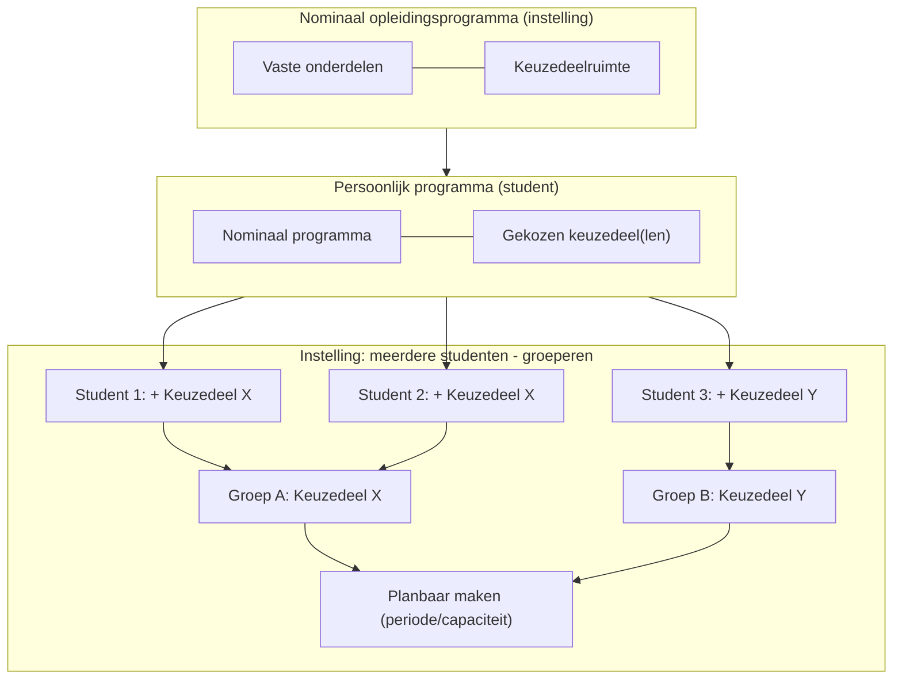
```mermaid
flowchart TB
  subgraph N["Nominaal opleidingsprogramma (instelling)"]
    N1["Vaste onderdelen"] --- N2["Keuzedeelruimte"]
  end

  subgraph P["Persoonlijk programma (student)"]
    P1["Nominaal programma"] --- P2["Gekozen keuzedeel(len)"]
  end

  subgraph M["Instelling: meerdere studenten - groeperen"]
    S1["Student 1: + Keuzedeel X"]
    S2["Student 2: + Keuzedeel X"]
    S3["Student 3: + Keuzedeel Y"]
    G1["Groep A: Keuzedeel X"]
    G2["Groep B: Keuzedeel Y"]
    Plan["Planbaar maken (periode/capaciteit)"]
  end

  N --> P
  P --> S1
  P --> S2
  P --> S3
  S1 --> G1 --> Plan
  S2 --> G1
  S3 --> G2 --> Plan
```

<!-- **Actor(en) — wie maakt regulier studeren mogelijk?**
- **Student**: schrijft in, kiest (bij intake) keuzedelen binnen de ruimte/regels, tekent in en volgt onderwijs.
- **Intakebegeleider / SLB’er**: begeleidt keuze en legt afspraken/keuzes vast in het persoonlijke programma.
- **Onderwijsontwerper**: ontwerpt het nominale programma (incl. keuzedeelruimte) en samenhang.
- **Onderwijsontwikkelaar**: werkt leeronderdeelspecificaties/lesspecificaties/toetsspecificaties uit tot uitvoerbaar aanbod.
- **Planner**: maakt het aanbod planbaar (periodes/capaciteit binnen mensen en middelen), incl. groepen op basis van vergelijkbare keuzes.
- **Roosteraar**: maakt het planbare aanbod geroosterd (tijdsloten en toewijzingen).
- **Docent / begeleider**: voert onderwijs uit en begeleidt studenten in de leerroute.
- **Toets-/examenfunctionarissen**: organiseren toetsing/afname en zorgen voor geldige afronding.

**Wat moet er minimaal beschreven en uitwisselbaar zijn om dit mogelijk te maken?**
- **Onderwijskundige beschrijving**: leeruitkomsten en samenhang (programma → **leeronderdeelspecificaties** → lesspecificaties).
- **Organiseerbaarheid**: leervorm, studielast (BOT/OOT), ruimtebehoefte, expertiseprofielen, leermiddelen; plus volgordelijkheid.
- **Toetsing**: welke toets-/examenvormen gelden, en welke leeruitkomsten daarmee worden beoordeeld.
- **Onderwijslogistiek**: planning (planbaar aanbod: periodes/capaciteit) en roostering (geroosterd aanbod: tijdsloten en toewijzingen).

**Scenario-set (aanbod-gestuurd, primair)**
1. Onderwijsontwerp en publicatie (onderwijsspecificaties beschikbaar maken).
2. Planning: planbaar aanbod maken (periode/capaciteit binnen mensen en middelen).
3. Roostering: geroosterd aanbod maken (tijdsloten + toewijzingen).
4. Student wordt aangemeld en ingeschreven (verbintenis/inschrijving) op en volgt onderwijs volgens rooster.
5. Toetsing en resultaat (summatief/formatief; voortgang/resultaten vastleggen). -->

#### 3.3.2 Leerroute 2 — Temporiseren (standaard route) (TO-DO)

**Kern**: de student volgt dezelfde opleiding, maar spreidt de belasting in de tijd (bijv. lagere intensiteit, aangepaste volgorde, pauzes).  
**Implicatie**: meer varianten in persoonlijke leerroute en meer dynamiek in planning/roostering.

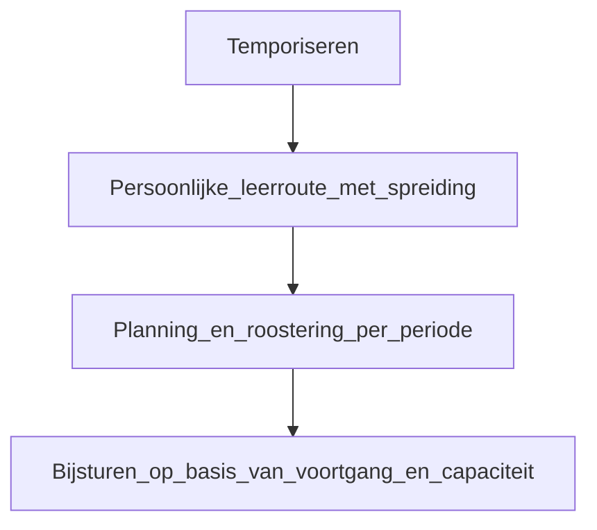
```mermaid
flowchart TD
  route2[Temporiseren] --> routePlan[Persoonlijke_leerroute_met_spreiding]
  routePlan --> planning2[Planning_en_roostering_per_periode]
  planning2 --> bijsturen2[Bijsturen_op_basis_van_voortgang_en_capaciteit]
```


- **Sterk aanbod-gestuurd onderwijsaanbodmodel met hybride kenmerken**: In de praktijk is het onderwijsmodel primair aanbod-gestuurd. De instelling ontwikkelt en publiceert het overgrote deel van het onderwijsaanbod vooraf, zodat studenten zich inschrijven op geplande programma’s in vaste perioden en groepen. Alleen in uitzonderlijke situaties (unhappy flow, zoals incidenteel moeten temporiseren of versnellen) wordt van deze hoofdroute afgeweken. In dat geval kunnen studenten onderwijs- of onderdeelspecificaties ‘on request’ aanvragen om het volgen of herhalen ervan mogelijk te maken. Individuele verzoeken van studenten om onderdelen opnieuw te mogen volgen worden door de instelling gepoold (‘batched’) tot er een kritieke drempel is bereikt. Pas als er voldoende vraag is, en mits binnen de beschikbare mensen en middelen, kan het onderwijsaanbod opnieuw gepland en aangeboden worden. Zo behoudt het model haar aanbod-gestuurde karakter, maar ontstaat er een hybride structuur: incidentele vraag-gebaseerde verzoeken leiden – mits levensvatbaar – tot hernieuwd of aanvullend aanbod.

#### 3.3.3 Leerroute 3 — Versnellen (standaard route) (TO-DO)

**Kern**: de student rondt sneller af door vrijstellingen/EVC, hogere intensiteit of het overslaan van onderdelen.  
**Implicatie**: toetsing kan onafhankelijk(er) van deelname nodig zijn; planning moet kleine groepen en afwijkende paden kunnen dragen.

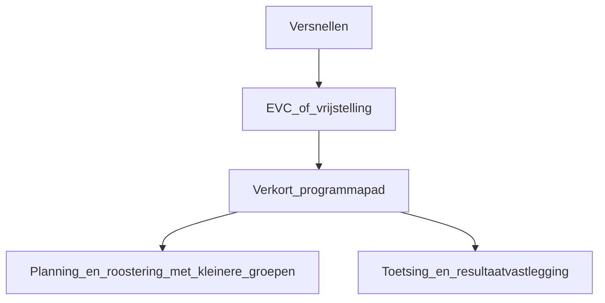
```mermaid
flowchart TD
  route3[Versnellen] --> vrijstelling[EVC_of_vrijstelling]
  vrijstelling --> verkortPad[Verkort_programmapad]
  verkortPad --> planning3[Planning_en_roostering_met_kleinere_groepen]
  verkortPad --> toets3[Toetsing_en_resultaatvastlegging]
```

#### 3.3.4 Leerroute 4 — Binnen de instelling (personaliseren diplomaroute) (TO-DO)

**Kern**: de student personaliseert binnen één instelling (combineren/overlap tussen opleidingen of trajecten).  
**Implicatie**: hergebruik van onderdelen en het voorkomen van dubbel volgen; planning/roostering op overlap en conflicten.

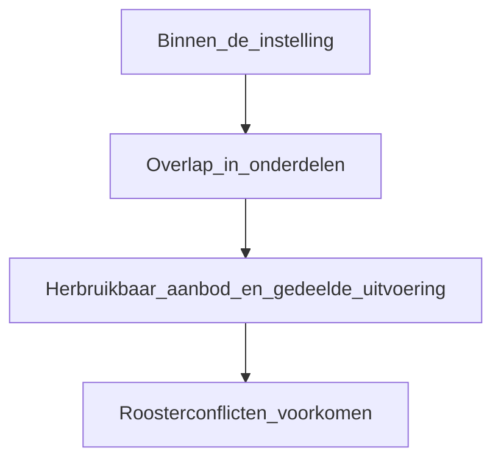
```mermaid
flowchart TD
  route4[Binnen_de_instelling] --> overlap[Overlap_in_onderdelen]
  overlap --> aanbod4[Herbruikbaar_aanbod_en_gedeelde_uitvoering]
  aanbod4 --> rooster4[Roosterconflicten_voorkomen]
```

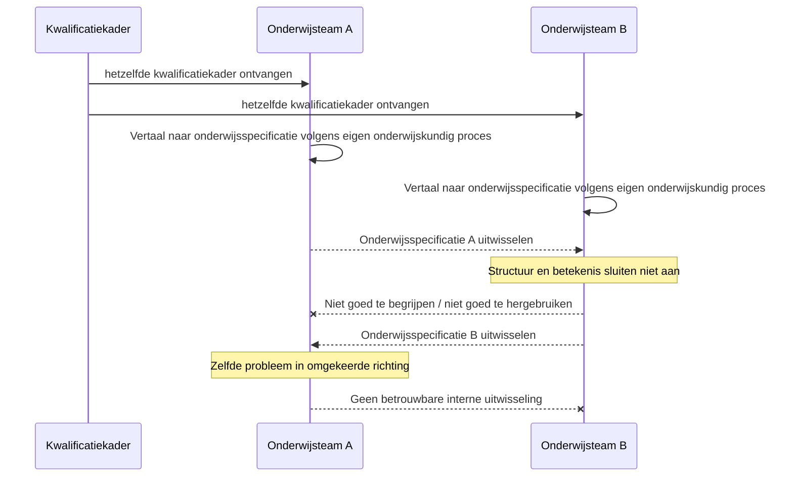
```mermaid
sequenceDiagram
  participant kwalificatiekader as Kwalificatiekader
  participant teamA as Onderwijsteam A
  participant teamB as Onderwijsteam B

  kwalificatiekader->>teamA: hetzelfde kwalificatiekader ontvangen
  kwalificatiekader->>teamB: hetzelfde kwalificatiekader ontvangen

  teamA->>teamA: Vertaal naar onderwijsspecificatie volgens eigen onderwijskundig proces
  teamB->>teamB: Vertaal naar onderwijsspecificatie volgens eigen onderwijskundig proces

  teamA-->>teamB: Onderwijsspecificatie A uitwisselen
  Note over teamB: Structuur en betekenis sluiten niet aan
  teamB--xteamA: Niet goed te begrijpen / niet goed te hergebruiken

  teamB-->>teamA: Onderwijsspecificatie B uitwisselen
  Note over teamA: Zelfde probleem in omgekeerde richting
  teamA--xteamB: Geen betrouwbare interne uitwisseling
```


SOLL situatie:
Delta: leeruitkomsten sectoroversteigend gestandaardiseerd. Basis voor alle onderwijsspecificaties.

`TO-DO: Rapport van Hans Kok op ontsluiten onderwijs aanbod rapportage benoemen en meenemen en principes mappen op ons document en voorgestelde aanpak`. 


```mermaid
flowchart TB
  subgraph onderwijsontwerperVooraf["Onderwijsontwerper (vooraf)"]
    analyseerKwalificatiekader["Analyseren Kwalificatie kader (Kwalificatiedossier/CROHO/CREBO/Keuzedelen)"]
    kwalificatieKader(("Kwalificatie, Kerntaken, Werkprocessen"))
    onderwijskundigeTaxonomieToepassen["Binnen INSTELLING gestandaardiseerde Onderwijskundig taxonomisch proces toepassen op kwalificatie, kerntaken en werkprocessen"]
    leeruitkomsten(("Sector oversteigende gestandaardiseerde Leeruitkomsten"))
    beschrijfOpleidingsspecificatie["Opleidingsspecificatie beschrijven (Grofmazig ontwerp) op basis van LEERUITKOMSTEN (nominaal programma + keuzedeelruimte)"]
    instantieerOnderwijsspecificaties["Onderwijsspecificaties instantiëren op basis van LEERUITKOMSTEN en koppelen aan opleidingspecificatie"]
    publiceerOpleidingsspecificatie["Opleidingsspecificatie met onderliggende onderwijsspecificaties publiceren"]
    beschrijfToetsvormen["Toetsvorm(en) beschrijven"]
  end

  subgraph onderwijsontwikkelaar["Onderwijsontwikkelaar"]
    detailleerOnderwijsspecificaties["Onderwijsspecificaties beschrijven en detailleren (fijnmazige onderwijsontwikkeling)"]
    detailleerLeergelegenheid["Leergelegenheid instantiëren,  beschrijven en detailleren"]
    beschrijfToetsspecificatie["Toetsspecificatie op basis van toetsvorm beschrijven"]
  end

  subgraph plannerInstelling["Planner (instelling)"]
    bepaalHaalbaarheid["Haalbaarheid bepalen (mensen en middelen, alle opleidingen)"]
    maakPlanbaarAanbod["Planbaar aanbod maken (periodes, capaciteit, groepen) (incl. examengelegenheid)"]
  end

  subgraph studentOrientatie["Student"]
    orienteerOpGeplandAanbod["Orienteren (op opleidingsspecificatie + gepland aanbod + keuzedeelaanbod)"]
    meldAanOpGeplandAanbod["Aanmelden op gepland aanbod"]
  end

  subgraph slbEnStudent["StudieLoopbaanBegeleider + Student"]
    voerIntakeUit["Intake"]
    kiesOpleidingEnProgramma["Opleiding en opleidingsprogramma kiezen"]
    momentKeuzedeelBeleid{"Instellingsbeleid: moment keuzedeel-aanmelding?"}
    legKeuzedeelVoorkeurslijst["Geprioriteerde keuzedeel-voorkeurslijst samenstellen"]
    meldAanKeuzedeel["Aanmelden keuzedeel (periode en onderwijslocatie per prioriteit)"]
    legKeuzedeelAanmeldingIntake["Keuzedeel-aanmelding bij intake vastleggen (definitief)"]
    legKeuzedeelAanmeldingVoorlopig["Keuzedeel-aanmelding bij intake vastleggen (voorlopig)"]
    aanmeldingKeuzedeel(("Aanmelding keuzedeel"))
    passendKeuzedeelAanbod{"Passende combinatie keuzedeel, periode en locatie?"}
    inschrijvingKeuzedeel(("Inschrijving keuzedeel"))
  end

  subgraph roosteraar["Roosteraar"]
    roosterAanbod["Roosteren"]
    geroosterdAanbod(("Geroosterd Aanbod - Leergelegenheid (reeks aan lessen)"))
    schrijfInOpGeroosterdAanbod["Inschrijven student en docent op geroosterd aanbod"]
    inschrijvingGeroosterdAanbod(("Inschrijving student en docent op geroosterd onderwijsaanbod (waaronder examengelegenheid)"))
  end

  subgraph docent["Docent"]
    voerOnderwijsUit["Onderwijs Uitvoeren"]
    planToetsgelegenheidTijdensLes["Toetsgelegenheid plannen tijdens geroosterde lessen"]
    toetsStudent["Toetsen"]
    houdFormatieveVoortgangBij["Formatieve voortgang student bijhouden"]
  end

  subgraph studentUitvoering["Student"]
    volgOnderwijs["Onderwijs volgen"]
    volgToetsgelegenheid["Toetsgelegenheid volgen"]
    volgExamengelegenheid["Examengelegenheid volgen"]
  end

  subgraph examinator["Examinator"]
    bereidExamengelegenheidVoor["Geplande examengelegenheid voorbereiden"]
    voerExamengelegenheidUit["Examengelegenheid uitvoeren/begeleiden"]
  end

  subgraph examenbeoordelaar["Examenbeoordelaar"]
    beoordeelGemaaktExamen["Door student gemaakt examen beoordelen"]
  end

  subgraph examencommissieVaststelling["Examencomissie"]
    stelExamenbeoordelingVast["Examen beoordeling vaststellen"]
    kwalificeerEnDiplomeer["Kwalificeren en Diplomeren op basis van LEERUITKOMSTEN"]
    kwalificeringEnDiplomering(("Kwalificering, certificering en diplomering op basis van LEERUITKOMSTEN"))
  end

  subgraph examencommissieOntwerp["Examencommissie"]
    examenplan(("Examenplan"))
    examenspecificaties(("Examenspecificatie(s)"))
    examenInstrumenten(("Examen Instrument(en)"))
    stelExamenplanEnSpecificatiesOp["Opstellen Examenplan en examen specificaties op basis van LEERUITKOMSTEN"]
    bepaalBenodigdeExamenInstrumenten["Bepalen benodigde examen instrumenten"]
    bepaalBenodigdExamenMateriaal["Bepalen Benodigd Examen materiaal"]
    besluitInkopenOfConstrueren["Besluiten inkopen of construeren"]
    koopExamenInstrumentenIn["Inkopen Examen instrumenten"]
    construeerExamenInstrumenten["Construeren Examen instrumenten"]
    stelExamenspecificatieEnInstrumentenVast["Vaststellen examen specificatie, examenmateriaal en examen instrumenten"]
  end

  grofmazigeSpecificaties(("Grofmazige Opleidings- / onderwijs- en examenspecificaties"))
  planbaarOnderwijsaanbod(("Planbaar Onderwijsaanbod (incl. examengelegenheid)"))
  aanmeldingGeplandAanbod(("Aanmelding voor Opleiding en gepland aanbod"))
  inschrijvingGeplandAanbod(("Inschrijving op geplande opleidings- en opleidingsprogramma aanbod"))
  onderwijsresultaat(("Onderwijsresultaat op basis van LEERUITKOMSTEN"))

  leeruitkomsten --> stelExamenplanEnSpecificatiesOp
  stelExamenplanEnSpecificatiesOp --> examenplan
  stelExamenplanEnSpecificatiesOp --> examenspecificaties
  examenspecificaties --> bepaalBenodigdeExamenInstrumenten
  bepaalBenodigdeExamenInstrumenten --> bepaalBenodigdExamenMateriaal --> besluitInkopenOfConstrueren
  besluitInkopenOfConstrueren --> koopExamenInstrumentenIn
  besluitInkopenOfConstrueren --> construeerExamenInstrumenten
  koopExamenInstrumentenIn --> examenInstrumenten
  construeerExamenInstrumenten --> examenInstrumenten
  examenInstrumenten --> stelExamenspecificatieEnInstrumentenVast
  stelExamenspecificatieEnInstrumentenVast --> grofmazigeSpecificaties

  examenplan --> bepaalHaalbaarheid
  analyseerKwalificatiekader --> kwalificatieKader --> onderwijskundigeTaxonomieToepassen --> leeruitkomsten --> beschrijfOpleidingsspecificatie --> instantieerOnderwijsspecificaties --> beschrijfToetsvormen --> publiceerOpleidingsspecificatie --> grofmazigeSpecificaties
  grofmazigeSpecificaties --> bepaalHaalbaarheid --> maakPlanbaarAanbod --> planbaarOnderwijsaanbod
  planbaarOnderwijsaanbod --> detailleerOnderwijsspecificaties --> detailleerLeergelegenheid --> beschrijfToetsspecificatie --> inschrijvingGeplandAanbod
  planbaarOnderwijsaanbod --> orienteerOpGeplandAanbod --> meldAanOpGeplandAanbod --> aanmeldingGeplandAanbod
  aanmeldingGeplandAanbod --> voerIntakeUit --> kiesOpleidingEnProgramma --> momentKeuzedeelBeleid
  momentKeuzedeelBeleid -->|Keuzedeelruimte nadert| legKeuzedeelVoorkeurslijst --> meldAanKeuzedeel --> aanmeldingKeuzedeel
  momentKeuzedeelBeleid -->|Bij intake, definitief| legKeuzedeelAanmeldingIntake --> aanmeldingKeuzedeel
  momentKeuzedeelBeleid -->|Bij intake, voorlopig| legKeuzedeelAanmeldingVoorlopig --> aanmeldingKeuzedeel
  aanmeldingKeuzedeel --> passendKeuzedeelAanbod
  passendKeuzedeelAanbod -->|Ja| inschrijvingKeuzedeel --> inschrijvingGeplandAanbod
  passendKeuzedeelAanbod -->|Nee: keuzedeelruimte oningevuld| inschrijvingGeplandAanbod
  kiesOpleidingEnProgramma --> inschrijvingGeplandAanbod
  inschrijvingGeplandAanbod --> roosterAanbod --> geroosterdAanbod --> schrijfInOpGeroosterdAanbod --> inschrijvingGeroosterdAanbod
  inschrijvingGeroosterdAanbod --> voerOnderwijsUit
  voerOnderwijsUit --> planToetsgelegenheidTijdensLes --> toetsStudent --> houdFormatieveVoortgangBij --> voerOnderwijsUit
  inschrijvingGeroosterdAanbod --> volgOnderwijs --> volgToetsgelegenheid --> volgExamengelegenheid --> volgOnderwijs
  volgToetsgelegenheid --> onderwijsresultaat
  toetsStudent --> onderwijsresultaat
  maakPlanbaarAanbod --> volgExamengelegenheid --> voerExamengelegenheidUit
  maakPlanbaarAanbod --> bereidExamengelegenheidVoor --> voerExamengelegenheidUit
  voerExamengelegenheidUit --> beoordeelGemaaktExamen --> stelExamenbeoordelingVast --> onderwijsresultaat --> kwalificeerEnDiplomeer --> kwalificeringEnDiplomering

  class kwalificatieKader,geroosterdAanbod,inschrijvingGeroosterdAanbod,grofmazigeSpecificaties,planbaarOnderwijsaanbod,aanmeldingGeplandAanbod,inschrijvingGeplandAanbod,aanmeldingKeuzedeel,inschrijvingKeuzedeel,onderwijsresultaat,examenplan,examenspecificaties,examenInstrumenten,kwalificeringEnDiplomering yellowNode;

  classDef freeze fill:#fff3cd,stroke:#b38f00,stroke-width:2px,color:#111;
  class kiesOpleidingEnProgramma freeze;

```

######  Persoon, rollen en skills als denkraam voor constraints

Naast de onderwijsdata die elders in dit document wordt gemodelleerd, is voor **planning en roostering** (§3.3.1.2.3.5) een **complementair denkpatroon** nodig dat direct met **mensen** en **wat zij kunnen en willen** werkt. In dat denkpatroon is elke **`Persoon`** — **student** of **medewerker** — iemand met **skills**: een samenstel van **vaardigheden**, **kennis** en **inzichten** (inclusief formele bevoegdheden waar dat speelt). Bij **instroom** heeft een student typisch al een skill-profiel en een **leerwens**: welke skills hij of zij verder wil **ontwikkelen** binnen de gekozen **leerroute** en de scenario's die daarbij horen. Een **medewerker** heeft evenzo een skill-profiel, uitgedruikt via **functie en titel** (docent, SLB'er, praktijkbegeleider, examinator, …): die titels zijn **koppelvlakken** naar HR en contract, maar **inhoudelijk** gaat het om **welk skill-pakket** iemand kan **aanbieden** in onderwijs, begeleiding, praktijk of examen.

**Skill-vraag en skill-aanbod.** Groepen zijn in dit denkpatroon **clusters van personen** die qua skill-vector op elkaar lijken of dezelfde **aan te bieden** onderwijs- of begeleidingsbehoefte delen. Tegelijk zoekt de instelling naar het **snijpunt** van (a) **skill-vraag** — wat moet deze populatie **kunnen** na het traject — en (b) **skill-aanbod** — welke medewerkers en welke leer- en praktijkomgeving kunnen dat **leveren**. Dat snijpunt is direct te vertalen naar **harde en zachte constraints** in een CSP: harde grenzen (bevoegdheid ontbreekt, geen docent beschikbaar, zaal te klein) en zachte voorkeuren (vaste teamdag, voorkeurdocent, spreiding SLB).

**Reële wereld en strategie.** Daarbovenop liggen constraints die niet “in het hoofd” van één persoon zitten maar de **realiteit van de instelling** vormen: **beperkte tijd** (roosteruren, openingstijden, BPV-vensters), **beperkt geld en capaciteit** (FTE, vervanging, materiaal, collegegeld- of bekostigingskaders), **facilitaire grenzen** (aantal werkplaatsen, labtypes, reisafstand), en **strategische doelen** (doorstroom, inclusie, werkveldafspraken). Die vlakken bepalen **wat er überhaupt in het model mag** voordat een planner of roosteraar een CSP draait.

**Planning en roostering.** Binnen die totale constraintset voeren **planning** en **roostering** het zoeken naar haalbare toewijzingen uit (CSP: §3.3.1.2.3.1; complexiteit en beheer: §3.3.1.2.3.3–§3.3.1.2.3.4; procesdiagram: §3.3.1.2.3.5): variabelen en domeinen komen uit **tijd en ruimte**, **skill-match**, en **populatie-clusters**; de **human-in-the-loop** stappen wegen zachte constraints en beleidsafwegingen. Het procesdiagram in §3.3.1.2.3.5 blijft geldig: *groep* leest hier vooral als **skill-groepering en inschrijf-/cohortrealiteit**, *cap* als **tijd/middelen/facilitair**, *beleid* als **strategie en regels**.

| **Hoofdtype `Persoon`** | **Rol of functietitel (voorbeelden; koppelbaar aan HR)** | **Skills-profiel** (vaardigheden, kennis, inzichten; bevoegdheden waar van toepassing) | **Als constraint geformuleerd** (skill-vraag / skill-aanbod; typisch plan vs rooster) |
| --- | --- | --- | --- |
| **Student** | student / deelnemer aan programma | **Startsituatie** bij instroom; **leerdoelen** als gewenste skill-ontwikkeling binnen leerroute en scenario | **Skill-vraag:** welke skills moeten in het traject **worden opgebouwd**; groeperen in cohort of werkgroep met vergelijkbare vraagvector; harde grenzen uit examen- en opleidingsregels (**Plan**); max. belasting per dag/week (**Rooster**) |
| **Medewerker** | docent (theorie/praktijk), teamcoördinator | vakinhoud, didactiek, toets- en beoordelingsbekwaamheid | **Skill-aanbod:** welke onderwijs- en toetsmomenten kunnen worden bemand; matching met gevraagde leeruitkomst-skills; **beschikbaarheid** en max. uren (**Rooster**); teamspreiding (**Plan**, zacht) |
| **Medewerker** | SLB'er, studiecoach | coachende vaardigheden, route-inzicht, signalering, verwijzen | **Skill-aanbod:** begeleidingscapaciteit (caseload); **zacht:** voorkeurskoppeling met studentgroep; tijdvensters naast lesrooster (**Rooster**) |
| **Medewerker** | praktijkbegeleider, BPV-begeleider | werkveldkennis, praktijkassessment, veiligheid, werkpleknorm | **Skill-aanbod:** uren en trips naar werkveld; **reële wereld:** reis- en clusterafspraken met bedrijven; beperkte parallelle BPV-plaatsen (**Plan** + **Rooster**) |
| **Medewerker** | examinator, surveillant, afnemer, tweede corrector | examenbekwaamheid, integriteit, correctie-inzicht | **Skill-aanbod:** piek rond examenperiodes; verhouding surveillanten/kandidaten; geen belangenverstrengeling (**Rooster**, deels harde regel) |
| **Medewerker** | onderwijsondersteuning, facilitair, ICT-ondersteuning | operationele skills (materiaal, digitaal, logistiek) | **Skill-aanbod:** beschikbaarheid voor opbouw en ondersteuning; koppeling aan zaal- en middelen-constraints (**Plan** / **Rooster**) |
| **Cluster (aggregaat)** | cohort, werkgroep, team, “pool” | **geaggregeerde** skill-vraag of -aanbod over meerdere personen | **Constraint:** doorsnede van populatie-vraag en beschikbaar aanbod; klassen- of werkgroepsgrootte; minimale teamdekking (**Plan**); conflictvrije slottoewijzing (**Rooster**) |

| **Reële-wereldvlak** | **Voorbeelden van constraints** | **Meest zichtbaar in** |
| --- | --- | --- |
| **Tijd en beschikbaarheid** | lesdagen, vakanties, examenweken, cao-uren, nacht- of weekendbeperkingen, reistijd | **Rooster** (slots); kaders en blokken in **Plan** |
| **Middelen, geld en capaciteit** | FTE-plafonds, vervangingsbudget, materiaal- en licentiebudget, onderhoudsvensters werkplaats | vooral **Plan**; harde grenzen in **Rooster** zodra concreet |
| **Facilitair en materieel** | zaaltypes, werkplaats-capaciteit, veiligheid, AV, inventaris per vak | **Plan** (wat is organiseerbaar) en **Rooster** (concrete toewijzing) |
| **Strategie en beleid** | instroomdoelen, inclusie, werkveldafspraken, kwaliteitsagenda, examenregeling | **beleid**-input in het diagram; vertaalt naar zachte en harde constraints in beide fasen |

**Leeswijzer.** Dit blok **vervangt geen** gegevensmodel uit §3.3.1.2.5: het beschrijft **hoe planners en roosteraars redeneren** over mensen en middelen. Technische koppeling naar registers blijft: **student-`Persoon`** en inschrijfcontext leven typisch in **KRS**; **medewerker-`Persoon`**, contract en basisrol in **HR / identiteit**; skills kunnen als **uitbreiding op het profiel** in die bronnen of in een **aparte competentie- of skillservice** worden bijgehouden — zolang er **één waarheid per feit** blijft. De blokken *groep*, *cap* en *beleid* in §3.3.1.2.3.5 vangen deze informatie conceptueel.

#### 3.3.5 Leerroute 5 — Buiten de instelling, binnen de sector (personaliseren diplomaroute) (TO-DO)

**Kern**: de student volgt onderdelen bij een andere instelling binnen dezelfde sector.  
**Implicatie**: interoperabiliteit (begrijpen, matchen, erkennen) en zichtbaarheid van capaciteit/aanbod over instellingen heen.

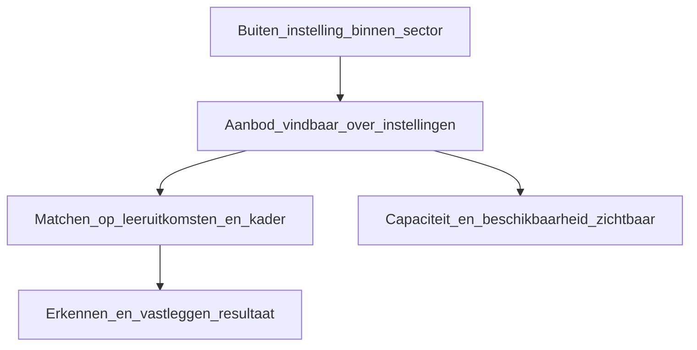
```mermaid
flowchart TD
  route5[Buiten_instelling_binnen_sector] --> vindbaar[Aanbod_vindbaar_over_instellingen]
  vindbaar --> match[Matchen_op_leeruitkomsten_en_kader]
  match --> erkenning[Erkennen_en_vastleggen_resultaat]
  vindbaar --> capaciteit5[Capaciteit_en_beschikbaarheid_zichtbaar]
```

#### 3.3.6 Leerroute 6 — Buiten de instelling, over sectoren heen (personaliseren diplomaroute) (TO-DO)

**Kern**: de student volgt onderdelen over sectoren heen (mbo/hbo/wo).  
**Implicatie**: extra harmonisatie in begrippen, studielast (SBU/ECTS), en erkenning/waardering.

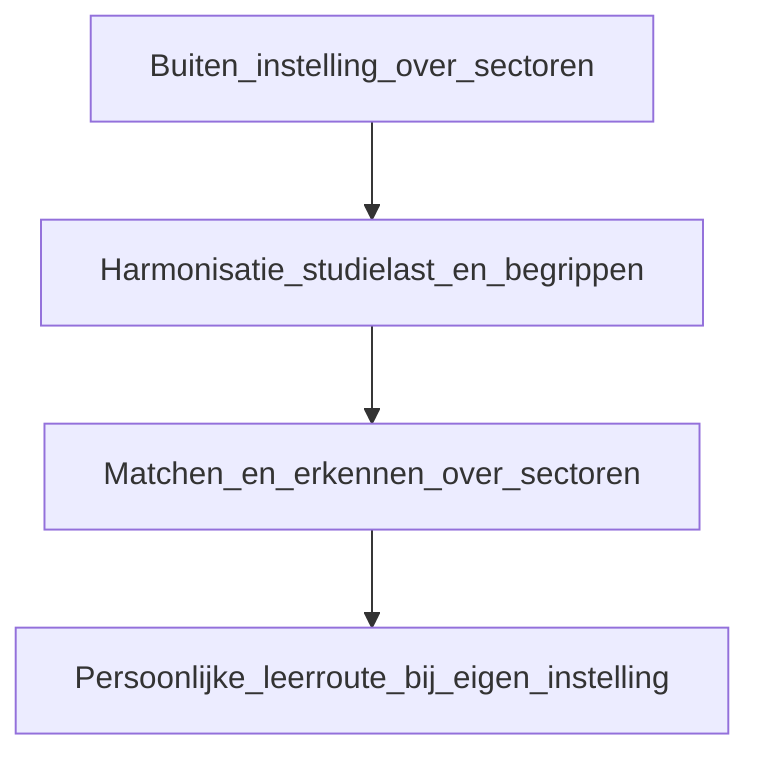
```mermaid
flowchart TD
  route6[Buiten_instelling_over_sectoren] --> harmonisatie[Harmonisatie_studielast_en_begrippen]
  harmonisatie --> match6[Matchen_en_erkennen_over_sectoren]
  match6 --> leerroute6[Persoonlijke_leerroute_bij_eigen_instelling]
```

#### 3.3.7 Leerroute 7 — Vrije keuze (modulair studeren) (TO-DO)

**Kern**: de student kiest losse onderdelen voor ontwikkeling/bijscholing; geen vaste diplomaroute nodig.  
**Implicatie**: aanbod moet fijnmazig en vindbaar zijn; planning/roostering moet omgaan met wisselende vraag.

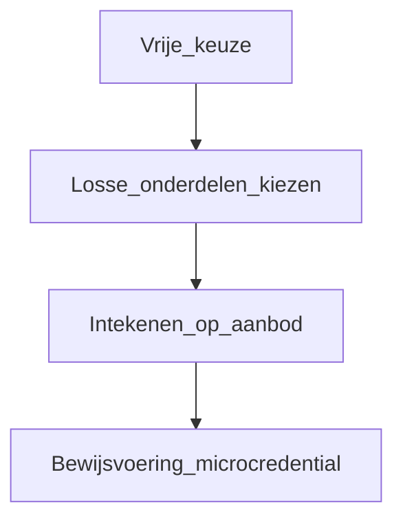
```mermaid
flowchart TD
  route7[Vrije_keuze] --> losseOnderdelen[Losse_onderdelen_kiezen]
  losseOnderdelen --> intekenen7[Intekenen_op_aanbod]
  intekenen7 --> bewijs7[Bewijsvoering_microcredential]
```

#### 3.3.8 Leerroute 8 — Bundelen (modulair studeren) (TO-DO)

**Kern**: de student bundelt losse onderdelen tot een samenhangend pakket rond een thema/rol.  
**Implicatie**: bundelregels en samenhang moeten expliciet gemaakt worden; vraag kan cohort-achtig worden.

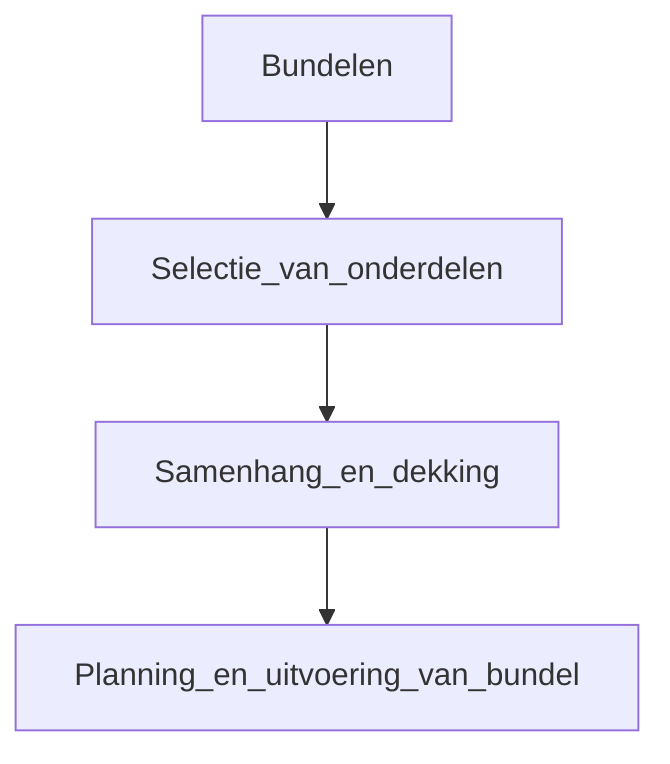
```mermaid
flowchart TD
  route8[Bundelen] --> set8[Selectie_van_onderdelen]
  set8 --> coherentie8[Samenhang_en_dekking]
  coherentie8 --> planning8[Planning_en_uitvoering_van_bundel]
```

#### 3.3.9 Leerroute 9 — Stapelen (modulair studeren) (TO-DO)

**Kern**: de student stapelt onderdelen richting een formeel eindresultaat (bijv. diploma) — eventueel retroactief.  
**Implicatie**: dekking t.o.v. kwalificatiekader en regels voor “wanneer is het diplomawaardig?”.

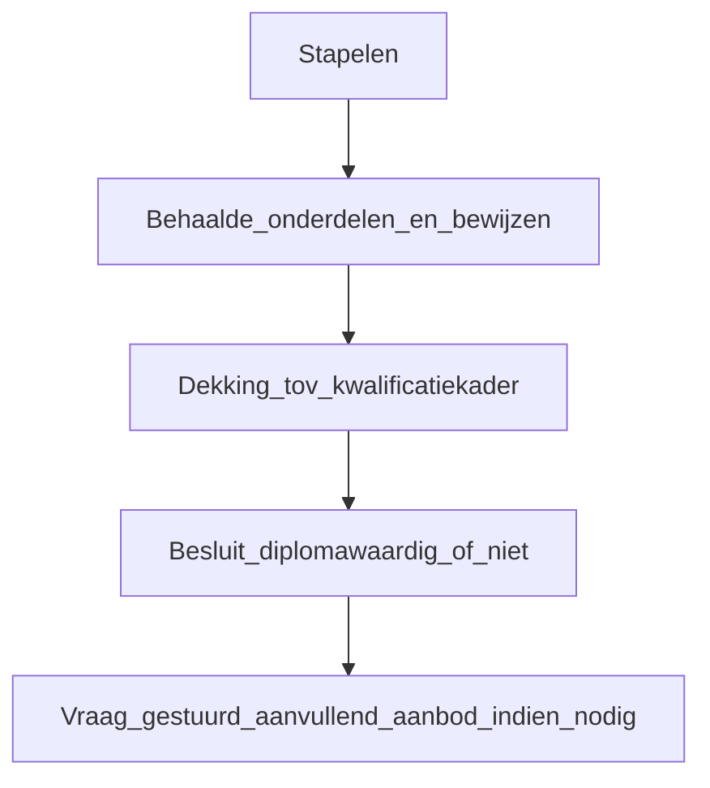
```mermaid
flowchart TD
  route9[Stapelen] --> behaalde[Behaalde_onderdelen_en_bewijzen]
  behaalde --> dekking9[Dekking_tov_kwalificatiekader]
  dekking9 --> besluit9[Besluit_diplomawaardig_of_niet]
  besluit9 --> aanbod9[Vraag_gestuurd_aanvullend_aanbod_indien_nodig]
```

placeholder verwijderd: de tekst hieronder vertaalt direct door naar de scenario’s

### 3.4 Scenario-uitwerkingen — leerroute 1 (regulier), 2 (temporiseren by design), 3 (versnellen by design)

In §3.3 hebben we de 9 leerroutes van Npuls aangevuld met onderwijslogistiek en onderwijskundig perspectief. In deze paragraaf vertalen we deze aangevulde leerroutes tot concrete gebruikerscenario's per leerroute.

**Doel.** Externen (leveranciers, instellingen, ketenpartners) moeten in begrijpelijke taal kunnen volgen *wat er allemaal gebeurt* om elke vorm van leerroute mogelijk te maken. Daarbij staan we ook stil bij veel voorkomende wijzigingen op geplande leerroutes. Denk hierbij  *hoe een incidentele wijziging (vertraging/versnelling by incident)* of een *bewuste tempo-keuze (by design)* hierop ingrijpt. De begrippen die we daarvoor gebruiken zijn die van §3.2.

#### 3.4.0 Sjabloon en leeswijzer

We gebruiken voor elk scenario hetzelfde sjabloon. Lees het als een verhaal in zeven blokken (A–G), met steeds één persona (**Jochem**) en één doorlopende casus (**Apothekersassistent**, Crebo dossier 23450, kwalificatie 27141). De BPMN-uitwerking in `bpmn/leerroute-1-scenario-1-regulier-geenkeuze-happyflow.bpmn2` (zie [SVG](../img/leerroute-1-scenario-1-regulier-geenkeuze-happyflow.svg)) is de **basis-procesplaat** voor scenario 1.1; voor de andere scenario's beschrijven we waar het proces afwijkt.

| Blok | Naam                              | Wat staat erin                                                                                                                                  |
| ---- | --------------------------------- | ----------------------------------------------------------------------------------------------------------------------------------------------- |
| **A** | Persona en voorvraag              | Eén levendige zin over Jochem + dé vraag die het scenario beantwoordt.                                                                          |
| **B** | Given — beginstaat                 | Mini-tabel in §3.2-taal: per relevante rij (kwalificatiedossier → toetsrij) welke kolommen al gevuld zijn en welke leeg.                        |
| **C** | When — trigger                     | Wie zet wat in beweging? Korte verhalende zin met BPMN-aanknopingspunt.                                                                         |
| **D** | Het verhaal per swimlane           | Per actor (onderwijsontwerper, onderwijsontwikkelaar, planner, roosteraar, SLB'er, student, docent) 2–4 zinnen *wat ontvang ik, wat lever ik op*. |
| **E** | Then — eindstaat **bij start van onderwijsuitvoering** | De staat van de 6 informatie-objectfamilies op de eerste schooldag — niet over 3 jaar. Aanbod kan in verschillende stadia zijn (sommige eenheden geroosterd, andere alleen planbaar, andere nog specificatie). Verbintenis kan in verschillende stadia zijn (programma ingeschreven, eenheden van P1 deelnemend, eenheden van P2/P3/P4 nog niet aangemaakt). |
| **F** | Voorwaarden — 9 architectuurlagen | Wat moet per laag (Business/Strategy/Motivation/Beleid/Organisatie/Proces/Informatie/Data/Systeem) geregeld zijn voordat dit scenario kán?     |
| **G** | Informatiestromen-figuur          | Placeholder/verwijzing naar de architectuurplaat (afgeleid van *Hoofdplaat OKx informatiestromen v20260317*) die expliciet maakt welke OEAPI-stromen bewegen. |

**Werkproces-paneel als concrete inkijk.** We gebruiken doorlopend drie werkprocessen uit het Apothekersassistent-dossier — telkens op de werkproces-rij (kolom 3 = `Leeronderdeel-specificatie`, kolom 4 = `Leergelegenheid`):

| Werkproces                                  | Karakter            | Typische `deliveryForm` |
| ------------------------------------------- | ------------------- | ----------------------- |
| **B1-K1-W1** — Neemt de zorg-/adviesvraag in behandeling     | mens-mens-contact   | `simulation`            |
| **B1-K2-W2** — Houdt de voorraad bij                          | proces + systeem    | `workshop` / practicum  |
| **B1-K3-W2** — Evalueert werkzaamheden, ontwikkelt zich als professional | reflectie           | `guided_self_study` + portfolio |

Deze drie werkprocessen samen tonen verschillende eisen aan ruimte, expertise en leermiddelen — en daarmee aan planning en roostering.

**Persona.** *Jochem (15). Heeft VMBO-tl afgerond. Heeft via een open dag interesse in farmacie ontwikkeld. Meld zich aan voor de voltijd mbo-4-opleiding Apothekersassistent (3 jaar) bij ROC Het Voorbeeld. Geen relevante voorkennis, geen vrijstellingen, geen verwachte verstoring.* In §3.4.5 t/m §3.4.12 verschijnt dezelfde Jochem op een andere levensloop — om de scenario's herkenbaar te houden voor lezers, en om expliciet te maken dat **dezelfde persoon** in verschillende cohorten of jaren een ander tempo of een andere route nodig kan hebben.

#### 3.4.1 Scenario 1.1 — Regulier, happyflow

**Status.** *Happyflow.* Geen vertraagd of versneld ontwerp, geen keuzes, geen incidenten tijdens het volgen van de studie. Alles loopt volgens plan.

##### A. Persona en voorvraag

> *Jochem schrijft zich in juni 2026 in voor de voltijd mbo-4-opleiding Apothekersassistent. Op 1 september 2026 begint zijn eerste lesweek. Hij volgt drie jaar lang het nominale opleidingsprogramma, behaalt op tijd alle leeruitkomsten, en ontvangt zijn diploma in juli 2029.*

**De voorvraag**: *wat moet er allemaal — bij ontwerp, ontwikkeling, planning, roostering, intake en LMS-inrichting — geregeld zijn voordat Jochem op 1 september 2026 om 09:00 uur zijn eerste les "Balie: zorg-/adviesvraag (simulatie)" kan binnenlopen?* Dit scenario laat zien hoeveel werk er **vóór** de student plaatsvindt.

##### B. Given — beginstaat (in §3.2-taal)

| Niveau (rij) ↓ \ Familie (kolom) → | 1. Kader | 2. Beoogde LO | 3. Specificatie | 4. Aanbod | 5. Verbintenis | 6. Resultaat |
| --- | --- | --- | --- | --- | --- | --- |
| Kwalificatiedossier (23450) | aanwezig (SBB) | n.v.t. | leeg | leeg | leeg | leeg |
| Kwalificatie (27141) | aanwezig (SBB) | n.v.t. | leeg | leeg | leeg | leeg |
| Kerntaak (B1-K1, B1-K2, B1-K3) | aanwezig | LO-collecties leeg | leeg | leeg | leeg | leeg |
| Werkproces (B1-K1-W1, B1-K2-W2, B1-K3-W2) | aanwezig | LO-set leeg | leeg | leeg | leeg | leeg |
| Lesuitkomst-laag | n.v.t. | leeg | leeg | leeg | leeg | leeg |
| Toetsing en examinering | examencommissie-vasstelling | scope leeg | leeg | leeg | leeg | leeg |

> **Leeswijzer.** Het kader staat klaar bij SBB. De rest is leeg — **alle kolommen 2 t/m 6 worden in dit scenario stap voor stap gevuld**.

##### C. When — trigger

In maart 2026 vraagt het college van bestuur van ROC Het Voorbeeld om de Apothekersassistent-opleiding klaar te zetten voor cohort 2026. De **onderwijsontwerper** start (BPMN-startevent in de swimlane "Onderwijsontwerper") met de taak `Kwalificatiekader analyseren` — de aftrap van het sub-process *Grofmazig onderwijsontwerp / Onderwijsplan / Onderwijsspecificatie opstellen*.

##### D. Het verhaal per swimlane

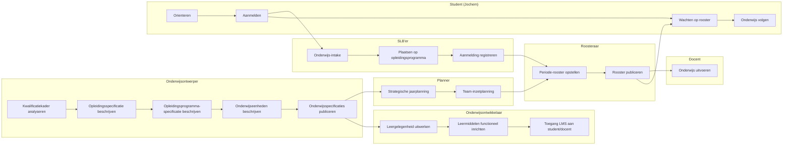
```mermaid
flowchart LR
  subgraph OO["Onderwijsontwerper"]
    OO1[Kwalificatiekader analyseren] --> OO2[Opleidingsspecificatie beschrijven]
    OO2 --> OO3[Opleidingsprogramma-specificatie beschrijven]
    OO3 --> OO4[Onderwijseenheden beschrijven]
    OO4 --> OO5[Onderwijsspecificaties publiceren]
  end
  subgraph OW["Onderwijsontwikkelaar"]
    OW1[Leergelegenheid uitwerken] --> OW2[Leermiddelen functioneel inrichten]
    OW2 --> OW3[Toegang LMS aan student/docent]
  end
  subgraph PL["Planner"]
    PL1[Strategische jaarplanning] --> PL2[Team-inzetplanning]
  end
  subgraph RO["Roosteraar"]
    RO1[Periode-rooster opstellen] --> RO2[Rooster publiceren]
  end
  subgraph SLB["SLB'er"]
    SLB1[Onderwijs-intake] --> SLB2[Plaatsen op opleidingsprogramma] --> SLB3[Aanmelding registreren]
  end
  subgraph ST["Student (Jochem)"]
    ST1[Orienteren] --> ST2[Aanmelden] --> ST3[Wachten op rooster] --> ST4[Onderwijs volgen]
  end
  subgraph DO["Docent"]
    DO1[Onderwijs uitvoeren]
  end
  OO5 --> OW1
  OO5 --> PL1
  PL2 --> RO1
  ST2 --> SLB1
  SLB3 --> RO1
  RO2 --> ST3
  RO2 --> DO1
```

**Onderwijsontwerper.** Zij analyseert eerst het Crebo-dossier 23450 ("Apothekersassistent") en mapt de drie kerntaken (B1-K1, B1-K2, B1-K3) en hun werkprocessen op een set **summatieve leeruitkomsten** per werkproces. Vervolgens beschrijft zij de `Opleidingsspecificatie` (rij Kwalificatiedossier, kolom 3), de `Opleidingsprogramma-specificatie` (rij Kwalificatie — nominaal, voltijd, 3 jaar, 4800 SBU), en de `Onderwijseenheid-specificaties` per kerntaak. Daarna publiceert zij — via de Curriculum-ontwerptool → OC (stadium 1) — het hele pakket. **Levert op:** kolom 2 én kolom 3 op rij Kwalificatiedossier t/m Kerntaak.

**Onderwijsontwikkelaar.** Hij ontvangt het verzoek tot detaillering van de onderwijsspecificatie en werkt voor elk werkproces de `Leeronderdeel-specificatie` uit (rij Werkproces, kolom 3) — inclusief `educationSpecification` met `deliveryForm: simulation` voor B1-K1-W1, `workshop` voor B1-K2-W2, en `guided_self_study` voor B1-K3-W2. Hij richt het LMS in (lesplanning, leermiddelen, toegangsrechten) en werkt waar nodig de lesspecificaties uit. **Levert op:** kolom 3 op rij Werkproces en Lesuitkomst.

**Planner.** Zij ontvangt de gepubliceerde specificaties uit OC en stelt de **strategische jaarplanning** vast: cohortgrootte 120 studenten, 4 perioden van 10 weken, en een team-inzetplanning waarin 8 docenten (`expertiseProfiles: ["pharmaceutical_assistant_coach", "roleplay_training", "pharmacy_logistics", "coach_reflective_practice"]`) en 5 ruimtetypes (`simulation_practice_room`, `workshop`, `lecture_hall`, `online`, `general_classroom`) gematcht zijn op de specificaties. Zij publiceert per `Onderwijseenheid` en per `Leeronderdeel` een **planbaar aanbod** (stadium 2a) — perioden + capaciteit, **zonder** concrete lokaal- of personeelsnummers. **Levert op:** kolom 4 (planbaar) op rij Kerntaak en Werkproces.

**Roosteraar.** Hij neemt het planbare aanbod over en roostert eerst alleen periode 1: concrete tijdsloten ("ma 09:00–11:00, simulatieruimte 2.14, docent personeelsnr 4711"), concrete groepen, concrete lokaal-instanties. Voor periode 2, 3, 4 blijft het **planbaar** (capaciteit gereserveerd, geen concrete tijdsloten). Hij publiceert geroosterd aanbod (stadium 2b) en stelt het ter beschikking aan de student (via SVS/SKS) en de docent (via LMS/rooster). **Levert op:** kolom 4 (geroosterd) op rij Werkproces en Lesuitkomst — *alleen voor periode 1*.

**SLB'er.** Zij ontvangt Jochems aanmelding (april 2026), voert de intake uit (kennismakings- en geschiktheidsgesprek; bevestigt dat er geen vrijstellingen, EVC of zorgafspraken zijn), plaatst hem op het nominale opleidingsprogramma en registreert de aanmelding (`Association.state = enrolled` op `Opleidingsverbintenis` en `Opleidingsprogramma-verbintenis`). Bij start van de uitvoering activeert zij de verbintenissen op de geroosterde leergelegenheden van periode 1. **Levert op:** kolom 5 op rij Kwalificatiedossier en Kwalificatie; kolom 5 op de geroosterde Werkproces-leergelegenheden.

**Student (Jochem).** Jochem oriënteert zich in maart 2026 via de website van het ROC en SBB-info op de opleiding. In april meldt hij zich aan, doet hij intake, en ontvangt hij na enkele weken zijn inschrijvingsbevestiging. Eind augustus krijgt hij toegang tot het LMS en zijn periode-1-rooster. Op 1 september begint hij. **Levert op:** zijn leervraag (impliciet: de hele LO-set van de Apothekersassistent), zijn aanmelding, en straks zijn deelname.

**Docent.** Een rollenspeltrainer met farmaceutische coachingbevoegdheid krijgt op 28 augustus zijn periode-1-rooster en LMS-toegang. Op 1 september voert hij in lokaal 2.14 het eerste simulatie-onderdeel uit. Tijdens de uitvoering zal hij `Association.state` per les muteren (`participating` → `completed`) en eventuele resultaten vastleggen. **Levert op:** kolom 6 op rij Lesuitkomst en — via de toetsrij — straks ook op rij Werkproces.

##### E. Then — eindstaat **bij start van onderwijsuitvoering** (1 september 2026, 08:55)

Dit is het moment waarop Jochem in zijn jas voor lokaal 2.14 staat. De stand van zaken in §3.2-taal:

| Niveau (rij) ↓ \ Familie (kolom) → | 1. Kader | 2. Beoogde LO | 3. Specificatie | 4. Aanbod | 5. Verbintenis | 6. Resultaat |
| --- | --- | --- | --- | --- | --- | --- |
| Kwalificatiedossier | ongewijzigd | n.v.t. | **gepubliceerd** | **opleidingsaanbod uitgerold** | **Jochem `enrolled`** | leeg |
| Kwalificatie | ongewijzigd | n.v.t. | **programma-specificatie gepubliceerd** | **programma-aanbod uitgerold** | **Jochem `enrolled` op nominaal traject** | leeg |
| Kerntaak | ongewijzigd | LO-collecties gevuld | **eenheid-specificaties gepubliceerd** | **planbaar** voor alle perioden, **geroosterd** alleen voor P1 | **enrolled op P1-eenheden**; P2–P4 nog niet aangemaakt | leeg |
| Werkproces (W1, W2, W3) | ongewijzigd | LO-set per WP | **leeronderdeel-specificaties gepubliceerd** | **leergelegenheid van P1 geroosterd** (lokaal + docent toegewezen); P2–P4 alleen planbaar | **`Association.state = enrolled`** op P1-leergelegenheden; over enkele uren → `participating` | leeg |
| Lesuitkomst-laag | n.v.t. | DAG met lesuitkomsten beschreven | **lesspecificaties gepubliceerd** | **lesgelegenheden van eerste week geroosterd**; rest van P1 nog te roosteren binnen periode | **`Association` op eerste les** | leeg |
| Toetsrij | examencie-besluit voor scope P1 | scope = WP-LO-set P1 | **toetsonderdeel-specificaties gepubliceerd** | **toetsgelegenheid einde P1 planbaar** | nog geen verbintenis | leeg |

**Belangrijk om te zien.** Aanbod en verbintenis zitten op verschillende rijen in **verschillende stadia** tegelijk. Dat is geen fout maar het normale beeld bij start van uitvoering: je roostert niet 3 jaar vooruit. Bij elke periode-overgang muteert de tabel: meer leergelegenheden van planbaar → geroosterd, meer associations van *nog niet aangemaakt* → `enrolled` → `participating` → `completed`.

##### F. Voorwaarden — wat moet vooraf geregeld zijn (9 architectuurlagen)

Dit blok maakt expliciet dat één scenario "regulier-happyflow" mogelijk maken **negen architectuurlagen** raakt. Elke laag draagt eigen verantwoordelijkheid die buiten het OEAPI-koppelvlak ligt maar wel een randvoorwaarde is.

- **Business.** Klant = student + ouders/werkveld. Waarde-propositie = diplomeerbare Apothekersassistent in 3 jaar. Dienst = voltijds opleidingsprogramma. **Implicatie scenario:** de instelling moet deze dienst commercieel + maatschappelijk willen aanbieden in cohort 2026.
- **Strategy.** Richting van de instelling: bredere flexibilisering volgens Npuls + toegankelijke standaard mbo-route. **Implicatie scenario:** de "regulier"-baseline moet expliciet als eerste lijn op de strategische roadmap staan, anders wordt het overstemd door flex-experimenten.
- **Motivation (drivers, doelen, principes).** Drivers: maatschappelijke vraag naar apothekersassistenten, OCW-bekostigingseisen, tevredenheidsdoelen. Principes: doceerbaar onderwijs, traceerbare leerresultaten. **Implicatie scenario:** keuzes in ontwerp/planning moeten op deze principes te toetsen zijn.
- **Beleid.** Examenreglement (scope summatief), instellingsbeleid t.a.v. studielast (BOT/OOT), inschrijvingsvoorwaarden, beleid t.a.v. resource-schaarste. **Implicatie scenario:** examencommissie heeft de toetsrij-scope formeel vastgesteld (kolom 1 op de toetsrij).
- **Organisatie-inrichting.** Rollen onderwijsontwerper, onderwijsontwikkelaar, planner, roosteraar, SLB'er, docent zijn benoemd, bezet, met mandaat. Onderwijsteam Apothekersassistent is samengesteld; vlekkenplan voor docenten en lokalen is vastgelegd. **Implicatie scenario:** zonder deze rollen kan de BPMN-flow niet starten.
- **Proces.** De BPMN-flow van scenario 1.1 (zie [SVG](../img/leerroute-1-scenario-1-regulier-geenkeuze-happyflow.svg) en `bpmn/leerroute-1-scenario-1-regulier-geenkeuze-happyflow.bpmn2`) is vastgesteld als referentieproces. Hand-offs tussen actoren zijn ondubbelzinnig.
- **Informatie.** Begrippenkader §3.2 wordt door alle ketenpartijen gehanteerd. Specifiek: de zes informatie-objectfamilies, de zes niveaus, en de stadia van aanbod (§3.2.3) en verbintenis (§3.2.4). MORA-aliasen (§3.2.5) zijn bekend bij architecten van leveranciers.
- **Data.** Identifiers/sleutels: Crebo dossier+kwalificatie, OKx `qualificationReference`, `learningOutcomeIds`, OEAPI ID's voor `Programme`/`Course`/`LearningComponent`/`TestComponent`/`*Offering`/`Association`. Bottom-up aggregatie-invariant (SOM van studielast klopt per niveau).
- **Systeem.** Curriculum-ontwerptool, Onderwijscatalogus (OC), Planningssysteem, Roostersysteem, SVS, SKS/Aanmeldsysteem, LMS — allen aangesloten op OEAPI-koppelvlak met OKx-profiel; OC is centraal distributiepunt (zie §4.1). LMS is gevuld met content vóór 28 augustus.

##### G. Informatiestromen — placeholder voor architectuurplaat

> *Te maken: figuur "Informatiestromen scenario 1.1 — regulier happyflow", afgeleid van `img/Hoofdplaat OKx informatiestromen v20260317.png`.* De plaat moet expliciet maken: (1) Curriculum-ontwerptool → OC publiceert specificaties (stadium 1); (2) Planning → OC publiceert planbaar aanbod (stadium 2a); (3) Roostering → OC publiceert geroosterd aanbod (stadium 2b); (4) SVS/SKS → OC publiceert `Association` (stadium 3); (5) OC → LMS levert onderwijsspecificatie + leermiddelen-referenties; (6) OC → SVS levert resultaatstructuren; (7) OC → SKS levert "passend aanbod op leervraag". De stromen voor scenario 1.1 zijn **alle stromen** die de hoofdplaat kent — er is hier nog geen "vraag-gestuurd" of "cross-instelling"-aanvulling nodig.

#### 3.4.2 Scenario 1.2 — Regulier, vertraging by accident

> **Status.** *By accident, alleen vertraging.* **Pitch.** *Halverwege periode 2 wordt Jochem ziek (lange griep, daarna concentratieproblemen). Hij mist drie weken onderwijs, haalt twee leergelegenheden niet op tijd, en moet in periode 3 of 4 inhalen — waardoor hij voor één werkproces uit ritme raakt en uiteindelijk twee maanden uitloopt op zijn diploma.*
>
> **Verschil met 1.1 in §3.2-taal.** Aanbod en specificatie blijven gelijk. De **verbintenis-state** muteert anders: `participating → onderbroken → participating`. Voor minstens één werkproces wordt een **extra** `Association` aangemaakt op een latere `Leergelegenheid`-periode (planbaar werd opnieuw geroosterd voor Jochem). De toetsrij krijgt een tweede `Toetsgelegenheid-verbintenis`.
>
> **Wat dit raakt in §3.4.0-sjabloon.** D (verhaal): SLB'er en Planner krijgen een rol als bemiddelaar; Onderwijsontwerper níet. E (Then op startmoment van periode 3): één rij toont `participating` waar de baseline `completed` zou tonen. F (architectuurlagen): Beleid t.a.v. langdurige uitval, Organisatie t.a.v. inhaaltrajecten, Data t.a.v. resultaat-overdracht tussen perioden.
>
> *— Volledige uitwerking in een vervolgsessie.*

#### 3.4.3 Scenario 1.3 — Regulier, versnelling by accident

> **Status.** *By accident, alleen versnelling.* **Pitch.** *Jochem blijkt tijdens periode 1 sneller te leren dan verwacht. Hij rondt twee leergelegenheden vroeg af, kan in periode 2 alvast werkprocessen uit periode 3 oppakken en is — zonder dat dit ooit als route ontworpen is — drie maanden vóór op het cohort.*
>
> **Verschil met 1.1.** De specificatie verandert niet. **Aanbod-stadium**: Planner moet eerder dan ontworpen leergelegenheden uit P3 ophogen voor P2 (capaciteit + roostering). **Verbintenis**: extra `Association` op niet-cohortgebonden offerings; toetsgelegenheden eerder geactiveerd. **Resultaat**: dezelfde LO-dekking, eerder behaald.
>
> **Architectuurlagen-impact.** Beleid t.a.v. afwijken van cohortritme (mag dit zonder formele "versnel-track"?), Proces t.a.v. tussentijds bijplannen, Systeem t.a.v. of OC en planningssysteem mid-period mutaties op `*Offering` toestaan.
>
> *— Volledige uitwerking in een vervolgsessie.*

#### 3.4.4 Scenario 1.4 — Regulier, versnellen én vertragen by accident (hybride)

> **Status.** *By accident, hybride.* **Pitch.** *Jochem versnelt op B1-K2-W2 (voorraadbeheer — hij heeft een vakantiebaan in een drogist), maar blijft achter op B1-K3-W2 (reflectie/portfolio — hij vindt het taalkundig ingewikkeld). Voor één werkproces loopt hij voor; voor een ander loopt hij achter. Het netto-effect kan diploma-neutraal zijn, maar de planning is complexer.*
>
> **Verschil met 1.1.** Verbintenis- en aanbod-stadia zijn **per werkproces verschillend**. Eén rij toont `completed` waar de baseline `participating` heeft, een andere rij toont `onderbroken` waar de baseline `participating` heeft. Dit is het scenario waarin de **rij-discipline** uit §3.2.2 het meest betaalt: zonder die rij-discipline kun je niet zien dat de student "totaal nog steeds op tempo" is, maar "per werkproces uit ritme".
>
> *— Volledige uitwerking in een vervolgsessie.*

#### 3.4.5 Scenario 2.1 — Temporiseren by design (anker LR2)

> **Status.** *By design, baseline voor leerroute 2.* **Pitch.** *Jochem is dit jaar 24, werkt 24 uur per week in een drogisterij en heeft een gezin. Hij wil dezelfde Apothekersassistent-opleiding doen, maar op **lager tempo by design**: 4 jaar in plaats van 3, met 60% van de nominale studiebelasting per periode. Geen vrijstellingen — alleen meer tijd.*
>
> **Verschil met 1.1 in §3.2-taal.** Specificatie van de opleiding (kolom 3 op rij Kwalificatiedossier/Kwalificatie) krijgt een **track "Temporiseren"** — `programmeType: "track"`, `consumer.okx.leerrouteType: "getemporiseerd"`. Onderwijseenheid- en leeronderdeel-specificaties blijven dezelfde objecten, maar de **planbaarheid** (stadium 2a) wijzigt: andere `spreadPattern`, andere `timeAllocation` (zelfde BOT, OOT verspreid), andere periodelengte.
>
> **Wat dit raakt.** Onderwijsontwerper voegt track toe (kolom 3, rij Kwalificatie). Planner maakt **alternatief planbaar aanbod** parallel aan het reguliere (stadium 2a, andere perioden). SLB'er plaatst Jochem op de track "Temporiseren" (kolom 5, rij Kwalificatie — andere verbintenis-attributen). Roostering en docentinzet kunnen — als de instelling slim ontwerpt — gedeeld worden met regulier (zelfde leergelegenheden, andere route door de leergelegenheden).
>
> **9-architectuurlagen-aanvulling t.o.v. 1.1.** Beleid: instelling moet leerroute "Temporiseren" als formele variant erkennen (bekostiging, examenmoment-vrijheid, studieduur-toezicht). Organisatie: SLB'er-capaciteit voor maatwerk-trajecten. Data: `learningRouteType`-attribuut op programma; ABC-relatie tussen track en leergelegenheden expliciet.
>
> *— Volledige uitwerking met §B Given, §D verhaal, §E Then op startmoment, §G placeholder in een vervolgsessie.*

#### 3.4.6 Scenario 2.2 — Temporiseren by design + vertraging by accident

> **Pitch.** *Jochem volgt de getemporiseerde route, maar zijn werkgever vraagt halverwege jaar 2 om méér uren. Hij vertraagt verder: van 4 jaar naar 5 jaar uitgesmeerd. De vraag is hoe je twee tempo-afwijkingen (één design, één accident) gecombineerd zichtbaar maakt zonder dubbele track-administratie.*
>
> **Verschil met 2.1.** Verbintenis-stadia muteren extra; planbaar aanbod wordt opnieuw uitgesmeerd; één onderwijseenheid komt in conflict met de nominale toetsperiode → toetsgelegenheid moet in een latere periode opnieuw gepland worden.
>
> *— Volledige uitwerking in een vervolgsessie.*

#### 3.4.7 Scenario 2.3 — Temporiseren by design + versnelling by accident

> **Pitch.** *Jochem heeft de getemporiseerde route gekozen, maar het lukt hem op één werkproces beter dan verwacht. Voor B1-K1-W1 zit hij ineens op het tempo van het reguliere cohort. Hoe modelleer je dit? Zelfde track, andere leergelegenheid-Association? Of overplaatsing per werkproces?*
>
> *— Volledige uitwerking in een vervolgsessie.*

#### 3.4.8 Scenario 2.4 — Temporiseren by design + hybride by accident

> **Pitch.** *Jochem volgt de getemporiseerde route, versnelt op één werkproces (zoals 2.3) en vertraagt op een ander (zoals 2.2). Drie tempo-staten in één studietraject. Vraagt om strikte rij-discipline én een fijnmazige verbintenis-stadia-administratie.*
>
> *— Volledige uitwerking in een vervolgsessie.*

#### 3.4.9 Scenario 3.1 — Versnellen by design (anker LR3)

> **Status.** *By design, baseline voor leerroute 3.* **Pitch.** *Jochem (28) heeft 6 jaar als drogist gewerkt en wil als zij-instromer in 2 jaar in plaats van 3 zijn diploma Apothekersassistent halen. Geen formele vrijstellingen (die laten we nadrukkelijk in een latere fase voor LR4-9), wel een hogere intensiteit per periode (130% nominale studielast) en een aangepast spreidingspatroon.*
>
> **Verschil met 1.1.** Een tweede track op de programma-specificatie (`leerrouteType: "versneld"`). Planbaar aanbod krijgt een eigen periodisering met hogere wekelijkse belasting; capaciteit kan kleiner zijn (zij-instroom-cohort). Roostering: deelt waar mogelijk leergelegenheden met regulier; aparte tijdsloten voor versneld-specifieke onderdelen (bijv. inhaal-blokken).
>
> **Architectuurlagen-aanvulling.** Beleid: examencommissie moet onafhankelijk-toetsmoment toestaan zodra LO's gedekt zijn — zelfs als de versnelde student niet alle leergelegenheden heeft bijgewoond. Organisatie: docenten moeten 130%-intensieve groepen aankunnen. Data: `targetCompletionDate` per track.
>
> *— Volledige uitwerking in een vervolgsessie.*

#### 3.4.10 Scenario 3.2 — Versnellen by design + vertraging by accident

> **Pitch.** *Jochem volgt de versnelde 2-jarige route, maar onderschat de combinatie met zijn werk. Hij verliest tempo. Hij vertraagt naar regulier-tempo (3 jaar) of zelfs daarbuiten. Vraagt om route-overgang **zonder dubbele inschrijving**.*
>
> *— Volledige uitwerking in een vervolgsessie.*

#### 3.4.11 Scenario 3.3 — Versnellen by design + versnelling by accident

> **Pitch.** *Jochem op de versnelde route blijkt nóg sneller te kunnen — bijvoorbeeld op B1-K2-W2 (voorraadbeheer) waar zijn drogisterij-ervaring volledig aansluit. De vraag is wanneer dit nog binnen "versnellen by design" past en wanneer er een ad-hoc, niet ontworpen, individueel pad ontstaat (raakt LR4-9 territorium).*
>
> *— Volledige uitwerking in een vervolgsessie.*

#### 3.4.12 Scenario 3.4 — Versnellen by design + hybride by accident

> **Pitch.** *Jochem op de versnelde route, versnelt op één werkproces én vertraagt op een ander. Toetst de absolute grenzen van de rij-discipline en de stadia-administratie van §3.2 binnen één geheel scenario. Idealiter eindcasus van §3.4.*
>
> *— Volledige uitwerking in een vervolgsessie.*

#### 3.4.13 Niet in scope voor §3.4 — flex-flow met meegenomen LO's

> **Buiten scope.** Een student wil op een afwijkend instroommoment instappen óf overstappen vanuit een andere opleiding, en wil **al behaalde leeruitkomsten meenemen** (basisdelen, algemene delen, individuele LO's). Dit raakt LO-erkenning, EVC, bottom-up aggregatie en cross-instelling-interoperabiliteit — die werken we uit als onderdeel van de scenario-uitwerkingen voor leerroutes 4–9 (in een toekomstige paragraaf §3.x).

### 3.5 Gegevens Analyse

### 3.2 Begrippenkader — hoe beschrijven we flexibel onderwijs?

Voordat we scenario's induiken, lijnen we eerst de **taal** uit. De leerroutes zijn pas vergelijkbaar (en uitwisselbaar tussen instellingen) als alle ketenpartijen — ontwerper, ontwikkelaar, planner, roosteraar, SLB'er, student, docent, en hun systemen — dezelfde begrippen op dezelfde manier hanteren. Dit begrippenkader is daarom **leidend voor §3.3 (kaderstellende scenario's), §3.4 (uitgewerkte scenario's) en de volledige rest van het document**. Detailtabellen die in eerdere versies in §12 stonden, zijn naar deze paragraaf verhuisd; §12 verwijst er naar terug.

#### 3.2.1 Zes informatie-objectfamilies — wat zien we per stap?

Onderwijs is van *idee* tot *resultaat* een keten van zes informatie-objectfamilies. Lees ze als opvolgende vragen die in de keten beantwoord worden:

| Familie (kolom)              | Stelt de vraag                                       | Wie levert dit                          | Voorbeeld (Apothekersassistent)                                |
| ---------------------------- | ---------------------------------------------------- | --------------------------------------- | -------------------------------------------------------------- |
| **1. Kader**                 | Wat is *normatief* geldig?                           | SBB, CROHO, examencommissie             | Crebo-dossier 23450, kwalificatie 27141, werkproces B1-K1-W1   |
| **2. Beoogde leeruitkomst**  | Wat moet de student *kennen en kunnen*?              | Onderwijsontwerper                      | "Neemt de zorg-/adviesvraag in behandeling"                    |
| **3. Onderwijsspecificatie** | Wat gaan we *organiseren* (sjabloon, herbruikbaar)?  | Onderwijsontwerper + onderwijsontwikkelaar | Course "Balie: zorg-/adviesvraag", LearningComponent simulatie |
| **4. Onderwijsaanbod**       | *Wanneer / met hoeveel / met wie* gaan we het doen?  | Planner (planbaar) + roosteraar (geroosterd) | "Periode 1, max. 24 studenten, lokaal X, docent Y"             |
| **5. Onderwijsverbintenis**  | *Welke student* heeft welke relatie met dit aanbod?  | SLB'er + aanmeldsysteem + SVS           | Jochem is `enrolled` of `enlisted` op CourseOffering "Balie 2026-P1"         |
| **6. Onderwijsresultaat**    | Wat heeft die student *behaald* (state + bewijs)?    | Docent + examencommissie                | `state = completed`, `attendance = present`, microcredential, evidence per Leeruitkomst          |

> **Mentaal model.** *Kolom 1–2 = wat moet?* — *Kolom 3 = wat gaan we doen?* — *Kolom 4 = wanneer doen we het?* — *Kolom 5 = wie doet mee?* — *Kolom 6 = wat is de uitkomst?*

<!-- #### 3.2.2 Zes niveaus — van diploma tot lesopdracht

Dezelfde zes families komen op meerdere **niveaus** terug. Het kwalificatiekader (SBB) bepaalt de niveaus, OKx volgt diezelfde rij-discipline:

| Niveau (rij)                       | Wat het betekent                                                       | OEAPI-haak                              |
| ---------------------------------- | ---------------------------------------------------------------------- | --------------------------------------- |
| **Kwalificatiedossier**            | Geheel van een mbo-beroepsdomein                                       | `Programme` (root)                      |
| **Kwalificatie**                   | Diplomeerbare opleiding binnen het dossier                             | `Programme` (root of track)             |
| **Kerntaak**                       | Samenhangend cluster van werkprocessen                                 | `Course`                                |
| **Werkproces**                     | Concreet uitvoerbaar onderdeel van het beroep                          | `LearningComponent` (`learning_activity`) |
| **Lesuitkomst**               | Wat een student in één les leert (formatief)                           | `LearningComponent` (`lesson_assignment`) |
| **Toets** (cross-cutting)       | Welk LO-/lesuitkomst-cluster wordt summatief beoordeeld                | `TestComponent`                         |

Het OEAPI-recursieve datamodel laat de hiërarchie meegroeien: een kerntaak heeft meerdere werkprocessen, een werkproces meerdere leeruitkomsten, en een leeruitkomst kan over meerdere lessen worden gespreid (DAG). Zie §5 voor de volledige mapping. -->

#### 3.2.3 Stadia van onderwijsaanbod — specificatie → planbaar → geroosterd

Aanbod ontstaat in stappen. Dit onderscheid is **cruciaal** voor de scenario's, omdat een student aan het begin van het schooljaar typisch *niet* voor alle drie de jaren tegelijk geroosterd is — sommige eenheden zijn al geroosterd, andere alleen planbaar, en weer andere staan nog alleen als specificatie:

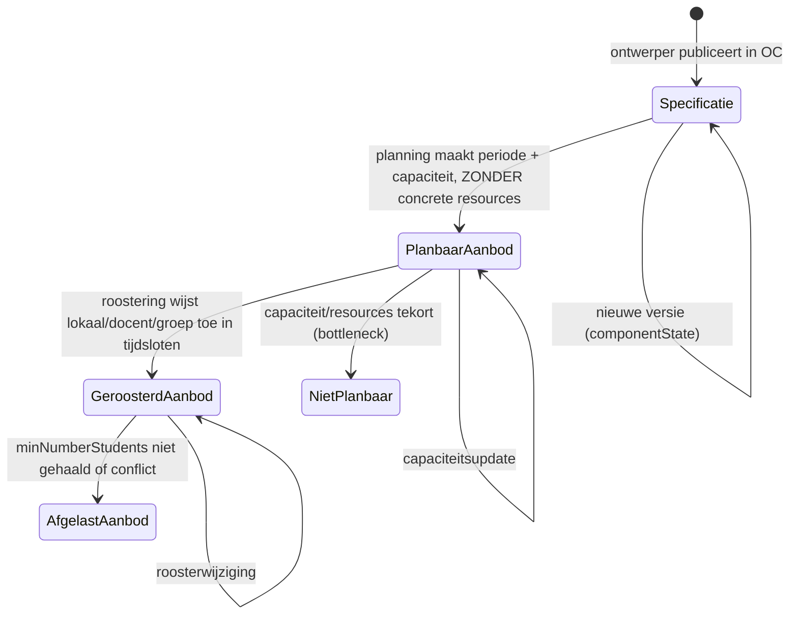
```mermaid
stateDiagram-v2
    [*] --> Specificatie : ontwerper publiceert in OC
    Specificatie --> PlanbaarAanbod : planning maakt periode + capaciteit, ZONDER concrete resources
    PlanbaarAanbod --> GeroosterdAanbod : roostering wijst lokaal/docent/groep toe in tijdsloten
    PlanbaarAanbod --> NietPlanbaar : capaciteit/resources tekort (bottleneck)
    GeroosterdAanbod --> AfgelastAanbod : minNumberStudents niet gehaald of conflict
    Specificatie --> Specificatie : nieuwe versie (componentState)
    PlanbaarAanbod --> PlanbaarAanbod : capaciteitsupdate
    GeroosterdAanbod --> GeroosterdAanbod : roosterwijziging
```

- **Specificatie** = ontwerp/sjabloon. Stabiel, herbruikbaar, versieerbaar. Bevat *wat* geleerd wordt en *hoe organiseerbaar* (`educationSpecification`: deliveryForm, BOT/OOT, roomType, expertiseProfiles, …).
- **Planbaar aanbod (stadium 2a)** = specificatie ingepast in **perioden** + **capaciteit** (`maxNumberStudents`). **Geen** concrete resource-instanties. Hoort bij de planner.
- **Geroosterd aanbod (stadium 2b)** = planbaar aanbod met **concrete tijdsloten** + **resource-instanties** (lokaal-instantie, personeelsnummer). Hoort bij de roosteraar.

#### 3.2.4 Stadia van onderwijsverbintenis — aangemeld → ingeschreven → bezig → afgerond

Een student loopt parallel een eigen state-machine: van eerste belangstelling tot afronding. Verbintenissen bestaan op elk niveau (programma, eenheid, leergelegenheid, toets) en ze hebben elk hun eigen state:

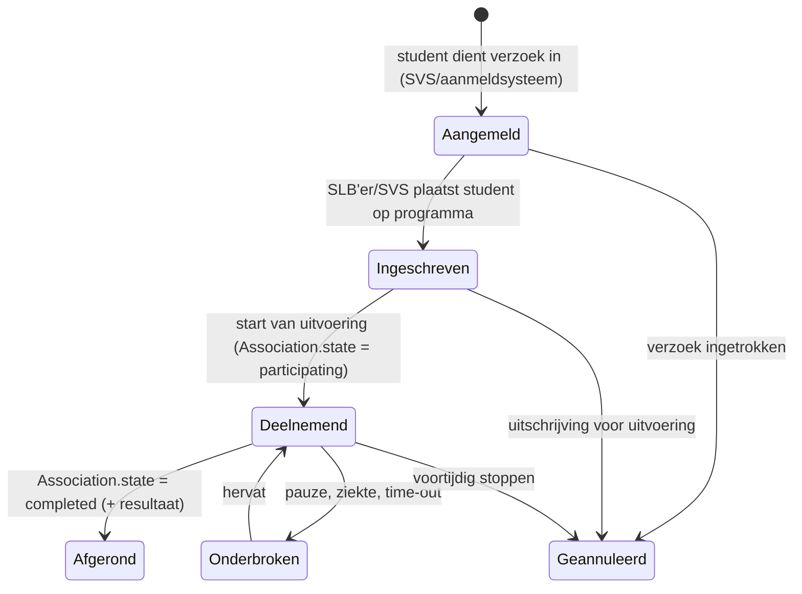
```mermaid
stateDiagram-v2
    [*] --> Aangemeld : student dient verzoek in (SVS/aanmeldsysteem)
    Aangemeld --> Ingeschreven : SLB'er/SVS plaatst student op programma
    Ingeschreven --> Deelnemend : start van uitvoering (Association.state = participating)
    Deelnemend --> Afgerond : Association.state = completed (+ resultaat)
    Deelnemend --> Onderbroken : pauze, ziekte, time-out
    Onderbroken --> Deelnemend : hervat
    Aangemeld --> Geannuleerd : verzoek ingetrokken
    Ingeschreven --> Geannuleerd : uitschrijving voor uitvoering
    Deelnemend --> Geannuleerd : voortijdig stoppen
```

In OEAPI wordt dit gedragen door `Association.state` op het bijbehorende offering-type. Het **minimum-resultaat** is dus `Association.state`. Rijkere bewijsvoering op leeruitkomstniveau (evidence, judgement) zit niet in OEAPI-kern — daarvoor is een aanvullend resultaat-koppelvlak nodig (zie §9 signaleringen).

<!-- #### 3.2.5 MORA cross-walk — aansluiten op mbo-architectuurtaal

Deze begrippen zijn niet nieuw uitgevonden. Ze sluiten aan op de **MORA** (mbo-referentiearchitectuur). Wanneer mensen in het mbo praten over *Onderwijscatalogus*, *Onderwijseenheid*, *Onderwijsaanbod* of *Leerresultaat*, mappen we dat als volgt op het OKx-/OEAPI-begrippenkader:

| MORA-begrip                     | OKx/OEAPI-equivalent                                              | Toelichting                                                       |
| ------------------------------- | ----------------------------------------------------------------- | ----------------------------------------------------------------- |
| **Onderwijscatalogus (OC)**     | Distributiepunt voor specificaties/aanbod/verbintenissen          | OEAPI-implementatie binnen instelling; centraal in OKx (zie §4)   |
| **Onderwijsproduct**            | `Onderwijsspecificatie` (kolom 3) op niveau Kwalificatie/Kerntaak | Stabiel sjabloon, herbruikbaar over cohorten                      |
| **Onderwijseenheid**            | `Onderwijseenheid-specificatie` (rij Kerntaak, kolom 3)           | OEAPI: `Course`                                                   |
| **Leeractiviteit**              | `Leeronderdeel-specificatie` (rij Werkproces, kolom 3)            | OEAPI: `LearningComponent` met `hierarchyLevel = learning_activity` |
| **Onderwijsaanbod / cursusaanbod** | `Onderwijsaanbod` (kolom 4), in stadium planbaar of geroosterd | OEAPI: `*Offering`-objecten met OKx-`OfferingProperties`          |
| **Leergelegenheid**             | `LearningComponentOffering` (kolom 4, rij Werkproces)             | Concrete realisatie van een leeractiviteit in tijd/groep          |
| **Inschrijving / deelname**     | `Onderwijsverbintenis` (kolom 5) — `Association.state`            | Roltype `student`, state-machine §3.2.4                           |
| **Leerresultaat / studieresultaat** | `Onderwijsresultaat` (kolom 6)                                | Minimaal in `Association.state`; rijker buiten OEAPI-kern         |
| **Onderwijsteam / docent**      | `expertiseProfile` (in `educationSpecification`)                  | Profiel-match, geen instantie-toewijzing in specificatie          |
| **Lokaalcluster / vlek**        | `roomType` + `roomRequirements`                                   | Profiel-match; instantie pas in stadium 2b                        |

Voor de bredere context (ROSA als knooppunt; HORA-mbo-aliasering) verwijzen we naar §2.2 (waar de architectuurkaders zijn ingeleid) en de uitlijning met "klus 53 — Alignment MORA <> HORA" in het MBO-digitaal Architectuurberaad. -->

#### 3.2.6 Het vlaks-model als ankertabel — 6 niveaus × 6 families

De volgende tabel is de **canonieke verankering** van §3.2.1 (kolommen) en §3.2.2 (rijen). Lees als: "*per kwalificatiekader-niveau (rij) hebben we kader, beoogde uitkomsten, een specificatie, een aanbod, een verbintenis en een resultaat*". De tabel is in eerdere versies §12.0.2 geweest; dit is nu de definitieve plek.

| Niveau (rij) ↓ \ Familie (kolom) →                                                           | **1. Kader**                                                                  | **2. Beoogde leeruitkomst**                                                                   | **3. Onderwijsspecificatie**       | **4. Onderwijsaanbod**                                                                                                         | **5. Onderwijsverbintenis**                  | **6. Onderwijsresultaat**                            |
| -------------------------------------------------------------------------------------------- | ----------------------------------------------------------------------------- | --------------------------------------------------------------------------------------------- | ---------------------------------- | ------------------------------------------------------------------------------------------------------------------------------ | -------------------------------------------- | ---------------------------------------------------- |
| `Kwalificatiedossier`                                                                        | SBB-dossier                                                                   | *n.v.t. op dit niveau*                                                                        | `Opleidingsspecificatie`           | `Opleidingsaanbod`                                                                                                             | `Opleidingsverbintenis`                      | `Opleidingsresultaat`                                |
| `Kwalificatie`                                                                               | SBB-kwalificatie                                                              | *n.v.t. op dit niveau*                                                                        | `Opleidingsprogramma-specificatie` | `Opleidingsprogramma-aanbod`                                                                                                   | `Opleidingsprogramma-verbintenis`            | `Opleidingsprogramma-resultaat`                      |
| `Kerntaak`                                                                                   | SBB-kerntaak                                                                  | **Collectie van LO-collecties** (kerntaak heeft meerdere werkprocessen, elk met eigen LO-set) | `Onderwijseenheid-specificatie`    | `Onderwijseenheid-aanbod`                                                                                                      | `Onderwijseenheid-verbintenis`               | `Onderwijseenheid-resultaat`                         |
| `Werkproces`                                                                                 | SBB-werkproces                                                                | **Collectie leeruitkomsten** (summatief)                                                      | `Leeronderdeel-specificatie`       | **Leergelegenheid** = `LearningComponentOffering` waar `LearningComponent.consumer.okx.hierarchyLevel = learning_activity`     | `Association` op `LearningComponentOffering` | `Association.state` (+ evt. resultaat-koppelvlak)    |
| *n.v.t. kwalificatiekader*                                                                   | (instelling-eigen)                                                            | `Lesdoel / Lesuitkomst`                                                                       | `Lesspecificatie`                  | **Lesgelegenheid** = `LearningComponentOffering` waar `LearningComponent.consumer.okx.hierarchyLevel = lesson_assignment`      | `Association` op `LearningComponentOffering` | `Association.state` (+ evt. aanwezigheid/resultaat)  |
| Summatief: vaststelling Examencommissie t.o.v. leeruitkomsten / formatief: instellingsbeleid | Examencie-besluit (summatief) of instellingsbeleid (formatief)                | `Lesuitkomst`/set, `Leeruitkomst`/set, `Werkproces`/set, … (scope van toetsing)               | `Toetsonderdeel-specificatie`      | `Toetsgelegenheid`                                                                                                             | `Toetsgelegenheid-verbintenis`               | `Toetsresultaat / Aanwezigheid`                      |

**Cardinaliteit (normatief voor dit profiel):**

- `Kerntaak (1..*) Werkproces`
- `Werkproces (1..*) Leeruitkomst` (summatief)
- `Leeruitkomst (0..*) Onderwijseenheid` / `Leeronderdeel` / `Toetsonderdeel` (dezelfde LO kan over meerdere onderdelen verdeeld zijn; onderdelen kunnen meerdere LO's dekken)
- `Leeruitkomst (0..*) Lesuitkomst` (formatief; DAG/boom-structuur)

**Voetnoot.** OKx richt zich in dit profiel primair op het beschrijven van de **werkproceslaag**. De entiteit *leergelegenheid* (groep van lessen) leidt uiteindelijk tot individueel geroosterde lessen. Binnen geroosterde lessen kunnen op hun beurt geneste lessen voorkomen; in toekomstige iteraties moeten ook deze recursief volgens dit datamodel gemodelleerd kunnen worden. Dit geldt eveneens voor diepere sublagen zoals een *lessenreeks* of specifieke leeractiviteiten binnen een les. Dit erkent expliciet dat onder een *leergelegenheid* of *lessenreeks* nog een hiërarchie van leeronderdelen kan bestaan, met directe impact op bottom-up en top-down aggregatie.

> **Verdiepende verwijzingen:** uitwerking van de specificatie-objecten op attribuutniveau staat in §12.5; de informatiestromen tussen ketenpartijen (CO ↔ OC ↔ Planning ↔ Roostering ↔ SVS) in §12.2; het volledige ERD in §12.0.3.


### 3.5 Eerdere scenario-schetsen (archief — worden geconsolideerd in §3.4)

> **Status.** Deze paragraaf bevat eerdere scenario-schetsen (A–E) uit een vroege iteratie. Ze zijn deels nog bruikbaar als verkenning van leerroute 3, 4, 5 en 7-9 (waarvan 4-9 buiten scope vallen voor §3.4). Bij de volledige uitwerking van §3.4.5–§3.4.12 (LR2/LR3 in detail) en de toekomstige LR4–LR9-paragraaf worden de relevante delen hieruit overgenomen of vervangen. Tot die tijd bewaren we ze hier als context.

#### Scenario A — Regulier (leerroute 1): Jochem wil apothekersassistent worden

*Jochem schrijft zich in voor een voltijd mbo-4 opleiding van 3 jaar. Na 3 jaar behaalt hij zijn diploma.*

**Onderwijsontwerper (top-down)**

- Ontwerpt `Programme "Apothekersassistent"` met `curriculumType: nominaal`.
- Vertaalt kwalificatiedossier (Crebo 23450 / kwalificatie 27141) naar `LearningOutcome`-hiërarchie.
- Maakt per kerntaak een of meer `Courses` met vaste `LearningComponents` (**leeronderdeelspecificaties** op werkproceslaag).
- Specificeert per component: leervorm (simulatie/klassikaal/werkplek), BOT/OOT, ruimtetype, expertiseprofiel, leermiddelen.
- Publiceert naar OC → alles staat klaar.

**Planner**

- Ontvangt volledige specificatie uit OC. Per `LearningComponentOffering`:
  - *"Gespreksvoering simulatie"*: 80 BOT, praktijkruimte met balie, docent met rollenspel-expertise, 2x/week, 8 weken.
  - *"Farmaceutische theorie"*: 40 BOT, collegezaal, farmaceutisch docent.
- Berekent: 120 studenten × deze specificaties = X lokalen, Y docenten, Z leermiddelen.
- Voedt `beschikbarePlaatsen` en `cohortGrootte` terug naar OC.

**Student (Jochem)**

- Ziet in SKS één programma met één track. Kiest niet, volgt nominale route.
- Elke afgeronde les → badge. Elke afgeronde **leergelegenheid** → microcredential. Course → certificaat. Alles → diploma.

---

#### Scenario B — Versneld (leerroute 3): Linda heeft horeca-ervaring

> *Linda volgt Leidinggevende Bediening versneld. Ze heeft al horeca-ervaring en kan sneller door het programma.*

**Onderwijsontwerper**

- Dezelfde `Programme` root als regulier, maar voegt een `Programme "Track: Versneld"` toe (`leerrouteType: versneld`).
- Track "Versneld" deelt courses met Track "Regulier" via `programmeIds` (N:M), maar met minder totaal SBU (vrijstellingen o.b.v. EVC).
- Sommige `Courses` staan bij beide tracks; sommige alleen bij regulier.

**Planner**

- Ziet twee tracks onder hetzelfde programma. Kan berekenen:
  - Track Regulier: 30 studenten, Track Versneld: 5 studenten.
  - Gedeelde courses: 35 studenten in dezelfde `CourseOffering`.
  - Niet-gedeelde courses: aparte offerings met minder capaciteitsvraag.

**Student (Linda)**

- SKS toont track "Versneld" met minder courses. LO's die ze al beheerst (EVC) zijn afgevinkt.
- Kan alsnog meteen examen doen voor courses die ze overslaat → `TestComponent` is bereikbaar onafhankelijk van het volgen van de bijbehorende `LearningComponents`.

---

#### Scenario C — Personaliseren binnen instelling (leerroute 4): Kyra combineert Pabo en ALO

> *Kyra wil het klaslokaal en de gymzaal combineren en gaat voor de dubbele bachelor Pabo-ALO.*

**Onderwijsontwerper**

- `Programme "Pabo"` en `Programme "ALO"` bestaan als losse root-programmes.
- Sommige `Courses` (bijv. "Pedagogiek", "Didactiek") horen bij **beide** programmes via `programmeIds`.
- Keuzedelen/minors zijn `Programme`-kinderen met `programmeType: "minor"`.

**Planner**

- Ziet dat `Course "Pedagogiek"` bij twee programmes hoort.
- Kan één `CourseOffering` plannen voor studenten uit beide opleidingen.
- Education specification is identiek → zelfde roomType, expertiseProfiles, learningResourceGroups.

**Student (Kyra)**

- SKS toont overlap: *"Deze 5 courses tellen voor beide diplomas."*
- Bottom-up: haar combinatie van gekozen courses aggregeert naar de LO's van **beide** kwalificaties.
- Na 4,5 jaar: twee diploma's, omdat de `learningOutcomes` van beide programmes zijn afgedekt.

---

#### Scenario D — Personaliseren buiten instelling, binnen sector (leerroute 5): Macca doet Data Science bij universiteit B

> *Macca studeert voedingswetenschappen aan universiteit A. Ze vult haar programma aan met Data Science vakken van universiteit B.*

**Cross-instelling interoperabiliteit — waarom de standaard nodig is**

- Universiteit B publiceert `Course "Data Science Fundamentals"` in haar OC, met OKx-profiel:
  - `learningOutcomes`, `educationSpecification` (deliveryForm, BOT/OOT, roomType, etc.)
  - `studyLoad: 5 ECTS`
  - `credentialDocument: microcredential`
- Universiteit A ontvangt dit via **Sector Edubroker** of directe OEAPI-koppeling.
- **Omdat beide instellingen hetzelfde profiel gebruiken**, kan universiteit A:
  - De `learningOutcomes` matchen met haar eigen kwalificatie-eisen.
  - De `studyLoad` optellen in Macca's totaal.
  - De `educationSpecification` tonen aan Macca (deliveryForm, locatie, etc.).

**Planner (universiteit B)**

- Plant de offering op basis van eigen onderwijsspecificatie.
- `beschikbarePlaatsen` wordt gedeeld via OC → Edubroker.

**Student (Macca)**

- SKS bij universiteit A toont aanbod van universiteit B als matchend op haar leervraag.
- `Course` van B wordt onderdeel van haar persoonlijke programme bij A (via `programmeIds`).
- Na afronding: microcredential van B + opname in diploma van A.

---

#### Scenario E — Vrije keuze / modulair studeren (leerroute 7-9): Sinead en Chen

> *Sinead volgt losse modules voor bijscholing (vrije keuze). Chen bundelt modules uit mbo-opleidingen rond energietransitie (bundelen). Michelle stapelt modules richting diploma (stapelen).*

**Onderwijsontwerper**

- Publiceert `Courses` als **zelfstandige eenheden** met `choiceAvailable: true`.
- Elke course heeft eigen `learningOutcomes`, `educationSpecification` en `credentialDocument: microcredential`.
- Courses kunnen los gevolgd worden — geen verplichte `Programme`-parent.

**Bottom-up aggregatie (de student bouwt zelf)**

```
Sinead kiest 3 losse courses:
  Course "Cloud Security" (5 ECTS, microcredential)
  Course "Threat Analysis" (5 ECTS, microcredential)
  Course "Incident Response" (5 ECTS, microcredential)
→ Geen diploma, wel 3 microcredentials + 15 ECTS in wallet

Chen bundelt 6 courses uit 2 opleidingen:
  Courses uit "Technicus Smart Energy" (mbo)
  Courses uit "Technicus Engineering" (mbo)
  Courses uit "Elektrotechniek" (hbo)
→ Thematische bundel, microcredentials, cross-instelling

Michelle stapelt modules:
  Begint met 4 courses → 4 microcredentials
  Instelling ziet: LO's dekken 60% van kwalificatie niveau-4
  → Aanbod: "volg nog 6 courses + examen → diploma"
  → Programme wordt retroactief samengesteld uit behaalde courses
```

**De aggregatie werkt bottom-up:** de `learningOutcomes` van de gekozen courses worden opgeteld en gematcht tegen het kwalificatiedossier. Als de som alle LO's dekt → diplomawaardig.

**Planner**

- Ziet per `CourseOffering`: aanmeldingen van zowel reguliere studenten als modulaire studenten.
- Education specification is identiek ongeacht hoe de student er komt — dezelfde delivery form, roomType en expertise.
- Kan `minimaalAantalDeelnemers` hanteren voor go/no-go.

## 4. De "Student Kiest"-keten

### 4.1 De Onderwijscatalogus als centraal distributiepunt

In dit stuk schetsen we het proces nader. Dit breiden we later uit.

Het ArchiMate-model positioneert de **OC** als centraal distributiepunt. Alle informatiestromen in scope lopen **door** of **naar** de OC:

```
                          ┌───────────────────┐
  Curriculum ontwerptool ─┤                   ├─▶ SKS (passend aanbod)
  ("Grofmazig ontwerp")   │                   │
                          │  Onderwijs-       ├─▶ SVS (resultaat structuren)
  Planningssysteem ───────┤  catalogus (OC)   │
  ("onderwijsspecificatie-│                   ├─▶ Roostersysteem (Fijnmazig aanbod)
   specifieke planning")  │                   │
                          │                   ├─▶ LMS (onderwijsspecificatie + leermiddelen)
  SKS ────────────────────┤                   │
  ("Leervraag in LO,      │                   ├─▶ Planningssysteem
   domein, leervorm")     │                   │
                          │                   ├─▶ Sector Edubroker
                          │                   │   ("Alle sector onderwijsspecificaties
                          │                   │    i.r.t. leeruitkomsten")
                          │                   │
                          │                   ├─▶ Curriculum ontwerptool
                          └───────────────────┘   ("Herbruikbare onderwijsspecificaties
                                                    aanbod")
```

**Het OKx-profiel is primair het profiel waarmee de OC via OEAPI communiceert.** Elke afnemer (SKS, planner, LMS, andere instelling) ontvangt dezelfde verrijkte structuur en haalt eruit wat relevant is.

### 4.2 De "Student Kiest"-keten (kernstroom)

Het ArchiMate-model nummert de kernstroom expliciet:


| Stap | Stroom                                                                          | Van → Naar   | OEAPI-entiteiten                                        |
| ---- | ------------------------------------------------------------------------------- | ------------ | ------------------------------------------------------- |
| 1    | Intake resultaat (studentidentiteit, leervraag in gewenste LO's, leercontext)   | Intake → SVS | `Person`, `LearningOutcome` (referenties)               |
| 2    | Keuzeproces starten (administratieve aanmelding)                                | SVS → SKS    | `Association`-referentie                                |
| 3    | Aanbod passend op leervraag (uitgedrukt in LO's, domein, leervorm)              | SKS → **OC** | Query op `LearningOutcome`, `modesOfDelivery`, leervorm |
| 4    | Passend aanbod: **programmes, courses, learning components <> test components** | **OC** → SKS | Volledige OEAPI-hiërarchie + OKx-extensies              |
| 5    | Concept-leerroute als keuze → intekening                                        | SKS → SVS    | Genest `Programme` als track                            |


Stap 4 noemt de OEAPI-entiteiten letterlijk. Het OKx-profiel verrijkt die entiteiten met alles wat de keten nodig heeft.

## 5. OKx-hiërarchie op het OEAPI recursieve datamodel

### 5.1 OEAPI ondersteunt recursie

```
Programme ──parentId/childIds──▶ Programme (recursief, onbeperkte diepte)
  │
  └──programmeIds──▶ Course (N:M — course kan bij meerdere programmes horen)
                       │
                       ├──courseId──▶ LearningComponent ──parentId/childIds──▶ LearningComponent (recursief)
                       │
                       └──courseId──▶ TestComponent ──parentId/childIds──▶ TestComponent (recursief)

LearningOutcome ──parentIds/childIds──▶ LearningOutcome (DAG, meerdere ouders mogelijk)
  ▲ gerefereerd via learningOutcomeIds vanuit Programme, Course, LearningComponent, TestComponent
```

### 5.2 Mapping OKx → OEAPI


| OKx concept                                | OEAPI entiteit                        | Hoe                                                                   | Credential bij afronding               |
| ------------------------------------------ | ------------------------------------- | --------------------------------------------------------------------- | -------------------------------------- |
| **Kwalificatie / opleiding**               | `Programme` (root)                    | `programmeType: "programme"`                                          | **Diploma**                            |
| **Leerroute** (globaal, vóór inschrijving) | `Programme` (kind)                    | `programmeType: "track"` of `"specialisation"`                        | (onderdeel van diploma)                |
| **Keuzedeel**                              | `Programme` (kind) of `Course`        | `programmeType: "minor"` of als losse `Course`                        | **MBO-certificaat** / Keuzedeel-bewijs |
| **Opleidingsonderdeel / leertaak**         | `Course`                              | Eigen `studyLoad`, `learningOutcomeIds`. Kan bij meerdere programmes. | **Certificaat** / **Microcredential**  |
| **Leeractiviteit** (keuzeniveau student)   | `LearningComponent` (niveau 1)        | Collectie lesopdrachten + lesuitkomsten                               | **Microcredential** / badge            |
| **Lesopdracht / les**                      | `LearningComponent` (kind, recursief) | Genest via `parentId`/`childIds`                                      | **Badge**                              |
| **Toets / examen**                         | `TestComponent`                       | Onder dezelfde `Course`. Gedeelde `learningOutcomeIds`                | (beoordeelt bovenliggende LO's)        |
| **Leeruitkomst** (summatief)               | `LearningOutcome` (root)              | Gerefereerd vanuit Programme, Course, LearningComponent               | —                                      |
| **Lesuitkomst** (formatief)                | `LearningOutcome` (kind)              | Genest via `parentIds`/`childIds`. DAG-structuur.                     | —                                      |


### 5.3 Bottom-up aggregatie: de som klopt

Een **fundamenteel ontwerpprincipe**: de onderwijsspecificatie aggregeert bottom-up. De som van alle lessen onder een course moet kloppen met de course-specificatie, en de som van alle courses onder een programme moet kloppen met het programme — en idealiter uitlijnen met het top-down kwalificatiedossier van SBB.

```
Programme "Apothekersassistent" (level: mbo-4, studyLoad: 4800 SBU)
│  ▸ learningOutcomes: [alle kerntaak-afgeleide LO's]
│  ▸ OKx: credentialDocument: { type: diploma, register: "DUO" }
│  ▸ OKx: qualificationReference: { scheme: "crebo", dossier: "23450", qualification: "27141" }
│  ▸ SOM studyLoad children = 4800 SBU ✓
│
├── Programme "Track: Regulier voltijd" (programmeType: track)
│   │  ▸ OKx: leerrouteType: regulier
│   │  ▸ SOM studyLoad courses = 4800 SBU ✓
│   │
│   ├── Course "Baliegesprekken en cliëntcommunicatie" (studyLoad: 240 SBU)
│   │   │  ▸ learningOutcomes: ["Voert professionele baliegesprekken",
│   │   │  │                     "Cliëntgericht handelen"]
│   │   │  ▸ OKx: credentialDocument: { type: microcredential, register: "edubadges.nl" }
│   │   │  ▸ OKx: educationSpecification:
│   │   │  │    deliveryForm: simulation
│   │   │  │    timeAllocation: { bot: 160, oot: 80, unit: sbu }
│   │   │  │    roomType: simulation_practice_room
│   │   │  │    expertiseProfiles: ["roleplay_training", "pharmaceutical"]
│   │   │  │    learningResourceGroups: ["simulation_material", "digital_workstation"]
│   │   │  ▸ SOM componentStudyLoad children = 240 SBU ✓
│   │   │
│   │   ├── LearningComponent "Leeractiviteit: Gespreksvoering simulatie"
│   │   │   │  ▸ learningComponentType: practical
│   │   │   │  ▸ OKx: hierarchyLevel: learning_activity
│   │   │   │  ▸ OKx: educationSpecification:
│   │   │   │  │    deliveryForm: simulation
│   │   │   │  │    timeAllocation: { bot: 80, oot: 40, unit: sbu }
│   │   │   │  │    roomType: simulation_practice_room
│   │   │   │  │    roomRequirements: "balie, wachtruimte, kassasysteem"
│   │   │   │  │    expertiseProfiles: ["roleplay_training"]
│   │   │   │  │    learningResourceGroups: ["simulation_material"]
│   │   │   │  │    spreadPattern: "2x per week, 8 weken"
│   │   │   │  ▸ OKx: credentialDocument: { type: microcredential, register: "edubadges.nl" }
│   │   │   │  ▸ OKx: participationRequirements: []
│   │   │   │  ▸ learningOutcomes: ["Voert professionele baliegesprekken"]
│   │   │   │
│   │   │   ├── LearningComponent "Les: Gesprek bij emotionele cliënt"
│   │   │   │     ▸ OKx: hierarchyLevel: lesson_assignment
│   │   │   │     ▸ OKx: educationSpecification:
│   │   │   │     │    deliveryForm: simulation
│   │   │   │     │    timeAllocation: { bot: 20, oot: 10, unit: sbu }
│   │   │   │     │    roomType: simulation_practice_room
│   │   │   │     │    expertiseProfiles: ["roleplay_training"]
│   │   │   │     ▸ OKx: credentialDocument: { type: badge, register: "edubadges.nl" }
│   │   │   │     ▸ learningOutcomes: [lesuitkomst: "Herkent en hanteert
│   │   │   │     │                     emoties in baliegesprek"]
│   │   │   │
│   │   │   ├── LearningComponent "Les: Medicatie-informatie verstrekken"
│   │   │   │     ▸ (zelfde structuur, andere lesuitkomsten)
│   │   │   │
│   │   │   └── LearningComponent "Les: Culturele sensitiviteit"
│   │   │         ▸ (zelfde structuur)
│   │   │
│   │   ├── LearningComponent "Leeractiviteit: Farmaceutische theorie"
│   │   │   │  ▸ learningComponentType: lecture
│   │   │   │  ▸ OKx: educationSpecification:
│   │   │   │  │    deliveryForm: classroom
│   │   │   │  │    timeAllocation: { bot: 40, oot: 40, unit: sbu }
│   │   │   │  │    roomType: lecture_hall
│   │   │   │  │    expertiseProfiles: ["pharmaceutical"]
│   │   │   │  │    learningResourceGroups: ["digital_workstation", "professional_literature"]
│   │   │   │  ▸ OKx: participationRequirements: []
│   │   │   │  (... geneste lesopdrachten ...)
│   │   │
│   │   └── TestComponent "Praktijkexamen baliegesprekken"
│   │         ▸ testComponentType: life_skills_test
│   │         ▸ learningOutcomes: [zelfde LO's als bovenliggende course]
│   │         ▸ OKx: assessmentLevel: summative
│   │         ▸ OKx: assessmentScope: { workProcessCodes: ["B1-K1-W1"], learningOutcomeIds: ["<LO-ids>"] }
│   │         ▸ OKx: educationSpecification:
│   │         │    roomType: simulation_practice_room
│   │         │    expertiseProfiles: ["assessor_pharmaceutical"]
│   │         │    timeAllocation: { bot: 4, unit: sbu }
│   │
│   ├── Course "Farmaceutische kennis en medicatieveiligheid" (studyLoad: 360 SBU)
│   │   └── (... zelfde structuur, andere leervormen/LO's ...)
│   │
│   ├── Course "Beroepspraktijkvorming" (studyLoad: 1200 SBU)
│   │   │  ▸ OKx: educationSpecification:
│   │   │  │    deliveryForm: work_based_learning
│   │   │  │    roomType: external_workplace
│   │   │  │    expertiseProfiles: ["practice_supervisor"]
│   │   │  (gedeeld via programmeIds — hoort ook bij track "Versneld")
│   │   └── (... stage-activiteiten als LearningComponents ...)
│   │
│   └── (... overige courses tot SOM = 4800 SBU ...)
│
├── Programme "Track: Versneld" (programmeType: track)
│   │  ▸ OKx: learningRouteType: versneld
│   │  ▸ SOM studyLoad = 3600 SBU (minder SBU door EVC/vrijstellingen)
│   │  ▸ Deelt courses via programmeIds (N:M)
│   └── (... subset van courses, evt. gecomprimeerd ...)
│
└── Course "Keuzedeel: Digitale vaardigheden" (studyLoad: 240 SBU)
    ▸ programmeIds: [root + beide tracks] (beschikbaar in alle routes)
    ▸ OKx: credentialDocument: { type: mbo_certificaat, register: "DUO" }
```

**De aggregatie-invariant:** `SOM(children.studyLoad) = parent.studyLoad` op elk niveau. Dit maakt het mogelijk om vanuit een willekeurig niveau omhoog te aggregeren naar het kwalificatiedossier.

**Kwalificatiedossier-alignment:** De root `Programme` verwijst via `qualificationReference` naar het kwalificatiedossier (Crebo/SBB-scheme expliciet). De `learningOutcomes` op programmaniveau dekken alle kerntaken/werkprocessen. Per `Course` en `LearningComponent` is traceerbaar welke LO's (en dus welke kerntaken) worden afgedekt.

### 5.4 Voorbeeld: LearningOutcome-hiërarchie met CompetentNL-taxonomieën

[CompetentNL](https://competentnl.nl/page/view/b1741ead-e4e8-4974-8aea-1399ae22284a/data-taxonomieen-van-competentnl) is de nationale standaard voor het beschrijven van skills, ontwikkeld door SBB, UWV, TNO en CBS. De taxonomie is beschikbaar als Linked Open Data (RDF/OWL/SKOS) via een SPARQL-endpoint en API. CompetentNL onderscheidt twee hiërarchieën:


| Taxonomie                   | Lagen                                                                     | Omvang                                                   | Basis                                    |
| --------------------------- | ------------------------------------------------------------------------- | -------------------------------------------------------- | ---------------------------------------- |
| **Vaardighedentaxonomie**   | 3 lagen: 6 algemene → 19 generieke → 112 specifieke vaardigheidsconcepten | Hard skills (leerbaar) + soft skills (ontwikkelbaar)     | ESCO, ONet, wetenschappelijke literatuur |
| **Kennisgebiedentaxonomie** | 4 lagen, gebaseerd op ISCED-F 2013                                        | Vakspecifieke feiten, principes, theorieën en praktijken | ISCED-F 2013, CBS-rubrieken              |


CompetentNL koppelt skills aan **alle mbo-kwalificaties** (kwalificaties, keuzedelen, certificaten) en is bezig met uitbreiding naar hbo en non-formeel onderwijs. De relatie `cnl:requires` verbindt beroepen met skills.

#### Waarom CompetentNL als referentie voor LearningOutcome?

1. **Gedeelde taal**: Leeruitkomsten in OEAPI beschrijven *wat* een student na afronding kan. CompetentNL beschrijft *welke vaardigheden en kennisgebieden* nodig zijn op de arbeidsmarkt. De koppeling maakt leeruitkomsten matchbaar met beroepen en vacatures.
2. **Cross-instelling vergelijkbaarheid**: Als instelling A en B dezelfde CompetentNL-referenties gebruiken voor hun leeruitkomsten, is automatisch zichtbaar welke overlap en complementariteit er is.
3. **Modulair studeren**: Bij bottom-up samenstellen van een leerroute (scenario E) kan het SKS leeruitkomsten matchen op CompetentNL-skills om te bepalen welke kwalificatie-eisen al zijn afgedekt.
4. **Arbeidsmarktaansluiting**: SBB koppelt CompetentNL aan de complete mbo-kwalificatiestructuur; OEAPI LearningOutcomes met CompetentNL-referenties sluiten dus direct aan op het kwalificatiedossier.

#### OEAPI-kernvelden die CompetentNL faciliteren

Het bestaande `LearningOutcome`-schema biedt al aanknopingspunten:


| OEAPI-veld                                             | CompetentNL-mapping                                                                 |
| ------------------------------------------------------ | ----------------------------------------------------------------------------------- |
| `fieldsOfStudy` (ISCED-F, 2-6 digits)                  | Direct bruikbaar voor CompetentNL kennisgebiedentaxonomie (laag 1-3 = ISCED-F 2013) |
| `complexityLevel` (extensible enum: bloom1-6, solo0-4) | Aanvulbaar met CompetentNL vaardigheidsniveaus (als die beschikbaar komen)          |
| `otherCodes` (array IdentifierEntry)                   | Ideaal voor CompetentNL skill-URI's als secundaire code                             |
| `parentIds` / `childIds`                               | DAG-structuur voor leeruitkomst → lesuitkomst hiërarchie                            |


#### OKx-extensie op LearningOutcome voor CompetentNL

Naast de bestaande OKx-attributen (`hierarchyLevel`, `standardisationStatus`, `qualificationReference`, `sectorReference`) voegen we toe:


| Attribuut                | Type                             | Beschrijving                                                                                                                                                                                                                                                                         |
| ------------------------ | -------------------------------- | ------------------------------------------------------------------------------------------------------------------------------------------------------------------------------------------------------------------------------------------------------------------------------------ |
| `competentNlRefs`        | array of object                  | Referenties naar CompetentNL-concepten. Per referentie: `{ uri: string, type: enum, label: string }`. `type`: `vaardigheid_algemeen`, `vaardigheid_generiek`, `vaardigheid_specifiek`, `kennisgebied`. `uri`: de CompetentNL Linked Data URI. `label`: leesbare naam (voor display). |
| `competentNlRelatieType` | enum: `primair`, `ondersteunend` | Geeft aan of deze LO primair of ondersteunend is voor het gekoppelde CompetentNL-concept. Volgt het CompetentNL-patroon van kernrelaties vs. contextuele relaties.                                                                                                                   |


#### Uitgewerkt voorbeeld: Apothekersassistent (mbo-4)

Hieronder de LearningOutcome-boom voor het voorbeeld uit §5.3. Leeruitkomsten zijn afgeleid van het kwalificatiedossier (Crebo 23450 / kwalificatie 27141) en gekoppeld aan CompetentNL vaardigheden en kennisgebieden.

```
LearningOutcome "LO-APOTH-001" (root — summatieve leeruitkomst)
│  name: "Voert professionele baliegesprekken"
│  description: "De beginnend beroepsbeoefenaar voert zelfstandig baliegesprekken
│  │              met cliënten over medicatiegebruik, bijwerkingen en
│  │              gezondheidsadvies, rekening houdend met de cliënt-context."
│  fieldsOfStudy: "0916"  (ISCED-F: Pharmacy)
│  complexityLevel: bloom_3  (Apply)
│  ▸ OKx: hierarchyLevel: learning_outcome
│  ▸ OKx: standardisationStatus: aligned
│  ▸ OKx: qualificationReference:
│  │    scheme: "crebo"
│  │    dossier: "23450"
│  │    qualification: "27141"
│  │    kerntaak: "B1-K1"
│  │    werkproces: "B1-K1-W1"
│  ▸ OKx: competentNlRefs:
│  │    - uri: "cnl:skill/specifiek/mondelinge-communicatie"
│  │      type: vaardigheid_specifiek
│  │      label: "Mondelinge communicatie"
│  │      relatieType: primair
│  │    - uri: "cnl:skill/specifiek/klantgericht-handelen"
│  │      type: vaardigheid_specifiek
│  │      label: "Klantgericht handelen"
│  │      relatieType: primair
│  │    - uri: "cnl:knowledge/0916"
│  │      type: kennisgebied
│  │      label: "Farmacie"
│  │      relatieType: primair
│  │    - uri: "cnl:skill/generiek/communiceren"
│  │      type: vaardigheid_generiek
│  │      label: "Communiceren"
│  │      relatieType: primair
│  │    - uri: "cnl:skill/specifiek/empathie-tonen"
│  │      type: vaardigheid_specifiek
│  │      label: "Empathie tonen"
│  │      relatieType: ondersteunend
│  ▸ otherCodes:
│  │    - codeType: "competentnl-skill"
│  │      code: "cnl:skill/specifiek/mondelinge-communicatie"
│  │    - codeType: "competentnl-skill"
│  │      code: "cnl:skill/specifiek/klantgericht-handelen"
│  │    - codeType: "sbb-werkproces"
│  │      code: "B1-K1-W1"
│  │
│  ├── LearningOutcome "LO-APOTH-001a" (kind — formatieve lesuitkomst)
│  │     name: "Herkent en hanteert emoties in baliegesprek"
│  │     description: "De student herkent emotionele reacties bij cliënten
│  │     │              (angst, boosheid, verdriet) en past de gespreksvoering
│  │     │              aan met actief luisteren en empathische bevestiging."
│  │     fieldsOfStudy: "0916"
│  │     complexityLevel: bloom_4  (Analyse)
│  │     ▸ OKx: hierarchyLevel: lesson_outcome
│  │     ▸ OKx: standardisationStatus: concept
│  │     ▸ OKx: qualificationReference:
│  │     │    scheme: "crebo"
│  │     │    dossier: "23450"
│  │     │    qualification: "27141"
│  │     │    kerntaak: "B1-K1"
│  │     │    werkproces: "B1-K1-W1"
│  │     ▸ OKx: competentNlRefs:
│  │     │    - uri: "cnl:skill/specifiek/empathie-tonen"
│  │     │      type: vaardigheid_specifiek
│  │     │      label: "Empathie tonen"
│  │     │      relatieType: primair
│  │     │    - uri: "cnl:skill/specifiek/conflicthantering"
│  │     │      type: vaardigheid_specifiek
│  │     │      label: "Conflicthantering"
│  │     │      relatieType: ondersteunend
│  │     │    - uri: "cnl:skill/generiek/sociaal-communicatief"
│  │     │      type: vaardigheid_generiek
│  │     │      label: "Sociaal-communicatief handelen"
│  │     │      relatieType: primair
│  │
│  ├── LearningOutcome "LO-APOTH-001b" (kind — formatieve lesuitkomst)
│  │     name: "Verstrekt correcte medicatie-informatie aan cliënt"
│  │     description: "De student geeft gestructureerde en begrijpelijke
│  │     │              mondelinge uitleg over dosering, bijwerkingen,
│  │     │              interacties en bewaarcondities van gangbare medicijnen."
│  │     fieldsOfStudy: "0916"
│  │     complexityLevel: bloom_3  (Apply)
│  │     ▸ OKx: hierarchyLevel: lesson_outcome
│  │     ▸ OKx: standardisationStatus: concept
│  │     ▸ OKx: qualificationReference:
│  │     │    scheme: "crebo"
│  │     │    dossier: "23450"
│  │     │    qualification: "27141"
│  │     │    kerntaak: "B1-K1"
│  │     │    werkproces: "B1-K1-W2"
│  │     ▸ OKx: competentNlRefs:
│  │     │    - uri: "cnl:knowledge/0916"
│  │     │      type: kennisgebied
│  │     │      label: "Farmacie"
│  │     │      relatieType: primair
│  │     │    - uri: "cnl:skill/specifiek/mondelinge-communicatie"
│  │     │      type: vaardigheid_specifiek
│  │     │      label: "Mondelinge communicatie"
│  │     │      relatieType: primair
│  │     │    - uri: "cnl:skill/specifiek/informatieverstrekking"
│  │     │      type: vaardigheid_specifiek
│  │     │      label: "Informatieverstrekking"
│  │     │      relatieType: primair
│  │     │    - uri: "cnl:knowledge/091601"
│  │     │      type: kennisgebied
│  │     │      label: "Farmacologie"
│  │     │      relatieType: primair
│  │
│  └── LearningOutcome "LO-APOTH-001c" (kind — formatieve lesuitkomst)
│        name: "Past communicatie aan bij culturele achtergrond cliënt"
│        description: "De student herkent culturele invloeden op
│        │              gezondheidsbeleving en past taalgebruik, non-verbale
│        │              communicatie en adviesstijl hierop aan."
│        fieldsOfStudy: "0916"
│        complexityLevel: bloom_5  (Evaluate)
│        ▸ OKx: hierarchyLevel: lesson_outcome
│        ▸ OKx: standardisationStatus: concept
│        ▸ OKx: competentNlRefs:
│        │    - uri: "cnl:skill/specifiek/interculturele-communicatie"
│        │      type: vaardigheid_specifiek
│        │      label: "Interculturele communicatie"
│        │      relatieType: primair
│        │    - uri: "cnl:skill/generiek/communiceren"
│        │      type: vaardigheid_generiek
│        │      label: "Communiceren"
│        │      relatieType: primair
│        │    - uri: "cnl:skill/specifiek/diversiteitsbewustzijn"
│        │      type: vaardigheid_specifiek
│        │      label: "Diversiteitsbewustzijn"
│        │      relatieType: ondersteunend

LearningOutcome "LO-APOTH-002" (root — summatieve leeruitkomst)
│  name: "Bereidt farmaceutische producten"
│  description: "De beginnend beroepsbeoefenaar bereidt zelfstandig magistrale
│  │              en generieke farmaceutische producten volgens GMP-richtlijnen,
│  │              voert kwaliteitscontroles uit en documenteert het bereidingsproces."
│  fieldsOfStudy: "0916"
│  complexityLevel: bloom_3  (Apply)
│  ▸ OKx: hierarchyLevel: learning_outcome
│  ▸ OKx: standardisationStatus: aligned
│  ▸ OKx: qualificationReference:
│  │    scheme: "crebo"
│  │    dossier: "23450"
│  │    qualification: "27141"
│  │    kerntaak: "B1-K2"
│  │    werkproces: "B1-K2-W1"
│  ▸ OKx: competentNlRefs:
│  │    - uri: "cnl:skill/specifiek/prepareren"
│  │      type: vaardigheid_specifiek
│  │      label: "Prepareren en bereiden"
│  │      relatieType: primair
│  │    - uri: "cnl:skill/specifiek/kwaliteitscontrole"
│  │      type: vaardigheid_specifiek
│  │      label: "Kwaliteitscontrole uitvoeren"
│  │      relatieType: primair
│  │    - uri: "cnl:knowledge/0916"
│  │      type: kennisgebied
│  │      label: "Farmacie"
│  │      relatieType: primair
│  │    - uri: "cnl:skill/specifiek/nauwkeurig-werken"
│  │      type: vaardigheid_specifiek
│  │      label: "Nauwkeurig werken"
│  │      relatieType: primair
│  │    - uri: "cnl:skill/generiek/procedures-volgen"
│  │      type: vaardigheid_generiek
│  │      label: "Procedures en protocollen volgen"
│  │      relatieType: primair
│  │    - uri: "cnl:skill/specifiek/documenteren"
│  │      type: vaardigheid_specifiek
│  │      label: "Documenteren en registreren"
│  │      relatieType: ondersteunend
│  │
│  ├── LearningOutcome "LO-APOTH-002a" (kind — formatieve lesuitkomst)
│  │     name: "Weegt en meet grondstoffen conform voorschrift"
│  │     complexityLevel: bloom_3
│  │     ▸ OKx: hierarchyLevel: lesson_outcome
│  │     ▸ OKx: competentNlRefs:
│  │     │    - uri: "cnl:skill/specifiek/nauwkeurig-werken"
│  │     │      type: vaardigheid_specifiek
│  │     │      label: "Nauwkeurig werken"
│  │     │      relatieType: primair
│  │     │    - uri: "cnl:skill/specifiek/meten-en-wegen"
│  │     │      type: vaardigheid_specifiek
│  │     │      label: "Meten en wegen"
│  │     │      relatieType: primair
│  │
│  ├── LearningOutcome "LO-APOTH-002b" (kind — formatieve lesuitkomst)
│  │     name: "Voert eindcontrole uit op bereid product"
│  │     complexityLevel: bloom_5  (Evaluate)
│  │     ▸ OKx: hierarchyLevel: lesson_outcome
│  │     ▸ OKx: competentNlRefs:
│  │     │    - uri: "cnl:skill/specifiek/kwaliteitscontrole"
│  │     │      type: vaardigheid_specifiek
│  │     │      label: "Kwaliteitscontrole uitvoeren"
│  │     │      relatieType: primair
│  │     │    - uri: "cnl:skill/specifiek/kritisch-denken"
│  │     │      type: vaardigheid_specifiek
│  │     │      label: "Kritisch denken"
│  │     │      relatieType: ondersteunend
│  │
│  └── LearningOutcome "LO-APOTH-002c" (kind — formatieve lesuitkomst)
│        name: "Documenteert bereidingsproces in apotheekinformatiesysteem"
│        complexityLevel: bloom_3
│        ▸ OKx: hierarchyLevel: lesson_outcome
│        ▸ OKx: competentNlRefs:
│        │    - uri: "cnl:skill/specifiek/documenteren"
│        │      type: vaardigheid_specifiek
│        │      label: "Documenteren en registreren"
│        │      relatieType: primair
│        │    - uri: "cnl:skill/specifiek/digitale-vaardigheden"
│        │      type: vaardigheid_specifiek
│        │      label: "Digitale vaardigheden"
│        │      relatieType: ondersteunend

LearningOutcome "LO-APOTH-003" (root — summatieve leeruitkomst)
│  name: "Handelt medicatieveilig"
│  description: "De beginnend beroepsbeoefenaar signaleert, voorkomt en
│  │              rapporteert medicatiefouten en -risico's conform de geldende
│  │              veiligheidsprotocollen en wet- en regelgeving."
│  fieldsOfStudy: "0913"  (ISCED-F: Nursing and caring)
│  complexityLevel: bloom_5  (Evaluate)
│  ▸ OKx: hierarchyLevel: learning_outcome
│  ▸ OKx: standardisationStatus: aligned
│  ▸ OKx: qualificationReference:
│  │    scheme: "crebo"
│  │    dossier: "23450"
│  │    qualification: "27141"
│  │    kerntaak: "B1-K3"
│  │    werkproces: "B1-K3-W1"
│  ▸ OKx: competentNlRefs:
│       - uri: "cnl:skill/specifiek/veiligheidsprotocollen-toepassen"
│         type: vaardigheid_specifiek
│         label: "Veiligheidsprotocollen toepassen"
│         relatieType: primair
│       - uri: "cnl:skill/specifiek/risicosignalering"
│         type: vaardigheid_specifiek
│         label: "Risico's signaleren"
│         relatieType: primair
│       - uri: "cnl:skill/generiek/kwaliteitsbewust-handelen"
│         type: vaardigheid_generiek
│         label: "Kwaliteitsbewust handelen"
│         relatieType: primair
│       - uri: "cnl:knowledge/0916"
│         type: kennisgebied
│         label: "Farmacie"
│         relatieType: primair
│       - uri: "cnl:knowledge/0413"
│         type: kennisgebied
│         label: "Management en administratie"
│         relatieType: ondersteunend
```

#### DAG-structuur: meerdere ouders, hergebruik

Het OEAPI `LearningOutcome`-model ondersteunt meerdere ouders (`parentIds` is een array). Dit maakt hergebruik van lesuitkomsten over courses heen mogelijk:

```
LO-APOTH-001  "Voert professionele baliegesprekken"
  ├── LO-APOTH-001a  "Herkent en hanteert emoties"
  ├── LO-APOTH-001b  "Verstrekt correcte medicatie-informatie"
  └── LO-APOTH-001c  "Past communicatie aan bij culturele achtergrond"

LO-APOTH-003  "Handelt medicatieveilig"
  ├── LO-APOTH-001b  "Verstrekt correcte medicatie-informatie"  ← GEDEELD
  │     parentIds: [LO-APOTH-001, LO-APOTH-003]
  └── ...
```

Lesuitkomst `LO-APOTH-001b` hoort bij twee summatieve leeruitkomsten: "Baliegesprekken" en "Medicatieveiligheid". Bij het correct verstrekken van medicatie-informatie draag je aan beide bij. Dit is essentieel voor:

- **Modulair studeren**: een student die course "Baliegesprekken" afrond, heeft ook deels aan "Medicatieveiligheid" voldaan.
- **Cross-instelling erkenning**: instelling B ziet dat de student deze lesuitkomst al heeft behaald en hoeft dat deel niet opnieuw te toetsen.

#### CompetentNL-referenties als matchingsleutel

```
Student kiest in SKS: "Ik wil werken aan klantgericht handelen in de farmacie"

SKS query naar OC:
  → filter LearningOutcomes waar competentNlRefs bevat:
      uri LIKE "cnl:skill/specifiek/klantgericht-handelen"
      AND fieldsOfStudy = "0916"

OC retourneert:
  → LO-APOTH-001 "Voert professionele baliegesprekken"
    → gekoppeld aan Course "Baliegesprekken en cliëntcommunicatie" (240 SBU)
    → gekoppeld aan LearningComponent "Gespreksvoering simulatie"
  → Student ziet: leervorm = simulatie, 80 BOT, praktijkruimte, 8 weken

Planner berekent:
  → CompetentNL expertiseProfiel "rollenspel_training" + "farmaceutisch"
    → match met beschikbare docenten
```

## 6. Het educationSpecification-object (fase 1 — kern)

Het informatiemodel Onderwijsontwerp in ArchiMate toont dat op elk niveau niet alleen *wat* maar ook *hoe*, *waarmee*, *door wie*, *waar* en *hoe lang* wordt vastgelegd. Dit vertaalt zich naar een gestructureerd consumer-extensie-object.

### 6.0 Naamgeving (canonical)

OEAPI is een UK-English standaard. In dit project request gebruiken we daarom **canonical UK-English veldnamen** voor OKx-extensies. Nederlandse termen kunnen in proza voorkomen, maar zijn **niet normatief**.


| NL in eerdere drafts    | Canonical (OKx-extensie)    |
| ----------------------- | --------------------------- |
| `onderwijsSpecificatie` | `educationSpecification`    |
| `leervorm`              | `deliveryForm`              |
| `tijdsbesteding`        | `timeAllocation`            |
| `ruimteType`            | `roomType`                  |
| `ruimteEisen`           | `roomRequirements`          |
| `expertiseProfiel(en)`  | `expertiseProfiles`         |
| `leermiddelGroepen`     | `learningResourceGroups`    |
| `waardeDocument`        | `credentialDocument`        |
| `kwalificatieRef`       | `qualificationReference`    |
| `leerrouteType`         | `learningRouteType`         |
| `keuzeMogelijk`         | `choiceAvailable`           |
| `deelnameVereisten`     | `participationRequirements` |
| `hierarchieNiveau`      | `hierarchyLevel`            |
| `toetsNiveau`           | `assessmentLevel`           |
| `standaardisatieStatus` | `standardisationStatus`     |
| `sectorReferentie`      | `sectorReference`           |


### 6.1 Structuur `educationSpecification`

Toepasbaar op `LearningComponent`, `Course` en `TestComponent`. Op hogere niveaus (Course, Programme) beschrijft het het overkoepelende kader; op lagere niveaus (LearningComponent) de concrete specificatie.

```yaml
educationSpecification:
  deliveryForm:
    type: string enum         # simulation, classroom, work_based_learning,
                              # project_based_education, guided_self_study,
                              # internship, research, co_teaching, blended
    strategy: string          # optioneel: didactische strategie (bijv. "4CID")
  timeAllocation:
    bot: number               # begeleid onderwijs tijd (SBU/EC/uur)
    oot: number               # onbegeleid onderwijs tijd
    unit: string enum         # sbu, ects, hour
    spreadPattern: string     # "2x per week, 8 weken" / "doorlopend"
  roomType: string enum       # simulation_practice_room, lecture_hall, online,
                              # external_workplace, exam_hall, hybrid
  roomRequirements: string    # vrije specificatie: "balie, wachtruimte"
  expertiseProfiles:
    - profile: string         # bijv. "roleplay_training", "pharmaceutical"
  learningResourceGroups:
    - group: string           # "digital_workstation", "professional_literature",
                              # "simulation_material", "tools"
      specification: string   # "Chromebook + MS Word licentie"
```

### 6.2 Aanvullende OKx-extensies per entiteit

**Programme** (`consumerKey: "okx"`)


| Attribuut                 | Type                                                                                                                                                                 | Beschrijving                                                                                                                                                   |
| ------------------------- | -------------------------------------------------------------------------------------------------------------------------------------------------------------------- | -------------------------------------------------------------------------------------------------------------------------------------------------------------- |
| `curriculumType`          | enum: `nominaal`, `flexibel`, `hybride`                                                                                                                              | Structuurtype. Bepaalt of tracks vast zijn of student vrij combineert.                                                                                         |
| `keuzegateType`           | enum: `nominaal`, `maatwerk`, `continu`                                                                                                                              | Keuzemoment. `continu` = reversibele overgang (ADR 0012).                                                                                                      |
| `learningRouteType`       | enum: `regulier`, `versneld`, `temporiserend`, `personalisatie_intra`, `personalisatie_sector`, `personalisatie_cross_sector`, `vrije_keuze`, `bundelen`, `stapelen` | Npuls leerroute-classificatie (1-9).                                                                                                                           |
| `credentialDocument`      | object: `{ type: enum, register: string }`                                                                                                                           | Credential bij afronding. `type`: `diploma`, `certificaat`, `mbo_certificaat`, `deelkwalificatie`, `microcredential`. `register`: bijv. "DUO", "edubadges.nl". |
| `qualificationReference`  | object                                                                                                                                                               | Referentie naar kwalificatiekader (minimaal: scheme+dossier+qualification; optioneel: coreTask/workProcess).                                                   |
| `learningOutcomeCoverage` | enum: `full`, `partial`, `missing`                                                                                                                                   | Mate waarin LO's gekoppeld zijn aan courses/components.                                                                                                        |
| `educationSpecification`  | object (zie §6.1)                                                                                                                                                    | Overkoepelend specificatiekader op programmaniveau.                                                                                                            |


**Course** (`consumerKey: "okx"`)


| Attribuut                   | Type                                          | Beschrijving                                                                                                     |
| --------------------------- | --------------------------------------------- | ---------------------------------------------------------------------------------------------------------------- |
| `educationSpecification`    | object (zie §6.1)                             | Specificatie op cursusniveau: deliveryForm, timeAllocation, roomType, expertiseProfiles, learningResourceGroups. |
| `credentialDocument`        | object: `{ type, register }`                  | Credential: `microcredential`, `certificaat`, `mbo_certificaat`, `badge`.                                        |
| `choiceAvailable`           | boolean                                       | Kan onderdeel zijn van een maatwerk-leerroute.                                                                   |
| `participationRequirements` | array of `{ courseId: UUID, type: "completed" | "concurrent" }`                                                                                                  |
| `qualificationReference`    | object                                        | Optioneel: mapping naar coreTask/workProcess.                                                                    |


**LearningComponent** (`consumerKey: "okx"`)


| Attribuut                   | Type                                                 | Beschrijving                                                                                                                     |
| --------------------------- | ---------------------------------------------------- | -------------------------------------------------------------------------------------------------------------------------------- |
| `hierarchyLevel`            | enum: `learning_activity`, `lesson_assignment`       | Positie in OKx-hiërarchie.                                                                                                       |
| `educationSpecification`    | object (zie §6.1)                                    | Concrete specificatie: deliveryForm, BOT/OOT, roomType + requirements, expertiseProfiles, learningResourceGroups, spreadPattern. |
| `credentialDocument`        | object: `{ type, register }`                         | `microcredential`, `badge`, of `null`.                                                                                           |
| `componentStudyLoad`        | object: `{ bot: number, oot: number, unit: enum }`   | SBU/ECTS op componentniveau. Splitsing BOT/OOT.                                                                                  |
| `participationRequirements` | array of `{ learningComponentId: UUID, type: enum }` | Prerequisites tussen componenten.                                                                                                |


**TestComponent** (`consumerKey: "okx"`)


| Attribuut                | Type                                                         | Beschrijving                                                                            |
| ------------------------ | ------------------------------------------------------------ | --------------------------------------------------------------------------------------- |
| `assessmentLevel`        | enum: `formative`, `summative`                               | Summatief = geldend voor diploma, gekoppeld aan werkproces/LO-set.                      |
| `educationSpecification` | object (subset: roomType, expertiseProfiles, timeAllocation) | Wat nodig is om de toets af te nemen.                                                   |
| `qualificationReference` | object                                                       | Mapping naar coreTask/workProcess die geëxamineerd wordt.                               |
| `assessmentScope`        | object                                                       | Scope van toetsing: `learningOutcomeIds` en/of `workProcessCodes` (zie §3.2.6 toetsrij). |


**LearningOutcome** (`consumerKey: "okx"`)


| Attribuut                | Type                                                    | Beschrijving                                                                                                                                                                                                                               |
| ------------------------ | ------------------------------------------------------- | ------------------------------------------------------------------------------------------------------------------------------------------------------------------------------------------------------------------------------------------ |
| `hierarchyLevel`         | enum: `learning_outcome`, `lesson_outcome`              | Positie in LO-hiërarchie.                                                                                                                                                                                                                  |
| `standardisationStatus`  | enum: `concept`, `aligned`, `established`, `deprecated` | Status sectorale standaardisatie.                                                                                                                                                                                                          |
| `qualificationReference` | object                                                  | Traceerbaarheid naar kwalificatiekader en (optioneel) coreTask/workProcess.                                                                                                                                                                |
| `sectorReference`        | string                                                  | Referentie naar sectoraal register.                                                                                                                                                                                                        |
| `competentNlRefs`        | array of `{ uri: string, type: enum, label: string }`   | Referenties naar [CompetentNL](https://competentnl.nl) vaardigheden en kennisgebieden. `type`: `vaardigheid_algemeen`, `vaardigheid_generiek`, `vaardigheid_specifiek`, `kennisgebied`. `uri`: Linked Data URI. Zie §5.4 voor voorbeelden. |
| `competentNlRelatieType` | enum: `primair`, `ondersteunend`                        | Geeft aan of deze LO primair of ondersteunend is voor het gekoppelde CompetentNL-concept.                                                                                                                                                  |


---

## 7. Cross-instelling interoperabiliteit

### Waarom de standaard nodig is

Als instelling A een `Course` publiceert met OKx-profiel, moet instelling B deze kunnen:

1. **Ontvangen** — via Sector Edubroker of directe OEAPI-koppeling
2. **Begrijpen** — dankzij gestandaardiseerde `educationSpecification`, `learningOutcomes` en `qualificationReference`
3. **Matchen** — `learningOutcomes` van course B matchen met kwalificatie-eisen van programme A
4. **Inplannen** — `educationSpecification` vertelt welke resources nodig zijn
5. **Erkennen** — `credentialDocument` en `learningOutcomes` maken erkenning/vrijstelling mogelijk

### Wat gestandaardiseerd moet zijn per entiteit


| Aspect                                            | Waarom standaard                                              | Voorbeeld                                                        |
| ------------------------------------------------- | ------------------------------------------------------------- | ---------------------------------------------------------------- |
| `learningOutcomes` met `qualificationReference`   | Anders kan B niet matchen met eigen kwalificatie              | LO "Voert professionele baliegesprekken" → werkproces `B1-K1-W1` |
| `educationSpecification.deliveryForm`             | Instelling B moet weten of het werkplekleren of klassikaal is | Relevant voor planning en studentverwachting                     |
| `educationSpecification.timeAllocation` (BOT/OOT) | Instelling B moet weten hoeveel contacttijd nodig is          | Relevant voor inpassing in eigen rooster                         |
| `studyLoad` in gedeelde eenheid                   | Optelbaarheid cross-instelling                                | ECTS (hbo) of SBU (mbo)                                          |
| `credentialDocument`                              | Erkenning van wat de student elders heeft behaald             | Microcredential van B telt mee bij A                             |
| `participationRequirements`                       | Instelling B moet weten of student kwalificeert               | "Eerst course X afgerond"                                        |


### Wat instelling-specifiek mag blijven


| Aspect                             | Waarom niet standaard         |
| ---------------------------------- | ----------------------------- |
| Fysiek lokaal (OEAPI `Room`)       | Instelling-eigen faciliteiten |
| Specifieke docent (OEAPI `Person`) | Instelling-eigen personeel    |
| Roostering / tijdslots             | Instelling-eigen planning     |
| Prijs / bekostigingsmodel          | Instelling-eigen beleid       |


---

## 8. Fasering (herzien)

### Fase 1 — Curriculum ontwerp → OC (onderwijsspecificatie publiceren)

**Doel:** Instelling publiceert compleet curriculum als OEAPI-structuur met onderwijsspecificatie. Bruikbaar voor zowel klassiek nominaal onderwijs als flexibel modulair aanbod.

**Scope:** `Programme`, `Course`, `LearningComponent`, `TestComponent`, `LearningOutcome` met alle OKx-extensies uit §6. Bottom-up aggregatie-invariant (SOM klopt per niveau). Kwalificatiedossier-referenties.

### Fase 2 — OC → SKS (keuze, trechters en leerroutes)

**Doel:** OC levert gefilterd aanbod aan SKS. Student kan kiezen op leervorm, LO's, beschikbaarheid, budget, regio. Alle 9 leerroute-typen worden ondersteund.

**Aanvullende extensies:** `instroomEisen` (gestructureerd), `uitstroomProfiel`, `leerrouteType`, `beschikbaarheidsType`, `budgetIndicatie`, `instroomMomenten`, `beschikbarePlaatsen`, `regioAanbod`.

### Fase 3 — OC ↔ Planningssysteem (realisatie)

**Doel:** Planningssysteem gebruikt onderwijsspecificatie om haalbaarheid te berekenen. Terugkoppeling naar OC.

**Aanvullende extensies:** `planningHorizon`, `minimaalAantalDeelnemers`, `parallelGroepen`, `cohortGrootte`, `doorlooptijdWeken`. De `educationSpecification` (deliveryForm, BOT/OOT, roomType, expertiseProfiles, learningResourceGroups) uit fase 1 is hier direct bruikbaar — geen aparte planning-extensies nodig voor de kernvraag "kan de instelling dit realiseren?".

---

## 9. Signaleringen (buiten extensiemogelijkheden OEAPI)


| #   | Probleem                                                     | Impact                                                                              | Workaround                                         | Aanbeveling                                                                                                          |
| --- | ------------------------------------------------------------ | ----------------------------------------------------------------------------------- | -------------------------------------------------- | -------------------------------------------------------------------------------------------------------------------- |
| 1   | `studyLoad` ontbreekt op `LearningComponent`/`TestComponent` | BOT/OOT per component alleen via extensie; niet interoperabel                       | `componentStudyLoad` als OKx-extensie              | OEAPI change request: `studyLoad` op alle entiteiten                                                                 |
| 2   | `modesOfDelivery` te grof voor OKx-leervormen                | Simulatie, werkplekleren, projectonderwijs niet expresseerbaar                      | `educationSpecification.deliveryForm` als extensie | Uitbreiden `x-ooapi-extensible-enum` met OKx-waarden                                                                 |
| 3   | Geen prerequisite-mechanisme                                 | Volgordelijkheid niet uitdrukbaar in kern                                           | `participationRequirements` als extensie           | OEAPI change request: `prerequisiteIds` op `Course`/`LearningComponent`                                              |
| 4   | Geen credential/waardedocument-veld                          | Niet duidelijk welk bewijs bij afronding hoort                                      | `credentialDocument` als extensie                  | Evalueer OEAPI-uitbreiding                                                                                           |
| 5   | Keuze/plaatsingsobject ontbreekt                             | SKS ↔ SVS interactie buiten OEAPI                                                   | Separaat koppelvlak                                | OKx-koppelvlakspecificatie voor SKS ↔ SVS                                                                            |
| 6   | Fijnmazige roostering (recurrence) ontbreekt                 | Geen "elke dinsdag 10-12"                                                           | Basiskenmerken via extensie                        | Aansluiting iCal/RFC 5545 onderzoeken                                                                                |
| 7   | `RequestForOffering` ontbreekt in OEAPI-kern                 | Vraag-gestuurd aanbod (student/cohort) kan niet uniform worden ingediend of gevolgd | Eigen OKx-koppelvlak voor request/response         | OEAPI change request: `RequestForOffering` workflow-object (request → planning decision → offering created/declined) |


---

## 10. Ontwerpkeuzes


| #   | Keuze                                                  | Toelichting                                                                                                               | Alternatief                                                                                       |
| --- | ------------------------------------------------------ | ------------------------------------------------------------------------------------------------------------------------- | ------------------------------------------------------------------------------------------------- |
| 1   | `**educationSpecification` als gestructureerd object** | Eén consistent object op elk niveau. Planner, student en LMS halen er elk uit wat ze nodig hebben.                        | Losse attributen per concern (ruimte apart, docent apart, leermiddel apart) — verliest samenhang. |
| 2   | **Bottom-up aggregatie als invariant**                 | `SOM(children) = parent` op elk niveau. Maakt cross-instelling erkenning en modulair studeren mogelijk.                   | Geen aggregatie-eis — verliest controleerbaarheid.                                                |
| 3   | `**credentialDocument` per niveau**                    | Maakt de credentialing-cascade (badge → microcredential → certificaat → diploma) expliciet en gestandaardiseerd.          | Alleen op programmaniveau — mist de bottom-up motivatie.                                          |
| 4   | `**qualificationReference` op elk niveau**             | Traceert van lesopdracht tot kwalificatiedossier. Essentieel voor summatieve toetsing en cross-instelling erkenning.      | Alleen op programmaniveau — verliest granulaire alignment.                                        |
| 5   | **Alle 9 Npuls-leerroutes via `leerrouteType`**        | Expliciet classificeren maakt het mogelijk om in SKS op leerroute-type te filteren.                                       | Afleiden uit structuur — niet eenduidig.                                                          |
| 6   | **BOT/OOT-splitsing in `tijdsbesteding`**              | Cruciaal voor planning: BOT = docent + ruimte nodig, OOT = zelfstandig.                                                   | Alleen totaal SBU — planner kan niet berekenen wat nodig is.                                      |
| 7   | **Cross-instelling door gedeeld profiel**              | Eén `consumerKey: "okx"` met gestandaardiseerde semantiek. Instelling B kan aanbod van A begrijpen, matchen en inplannen. | Bilaterale afspraken — niet schaalbaar.                                                           |


---

## 11. Overige aantekeningen

- **Architectuurkader incompleet:** ADRs staan op "Voorstel". Het profiel evolueert mee.
- **Afstemming RIO/EduXchange:** Vermijd overlap. RIO heeft `sector`, `studyChoiceCheck`; EduXchange heeft `alliances`. OKx vult aan.
- **64 OKx business processes** in ArchiMate vormen de functionele validatie.
- **Twee catalogi:** OC (fijnmazig) en Onderwijsprogrammacatalogus (grofmazig). OEAPI: expand = fijnmazig, geen expand = grofmazig.
- **Voorbeelden:** Bij YAML-implementatie: `source/consumers/OKx/V1/` met examples conform RIO-patroon.

---

## 12. Informatie- en data-model in OKx-keten

### 12.0 Vlaks-informatiemodel — verplaatst naar §3.2

> **Verhuisd naar §3.2.** De inleidende uitleg van het vlaks-informatiemodel (zes informatie-objectfamilies, zes niveaus, MORA cross-walk en de canonieke verankeringstabel) is verhuisd naar **§3.2 "Begrippenkader — hoe beschrijven we onderwijs?"**. Reden: deze begrippentaal is leidend voor de scenario-uitwerkingen vanaf §3.3 / §3.4 en hoort daarom vóór de scenario's. Specifiek:
>
> - **§3.2.1** — Zes informatie-objectfamilies (was §12.0.1).
> - **§3.2.2** — Zes niveaus en rij-discipline.
> - **§3.2.3** — Stadia van onderwijsaanbod (specificatie → planbaar → geroosterd) — *nieuw, niet eerder in §12*.
> - **§3.2.4** — Stadia van onderwijsverbintenis (aangemeld → ingeschreven → bezig → afgerond) — *nieuw*.
> - **§3.2.5** — MORA cross-walk — *nieuw, vervangt de "alignment-zin" uit oude §12.0.1*.
> - **§3.2.6** — Canonieke vlaks-tabel met cardinaliteit (was §12.0.2).
>
> De **technische ERD** is ongewijzigd hier blijven staan onder §12.0.3 — die hoort thuis in het data-modelhoofdstuk en is een verdiepende technische verankering van wat in §3.2.6 conceptueel staat.

#### 12.0.3 Mermaid ERD — vlaks-informatiemodel

In aanbouw: Misschien niet hier neerzetten maar lager pas.

```mermaid
erDiagram
    %% ===== Kader (SBB/CROHO) =====
    QUALIFICATION_DOSSIER ||--|{ QUALIFICATION : contains
    QUALIFICATION ||--|{ CORE_TASK : includes
    CORE_TASK ||--|{ WORK_PROCESS : consists_of

    %% ===== Beoogde leeruitkomsten =====
    WORK_PROCESS ||--|{ LEARNING_OUTCOME : requires
    LEARNING_OUTCOME ||--o{ LESSON_OUTCOME : decomposes_into

    %% ===== Onderwijsspecificatie (sjabloon/ontwerp) =====
    PROGRAMME_SPEC ||--|{ PROGRAMME_SPEC_TRACK : has_track
    PROGRAMME_SPEC ||--|{ COURSE_SPEC : includes_course
    COURSE_SPEC ||--|{ LEARNING_COMPONENT_SPEC : includes_component
    COURSE_SPEC ||--|{ TEST_COMPONENT_SPEC : includes_test
    LEARNING_COMPONENT_SPEC ||--o{ LESSON_SPEC : decomposes_into

    %% Koppelingen specificatie ↔ beoogde uitkomst
    PROGRAMME_SPEC }o--o{ LEARNING_OUTCOME : targets
    COURSE_SPEC }o--o{ LEARNING_OUTCOME : targets
    LEARNING_COMPONENT_SPEC }o--o{ LEARNING_OUTCOME : targets
    TEST_COMPONENT_SPEC }o--o{ LEARNING_OUTCOME : assesses
    LESSON_SPEC }o--o{ LESSON_OUTCOME : targets

    %% ===== Onderwijsaanbod (instantie in tijd/capaciteit) =====
    PROGRAMME_OFFERING }o--|| PROGRAMME_SPEC : instantiates
    COURSE_OFFERING }o--|| COURSE_SPEC : instantiates
    COMPONENT_OFFERING }o--|| LEARNING_COMPONENT_SPEC : instantiates
    TEST_OFFERING }o--|| TEST_COMPONENT_SPEC : instantiates
    LESSON_OFFERING }o--|| LESSON_SPEC : instantiates

    %% ===== Onderwijsverbintenis (Association) =====
    PERSON ||--o{ ASSOCIATION : participates
    PROGRAMME_OFFERING ||--o{ ASSOCIATION : has
    COURSE_OFFERING ||--o{ ASSOCIATION : has
    COMPONENT_OFFERING ||--o{ ASSOCIATION : has
    TEST_OFFERING ||--o{ ASSOCIATION : has
    LESSON_OFFERING ||--o{ ASSOCIATION : has

    %% ===== Onderwijsresultaat =====
    ASSOCIATION ||--o{ RESULT_RECORD : yields
    RESULT_RECORD }o--|| LEARNING_OUTCOME : evidences
    RESULT_RECORD }o--|| LESSON_OUTCOME : evidences

    %% ===== Toetsrij: scope van toetsing =====
    ASSESSMENT_SPEC }o--o{ LEARNING_OUTCOME : assesses_scope
    ASSESSMENT_SPEC }o--o{ LESSON_OUTCOME : assesses_scope
    ASSESSMENT_OFFERING }o--|| ASSESSMENT_SPEC : instantiates
    ASSESSMENT_OFFERING ||--o{ ASSOCIATION : has

    %% ===== Kernattributen (indicatief, niet exhaustief) =====
    QUALIFICATION_DOSSIER {
      string dossier_id
      string name
    }
    QUALIFICATION {
      string qualification_id
      string name
      string level
    }
    CORE_TASK {
      string core_task_id
      string code
      string name
    }
    WORK_PROCESS {
      string work_process_id
      string code
      string name
    }
    LEARNING_OUTCOME {
      string learning_outcome_id
      string hierarchyLevel
      string standardisationStatus
    }
    LESSON_OUTCOME {
      string lesson_outcome_id
      string hierarchyLevel
    }
    PROGRAMME_SPEC {
      string programme_id
      string curriculumType
      string choiceGateType
      string learningRouteType
    }
    COURSE_SPEC {
      string course_id
      bool choiceAvailable
    }
    LEARNING_COMPONENT_SPEC {
      string learning_component_id
      string hierarchyLevel
      string deliveryForm
    }
    TEST_COMPONENT_SPEC {
      string test_component_id
      string assessmentLevel
    }
    PROGRAMME_OFFERING {
      string programmeOffering_id
      int maxNumberStudents
    }
    COURSE_OFFERING {
      string courseOffering_id
      int maxNumberStudents
    }
    COMPONENT_OFFERING {
      string learningComponentOffering_id
    }
    TEST_OFFERING {
      string testComponentOffering_id
    }
    ASSOCIATION {
      string association_id
      string role
      string state
    }
    RESULT_RECORD {
      string result_id
      string type
      string value
    }
```

**Notitie:** de ERD introduceert `RESULT_RECORD` als **conceptueel** resultaat-object om de kolom “Onderwijsresultaat” expliciet te maken. Dit object is **geen onderdeel** van het OEAPI consumer-profiel. In OEAPI zit het minimale resultaat in `Association.state`; rijkere bewijsvoering op LO-/lesuitkomst-niveau vereist een apart resultaat-koppelvlak (OKx) of een OEAPI change request. Dit model maakt alleen zichtbaar *waar* resultaat “logisch hangt” in de keten.

### 12.1 Informatiemodel Onderwijsontwerp (ArchiMate) — *wat zit er in een specificatie?*

Deze paragraaf zoomt in op de **inhoud** van de belangrijkste specificatie-objecten (stadium 1), en gebruikt daarvoor het ArchiMate-view `Informatiemodel Onderwijsontwerp` als leidraad. Voor de bredere context (van visie/beleid naar concrete aanbod-realisatie) verwijzen we aanvullend naar view `01. Onderwijsvisie vertalen naar onderwijsaanbod - Basis Model`.

**Naamgevingsdiscipline (negenvlaks):**

- **Specificatie** = ontwerp/sjabloon (stabiel; herbruikbaar; versieerbaar)
- **Offering** = realisatie-informatie voor een specificatie (maar dit kent **meerdere detailniveaus**, zie §12.2)
- **Association** = verbintenis student ↔ offering (rol + state)

#### 12.1.1 Specificatie-objecten en hun informatiedragers (stadium 1)

In OKx bestaat de “specificatie” uit twee soorten informatie die samen **altijd** nodig zijn:

1. **Wat** (inhoud/dekking): `learningOutcomeIds` + `qualificationReference` (+ eventueel CompetentNL).
2. **Hoe organiseerbaar** (constraints voor planning): `educationSpecification` (deliveryForm, timeAllocation, roomType, expertiseProfiles, learningResourceGroups, spreadPattern, requirements) + prerequisites + assessmentScope.

Per **specificatie-laag** (conceptueel, zoals in het view “Informatiemodel Onderwijsontwerp”) betekent dat concreet:

- **Programma-/opleidingsspecificatie**:
  - **Kader/identiteit**: `qualificationReference` (scheme + dossier + qualification; optioneel coreTask/workProcess).
  - **Structuur**: leerroute/trajectstructuur + keuze-gates (ADR 0012).
  - **Dekking**: set van (summatieve) `learningOutcomeIds` die het programma claimt te dekken.
  - **Waardering/credential**: `credentialDocument`.
  - **(Optioneel) kaders voor realiseerbaarheid**: globale `educationSpecification` als *randvoorwaarde* (geen rooster).
- **Onderwijseenheid-/onderdeel-specificatie**:
  - **Dekking**: `learningOutcomeIds` + (optioneel) `qualificationReference` tot op workProcess.
  - **Organiseerbaarheid (planbaarheid)**: `educationSpecification` (deliveryForm/timeAllocation/roomType/…).
  - **Prerequisites**: `participationRequirements` (prerequisite-graaf).
  - **Waardering/credential**: `credentialDocument`.
- **Leeractiviteit-/lesopdracht-specificatie**:
  - **Hiërarchie**: `hierarchyLevel` voor het onderscheid **leeronderdeelspecificatie (werkproceslaag)** vs **lesspecificatie** (ADR 0011).
  - **Dekking**: `learningOutcomeIds` (summatief of formatief; in DAG).
  - **Organiseerbaarheid (CSP-kritisch)**: `educationSpecification` inclusief BOT/OOT + spreidingspatroon.
  - **Prerequisites**: `participationRequirements`.
- **Toets-/examen-specificatie**:
  - **Niveau**: `assessmentLevel` (formative/summative).
  - **Scope**: `assessmentScope` (welke LO-set / workProcessCodes worden beoordeeld).
  - **Organiseerbaarheid**: `educationSpecification` (subset: roomType, expertiseProfiles, timeAllocation).
  - **Kader**: `qualificationReference` (werkproces/kerntaak waar de toets op “landt”).
- **Leeruitkomst-specificatie (summatief) / lesuitkomst-specificatie (formatief)**:
  - **Hiërarchie**: `hierarchyLevel` = `learning_outcome` of `lesson_outcome` (DAG met parentIds/childIds).
  - **Kader**: `qualificationReference` (minimaal; idealiter tot workProcess).
  - **Standaardisatie**: `standardisationStatus`.
  - **(Optioneel) arbeidsmarkt**: `competentNlRefs`.

#### 12.1.2 “Informatiemodel Onderwijsontwerp” als cross reference naar planninginformatie

Het ArchiMate-view laat zien dat de planninglaag naast de OEAPI-specificaties óók werkt met aanvullende (instelling-eigen) informatiedragers, o.a.:

- `Onderwijsaanbod Model` — de gekozen modellering van aanbod (beleidskeuze; stuurt hoe specificaties tot offerings leiden).
- `Jaarplanning` + `Jaarplanningsbeperkingen` — kalender/constraints voor de roosterautomaat/CSP.
- `Plangroepering / Concept Lesgroep` — groepeerlogica tussen specificatie en concrete lesgroepen.
- `Onderwijsteam Vlekkenplan` + `Lokalenvlek / cluster` + `Medewerker` — resource-profielen waarmee `educationSpecification` gematcht wordt.
- `Schaarste van middelen` — expliciete bottlenecks/constraints.
- Examen-informatie-objecten: `Examen`, `Examen instrument`, `Summatieve beoordeling`, `Summatief resultaat`, `Jaarplanning examens`.

Deze objecten zitten **niet** in OEAPI, maar verklaren wél waarom `educationSpecification` zo rijk moet zijn: het is de “brug” tussen onderwijskundige specificatie en CSP/roostering.

### 12.2 Wat wordt waar uitgewisseld? (stadium 1 → 2a → 2b → 3)

Informatie-uitwisseling volgt het negenvlaksmodel, maar met één belangrijke precisering: “aanbod” kent twee lagen.

- **2a — planbaar aanbod (planning)**: wel tijdvensters/perioden en capaciteitskaders, maar **geen** toewijzing van *concrete* resources (geen lokaal-instantie, geen personeelsnummer).
- **2b — geroosterd aanbod (roostering)**: wél concrete reserveringen/toewijzingen (lokaal-instantie X, docent-instantie Y) in concrete tijdsloten.

Elk stadium voegt informatie toe die in het vorige stadium **niet hoort**.

#### 12.2.1 Uitwisseling stadium 1 — specificaties (CO → OC)

**Payload**: alle specificatie-objecten inclusief OKx-extensies, met nadruk op “wat” en “planbaarheid”:

- `qualificationReference`, `learningOutcomeIds`, `educationSpecification`, `credentialDocument`
- prerequisites (`participationRequirements`)
- toetsing (`assessmentLevel`, `assessmentScope`)

#### 12.2.2 Uitwisseling stadium 2a — planbaar aanbod (Planning → OC)

**Payload**: planbare aanbod-informatie, waarin een specificatie wordt “ingeschat/ingepast” in perioden en capaciteit, zonder concrete resource-instanties:

- **Periode/venster**: planning-horizon (bijv. week-range, periode, buffer/acceptatie-venster)
- **Capaciteit**: `maxNumberStudents`, `minNumberStudents` en (optioneel) prognosevelden
- **Planstatus**: *planbaar / niet-planbaar* + redenen (bottleneck/constraint)

Dit sluit aan op de ArchiMate-informatieobjecten `Onderwijsaanbod Model`, `Jaarplanning` en `Jaarplanningsbeperkingen`.

#### 12.2.3 Uitwisseling stadium 2b — geroosterd aanbod (Roostering → OC)

**Payload**: rooster/allocatie-informatie die van “planbaar” naar “geroosterd” brengt, inclusief concrete toewijzingen:

- **Tijdsloten**: concrete start/eind voor onderwijs- en toetsmomenten
- **Resources (instanties)**: lokaal-instantie, docent-instantie (bijv. personeelsnummer), (optioneel) groep/lesgroep-instantie
- **Roosterstatus**: *geroosterd / gewijzigd / vervallen* + wijzigingsredenen

Dit sluit aan op de ArchiMate-informatieobjecten `Plangroepering / Concept Lesgroep`, `Onderwijsteam Vlekkenplan`, `Lokalenvlek / cluster`, `Medewerker`, `Schaarste van middelen` en `Jaarplanning examens`.

#### 12.2.4 Uitwisseling stadium 3 — associations (SKS/SVS/Aanmeldsysteem → OC)

**Payload**: `Association` (per offering-type) met:

- **Relatie**: `role` (student), + periodes/registratievelden uit `AssociationProperties`
- **State**: `pending`/`enrolled`/`participating`/`completed`/`cancelled`/…

**Onderwijsresultaat (minimum)**: `Association.state`. Rijkere resultaat-/evidence-data op LO/lesuitkomstniveau valt buiten OEAPI consumer-profiel (zie notitie bij `RESULT_RECORD`).

### 12.3 Specificatie → planbaar aanbod → geroosterd aanbod → inschrijving

```mermaid
stateDiagram-v2
    [*] --> Specificatie : ontwerper publiceert in OC, en geeft aan dat deze gepland moet worden.
    Specificatie --> PlanbaarAanbod : planning toetst CSP (globale capaciteit/perioden, geen resources-instanties)
    PlanbaarAanbod --> GeroosterdAanbod : roostering wijst lokaal/docent/groep toe in tijdsloten
    GeroosterdAanbod --> Inschrijving : student koppelt zich (Association)
    Inschrijving --> Voltooid : Association.state = result
    Inschrijving --> Geannuleerd : Association.state = cancelled
    PlanbaarAanbod --> NietPlanbaar : bottleneck/constraints (Schaarste van middelen)
    GeroosterdAanbod --> AfgelastAanbod : minNumberStudents niet gehaald of roosterconflict
    Specificatie --> Specificatie : nieuwe versie (componentState)
    PlanbaarAanbod --> PlanbaarAanbod : capaciteitsupdate (planningState)
    GeroosterdAanbod --> GeroosterdAanbod : roosterwijziging (rosteringState)
```


| Transformatie                       | Trigger                                                                | Verantwoordelijke component | OKx/OEAPI-mechanisme                                                                     |
| ----------------------------------- | ---------------------------------------------------------------------- | --------------------------- | ---------------------------------------------------------------------------------------- |
| Specificatie → planbaar aanbod      | Strategisch besluit + planningsalgoritme (CSP op profielen/aggregaten) | Planningssysteem            | Planning publiceert planbaarheid + perioden/capaciteit (zonder lokaal/docent-instanties) |
| Planbaar aanbod → geroosterd aanbod | Start roosterronde of her-roostering                                   | Roostersysteem              | Roostering publiceert concrete tijdsloten + resource-instanties (lokaal/docent/groep)    |
| Geroosterd aanbod → inschrijving    | Studentaanmelding via SKS/SVS                                          | SKS / SVS / Aanmeldsysteem  | POST `Association` voor het geroosterde aanbod met `state: "pending"`/`"enrolled"`       |
| Aanbod afgelast                     | Ondergrens niet gehaald of conflict/uitval resources                   | Planning/Roostering         | Publiceer status-update op aanbodlaag (planbaar/geroosterd)                              |
| Re-specificatie                     | Onderwijskundige wijziging                                             | Curriculum-ontwerptool      | Specificatie-update in OC met versionering — gevolgen: herplanning/herroostering         |


### 12.4 RequestForOffering — vraag-gestuurd aanbod

Het ArchiMate-model toont een dataobject `RequestForOffering?` (vraagteken in naam: nog niet uitgewerkt). Dit reflecteert dat de keten **bidirectioneel** moet werken:

- **Top-down (gedekt)**: instelling specificeert → planner maakt aanbod → student tekent in.
- **Bottom-up (vraagstuk)**: student of cohort vraagt aanbod aan dat (nog) niet bestaat → SKS/SVS dient `RequestForOffering` in → Planning evalueert haalbaarheid → terugkoppeling.

OEAPI-kern kent geen `RequestForOffering`; dit is een **signalering** (zie §9 nr. 7) en vraagt een eigen OKx-koppelvlak. Voor MVP is top-down voldoende.

---

## 12.5 Specificatie-catalogus (attribuutniveau) — *onderwijsontwerp vóór OEAPI*

Doel van deze sectie is om **per onderwijsspecificatie** (zoals benoemd in §3.2.6) te beschrijven **welke informatie erin zit**, op **attribuutniveau**, zónder al in OEAPI-termen te spreken. We gebruiken de benoemde **informatieobjecten uit de praatplaat / ArchiMate-view “Informatiemodel Onderwijsontwerp”** als **gegevensgroepen** (dat is het startpunt), waarbinnen attributen vallen.

**Relatie met hoofdstuk 4 (leeruitkomsten):** hoofdstuk 4 definieert de semantiek van `Leeruitkomst` (summatief) en `Lesuitkomst` (formatief) en hun hiërarchie. In deze sectie leggen we vast **hoe** elke onderwijsspecificatie naar die leeruitkomsten verwijst: *targets* (dekt), *assesses* (toetst), of *supports* (didactische ondersteuning).

**Notatie:**

- **Gegevensgroep**: samenhangende set attributen (uit praatplaat/ArchiMate).
- **Attributen**: de velden die minimaal nodig zijn om het object eenduidig te begrijpen en te plannen/roosteren.
- **Verwijzing**: een ID/URI/code die naar een ander object verwijst (geen embed van de volledige inhoud).

### 12.5.1 Opleidingsspecificatie (rij: `Kwalificatiedossier`)

De opleidingsspecificatie is het **instellingsspecifieke ontwerp** van een opleiding die binnen een kwalificatiedossier valt. Dit object is de “container” waarbinnen meerdere programma’s/leerwegen kunnen bestaan.


| Gegevensgroep               | Attributen (minimaal)                                          | Toelichting                                                             |
| --------------------------- | -------------------------------------------------------------- | ----------------------------------------------------------------------- |
| Identificatie & beheer      | `id`, `name`, `ownerOrganisation`, `version`, `status`         | Eenduidige identificatie + lifecycle (concept/definitief/uitgefaseerd). |
| Kwalificatiekader-koppeling | `qualificationReference`                                       | Verwijst naar dossier + (optioneel) kwalificatie(s).                    |
| Doel & positionering        | `description`, `targetAudience`, `entryProfile`, `exitProfile` | Kader voor keuzes/advies; niet direct planbaar maar wel normatief.      |
| Domein/sector               | `sectorReference`, `fieldsOfStudy`                             | Voor vindbaarheid en interoperabiliteit.                                |
| Resultaat/credentialing     | `credentialDocument` (type/register), `awardRules`             | Wat kan/wordt uitgereikt bij afronding (diploma/certificaat).           |


**Relatie met leeruitkomsten (hoofdstuk 4):**

- Opleidingsspecificatie **verwijst** niet naar individuele leeruitkomsten, maar stelt het **kader**: “welk kwalificatiedossier/kwalificatie(s) hoort hierbij”.

**Signaleringen / mogelijke gaten:**

- `status` + `version` zijn essentieel voor publicatie/consumptie, maar worden vaak impliciet gelaten.
- Meertaligheid (NL/EN) voor `name/description` is nog niet uitgewerkt.

### 12.5.2 Opleidingsprogramma specificatie (rij: `Kwalificatie`)

Een opleidingsprogramma specificatie is het **concrete programma** dat leidt tot één kwalificatie (of een kwalificatiepad). Dit is de laag waar leerroutekeuzes en het programma-ontwerpkader landen.


| Gegevensgroep               | Attributen (minimaal)                                       | Toelichting                                                                   |
| --------------------------- | ----------------------------------------------------------- | ----------------------------------------------------------------------------- |
| Identificatie & beheer      | `id`, `name`, `version`, `status`                           | Versiebeheer is cruciaal bij wijzigingen over cohorten.                       |
| Kwalificatiekader-koppeling | `qualificationReference` (incl. kwalificatie)               | Verwijst naar de kwalificatie waarop het programma is gericht.                |
| Programmastructuur          | `programmeStructure` (tracks/varianten), `compositionRules` | Welke varianten bestaan en hoe verhouden ze zich (leerroute/traject).         |
| Leerroute & keuze-gates     | `learningRouteType`, `choiceGateType`, `selectionCriteria`  | Keuzepunten en regels voor samenstellen/plaatsing.                            |
| Dekking leeruitkomsten      | `targetsLearningOutcomes` (verwijzingen)                    | De set summatieve leeruitkomsten die het programma moet dekken (hoofdstuk 4). |
| Studielast & normering      | `studyLoad`, `timeModel`                                    | Totale omvang (SBU/EC) en normeringskader.                                    |
| Programmaregels             | `programmeRegulations`                                      | Regelement op programmaniveau: herkansingsbeleid, overgangsnormen, etc.       |


**Relatie met leeruitkomsten (hoofdstuk 4):**

- `targetsLearningOutcomes` verwijst naar **summatieve** leeruitkomsten (`Leeruitkomst`).
- Programmaregels kunnen invloed hebben op **toetsplanning** (maar niet op toetsinhoud).

**Signaleringen / mogelijke gaten:**

- Er is behoefte aan een expliciet `academicYearValidity` / cohort-afbakening (welke cohorten vallen onder welke versie).
- Er is (nog) geen standaard “regeltypen-catalogus” voor `programmeRegulations`.

### 12.5.3 Onderwijseenheid specificatie (rij: `Kerntaak`)

Onderwijseenheid specificatie is de **ontwerp-eenheid** waarmee een instelling het programma opknipt in planbare/organiseerbare delen (bijv. periodeblok, module, semesteronderdeel).


| Gegevensgroep                 | Attributen (minimaal)                                                                                        | Toelichting                                                             |
| ----------------------------- | ------------------------------------------------------------------------------------------------------------ | ----------------------------------------------------------------------- |
| Identificatie & beheer        | `id`, `name`, `version`, `status`                                                                            | Nodig voor publicatie en hergebruik.                                    |
| Kader-koppeling               | `qualificationReference` (optioneel tot kerntaak)                                                            | Deze laag landt vaak op kerntaak-niveau.                                |
| Samenstelling                 | `containsLearningParts` (verwijzingen), `containsTests` (verwijzingen)                                       | Welke leeronderdelen en toetsonderdelen horen bij deze eenheid.         |
| Dekking leeruitkomsten        | `targetsLearningOutcomes` (verwijzingen)                                                                     | “Welke summatieve LO’s worden in deze eenheid afgedekt?”                |
| Planbaarheid (globaal)        | `deliveryForm`, `timeAllocation`, `spreadPattern`, `roomType`, `expertiseProfiles`, `learningResourceGroups` | Profiel/aggregaat voor planning (geen concrete roosterallocatie).       |
| Deelname- en volgordelijkheid | `participationRequirements`                                                                                  | Prerequisites op eenheidsniveau (bv. propedeuse-eis).                   |
| Waardering                    | `credentialDocument`                                                                                         | Wat levert afronding van deze eenheid op (certificaat/microcredential). |


**Relatie met leeruitkomsten (hoofdstuk 4):**

- Deze specificatie **target** summatieve leeruitkomsten, en is daarmee traceerbaar naar **werkprocessen** en **kerntaken**.

**Signaleringen / mogelijke gaten:**

- Het onderscheid tussen *planbaarheid* (planning) en *roosterbaarheid* (roostering) vraagt om twee detailniveaus van dezelfde gegevensgroep (zie §12.2).

### 12.5.4 Leeronderdeel specificatie / Leeractiviteitspecificatie (rij: `Werkproces`)

Dit is het niveau waarop de student vaak **kiest** (op een **leergelegenheid**, gebaseerd op een leeronderdeelspecificatie), en waarop resource-profielen concreet genoeg worden voor planning (BOT/OOT, ruimtetype, expertise, middelen), maar nog zonder concrete toewijzing.


| Gegevensgroep          | Attributen (minimaal)                                   | Toelichting                                                        |
| ---------------------- | ------------------------------------------------------- | ------------------------------------------------------------------ |
| Identificatie & beheer | `id`, `name`, `version`, `status`                       | Herbruikbaar “bouwblok”.                                           |
| Kader-koppeling        | `qualificationReference` (tot werkproces)               | Traceerbaarheid naar kwalificatiekader.                            |
| Dekking                | `targetsLearningOutcomes` (verwijzingen)                | Welke summatieve LO’s worden primair afgedekt.                     |
| Didactiek / leervorm   | `deliveryForm`, `learningActivityType`, `guidanceLevel` | Onderwijskundige intentie (bv. simulatie, werkplekleren, project). |
| Tijd                   | `timeAllocation` (BOT/OOT + unit), `spreadPattern`      | Cruciaal voor planning (BOT → docent/ruimte).                      |
| Ruimte                 | `roomType`, `roomRequirements`                          | Type + eisen (geen concreet lokaalnummer).                         |
| Expertise              | `expertiseProfiles`                                     | Profiel van benodigde docent/assessor (geen personeelsnummer).     |
| Leermiddelen           | `learningResourceGroups`                                | Groepen middelen/licenties (geen inventaris-asset-id).             |
| Volgordelijkheid       | `participationRequirements`                             | Prerequisites tussen leeronderdelen.                               |


**Relatie met leeruitkomsten (hoofdstuk 4):**

- Deze specificatie **target** summatieve leeruitkomsten en kan daarnaast **supports** formatieve lesuitkomsten (via lesspecificaties, §12.5.5).

**Signaleringen / mogelijke gaten:**

- Er is behoefte aan een expliciete *intensity/recurrence* representatie (bv. “elke dinsdag 10–12”), zie issue “fijnmazige roostering”.

### 12.5.5 Lesspecificatie (rij: `Lesdoel / Lesuitkomst`)

Lesspecificatie is het fijnmazige ontwerp voor één les/lesopdracht. Dit is de laag die direct koppelt aan **lesuitkomsten** (formatief) uit hoofdstuk 4.


| Gegevensgroep                  | Attributen (minimaal)                                                       | Toelichting                                                    |
| ------------------------------ | --------------------------------------------------------------------------- | -------------------------------------------------------------- |
| Identificatie & beheer         | `id`, `name`, `version`, `status`                                           | Fijnmazig, maar herbruikbaar.                                  |
| Lesuitkomsten (formatief)      | `targetsLessonOutcomes` (verwijzingen)                                      | Directe relatie naar `Lesuitkomst` (hoofdstuk 4).              |
| Lesopzet                       | `lessonPlanRef` (verwijzing), `learningTasks`                               | Verwijzing naar lesplan + leertaak/werkvormen.                 |
| Didactiek / leervorm           | `deliveryForm`, `workForm`, `interactionPattern`                            | Concrete werkvorm (“werkcollege”, “rollenspel”, “instructie”). |
| Tijd/ruimte/expertise/middelen | `timeAllocation`, `roomType`, `expertiseProfiles`, `learningResourceGroups` | Profiel voor planbaarheid/roosterbaarheid.                     |
| Lesmateriaal                   | `learningMaterials` (verwijzingen)                                          | Verwijzing naar lesmateriaal-specificaties.                    |


**Relatie met leeruitkomsten (hoofdstuk 4):**

- Lesspecificatie **target** `Lesuitkomsten` (formatief) en **ondersteunt** daarmee één of meer summatieve `Leeruitkomsten` (indirect via de LO→LesU DAG).

**Signaleringen / mogelijke gaten:**

- “Lesplan” en “leertaak” zijn nu nog losjes gedefinieerd; er is een kans op overlap met LMS-structuren (LTI/IMS).

### 12.5.6 Toetsonderdeel specificatie (toetsrij)

Toetsonderdeel specificatie definieert **wat** beoordeeld wordt (scope) en **hoe** (vorm/instrument), en koppelt de toets aan kwalificatiekader en leeruitkomsten.


| Gegevensgroep          | Attributen (minimaal)                                                        | Toelichting                                                   |
| ---------------------- | ---------------------------------------------------------------------------- | ------------------------------------------------------------- |
| Identificatie & beheer | `id`, `name`, `version`, `status`                                            | Nodig voor toetsbank/uitwisseling.                            |
| Toetsniveau            | `assessmentLevel` (formatief/summatief), `assessmentType`                    | Summatief valt onder examencommissie-context.                 |
| Scope                  | `assessmentScope` (workProcessCodes, learningOutcomeRefs, lessonOutcomeRefs) | Wat wordt beoordeeld (set).                                   |
| Toetsvorm              | `testForm` / `toetsvormspecificatie`                                         | Bijvoorbeeld praktijk, theorie, portfolio, OSCE.              |
| Examenkader            | `examSpecificationRef` (verwijzing)                                          | Relatie toets ↔ examenconstructie.                            |
| Instrument             | `assessmentInstrumentRef`                                                    | Relatie naar toetsinstrument (item-bank / rubric / opdracht). |
| Organiseerbaarheid     | `timeAllocation`, `roomType`, `expertiseProfiles`                            | Planning/roostering-profiel van afname.                       |
| Resultaatdefinitie     | `resultModel` (scale, passCriteria, evidenceTypes)                           | Welke schaal en criteria horen bij slagen/zakken.             |


**Relatie met leeruitkomsten (hoofdstuk 4):**

- Toetsonderdeel specificatie **assesses** summatieve leeruitkomsten (en optioneel lesuitkomsten) via `assessmentScope`.

**Signaleringen / mogelijke gaten:**

- Er is behoefte aan een expliciete, herbruikbare resultaat-/evidence-taal (rubrics, bewijsstukken) die niet in dit profiel zit.

### 12.5.7 Lesplan (hulpspecificatie)

Het lesplan is een **didactische gegevensgroep** die meerdere lesspecificaties kan sturen. Het is niet primair planbaar, maar stuurt consistentie van didactiek en het geheel aan (les)onderdelen binnen een leeronderdeelspecificatie.


| Gegevensgroep         | Attributen (minimaal)                                                                 | Toelichting                               |
| --------------------- | ------------------------------------------------------------------------------------- | ----------------------------------------- |
| Didactische opbouw    | `phases` (intro/instructie/oefening/reflectie), `teacherActions`, `studentActivities` | Structuur die herbruikbaar is.            |
| Evaluatie (formatief) | `formativeChecks`                                                                     | Korte checks gekoppeld aan lesuitkomsten. |
| Materialen            | `materials` (verwijzingen)                                                            | Naar lesmateriaal-specificaties.          |


### 12.5.8 Leertaak-specificatie (hulpspecificatie)

Leertaak-specificatie beschrijft **wat de student doet** (taak/assignment) los van de organisatorische setting.


| Gegevensgroep            | Attributen (minimaal)                                   | Toelichting                                    |
| ------------------------ | ------------------------------------------------------- | ---------------------------------------------- |
| Taakomschrijving         | `taskDescription`, `deliverables`, `acceptanceCriteria` | Wat wordt opgeleverd en wanneer is het “goed”. |
| Context                  | `context`, `caseMaterialRef`                            | Casusmateriaal / context.                      |
| Koppeling aan uitkomsten | `targetsLessonOutcomes` / `supportsLearningOutcomes`    | Doelbinding (formatief primair).               |


### 12.5.9 LesmateriaalSpecificaties (hulpspecificatie)

Lesmateriaal-specificaties maken leermiddelen expliciet zonder naar concrete assets te gaan.


| Gegevensgroep  | Attributen (minimaal)                                   | Toelichting                                        |
| -------------- | ------------------------------------------------------- | -------------------------------------------------- |
| Type & toegang | `resourceType`, `accessMode`, `licenceType`, `provider` | Bijvoorbeeld boek, e-learning, simulator, dataset. |
| Beschrijving   | `title`, `description`, `edition`, `language`           | Vindbaarheid/gebruik.                              |
| Vereisten      | `requiredFor` (verwijzingen naar specificaties)         | Waar is het materiaal verplicht/optioneel.         |


### 12.5.10 Leervormspecificatie (hulpspecificatie)

Leervormspecificatie definieert het **vocabulaire** en de betekenis van leervormen die in andere specificaties worden gebruikt.


| Gegevensgroep    | Attributen (minimaal)                                                  | Toelichting                                                  |
| ---------------- | ---------------------------------------------------------------------- | ------------------------------------------------------------ |
| Leervorm         | `deliveryForm` (code + label), `definition`                            | Eenduidige semantiek per leervorm.                           |
| Resource-profiel | `defaultRoomType`, `defaultExpertiseProfiles`, `defaultResourceGroups` | Defaults om consistentie te stimuleren.                      |
| Variaties        | `variants`                                                             | Bijvoorbeeld “blended (50/50)”, “work_based_learning (BPV)”. |


### 12.5.11 Cross-cutting regels (geldt voor alle specificaties)

Om later een OEAPI-profiel te kunnen ontwerpen, zijn onderstaande attributen/regels **normatief** voor alle specificaties:

- **Lifecycle & versie**: elk specificatie-object heeft `version` en `status` (en publicatiedatum).
- **Traceerbaarheid**: elk object kan (waar relevant) naar `qualificationReference` verwijzen.
- **Dekking/toetsing**: elk object dat inhoudelijk “iets doet” verwijst naar leeruitkomsten/lesuitkomsten via `targets…` of `assesses…`.
- **Planbaarheid vs roosterbaarheid**: dezelfde gegevensgroepen bestaan op 2 detailniveaus:
  - **planning**: profielen/aggregaten (geen resource-instanties)
  - **roostering**: concrete toewijzingen (resource-instanties + tijdsloten)

**Signaleringen / mogelijke gaten (globaal):**

- Uniforme representatie voor **recurrence** (roosterpatronen) ontbreekt.
- Uniforme representatie voor **regels/regelementen** (typologie + machineleesbaarheid) ontbreekt.
- Uniforme representatie voor **resultaat/evidence** (rubrics, bewijsstukken) ontbreekt.

## 13. Resourcemapping — van leervorm naar reële middelen

De keten maakt onderscheid tussen **planbaarheid** (planning) en **concrete toewijzing** (roostering). Planning moet voor elke te realiseren specificatie (en bijbehorende *planbaar aanbod*) bepalen of de instelling het **in totaal** kan dragen (profielen/aggregaten), terwijl roostering pas daarna concrete lokalen/docenten in tijdsloten reserveert. Dit is een Constraint Satisfaction Problem (CSP) dat alleen oplosbaar is wanneer het OKx-profiel de relatie tussen *leervorm* en *reële middelen* expliciet maakt.

### 13.1 Decision matrix: leervorm × ruimte × expertise × leermiddelen

Onderstaande tabel is een **referentie-mapping** (instellingen mogen aanvullen). Ze laat zien hoe één veld `educationSpecification.deliveryForm` consequenties heeft voor drie middelen-categorieën.


| `deliveryForm`            | Verwachte `roomType`                      | Indicatieve `expertiseProfiles`                            | Indicatieve `learningResourceGroups`             | Voorbeelden                                                 |
| ------------------------- | ----------------------------------------- | ---------------------------------------------------------- | ------------------------------------------------ | ----------------------------------------------------------- |
| `simulation`              | `simulation_practice_room`, `workshop`    | `roleplay_training`, vakspecifiek (bijv. `pharmaceutical`) | `simulation_material`, `digital_workstation`     | Baliegesprek apothekersassistent; verpleegkundige skillslab |
| `classroom`               | `lecture_hall`, `general_classroom`       | Vakdocent (vakspecifiek profiel)                           | `professional_literature`, `digital_workstation` | Theorievak farmacie; rekenles; Engels                       |
| `work_based_learning`     | `external_workplace`                      | `practice_supervisor` (BPV-begeleider intern)              | (extern bedrijf levert middelen)                 | Stage; BPV; werkplekleren                                   |
| `project_based_education` | `workshop`, `general_classroom`, `online` | Procesbegeleider, inhoudelijke expert                      | `digital_workstation`, vak-leermiddelen          | 4CID-projectonderwijs; minor "Energietransitie"             |
| `guided_self_study`       | `online`, `study_room`                    | Mentorschap (lichte begeleiding)                           | `e_learning_platform`, `professional_literature` | LLO-modules; zelfstudietraject onder begeleiding            |
| `internship`              | `external_workplace`                      | `practice_supervisor`                                      | (extern)                                         | Hbo-stage; mbo-stage                                        |
| `research`                | `laboratory`, `external_workplace`        | `research_supervisor`, vakspecifiek                        | `lab_equipment`, vak-leermiddelen                | Praktijkonderzoek hbo-bachelor; mbo-onderzoeksopdracht      |
| `co_teaching`             | meerdere ruimtes simultaan                | meerdere docenten (instelling A + B)                       | conform `classroom` of `project_based`           | Cross-instelling minor; Edu Exchange                        |
| `blended`                 | `hybrid` + `online`                       | Vakdocent + e-learning ondersteuning                       | `e_learning_platform` + fysieke middelen         | Modern blended onderwijs                                    |


### 13.2 Hoe de planner deze mapping gebruikt

```mermaid
flowchart LR
    Spec["LearningComponent + educationSpecification"]
    Spec --> DF["deliveryForm = simulation"]
    Spec --> RT["roomType = simulation_practice_room"]
    Spec --> EP["expertiseProfiles = [roleplay_training, pharmaceutical]"]
    Spec --> LR["learningResourceGroups = [simulation_material, digital_workstation]"]
    Spec --> TA["timeAllocation: BOT 80, OOT 40 SBU"]

    subgraph Resources["Beschikbare middelen instelling (instelling-eigen, buiten OEAPI)"]
        Docent["Docent X — competenties: [pharmaceutical, roleplay_training]"]
        Lokaal["Lokaal 2.14 — type: simulation_practice_room, capaciteit 16"]
        Mat["Inventaris — simulatie-balie + kassa"]
    end

    DF -.match.-> Docent
    EP -.match.-> Docent
    RT -.match.-> Lokaal
    LR -.match.-> Mat
    TA -.dimensioneert.-> Lokaal
    TA -.dimensioneert.-> Docent
```

**De clou**: het OKx-profiel maakt geen uitspraak over welke specifieke docent of welk specifiek lokaal nodig is — dat is instelling-eigen. Het profiel maakt **expliciet welke kenmerken een docent/lokaal/middel moet hebben**, zodat de instelling die met haar HRM-systeem (`Plan van inzet systeem`) en facilitair systeem kan matchen.

### 13.3 ArchiMate-onderbouwing

Het ArchiMate-model toont expliciete flows tussen het Planningssysteem en het Plan van inzet systeem (HRM):


| Flow (ArchiMate)                        | Richting                          | Rol in CSP                                               |
| --------------------------------------- | --------------------------------- | -------------------------------------------------------- |
| `Inzetplanning mensen en middelen`      | Plan van inzet → Planning         | Beschikbaarheidskalender van docenten/ruimtes            |
| `Jaarplanning`                          | Planning → Plan van inzet         | Geboekte inzet (na CSP-oplossing)                        |
| `Doorstroom aantallen / Stamgroepen`    | KRS → Planning                    | Demand-side: hoeveel studenten verwacht                  |
| `Prognose op potentiële aanmeldingen`   | Aanmeldsysteem → Planning         | Demand-side: indicatieve aanmeldingen                    |
| `Concept Meerjarenplanning`             | Planning → Curriculum-ontwerptool | Terugkoppeling: welk grofmazig ontwerp wel/niet haalbaar |
| `Opleidingseenheid specifieke planning` | Planning → OC                     | Capaciteits- en periode-update terug naar catalog        |


Deze flows komen terug in §17 als sequentiediagrammen.

---

## 14. CSP-input — datachecklist voor planning

Wat heeft het Planningssysteem **minimaal** nodig om een eerste jaarplanning te genereren? Hieronder een geconsolideerde checklist, opgesplitst naar de drie zijden van het Constraint Satisfaction Problem.

### 14.1 Demand-side (vraag) — uit KRS, Aanmeldsysteem, beleidskader


| Gegeven                                     | Bron                                                           | OEAPI-/OKx-veld                                         |
| ------------------------------------------- | -------------------------------------------------------------- | ------------------------------------------------------- |
| Verwachte instroom per programme per cohort | KRS (Doorstroom aantallen / Stamgroepen)                       | `ProgrammeOffering.maxNumberStudents`, OKx `cohortSize` |
| Indicatieve aanmeldingen (lopend)           | Aanmeldsysteem (Prognose op potentiële aanmeldingen)           | `ProgrammeOffering.pendingNumberStudents`               |
| Strategisch besluit "aanbieden ja/nee"      | Beleidskader (`Strategisch kader start/stop opleidingsaanbod`) | Bestaan van een `*Offering` voor het komende jaar       |
| Doorstroom uit lager jaar                   | KRS                                                            | (afgeleid uit Associations met state = `participating`) |
| LLO-vraag (vrije keuze, leerroute 7-9)      | SKS RequestForOffering                                         | (signalering 7)                                         |


### 14.2 Specification-side (waaromheen plannen) — uit OC

Per `Programme`/`Course`/`LearningComponent`/`TestComponent` heeft de planner uit het OKx-profiel:


| Categorie                    | OEAPI-kern                                                                               | OKx-extensie                                                                | Functie in CSP                                       |
| ---------------------------- | ---------------------------------------------------------------------------------------- | --------------------------------------------------------------------------- | ---------------------------------------------------- |
| **Identiteit en hiërarchie** | `programmeId`, `courseId`, `learningComponentId`, `parentId`, `childIds`, `programmeIds` | `hierarchyLevel` (LC)                                                       | Aggregatieniveau, ouder-kind-bomen                   |
| **Inhoudelijk wat**          | `learningOutcomeIds`                                                                     | `qualificationReference`, `competentNlRefs`                                 | Welke LO's gedekt; matching met SBB-dossier          |
| **Studielast**               | `studyLoad` (Programme/Course)                                                           | `componentStudyLoad` (LC, sig. 1)                                           | Som per niveau ⇒ totaal SBU/EC                       |
| **Hoe wordt het onderwezen** | `modesOfDelivery` (grof)                                                                 | `educationSpecification.deliveryForm`                                       | Selecteert ruimtetype, expertise, materiaal          |
| **Tijdsbeslag**              | —                                                                                        | `educationSpecification.timeAllocation` (BOT/OOT/eenheid/spreidingspatroon) | BOT bepaalt docent- en lokaalbezetting               |
| **Ruimte**                   | (Room is OEAPI-kern, gerelateerd via offering)                                           | `educationSpecification.roomType`, `roomRequirements`                       | Filter beschikbare lokalen                           |
| **Expertise**                | —                                                                                        | `educationSpecification.expertiseProfiles`                                  | Filter beschikbare docenten                          |
| **Leermiddelen**             | —                                                                                        | `educationSpecification.learningResourceGroups`                             | Filter beschikbare inventaris/licenties              |
| **Volgordelijkheid**         | —                                                                                        | `participationRequirements` (sig. 3)                                        | Prerequisite-graaf — eerst module X dan Y            |
| **Credential**               | `formalDocument`                                                                         | `credentialDocument`                                                        | Welke registers (DUO, Edubadges) raken bij afronding |
| **Capaciteit per offering**  | `maxNumberStudents`, `minNumberStudents`                                                 | `parallelGroups`, `cohortSize`                                              | Hoeveel parallelle groepen; afgelast bij ondergrens  |
| **Periode**                  | `startDateTime`, `endDateTime`, `academicSession`                                        | `durationWeeks`, `admissionMoments` (fase 2)                                | Calendaire afbakening                                |


### 14.3 Resource-side (instelling-eigen, buiten OEAPI-kern)

Deze gegevens zitten **niet in OC** maar in HRM-/Facilitair-systeem en worden via koppelvlakken beschikbaar gemaakt aan Planning:


| Resourcecategorie     | Bron-systeem                 | Sleutel-attributen voor CSP                                                                                  |
| --------------------- | ---------------------------- | ------------------------------------------------------------------------------------------------------------ |
| Docenten              | Plan van inzet systeem (HRM) | competenties (matchen met `expertiseProfiles`), beschikbaarheid (FTE × kalender), maximum aantal contacturen |
| Lokalen               | Facilitair systeem           | type (matchen met `roomType`), capaciteit, faciliteiten (matchen met `roomRequirements`), bezetting per slot |
| Leermiddelen          | Inventaris/Licentiebeheer    | groep (matchen met `learningResourceGroups`), aantal beschikbaar                                             |
| Praktijkplekken (BPV) | BPV-administratie            | aantal beschikbare plekken per leerbedrijf, periode                                                          |


### 14.4 Constraints


| Constraint                                                         | Bron                                     | OEAPI/OKx-mechanisme                                                                                     |
| ------------------------------------------------------------------ | ---------------------------------------- | -------------------------------------------------------------------------------------------------------- |
| Aggregatie-invariant: `SOM(children.studyLoad) = parent.studyLoad` | OKx — feature 7                          | Validatie tijdens publicatie OC                                                                          |
| Volgordelijkheid (X eerst, dan Y)                                  | OKx                                      | `participationRequirements`                                                                              |
| Toelating (vooropleiding/credentials)                              | OKx fase 2                               | `admissionCriteria`; check bij intake (ADR 0013)                                                         |
| Examen-wettelijk: summatieve toetsing onafhankelijk volgbaar       | OKx                                      | `TestComponent.assessmentLevel = "summative"` zonder verplichte voorgaande LearningComponents (ADR 0003) |
| Kwalificatiedekking                                                | OKx                                      | `learningOutcomeIds` × `qualificationReference` (kerntaak/werkproces dekking)                            |
| Cross-instelling N:M                                               | OEAPI-kern                               | `programmeIds` op `Course`                                                                               |
| Geen tijdsconflict per docent/lokaal/student                       | Roostersysteem (downstream van Planning) | (buiten OC; signalering 6: recurrence-model ontbreekt)                                                   |


---

## 15. Interactiepatronen

De OKx-keten koppelt 8+ systemen aan elkaar. Per koppelvlak hanteren we een expliciet **interactiepatroon**: dit voorkomt dat leveranciers verschillende patronen door elkaar implementeren en maakt foutafhandeling voorspelbaar (consistent met ADR 0003 over enterprise messaging).

### 15.1 Patroonoverzicht per koppelvlak


| Koppelvlak                                                              | Patroon                                             | Synchronisatie                    | OEAPI-mechanisme                                                                           |
| ----------------------------------------------------------------------- | --------------------------------------------------- | --------------------------------- | ------------------------------------------------------------------------------------------ |
| Curriculum-ontwerptool → OC (publiceren specificatie)                   | **Publish-update** (idempotent PUT)                 | Asynchroon, eventually consistent | OEAPI POST/PUT op `/programmes`, `/courses`, `/learningComponents`, `/learningOutcomes`    |
| OC → Curriculum-ontwerptool (herbruikbaar fijnmazig aanbod)             | **Pull-on-demand** (request-response)               | Synchroon                         | OEAPI GET met `expand`                                                                     |
| Planningssysteem ↔ Curriculum-ontwerptool ("Concept Meerjarenplanning") | **Handshake** (request → review → vaststelling)     | Conversatie, meerdere rondes      | Buiten OEAPI; eigen koppelvlak                                                             |
| Planningssysteem → OC (offerings publiceren)                            | **Publish-update** (PUT/PATCH)                      | Asynchroon                        | OEAPI POST/PUT op `/programmeOfferings`, `/courseOfferings`, `/learningComponentOfferings` |
| Planningssysteem ↔ Plan van inzet systeem (HRM)                         | **CSP-roundtrip** (snapshot → solve → reservation)  | Asynchroon batch, soms iteratief  | Buiten OEAPI; eigen koppelvlak                                                             |
| OC → SKS (passend aanbod)                                               | **Request-response met queryparameters** (trechter) | Synchroon                         | OEAPI GET met filter-/expand-parameters (ADR 0007)                                         |
| SKS → SVS (associatie)                                                  | **Event** (student kiest aanbod)                    | Asynchroon                        | OEAPI POST `Association`                                                                   |
| OC → Sector Edubroker (cross-instelling)                                | **Publish-aggregate**                               | Asynchroon, eventually consistent | OEAPI federatieve structuur                                                                |
| OC → LMS (onderwijsspecificatie structuur)                              | **Push-template**                                   | Asynchroon                        | OEAPI; LMS leest specificatie                                                              |
| LMS → OC (lesmethode-referentie)                                        | **Push-update**                                     | Asynchroon                        | OKx-extensie of buiten OEAPI                                                               |
| OC → Toets-/examenbeheersysteem                                         | **Push-template**                                   | Asynchroon                        | OEAPI                                                                                      |
| KRS → Planning                                                          | **Periodieke push** (snapshot doorstroom)           | Batch                             | Buiten OEAPI                                                                               |
| Aanmeldsysteem → Planning                                               | **Push prognose**                                   | Asynchroon                        | Buiten OEAPI                                                                               |


### 15.2 Patroon-eigenschappen


| Patroon                              | Idempotentie                                          | Foutafhandeling                                | Consistentie                                        |
| ------------------------------------ | ----------------------------------------------------- | ---------------------------------------------- | --------------------------------------------------- |
| **Publish-update** (PUT)             | Verplicht (zelfde PUT levert zelfde state)            | Idempotent retry; dead-letter na N pogingen    | Eventually consistent; consumer fetch latere versie |
| **Pull-on-demand** (GET)             | N.v.t. (read-only)                                    | Synchrone foutcode; client retry-policy        | Strong (lees actuele OC-state)                      |
| **Handshake**                        | Per ronde behouden                                    | Conversatie kan paused/cancelled               | Door beide partijen geaccepteerd voor commit        |
| **CSP-roundtrip**                    | Snapshot bevriest input; oplossing als atomair commit | Solver-failure → terug naar Planning-input     | Strong na commit; tussenstaten zijn werkkopieën     |
| **Request-response queryparameters** | N.v.t.                                                | HTTP-foutcodes; pagineren bij grote resultsets | Strong                                              |
| **Event** (associatie)               | Eventid + at-least-once                               | Saga met compensatie (annulering)              | Eventually consistent; idempotente consumer         |
| **Publish-aggregate**                | Per source idempotent; aggregator deduplicate op id   | Heartbeats; sources kunnen offline zijn        | Eventually consistent; staleness-acceptable         |


### 15.3 Berichtenpatronen (ADR 0003)

ADR 0003 noemt expliciet: **guaranteed delivery, dead letter, idempotentie, berichtvolgorde**. OKx-koppelvlakken adopteren deze patronen:

- **Guaranteed delivery**: voor publish-update (CO→OC, Planning→OC) en events (SKS→SVS Association). Implementatie via doorstuurqueue of polling-fallback.
- **Dead letter**: na N retries gaat een bericht naar een dead-letter-queue voor handmatige inspectie.
- **Idempotentie**: alle write-acties moeten idempotent zijn op basis van `id`-veld (PUT-semantiek). Een tweede PUT met zelfde body levert geen tweede neveneffect.
- **Berichtvolgorde**: per `programmeId`/`courseId`/`learningComponentId` moet de volgorde behouden blijven (zelfde key → zelfde partition).

---

## 16. Sequentiediagrammen — Curriculum-ontwerp → Onderwijscatalogus

Vanuit het ArchiMate-model komen de volgende benoemde flows tussen Curriculum-ontwerptool en OC:


| ArchiMate-flow                                                 | Richting      | Inhoud                                                                  |
| -------------------------------------------------------------- | ------------- | ----------------------------------------------------------------------- |
| `Grofmazig Onderwijsontwerp`                                   | CO → OC       | Programme + Course-skelet, op zijn minst qualificationReference en LO's |
| `Herbruikbaar (fijnmazig) aanbod`                              | OC → CO       | Bestaande LearningComponents/Courses van eigen of andere instelling     |
| `Concept Onderwijsprogramma en opleidingsonderdelen`           | CO → Planning | Voorlopig ontwerp ter beoordeling planbaarheid                          |
| `Concept Meerjarenplanning`                                    | Planning → CO | Terugkoppeling: realiseerbaar/niet, suggesties                          |
| `Examenplan t.b.h.v. opstellen summatieve resultaat structuur` | CO → SVS      | TestComponent-structuur + LO-koppeling voor SVS-resultaatstructuren     |


### 16.1 Happy flow — top-down nieuwe opleiding ontwerpen en publiceren


| Reviewed door | Datum            | Opmerking                                   |
| ------------- | ---------------- | ------------------------------------------- |
| Niels, Niek   | 2026-05-01 15:00 | Handmatige review & aanpassingen uitgevoerd |


> **Scenario**: Onderwijsontwerper ontwerpt een nieuwe opleiding "Apothekersassistent" (mbo-4, Crebo-dossier 23450 / kwalificatie 27141) en publiceert deze naar de OC.

```mermaid
sequenceDiagram
    autonumber
    actor Ontwerper as Onderwijsontwerper
    actor Ontwikkelaar as Onderwijsontwikkelaar
    participant CO as Curriculum-ontwerptool
    participant OC as Onderwijscatalogus
    participant Edubroker as Sector Edubroker
    participant PubSubBus as PubSub-Bus

    Ontwerper->>CO: Maak Programme "Apothekersassistent" (mbo-4)
    Note over CO: qualificationReference: scheme=crebo, dossier=23450, qualification=27141<br/>curriculumType: nominal<br/>studyLoad: 4800 SBU
    alt Eigen instelling
        CO->>OC: GET /learningOutcomes?<set aan leeruitkomsten zoals gedefinieerd door onderwijsontwerper voor programme MBO-4>, <query parameters die grootte van learning outcome scopen> 
        OC->>CO: referentie in de vorm van UUID van onderwijsspecificatie, URI/URL naar fijnmazig aanbod.
    end
    alt Cross instelling
        CO->>Edubroker: GET /federated/courses?qualificationReference=<set aan learning outcomes zoals gedefinieerd door onderwijsontwerper voor programme MBO-4>
        Edubroker-->>CO: onderwijsspecificatie van andere instelling met OKx-profiel
    end
    Ontwerper->>CO: Ontwerper kiest bestaande onderwijsspecificaties of maakt nieuwe
    alt kiest bestaande specificaties
        CO->>OC: PUT /educationSpecification bestaande UUID's
        CO->>PubSubBus: subscribe op Subscription EducationSpecificationUpdates <UUID's>
    end
    alt maakt nieuwe specificaties
        Note over Ontwerper: Vul nieuwe onderwijsspecificatie (concept) aan met LO's en competentNlRefs
        Ontwerper->>CO: Voeg nieuwe onderwijsspecificatie toe (concept) + LO's + competentNlRefs
        CO->>OC: PUT /educationSpecification nieuwe UUID's + concept status + LO's + competentNlRefs + en meer metadata
        OC-->>CO: 201 Created (educationSpecification-id's)
        OC-->>OC: Request for Detailed Specification (binnen OC)
        Ontwikkelaar->>OC: Werk fijnmazig aanbod uit in bestaande educationSpecifications
        Note over CO: educationSpecification per LC<br/>(deliveryForm, roomType, expertiseProfiles, learningResourceGroups)<br/>componentStudyLoad bottom-up
        OC-->>OC: Zodra onderwijsontwikkelproces klaar is — publiceer specificaties
        OC-->>CO: PUT /educationSpecification (publish-status) + UUID's
    end

```

### 16.2 Notificatie bij bijwerken onderwijsspecificatie


| Reviewed door | Datum            | Opmerking                                   |
| ------------- | ---------------- | ------------------------------------------- |
| Niels, Niek   | 2026-05-01 15:00 | Handmatige review & aanpassingen uitgevoerd |


Wanneer een onderwijsspecificatie in de Onderwijscatalogus (OC) wordt bijgewerkt, of wanneer via de edubroker een relevante wijziging plaatsvindt, dient het Curriculum-ontwerptool (CO) automatisch een notificatie te ontvangen. Op basis van deze notificatie haalt het CO de nieuwste versie van de onderwijsspecificatie op. Hiermee kan het CO beoordelen of het initiële onderwijsontwerp nog valide is (integriteit), bijvoorbeeld qua inhoud en samenhang met leerlijnen, learning outcomes, en studiebelasting.

```mermaid
sequenceDiagram
    autonumber
    actor Ontwerper as Onderwijsontwerper
    participant OC as Onderwijscatalogus
    participant Edubroker as Sector Edubroker
    participant PubSub as PubSub-Bus
    participant CO as Curriculum-ontwerptool

    %% Onderwijsspecificatie wordt bijgewerkt of gepubliceerd, direct in OC of via Edubroker
    alt Directe wijziging in OC
        OC->>PubSub: message: educationSpecificationUpdated (UUID, versie, metadata)
    else Via Edubroker
        Edubroker->>PubSub: message: educationSpecificationUpdated (UUID, versie, metadata)
    end
    PubSub-->>CO: notificatie ontvangen (educationSpecificationUpdated)
    alt eigen OC
        CO->>OC: GET /educationSpecification/{UUID}
        OC-->>CO: nieuwste versie van onderwijsspecificatie
    else EduBroker
        CO->>EduBroker: GET /federated/educationSpecification/{UUID}
        OC-->>CO: nieuwste versie van onderwijsspecificatie
    end
    CO->>OC: GET /educationSpecification/{UUID}
    OC-->>CO: nieuwste versie van onderwijsspecificatie
    Ontwerper->>CO: (her)evalueer integriteit initiëel ontwerp en sla wijziging op
```

### 16.3 Faalpad — aggregatiemismatch tijdens publicatie

```mermaid
sequenceDiagram
    autonumber
    actor Ontwerper as Onderwijsontwerper
    participant CO as Curriculum-ontwerptool
    participant OC as Onderwijscatalogus

    Ontwerper->>CO: Publiceer Course "Baliegesprekken" (studyLoad: 240 SBU)
    Note over CO: 3 LearningComponents:<br/>LC1 (80 SBU) + LC2 (80 SBU) + LC3 (60 SBU) = 220 SBU
    CO->>CO: Validatie SOM(LC.componentStudyLoad) ?= Course.studyLoad
    Note over CO: 220 != 240 — mismatch 20 SBU!
    CO-->>Ontwerper: ⚠️ Aggregatiefout: Course studyLoad=240 SBU,<br/>SOM children=220 SBU. Tolerantie 0%.<br/>Verzoek: corrigeer LC's of Course-totaal.
    alt Ontwerper voegt 4e LC (20 SBU) toe
        Ontwerper->>CO: Add LC4 (20 SBU)
        CO->>CO: Hervalidatie: 240 == 240 ✓
        CO->>OC: PUT /courses/{id} + /learningComponents/{4 stuks}
        OC-->>CO: 200 OK
    else Ontwerper corrigeert Course-totaal naar 220
        Ontwerper->>CO: Course.studyLoad = 220
        Note over Ontwerper: Niet aanvaardbaar — kwalificatiedossier eist 240 SBU
        CO-->>Ontwerper: ⚠️ Onverenigbaar met qualificationReference
    end
    Note over OC: Geen partial publish: alles-of-niets<br/>(transactional integrity per Course-boom)
```

### 16.4 Faalpad — ontbrekende qualificationReference bij summatieve LO

```mermaid
sequenceDiagram
    autonumber
    actor Ontwerper as Onderwijsontwerper
    participant CO as Curriculum-ontwerptool
    participant OC as Onderwijscatalogus

    Ontwerper->>CO: Publiceer LearningOutcome (hierarchyLevel: learning_outcome)
    Note over CO: Maar geen qualificationReference gevuld
    CO->>CO: Validatie OKx fase 1
    alt LO is summatief (hierarchyLevel = learning_outcome)
        Note over CO: qualificationReference is REQUIRED<br/>voor summatieve LO's (ADR 0003 + 0004)
        CO-->>Ontwerper: ⚠️ Summatieve LO mist qualificationReference<br/>(kerntaak + werkproces)
    else LO is formatief (hierarchyLevel = lesson_outcome)
        Note over CO: qualificationReference optioneel
        CO->>OC: PUT /learningOutcomes/{id}
        OC-->>CO: 200 OK
    end
```

### 16.5 Re-publicatie en versionering

```mermaid
sequenceDiagram
    autonumber
    actor Ontwerper as Onderwijsontwerper
    participant CO as Curriculum-ontwerptool
    participant OC as Onderwijscatalogus
    participant Planning as Planningssysteem
    participant SKS as Student Keuze Systeem

    Note over Ontwerper,SKS: Initiele situatie: Programme actief,<br/>Offerings staan ingepland, studenten ingeschreven
    Ontwerper->>CO: Wijzig leervorm LC1: classroom → blended
    CO->>OC: PUT /learningComponents/{id} (nieuwe versie)
    Note over OC: Nieuwe LC-versie heeft componentState: "active"<br/>vorige versie wordt "archived"
    OC->>Planning: Notify (LC-update)
    alt Bestaande Offerings raken niet
        Note over Planning: Bestaande LearningComponentOfferings<br/>blijven aan VORIGE LC-versie gekoppeld<br/>(stable URL/id voor lopende cohort)
    else Wijziging ingrijpend
        Planning->>Planning: Markeer Offerings voor herziening
        Planning->>OC: PATCH /learningComponentOfferings/{id} state: "review"
    end
    OC->>SKS: Notify (LC update voor toekomstige offerings)
    Note over SKS: Studenten die NIEUW kiezen krijgen nieuwe versie<br/>Zittende studenten zien hun bestaande versie
```

---

## 17. Sequentiediagrammen — Onderwijscatalogus → Planningssysteem

### 17.1 Happy flow — jaarplanning generen via CSP

> **Scenario**: ROC publiceert "Apothekersassistent" voor cohort 2026-2027. Planning leest specificatie, lost CSP op, schrijft Offerings terug naar OC.

```mermaid
sequenceDiagram
    autonumber
    actor Planner as Planner
    participant Planning as Planningssysteem
    participant OC as Onderwijscatalogus
    participant KRS as Kernregistratie Studenten
    participant Aanmeld as Aanmeldsysteem
    participant HRM as Plan van inzet (HRM)
    participant Roost as Roostersysteem

    Planner->>Planning: Start jaarplanning cohort 2026-2027
    par Demand-side ophalen
        Planning->>KRS: GET /doorstroom?academicYear=2026-2027
        KRS-->>Planning: Doorstroom aantallen / Stamgroepen<br/>(verwachte instroom: 120 mbo-4 Apothekersassistent)
    and
        Planning->>Aanmeld: GET /prognose?programmeId=...
        Aanmeld-->>Planning: Prognose op potentiële aanmeldingen<br/>(150 indicatieve aanmeldingen)
    end

    Planning->>OC: GET /programmes/{id}?expand=courses,learningComponents,testComponents,learningOutcomes
    OC-->>Planning: Volledige Programme-boom + educationSpecification per LC
    Note over Planning: Voor elke LC bekend:<br/>- deliveryForm + roomType + expertiseProfiles<br/>- timeAllocation (BOT/OOT)<br/>- learningResourceGroups<br/>- componentStudyLoad

    Planning->>HRM: GET /resources?academicYear=2026-2027
    HRM-->>Planning: Inzetplanning mensen en middelen<br/>(docenten met competenties + beschikbaarheid,<br/>lokalen met type + capaciteit, leermiddelen)

    Planning->>Planning: Bouw CSP-instantie<br/>variabelen: LCO × tijdslot × resource<br/>constraints: capaciteit, expertise-match, room-match, prereqs

    alt CSP-oplossing gevonden
        Planning->>Planning: Solve CSP → Offerings + bezetting
        Planning->>OC: POST /programmeOfferings (cohortSize: 120, durationWeeks: 156)
        Planning->>OC: POST /courseOfferings per Course<br/>(maxNumberStudents, parallelGroups, periode)
        Planning->>OC: POST /learningComponentOfferings per LC<br/>(roomIds, schedule, leerkrachtRef indirect via HRM)
        OC-->>Planning: 201 Created
        Planning->>HRM: POST /jaarplanning (geboekte inzet)
        Planning->>Roost: POST /roosteraanvraag (slots per offering)
        Roost-->>Planning: Concept-rooster
        Planning-->>Planner: ✅ Jaarplanning klaar
    else Geen oplossing
        Planning-->>Planner: ⚠️ Infeasible — zie §17.5/17.6
    end
```

### 17.2 Capaciteitsterugkoppeling — Planning → OC

```mermaid
sequenceDiagram
    autonumber
    participant Planning as Planningssysteem
    participant OC as Onderwijscatalogus
    participant SKS as Student Keuze Systeem
    participant SVS as Studentvolgsysteem

    Note over Planning: Periodieke update (bv. dagelijks):<br/>actuele bezetting per offering
    Planning->>OC: PATCH /programmeOfferings/{id}<br/>(enrolledNumberStudents: 87, pendingNumberStudents: 12)
    Planning->>OC: PATCH /courseOfferings/{id} (zelfde)
    Planning->>OC: PATCH /learningComponentOfferings/{id}
    OC->>SKS: Notify (capaciteitsupdate)
    OC->>SVS: Notify (zelfde voor zittende studenten)
    Note over SKS: SKS kan nu actuelere ‘beschikbaarheid'<br/>tonen aan kiezende student

    alt Capaciteit nadert maximum
        Note over Planning: enrolledNumberStudents >= 0.9 × maxNumberStudents
        Planning->>Planning: Genereer extra parallelle groep?
        opt Capaciteit beschikbaar in HRM
            Planning->>OC: POST /courseOfferings (parallelGroup +1)
            Note over OC: cohortSize.parallelGroups++<br/>nieuwe Offering met state=active
        end
    else minNumberStudents niet gehaald (na deadline)
        Planning->>OC: PATCH state: "cancelled"
        OC->>SKS: Notify cancel
        OC->>SVS: Notify cancel
        Note over SVS: Trigger compensatie:<br/>ingeschreven studenten herplaatsen
    end
```

### 17.3 Keuzedeel als zelfstandig Programme + N:M-koppeling

> **Scenario**: SBB-keuzedeel "Digitale vaardigheden" (K0023) is volgens SBB een **zelfstandig programma**, maar wordt door studenten van meerdere mbo-opleidingen gekozen. OEAPI-N:M-relatie via `programmeIds` op Course is hier essentieel.

```mermaid
sequenceDiagram
    autonumber
    actor Ontwerper as Onderwijsontwerper
    participant CO as Curriculum-ontwerptool
    participant OC as Onderwijscatalogus
    participant Planning as Planningssysteem

    Ontwerper->>CO: Maak Programme "Keuzedeel Digitale vaardigheden" (K0023)
    Note over CO: programmeType: "minor"<br/>credentialDocument: mbo_certificate<br/>studyLoad: 240 SBU
    CO->>OC: PUT /programmes/keuzedeel-K0023
    Ontwerper->>CO: Course "Digitale basisvaardigheden 1"<br/>programmeIds: [K0023]
    CO->>OC: PUT /courses/dig-basis-1

    Note over Ontwerper: Studenten van Apothekersassistent<br/>EN Verzorgende-IG kunnen dit volgen
    Ontwerper->>CO: Voeg programmeIds toe aan course<br/>[K0023, Apothekersassistent, Verzorgende-IG]
    CO->>OC: PUT /courses/dig-basis-1 (geüpdate programmeIds)

    Planning->>OC: GET /courses/dig-basis-1?expand=programmes
    OC-->>Planning: 3 programmes
    Planning->>Planning: CSP: 1 CourseOffering volstaat<br/>met deelnemers uit alle 3 programmes
    Planning->>OC: POST /courseOfferings/dig-basis-1-2026<br/>(courseId: dig-basis-1, maxNumberStudents: 60)
    Note over OC: 1 offering, gedeelde uitvoering<br/>compleet bottom-up, één lokaal, één docent
```

### 17.4 Iteratieve handshake — Concept → Meerjarenplanning → Vastgesteld

```mermaid
sequenceDiagram
    autonumber
    actor Ontwerper as Onderwijsontwerper
    actor Planner as Planner
    participant CO as Curriculum-ontwerptool
    participant Planning as Planningssysteem
    participant OC as Onderwijscatalogus

    Ontwerper->>CO: Concept Programme + Courses (nog niet in OC)
    CO->>Planning: POST /conceptDesigns (Concept Onderwijsprogramma)
    Note over Planning: Planner beoordeelt op grove haalbaarheid:<br/>genoeg docenten? lokalen? budget?
    Planning->>Planning: Quick-scan CSP (relaxed constraints)
    alt Scan: realiseerbaar
        Planning-->>CO: Concept Meerjarenplanning (3 jaar vooruit)
        Note over CO: Ontwerper ziet: ja, dit kan
        Ontwerper->>CO: Verfijn ontwerp + finalize
        CO->>OC: PUT /programmes (definitief)
        Note over OC: Specificatie publiek beschikbaar
        Planner->>Planning: Start jaarplanning (zie §17.1)
    else Scan: niet realiseerbaar
        Planning-->>CO: ⚠️ Concept-feedback: te weinig docenten met<br/>expertise X, lokaal-type Y oversubscribed
        CO-->>Ontwerper: Suggesties tot aanpassing
        Note over Ontwerper: Reduceer leervormen / kies alternatieve<br/>expertise / spreid over jaren
        Ontwerper->>CO: Aangepast concept
        CO->>Planning: POST /conceptDesigns (revision)
    end
```

### 17.5 Faalpad — infeasible CSP wegens expertisetekort

```mermaid
sequenceDiagram
    autonumber
    participant Planning as Planningssysteem
    participant OC as Onderwijscatalogus
    participant HRM as Plan van inzet (HRM)

    Planning->>OC: GET specifications (alle LCs voor cohort)
    Planning->>HRM: GET /docenten?competentie=roleplay_training
    HRM-->>Planning: 1 docent beschikbaar (40% FTE)
    Note over Planning: LC "Gespreksvoering simulatie" vereist<br/>120 SBU BOT × 8 parallelle groepen × cohort 120<br/>= 960 contacturen totaal<br/>1 docent × 40% × 1665 = 666 uur — TEKORT
    Planning->>Planning: CSP: infeasible op resource constraint

    alt Mitigatie 1: Reduceer parallelle groepen
        Planning->>Planning: Probeer 4 groepen ipv 8<br/>(grotere groepen, minder contacttijd per groep)
        Note over Planning: Lukt: 4 × 30 = 120 contacturen × 40 weken = 480 uur ✓
        Planning->>OC: POST /courseOfferings (parallelGroups: 4)
    else Mitigatie 2: Substitueer leervorm
        Note over Planning: Niet alle 8 groepen face-to-face<br/>4 simulation + 4 blended (ander expertiseprofiel)
        Planning-->>OC: POST 2 verschillende LearningComponentOfferings
        Note over OC: ⚠️ Specificatie zegt deliveryForm: simulation<br/>Substitutie schendt OKx-profiel<br/>→ Curriculum-ontwerper moet bevestigen
    else Mitigatie 3: Cohort verplaatsen
        Planning-->>OC: PATCH state: "postponed" (volgend academisch jaar)
    else Geen mitigatie mogelijk
        Planning-->>OC: PATCH state: "cancelled"
        Note over OC: Cohort gaat niet door<br/>Aanmeldsysteem: nieuwe aanmeldingen geblokkeerd
    end
```

### 17.6 Faalpad — ruimtetekort / roosterconflict

```mermaid
sequenceDiagram
    autonumber
    participant Planning as Planningssysteem
    participant Roost as Roostersysteem
    participant OC as Onderwijscatalogus

    Planning->>Roost: POST /roosteraanvraag (alle offerings cohort)
    Roost->>Roost: Tijdsloturing per docent/lokaal/student
    Note over Roost: Conflict gedetecteerd:<br/>Lokaal 2.14 (simulation_practice_room)<br/>nodig in zowel Apothekersassistent als Verzorgende-IG<br/>op zelfde dagdeel voor 12 weken
    Roost-->>Planning: ⚠️ Conflict: lokaal-conflict in week 4-15
    alt Mitigatie: spreid over weken
        Planning->>Planning: Re-CSP met spreidingspatroon-aanpassing
        Planning->>OC: PATCH learningComponentOffering<br/>(distributionPattern aanpassen)
        Planning->>Roost: POST /roosteraanvraag (revisie)
    else Mitigatie: alternatief lokaal
        Planning->>Planning: Zoek lokaal met type=workshop dat ook<br/>als simulation kan worden ingericht
        Note over Planning: ⚠️ Schendt roomType-spec — overleg met ontwerper
    else Onoplosbaar
        Planning-->>OC: PATCH cohortSize verlagen (deelafmelding)
    end
    Note over OC: Aangepaste capaciteit propageert naar SKS/SVS
```

### 17.7 Faalpad — prognose-spike / late aanmeldgolf

```mermaid
sequenceDiagram
    autonumber
    participant Aanmeld as Aanmeldsysteem
    participant Planning as Planningssysteem
    participant OC as Onderwijscatalogus
    participant HRM as Plan van inzet
    participant Roost as Roostersysteem

    Aanmeld->>Planning: Prognose-update (T-1 maand)<br/>185 aanmeldingen ipv geprognoseerd 120
    Note over Planning: Capaciteit was: 120 (4 groepen × 30)<br/>Tekort: 65 plaatsen
    Planning->>HRM: GET /docenten extra beschikbaar?
    HRM-->>Planning: 1 extra docent rolspel beschikbaar (60% FTE)
    Planning->>Roost: GET /lokalen extra beschikbaar?
    Roost-->>Planning: Lokaal 3.07 (simulation_practice_room) vrij
    alt Capaciteit uitbreidbaar
        Planning->>Planning: Re-CSP: 6 groepen × 30 = 180
        Planning->>OC: PATCH /courseOfferings parallelGroups: 6<br/>maxNumberStudents: 180
        Planning->>HRM: POST /jaarplanning (extra inzet)
        Planning->>Roost: POST /roosteraanvraag (revisie)
        OC-->>Aanmeld: Capaciteits-update — 180 plaatsen
    else Niet uitbreidbaar
        Planning-->>OC: PATCH /programmeOfferings<br/>(maxNumberStudents blijft 120)
        OC-->>Aanmeld: Geen extra capaciteit — wachtlijst
        Note over Aanmeld: 65 studenten op wachtlijst<br/>SKS toont alternatieve aanbiedingen<br/>(andere instellingen via Edubroker)
    end
```

---

## 18. Sequentiediagrammen — overige referentie-flows (kort)

Deze flows zijn **buiten primaire scope (CO→OC, OC→Planning)** maar volgen voor compleetheid en als input voor design docs. Volgende sessies werken deze verder uit.

### 18.1 OC → SKS — passend aanbod op trechterquery

> **ArchiMate-flow 3**: SKS → OC `Aanbod passend op leervraag (uitgedrukt in o.a. leeruitkomsten, domein, leervorm etc.)`  
>
> **ArchiMate-flow 4**: OC → SKS `Passend aanbod op leervraag (programmes, courses, learning components <> test components)`

```mermaid
sequenceDiagram
    autonumber
    actor Student
    participant SKS as Student Keuze Systeem
    participant OC as Onderwijscatalogus

    Student->>SKS: Articuleert leervraag<br/>(via AI-coaching of trechter)
    SKS->>SKS: Vertaal vrije tekst naar trechterparameters<br/>(geo, budget, planningshorizon, LO's, leervorm, etc.)
    Note over SKS: queryparameters per ADR 0007:<br/>?startAfter=2026-01-01<br/>&maxCost=60000<br/>&geo=ring_amsterdam<br/>&learningOutcomes=cnl:skill/specifiek/...<br/>&modesOfDelivery=blended,classroom<br/>&qualificationReference.scheme=crebo<br/>&qualificationReference.dossier=23450<br/>&qualificationReference.qualification=27141
    SKS->>OC: GET /offerings (gefilterd)
    OC-->>SKS: Set van programmes/courses/LCs/TCs<br/>met educationSpecification per LC<br/>match-percentage o.b.v. LO-overlap
    SKS-->>Student: Match-resultaten<br/>+ leergelegenheden als keuzeniveau (ADR 0011)
    Student->>SKS: Kiest leergelegenheid
    SKS->>SKS: Bouw concept-leerroute (globaal, ADR 0012)
    Note over SKS: Bij intake instelling:<br/>keuzegate nominaal/maatwerk<br/>+ credentialcontrole (ADR 0013)
```

### 18.2 OC → Sector Edubroker — cross-instelling aggregatie

> **ArchiMate-flow**: OC → Edubroker `Alle beschikbare leergelegenheden i.r.t. leeruitkomsten`  
>
> **Edubroker-docstring**: `rocn.oc.nl/aanbod/getq?={01-01-26, 01-01-2030}, {maxcost = 60k}, {ring_amsterdam}, {set leeruitkomsten}, {OOT/BOT}, {BPV ja/nee}, {beoordeling < 5/7}, {toetsvorm = grotendeels selfpaced theorie}`

```mermaid
sequenceDiagram
    autonumber
    participant OC_A as OC instelling A (publisher)
    participant OC_B as OC instelling B (publisher)
    participant OC_C as OC instelling C (publisher)
    participant Edubroker as Sector Edubroker
    actor Student
    participant SKS as SKS (student bij A)

    par Periodiek
        OC_A->>Edubroker: PUSH /federated/offerings (alle beschikbare leergelegenheden)
    and
        OC_B->>Edubroker: PUSH /federated/offerings
    and
        OC_C->>Edubroker: PUSH /federated/offerings
    end
    Note over Edubroker: Aggregatie + deduplicatie op LO-overlap<br/>indexering op trechterparameters

    Student->>SKS: Vraag aanbod buiten eigen instelling
    SKS->>Edubroker: GET /federated/offerings?<br/>{trechterparameters}<br/>+ {behaalde LO's uit wallet}<br/>+ {gevraagde LO's}
    Edubroker-->>SKS: Set van offerings van A, B, C<br/>met OKx-profiel-attributen
    SKS-->>Student: Cross-instelling matching<br/>microcredentials van B kunnen optellen tot diploma A
    Note over Student: Cross-instelling erkenning vereist<br/>gestandaardiseerd profiel (§7)
```

### 18.3 OC → LMS — onderwijsspecificatie als template

> **ArchiMate-flow**: OC → LMS `Onderwijsspecificatie structuur (request for LMS structuur)`  
>
> **Reverse**: LMS → OC `verwijzing naar lesmethode structuur o.b.v. onderwijsspecificaties`

```mermaid
sequenceDiagram
    autonumber
    participant OC as Onderwijscatalogus
    participant LMS as Leer Management Systeem
    participant Roost as Roostersysteem

    Note over OC: Bij publicatie nieuwe LC:<br/>onderwijsspecificatie compleet
    OC->>LMS: POST /courseTemplates<br/>(course + LCs + LOs + assessmentLevel TestComponents)
    Note over LMS: LMS zet om naar lesmethode-structuur:<br/>course-spaces, modules, assignments<br/>per LearningComponent (1 module per leeronderdeelspecificatie)
    LMS-->>OC: PUT /courses/{id}/consumer/okx/lmsRef<br/>(verwijzing naar LMS lesmethode-structuur)

    Note over OC,Roost: Bij planning Offering:<br/>LMS gekoppeld aan rooster
    Roost->>LMS: PUT /lesgroepen (lesgroepen vanuit verenigd rooster)
    Note over LMS: Studentinschrijving via Association → LMS<br/>(via OEAPI Association notification)
```

### 18.4 OC → Toets-/examenbeheersysteem

> **ArchiMate-flow**: OC → Toetsbeheer `Onderwijsspecificaties i.c.m. examens en toetsen`  
>
> **Reverse**: Toetsbeheer → SKS `Onderwijsspecificaties i.c.m. examens en toetsen i.c.m. keuze mogelijkheden in toets- en exameninstrumenten`

```mermaid
sequenceDiagram
    autonumber
    participant CO as Curriculum-ontwerptool
    participant OC as Onderwijscatalogus
    participant Toets as Toets-/examenbeheersysteem
    participant SKS as Student Keuze Systeem
    participant SVS as Studentvolgsysteem

    CO->>OC: PUT /testComponents (TC met assessmentLevel: summative)
    OC->>Toets: POST /examInstruments<br/>(TC + LO's gedekt + qualificationReference)
    Note over Toets: Maakt examenitem-bank,<br/>itembank gekoppeld aan LO's
    OC->>SVS: POST /examPlans (Examenplan summatieve resultaat structuur)
    Note over SVS: SVS kan resultaten opbouwen<br/>(per LO + per kerntaak/werkproces)

    Note over SKS,Toets: Student kiest examen-instrument<br/>(zelfde TC kan meerdere instrumenten hebben)
    SKS->>Toets: GET /examInstruments?testComponentId=...
    Toets-->>SKS: Beschikbare instrumenten<br/>(varianten: schriftelijk, mondeling, casus)
    Toets-->>SKS: Onderwijsspecificaties + keuzemogelijkheden
```

---

## 19. Faalmatrix — overzicht ketenfaalmodi


| #   | Faalmodus                                                             | Detectiemoment       | Actor primair             | Mitigatie                                                                        | Diagram  |
| --- | --------------------------------------------------------------------- | -------------------- | ------------------------- | -------------------------------------------------------------------------------- | -------- |
| F1  | Aggregatiemismatch tijdens publicatie                                 | CO-validatie         | Curriculum-ontwerptool    | Correctie LC's of Course-totaal; transactional rollback                          | §16.3    |
| F2  | Ontbrekende qualificationReference voor summatieve LO                 | CO-validatie         | Curriculum-ontwerptool    | Verplicht-veld melding                                                           | §16.4    |
| F3  | Concept Onderwijsprogramma niet realiseerbaar                         | Planning quick-scan  | Planningssysteem          | Conceptfeedback → ontwerper past aan                                             | §17.4    |
| F4  | CSP infeasible op expertise                                           | Planning solve       | Planningssysteem          | Reduceer groepen / substitueer leervorm / verplaats cohort / annuleer            | §17.5    |
| F5  | Roosterconflict (lokaal/docent dubbel)                                | Roostersysteem       | Roostersysteem            | Spreid distributiepatroon / alternatief lokaal / capaciteit bijstellen           | §17.6    |
| F6  | Prognose-spike / late aanmeldgolf                                     | Aanmeld-update       | Aanmeldsysteem → Planning | Extra parallelle groep of wachtlijst                                             | §17.7    |
| F7  | minNumberStudents niet gehaald                                        | Aanmelddeadline      | Planning                  | PATCH state: cancelled, herplaats studenten                                      | §17.2    |
| F8  | Cross-instelling: ontbrekend OKx-profiel                              | Edubroker-aggregator | Edubroker                 | Herken OKx-extensie afwezig; degradeer naar OEAPI-kern; signaleer instelling     | §18.2    |
| F9  | LMS kan onderwijsspecificatie niet vertalen                           | LMS-import           | LMS                       | Ondersteunt subset; signaleer ontbrekende velden                                 | §18.3    |
| F10 | Specificatie-update raakt lopende Offerings                           | OC-versionering      | OC                        | Vorige versie blijft actief tot eindperiode; nieuwe versie voor nieuwe Offerings | §16.5    |
| F11 | Ontbrekende prerequisite-relatie                                      | Planning of SKS      | Planning                  | Signalering 3 (OEAPI-gat); OKx `participationRequirements` als workaround        | (sig. 3) |
| F12 | Discrepantie tussen `studyLoad` (Course/Programme) en aggregatie LC's | Aggregatievalidatie  | OC                        | Zie F1; mogelijk OEAPI-uitbreiding nodig (sig. 1)                                | (sig. 1) |


---

## 20. Bevestigde principes uit ArchiMate-model

Onderstaande **benoemde flows** in het ArchiMate-model bevestigen dat de OKx-keten exact deze interactiepatronen verlangt:


| ArchiMate-flow (naam in model)                                                                 | Bron → Doel                       | OKx-interpretatie                | Sectie              |
| ---------------------------------------------------------------------------------------------- | --------------------------------- | -------------------------------- | ------------------- |
| `Grofmazig Onderwijsontwerp`                                                                   | Curriculum-ontwerptool → OC       | Top-down ontwerp publiceren      | §16.1               |
| `Herbruikbaar (fijnmazig) aanbod`                                                              | OC → Curriculum-ontwerptool       | Bestaande LC/course oppikken     | §16.2               |
| `Concept Onderwijsprogramma en opleidingsonderdelen`                                           | Curriculum-ontwerptool → Planning | Handshake voor haalbaarheid      | §17.4               |
| `Concept Meerjarenplanning`                                                                    | Planning → Curriculum-ontwerptool | Terugkoppeling realiseerbaarheid | §17.4               |
| `Examenplan t.b.h.v. opstellen summatieve resultaat structuur`                                 | Curriculum-ontwerptool → SVS      | TC + LO's voor SVS               | §16.1               |
| `Opleidingseenheid specifieke planning`                                                        | Planning → OC                     | Capaciteits-update               | §17.2               |
| `Opleidingsaanbod`                                                                             | OC → Roostersysteem               | Aanbod doorzetten naar rooster   | §17.1               |
| `Fijmazig Opleidingsaanbod`                                                                    | OC → SVS                          | SVS resultaatstructuren          | §17.1               |
| `Onderwijsspecificatie structuur (request for LMS structuur)`                                  | OC → LMS                          | Template voor LMS                | §18.3               |
| `verwijzing naar lesmethode structuur o.b.v. onderwijsspecificaties`                           | LMS → OC                          | LMS-ref op course                | §18.3               |
| `3. Aanbod passend op leervraag (uitgedrukt in o.a. leeruitkomsten, domein, leervorm etc.)`    | SKS → OC                          | Trechterquery                    | §18.1               |
| `4. Passend aanbod op leervraag (programmes, courses, learning components <> test components)` | OC → SKS                          | Resultset met OKx-profiel        | §18.1               |
| `Alle beschikbare leergelegenheden i.r.t. leeruitkomsten`                                      | OC → Edubroker                    | Federatie-publicatie             | §18.2               |
| `Doorstroom aantallen / Stamgroepen`                                                           | KRS → Planning                    | Demand-side CSP                  | §14.1, §17.1        |
| `Prognose op potentiële aanmeldingen`                                                          | Aanmeldsysteem → Planning         | Demand-side CSP                  | §14.1, §17.1, §17.7 |
| `Inzetplanning mensen en middelen`                                                             | Plan van inzet → Planning         | Resource-side CSP                | §14.3, §17.1        |
| `Jaarplanning`                                                                                 | Planning → Plan van inzet         | Resource-commitment              | §17.1               |
| `Lesgroepen vanuit verenigd rooster`                                                           | Planning → LMS                    | Roostercommit naar LMS           | §17.1, §18.3        |
| `Onderwijsspecificaties i.c.m. examens en toetsen`                                             | OC → Toetsbeheer                  | Examenitem-bank input            | §18.4               |
| `Vraag articulatie student (OC Query)`                                                         | (vraagsysteem) → Edubroker        | Student vrije tekst → trechter   | (latere uitwerking) |
| `Behaalde leeruitkomsten en gevraagde leeruitkomsten`                                          | Wallet-context → Edubroker        | Cross-instelling LO-matching     | (latere uitwerking) |


Deze 21 flows vormen tezamen het **referentie-interactiemodel** van de OKx-keten. Sequentiediagrammen in §16-§18 dekken minimaal alle flows in scope (CO↔OC↔Planning, en kort de andere ketenpartijen).

---

## Sessiestatus

**Gedaan (v3):**

- Onderwijsspecificatie als gestructureerd object met leervorm, BOT/OOT, ruimtetype, expertiseprofiel, leermiddelen, spreidingspatroon
- Bottom-up aggregatie met SOM-invariant en kwalificatiedossier-alignment
- 5 uitgewerkte scenario's over Npuls-leerroutes (regulier, versneld, personalisatie intra/inter-instelling, modulair)
- 3 perspectieven per scenario (ontwerper, planner, student)
- Cross-instelling interoperabiliteit: wat moet standaard zijn, wat mag instelling-specifiek blijven
- Credentialing-cascade (badge → microcredential → certificaat → diploma) met `credentialDocument`

**Gedaan (v4):**

- LearningOutcome-voorbeelduitwerkingen met CompetentNL-taxonomieën (§5.4)
- CompetentNL vaardighedentaxonomie (6 → 19 → 112) en kennisgebiedentaxonomie (ISCED-F) als referentiekader
- Twee nieuwe OKx-extensieattributen: `competentNlRefs` en `competentNlRelatieType`
- Drie uitgewerkte root-leeruitkomsten (B1-K1, B1-K2, B1-K3) met geneste lesuitkomsten
- DAG-structuur voorbeeld: gedeelde lesuitkomst met meerdere ouders
- Matchingscenario: student zoekt op CompetentNL-skills → OC retourneert passend aanbod

**Gedaan (v5):**

- §12 Negenvlaks-mapping van Specificatie → Aanbod → Inschrijving incl. ArchiMate ↔ OEAPI-tabel
- §13 Resourcemapping leervorm × ruimte × expertise × leermiddelen (decision matrix + flowchart)
- §14 CSP-input checklist (demand-side / specification-side / resource-side / constraints)
- §15 Interactiepatronen per koppelvlak (publish-update, pull-on-demand, handshake, CSP-roundtrip, trechter-query, saga, idempotentie + dead-letter conform ADR 0003)
- §16 Sequentiediagrammen Curriculum-ontwerp → OC: top-down publish, bottom-up reuse, aggregatiemismatch, ontbrekende qualificationReference, re-publicatie/versionering
- §17 Sequentiediagrammen OC → Planning: jaarplanning via CSP, capaciteitsterugkoppeling, keuzedeel als zelfstandig Programme + N:M, iteratieve handshake, infeasible-CSP, roosterconflict, prognose-spike
- §18 Aanvullende referentie-sequenties: SKS-trechterquery, Edubroker cross-instelling, LMS-template, Toetsbeheer
- §19 Faalmatrix: 12 ketenfaalmodi met detectiemoment + mitigatie + diagram-referentie
- §20 ArchiMate-cross-reference: 21 benoemde flows uit `model.archimate` gemapt op secties

**Volgende stappen:**

- Review kernteam: kloppen scenario's met praktijk pilotinstellingen?
- Validatie sequentiediagrammen tegen feitelijke leveranciersimplementaties
- Concretiseren `RequestForOffering` als signalering 7 (vraag-gestuurd aanbod ontbreekt in OEAPI)
- Validatie CompetentNL-URI's: zijn de gebruikte URI's reëel in de publieksversie van CompetentNL?
- Validatie: kan voorbeeld (§5.3 + §5.4) door bestaande OEAPI-implementaties worden geserveerd?
- Detaillering enum-waarden (leervorm, ruimtetype, expertiseprofiel) met instellingen
- Uitwerking modulair studeren: hoe werkt retroactieve programme-samenstelling?
- OEAPI change requests voor signaleringen (incl. nieuwe sig. 7 RequestForOffering)
- Verwerking sequentiediagrammen in design-docs (per feature toepasselijke sequenties markeren)
- Featureplan via `/maak-plan` voor YAML-profielbestanden (opgeleverd: `feature-plans/20260414_1800_okx-oeapi-consumer-profiel.md`)
