# Bijdragen aan OKx-meta — handleiding voor beginners

Dit document staat **in deze repository** (onder `doc/`), zodat het mee versioneert en later eenvoudig mee kan bij een eventuele migratie (bijv. naar self-hosted GitLab). Concepten als branches, issues en merge requests zijn daar hetzelfde; alleen de knoppen en URL’s verschillen.

**Kort**: lees eerst [`CONTRIBUTING.md`](../CONTRIBUTING.md) voor governance.

Neem ook [`Privacy-meetings-en-transcriptie.md`](Privacy-meetings-en-transcriptie.md) door als je **deelneemt aan OKx-meetings** waarvan inhoud in deze repo kan terugkomen (opname, AI-transcriptie, publiek karakter).

**Leeswijzer**: eerst **Git & GitHub** (samenwerking in de repo), daarna **Cursor/agents**, vervolgens **agent-artifacten** (waar plannen en ontwerpdocumenten landen), tot slot **principes** en **referenties**.

---

## 1. Woordenlijst (heel kort)

| Term | Betekenis |
|------|-----------|
| **Repository (repo)** | De map met alle bestanden + de geschiedenis van wijzigingen. |
| **Git** | Programma dat wijzigingen bijhoudt (lokaal op je computer). |
| **GitHub** | Website waar de repo staat: issues, pull requests, review, projectborden. |
| **Branch** | Een “tak” van de code/docs om veilig te experimenteren zonder `main` direct te wijzigen. |
| **Commit** | Een opgeslagen bundel wijzigingen met een korte boodschap. |
| **Pull request (PR)** | Verzoek om jouw branch te laten samenvoegen; anderen kunnen reviewen. |
| **Issue** | Een ticket: vraag, bug, voorstel of taak — met nummer (`#12`) om te linken. |
| **Cursor** | Editor (gebaseerd op VS Code) met AI-ondersteuning; ondersteunt Git en terminals. |
| **IDE** | Integrated Development Environment: editor + terminal + Git (en meer) in één programma. |
| **Agent** | In Cursor: de AI-assistent die in stappen met je repo werkt — jij houdt de regie. |

---

# Deel A — Git en GitHub

## 2. OKx-projectaanpak, collaborative design en GitHub (ook als je nieuw bent)

**Geen ervaring met Git of GitHub?** Geen probleem. Je hoeft niet meteen alle techniek te snappen: **bijdragen begint vaak met een vraag of een voorstel** in GitHub (**issue** of **Discussion**). Verderop in dit document leggen we Git, branches en pull requests stap voor stap uit. Hieronder staat vooral **waarom** we zo werken en **hoe** dat samenhangt met ontwerp en planning.

### Projectaanpak (kort)

In [`OKx_Projectoverzicht.md`](OKx_Projectoverzicht.md) staat de lijn **begrijpen** → **ontwerpen** → **realiseren**: samenhang tussen **sector** (instellingen), **leveranciers** en ketenpartijen, met **MOKA-koppelvlakspecificaties** als gemeenschappelijk kader. Zo werken we toe naar **flexibele koppelvlakken** die de **Nederlandse onderwijssector** verder helpen — niet als een afgesloten document, maar als **gedeeld** en **iteratief** verbeterd gedachtegoed.

### Wat is collaborative design?

**Collaborative design** betekent: **ontwerp is geen truc van één discipline**, maar een **gedeeld** proces. Designers, ontwikkelaars, productmanagers en **stakeholders** (bij ons: o.a. instellingen en leveranciers) denken **vroeg en vaak** mee — via **workshops** (live of online), **feedback** en **iteratieve** uitwerking (schets, tekst, prototype, specificatie). Zo ontstaan **meerdere perspectieven** op hetzelfde vraagstuk en blijft kennis niet hangen in silo’s.

Atlassian beschrijft deze aanpak in de context van agile teams (o.a. hele team bij het ontwerp betrekken, design in de agile flow, klantinzichten voor testen en ideatie). Zie: [Collaborative design in agile teams (Atlassian)](https://www.atlassian.com/agile/design/collaborative-design-in-agile-teams-video). Elementen die ook voor OKx herkenbaar zijn:

- **Iedereen relevant betrekken** — niet alleen “de techneut” of “de architect”; wie een ander perspectief heeft, kan waarde toevoegen.
- **Werken met zichtbare tussenresultaten** — schetsen, diagrammen, markdown, issues: genoeg om **gedeelde begripsvorming** te krijgen (geen perfecte plaat nodig om te starten).
- **Documentatie en samenwerking op één plek** — bij ons is dat primair **deze GitHub-repository** (tekst, besluiten, notulen) in plaats van alleen e-mail of losse documenten.
- **Open communicatie en eigenaarschap** — wie iets inbrengt, kan **volgen** wat ermee gebeurt (issues, PR’s, borden).

OKx vertaalt dat naar **open kennis**: iedereen mag **vragen, problemen en ideeën** melden; **kernteam OKx** en een **dedicated kerngroep techniek** zorgen samen voor **prioritering, uitwerking en realisatie** — in afstemming met de sector.

### Asynchroon werken

We werken **federatief en asynchroon**: je hoeft niet alle besluiten in dezelfde vergadering te nemen. **Issues en PR’s** zijn het **geheugen** van het project: daar staat *wat* besproken is, *wat* de vervolgstap is en *wie* wat heeft voorgesteld. **Meetings** vullen dat aan (notulen/transcripten in `architecture/meetings/`), maar de **doorloop** gaat verder op GitHub.

Voordelen voor beginners en drukke deelnemers:

- Je kunt **in je eigen tijd** reageren of een issue aanmaken.
- Anderen kunnen **later** meelezen en inhaken zonder de hele chatgeschiedenis te missen.
- **Transparantie**: de backlog en besluiten zijn voor contributors zichtbaar (rekening houdend met [privacy bij meetings](Privacy-meetings-en-transcriptie.md)).

### GitHub in deze flow (agile-achtige artefacten)

We hanteren **geen strikt Scrum-handboek**, maar de **beelden** helpen om te zien waar GitHub bij hoort:

| Agile-achtig idee | Hoe dat in OKx-meta op GitHub terugkomt |
|-------------------|------------------------------------------|
| **Backlog** | Open **issues** (vragen, bugs, voorstellen) + eventueel **projectbord** / labels / milestones — alles wat nog gedaan of beslist moet worden. |
| **Prioriteren / plannen** | **Kernteam OKx** en **kerngroep techniek** kiezen waar focus ligt; issues kunnen aan epics/milestones gekoppeld worden. |
| **Sprint / werkrithme** | **Sprintachtige periodes** met **variabele duur** (zie §4): focus op een set issues, zonder starre Scrum-verplichting. |
| **Werk uitvoeren** | **Branches** + **pull requests** met review — concrete wijzigingen in docs en specificaties. |
| **Opleveren / vastleggen** | **Merge** naar `dev` / `main`, **tags** bij releases, **ADR’s** voor belangrijke architectuurkeuzes (`architecture/dr/`). |

**Iedereen kan bijdragen** door **problemen en vragen** (en oplossingsrichtingen) in GitHub te zetten. Zo komen ze in **onze projectaanpak** en planning terecht. De **realisatie** — uitwerken, scherpstellen, reviewen — gebeurt in samenwerking met **kernteam OKx** en **kerngroep techniek**, zodat de kennisbasis **betrouwbaar** en **samenhangend** blijft.

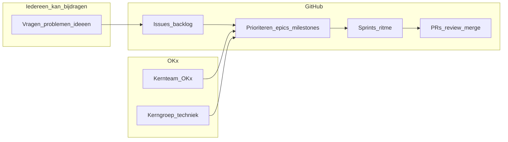

Zie ook **§3** (governance), **§4** (epics/issues/sprints) en **§5** (issues in GitHub en templates).

---

## 3. Governance en rollen (samenvatting)

Zie [`CONTRIBUTING.md`](../CONTRIBUTING.md). In het kort:

- **Iedereen** mag issues en PR’s; **OKx-teamleden** mergen (tenzij anders afgesproken).
- **Kernteam OKx** en **kerngroep techniek** dragen bij; grote impact → extra **SI-team**-review (Teams).

---

## 4. Projectplanning: epics → issues → uitvoering

| Laag | Wat het is | Voorbeeld |
|------|------------|-----------|
| **Epic / thema** | Grote hap of doellijn (bord/label) | “Informatiestroom SVS ↔ examensysteem” |
| **Issue** | Concrete taak of voorstel | “Paragraaf X aanvullen” |
| **PR** | Wijziging in de repo | Gekoppeld aan `#123` |

**Sprints**: soms **sprintachtige periodes**; **duur variabel** — ritme en focus, geen strikt Scrum.

**Tip**: PR’s koppelen aan issues (`Fixes #…` / `See also #…`).

---

## 5. Issues aanmaken in GitHub (de website waar je nu op zit)

Lees je dit document **op GitHub**? Dan zit je al in de **webinterface** van de repository: hier staan de tabbladen **Code**, **Issues**, **Pull requests**, enzovoort. GitHub hoeft niet “eng” te zijn: **alleen al een issue aanmaken** is een waardevolle bijdrage — je levert gestructureerde input aan zonder meteen aan code of Git te hoeven.

### Stappen (kort)

1. Open de repository op GitHub (de pagina met code en tabbladen bovenaan).
2. Klik op het tabblad **Issues**.
3. Klik op **New issue** (of de vergelijkbare knop).


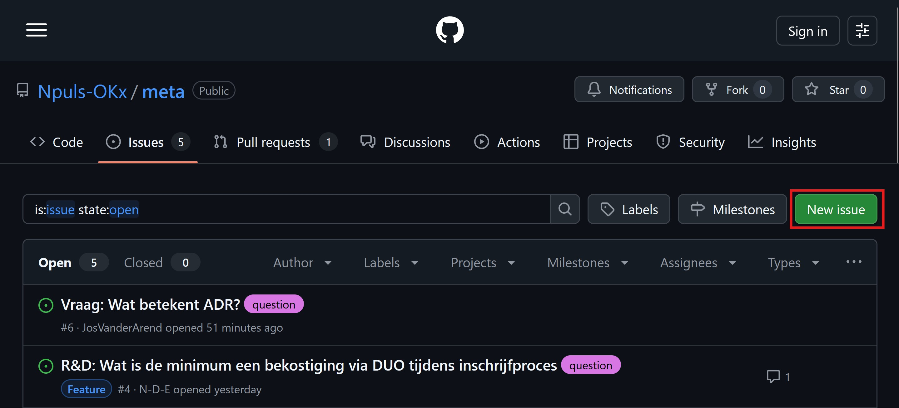

Wanneer je geen Github account hebt ingelogd, wordt je nu gevraagd in te loggen. Heb je geen Github account? Maak er dan een aan.

GitHub opent dan meestal **geen leeg tekstveld**, maar een **keuzescherm met sjablonen** (*issue templates*). Dat is expres zo ingesteld.

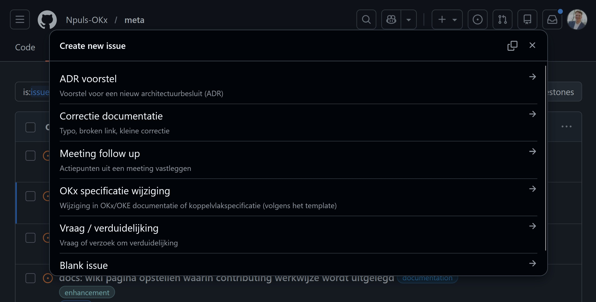


### Hoe werken issue templates?

- Elk **sjabloon** hoort bij een **type melding** (bijvoorbeeld documentatie corrigeren, een specificatievoorstel, vervolg op een meeting).
- Je ziet **vaste kopjes en vragen** in het formulier; daar vul jij je antwoorden in.
- Zo vergeet je minder snel belangrijke informatie en kan het OKx-team **hetzelfde overzicht** bij elke melding.
- In deze repo staat `blank_issues_enabled: false` in [`.github/ISSUE_TEMPLATE/config.yml`](../.github/ISSUE_TEMPLATE/config.yml): er is dus **bewust geen “leeg issue”** — je **kiest een passend template**. In hetzelfde scherm kan ook een **contactlink** staan (e-mail) als dat beter past dan een issue.

**Templates in OKx-meta** (map [.github/ISSUE_TEMPLATE/](../.github/ISSUE_TEMPLATE/)), onder andere:

| Sjabloon (zoals in GitHub) | Wanneer denkbaar |
|----------------------------|------------------|
| **Correctie documentatie** | Tikfout, verouderde zin, kapotte link in `doc/` of README. |
| **OKx specificatie wijziging** | Inhoudelijk voorstel voor specificatie of koppelvlak. |
| **ADR voorstel** | Een architectuurkeuze vastleggen of wijzigen (`architecture/dr/`). |
| **Meeting follow up** | Concreet vervolg op een besproken punt (koppel aan meeting of notulen). |
| **Vraag / verduidelijking** | Iets is onduidelijk; je wilt uitleg of richting voordat je een PR maakt. |

### Wanneer issue, wanneer iets anders?

- **Issue eerst** bij inhoud, richting of afstemming — en wanneer je **alleen** wilt signaleren of bespreken zonder direct bestanden te wijzigen.
- **Discussions** (als die aan staan) zijn **breder**; **issues** zijn bedoeld voor **concrete vervolgstappen** en zijn goed te koppelen aan PR’s en milestones.
- Ga je zelf wijzigingen in de repo voorstellen? Koppel je PR later aan het issue (`Fixes #…` / `See also #…`). Zie ook [`CONTRIBUTING.md`](../CONTRIBUTING.md).

Vul nu je Issue, wijziging of vraag naar wens in. Hoe meer detail, hoe beter! De templates dienen ter referentie.

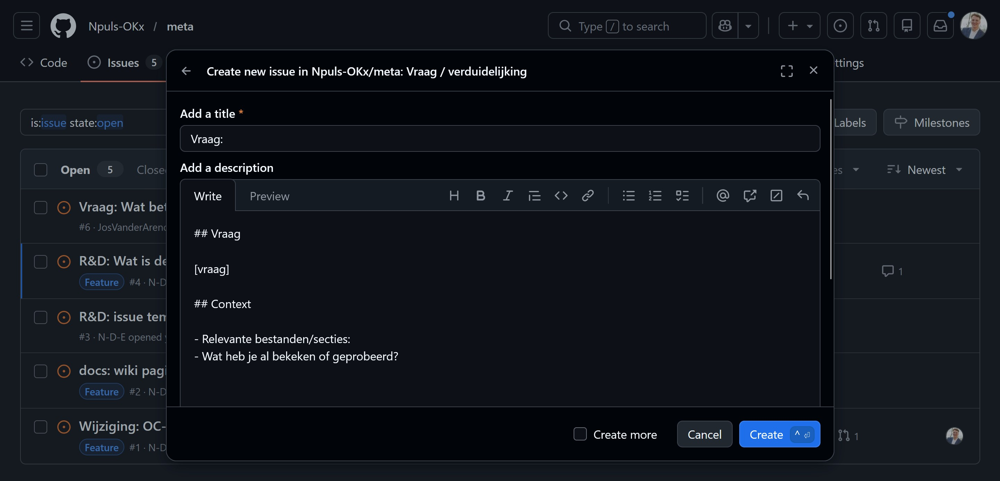

---

## 6. Vanaf hier: actief bijdragen (iets technischer — maak je geen zorgen)

Tot **§5** kon je alles in de **browser** doen. **Vanaf dit deel** gaan we ervan uit dat je misschien ook **bestanden** wilt wijzigen of **concrete tekstvoorstellen** wilt aanleveren. Dat klinkt soms als “veel techniek”, maar het valt mee: **je raakt de stabiele hoofdlijn niet zomaar kapot**. Jouw wijzigingen komen op een **eigen branch** en worden pas **na review** (via een **pull request**) onderdeel van de officiële lijn — zie **§9** (branchstrategie) en **§10** (PR).

### Twee manieren (kies wat bij je past)

| Manier | Wat je doet |
|--------|-------------|
| **A. Git op je computer** | Je installeert **Git**, **klon**t de repository naar je pc en werkt met een editor (bijvoorbeeld VS Code of Cursor). Handig voor langere teksten en veel bestanden. |
| **B. Alleen GitHub in je browser** | Je opent een bestand op GitHub, klikt op **bewerken** (potlood), of voegt een bestand toe. GitHub vraagt om een **commit op een nieuwe branch** — handig voor kleine wijzigingen **zonder** Git op je laptop. |

**Git installeren (manier A)** — download voor jouw besturingssysteem op [git-scm.com](https://git-scm.com). Controleer daarna in een terminal met `git --version` of het werkt.

**Repository klonen (manier A)** — op de repo-pagina: groene knop **Code** → kopieer de **HTTPS**-URL. In een terminal:

```bash
git clone <plak-hier-de-HTTPS-URL-van-de-repo>.git
cd OKx-meta
```

(De mapnaam volgt de repo-naam; `OKx-meta` is gebruikelijk voor deze kennisrepo.)

### Use cases om rustig mee te oefenen (jij maakt er screenshots bij)

*Je hoeft niet bang te zijn dat je het OKx-team “kapot maakt”: wijzigingen op een **eigen branch** worden pas echt onderdeel van de repo **na merge** door het team.*

1. **Typfout of kleine tekstfix** — Open `README.md` of een bestand onder `doc/` op GitHub → **Edit** (potlood) → kies **Create a new branch for this commit** → kleine aanpassing → commit. *Screenshot-idee: potlood-icoon + optie voor nieuwe branch.*
2. **Nieuw markdown-bestand** — Tab **Code**, map `doc/` → **Add file** → *Create new file* → inhoud typen → commit op een **nieuwe branch**. *Screenshot-idee: “Add file” en het pad naar het nieuwe bestand.*
3. **Iets uitproberen** — Werk in een concept-branch aan een paragraaf; open een PR als je feedback wilt. *Screenshot-idee: “Compare & pull request” of het branch-dropdown na je commit.*

Lees verder in **§7** en **§8** voor **dezelfde flow met Git op de commandoregel** en voor **wat een branch precies is**.

---

## 7. Git lokaal: clone, werken, remote, commit en push

**In Jip- en Jannetaal:** jouw **laptop** heeft een **map** met bestanden. **Git** onthoudt daar **versies** van. **GitHub** is de **kopie in de cloud**. **`origin`** is de naam voor “die cloud-kopie” waarnaar jij meestal **pusht**. Zo kunnen anderen (en jijzelf op een andere pc) dezelfde geschiedenis zien.

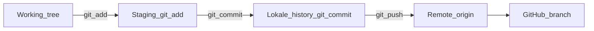

### Eenmalig: repo binnenhalen

```bash
git clone <HTTPS-URL-van-de-repo>.git
cd OKx-meta
```

### Dagelijks: actuele `dev` ophalen en eigen branch

```bash
git checkout dev
git pull origin dev
git checkout -b feature/jouw-onderwerp
```

Bewerk bestanden in je editor. Controleer wat er gewijzigd is:

```bash
git status
git diff
```

### Opslaan en naar GitHub sturen

```bash
git add .
git commit -m "Korte duidelijke boodschap"
git push -u origin feature/jouw-onderwerp
```

- **`git add`** — “deze wijzigingen wil ik in de volgende commit”.
- **`git commit`** — legt een momentopname vast **op jouw computer**.
- **`git push`** — stuurt die commits naar **GitHub** (`origin`), naar de branch met dezelfde naam.

### Hoe komen jouw verbeteringen bij OKx terecht?

**Alleen pushen is niet genoeg** om iets “officieel” te maken: daarna maak je een **pull request** (**§10**) naar het team. Het team **reviewt** en **merget** (meestal naar **`dev`**, zie **§9**). Zo blijft de kennisbasis **beheersbaar** en **traceerbaar**.

Handige commando’s: `git status` · `git diff` · `git log --oneline -10`.

**Fork?** Als je **geen** push-recht op de canonieke repo hebt, clone je vaak een **fork**; dan is `origin` jouw fork en voeg je `upstream` toe — volledig stappenplan in **§11**.

---

## 8. Branches: wat is dat, en hoe maak je er een?

Een **branch** is een **naam** voor een lijn van commits naast andere lijnen. Zo kun je experimenteren terwijl **`main`** (of **`dev`**) rustig blijft staan. Later voeg je lijnen samen via een **merge** (vaak via een **PR**).

### Op de command line (na §7)

Vanaf bijgewerkte `dev`:

```bash
git checkout dev
git pull origin dev
git checkout -b feature/mijn-voorstel
# ... wijzigingen, git add, git commit ...
git push -u origin feature/mijn-voorstel
```

Gebruik een **duidelijke branche naam** (`feature/…`, `fix/…`) — sluit aan bij **§9**.

### In de GitHub-webinterface

1. Bovenin de bestandsweergave: dropdown met **branch** (vaak `main` of `dev`).
2. Tik een **nieuwe naam** (bijvoorbeeld `feature/doc-readme-typos`) en bevestig **Create branch** — of gebruik het branch-menu vanuit een bestand.
3. Open een bestand → **Edit** (potlood) → onderaan: kies **Create a new branch for this commit** → commit.
4. GitHub biedt daarna vaak **Compare & pull request** aan (**§10**).

Zo kun je **spelen en aanpassen in de browser** zonder Git op je pc — wél altijd op een **eigen branch**, niet rechtstreeks op de beschermde hoofdlijn.

---

## 9. Branchstrategie: `main`, `dev`, feature branches, tags

Dit is de **teamsafspraak** over **welke branch waarvoor** dient. **§8** legde uit **hoe** je praktisch een branch maakt; hieronder **waar** je op wilt bouwen en **waarheen** pull requests gaan.

| Branch / ref | Rol |
|--------------|-----|
| **`main`** | Stabiele **release**-lijn. |
| **`dev`** | Integratie **volgende release**. |
| **`feature/…`** | Vanaf **`dev`**, PR terug naar **`dev`**. |
| **Tags** (op `main`) | Release-labels (bijv. `v1.0.0`). |

**Hotfix**: branch vanaf `main` → PR naar `main` én terug naar `dev`.

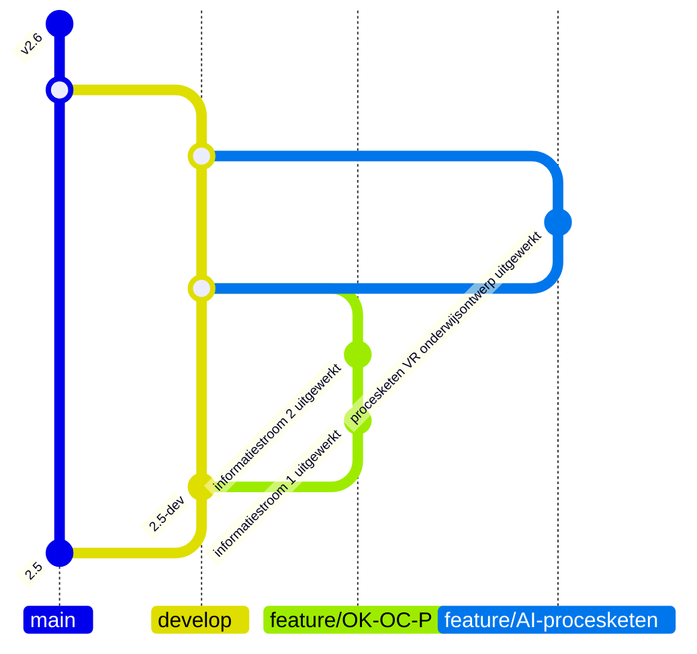

### Stroom van werk (PR’s)

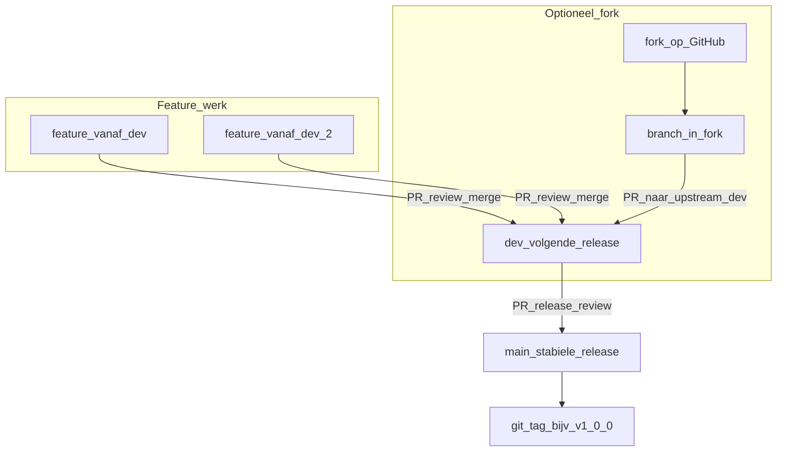

**Let op**: bestaat `dev` nog niet? Overleg met team of branch tijdelijk vanaf `main`. Geen ongecoördineerde directe commits op `main`.

---

## 10. Pull requests (GitHub): jouw wijzigingen terug naar het OKx-team

**In Jip- en Jannetaal:** een **pull request** (PR) is een **verzoek** aan het OKx-team: “Willen jullie **mijn branch** bekijken en — als het goed is — **samenvoegen** met de officiële lijn?” Jouw werk staat dan **apart** tot iemand het **reviewt** en **merget**. Pas daarna hoort het bij de **echte** versie van de kennisrepo (via **`dev`** en uiteindelijk releases op **`main`**, zie **§9**).

**Waarom doen we dit zo?** Zo kan iedereen **voorstellen** doen, terwijl de **kwaliteit en samenhang** bewaakt blijven. Je “breekt” niets: zonder merge blijft jouw idee een **voorstel** op een branch.

### In de webinterface (na push of na browser-commit)

1. Ga naar de repository op GitHub. Vaak verschijnt een banner **Compare & pull request** — klik daarop.
2. Zo niet: tab **Pull requests** → **New pull request**. Kies **base** (meestal **`dev`**) en **compare** (jouw `feature/…`-branch).
3. Vul **titel** en **beschrijving** in. GitHub kan [`.github/PULL_REQUEST_TEMPLATE.md`](../.github/PULL_REQUEST_TEMPLATE.md) tonen als startpunt — volg de vragen waar dat helpt.
4. Koppel issues: `Fixes #123` of `See also #45` in de beschrijving.
5. **Create pull request**. Het team **reviewt**; jij verwerkt eventuele feedback met nieuwe commits op dezelfde branch.
6. Na **merge** kun je je branch opruimen (lokaal en/of op GitHub).

### Checklist (kort)

1. Wijzigingen op een **branch** (niet rechtstreeks op `main`).
2. **Push** naar GitHub (of commit in de browser op een nieuwe branch — zie **§6** en **§8**).
3. **Pull request** openen → base **`dev`** (tenzij **hotfix** → `main`, zie **§9**).
4. Beschrijving + **issues** linken.
5. **Review** + feedback verwerken.
6. Na **merge**: branch opruimen (optioneel maar netjes).

**Grote impact**: ook **SI-team** (Teams) — zie [`CONTRIBUTING.md`](../CONTRIBUTING.md).

---

## 11. Fork (geen schrijfrecht op upstream)

Als je **geen direct push-recht** hebt op de canonieke repo, **fork** je die op GitHub naar **jouw eigen kopie**. Dan is **`origin`** in Git meestal **jouw fork**; je voegt **`upstream`** toe voor de officiële repo. Je PR gaat van **jouw fork** naar **upstream `dev`** (of `main` bij hotfix).

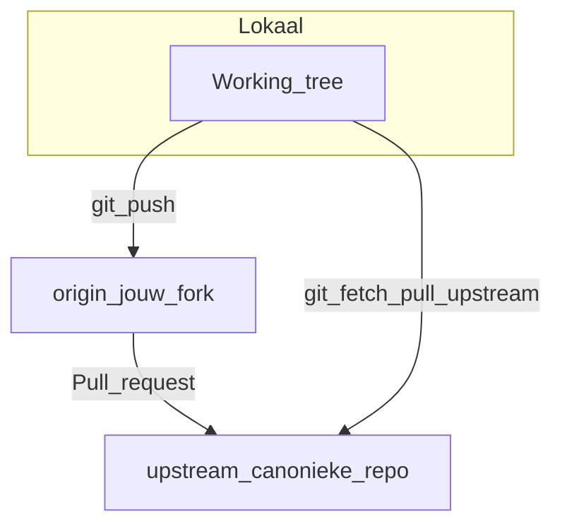

1. **Fork** op GitHub → clone **jouw fork** (`git clone` van **jouw** fork-URL).
2. **`upstream`** toevoegen (eenmalig), bijvoorbeeld:

   ```bash
   git remote add upstream <HTTPS-URL-van-de-canonieke-repo>.git
   git fetch upstream
   ```

3. Branch vanaf bijgewerkte `dev` (of `main` na overleg), commit, **push naar `origin`** (jouw fork).
4. Op GitHub: **Pull request** van jouw fork-branch naar **upstream `dev`** (of `main` bij hotfix).

[GitHub — Working with forks](https://docs.github.com/en/pull-requests/collaborating-with-pull-requests/working-with-forks)

---

# Deel B — Cursor en agents

## 12. IDE, Cursor en AI-agents (basis)

### Wat is een IDE?

Een **IDE** (*Integrated Development Environment*) is een **programmeeromgeving** waarin je in één venster kunt **bewerken** (teksteditor), **uitvoeren** (terminal), **versiebeheer** (Git) en vaak **debuggen** en **extensies** gebruiken. Voor deze repo werk je vooral met **markdown**, **mappen** en **Git** — geen volledige applicatie-build nodig, maar dezelfde werkwijze.

### Hoe verschilt Cursor van een “gewone” editor?

| | Klassieke editor (bv. kladblok, basis tekst) | **Cursor** |
|---|---------------------------------------------|------------|
| **Focus** | Vooral typen en opslaan | Typen + **AI in de workflow** |
| **Context** | Jij opent zelf bestanden | Je kunt de **repo** of **mappen** aan een gesprek koppelen (**`@`**-mentions) |
| **Herhaling** | Zelf stappen en templates onthouden | **Commands** (**`/`**) met vaste instructies uit [`.cursor/commands/`](../.cursor/commands/) |
| **Basis** | — | Gebouwd op **VS Code** — herkenbare Git- en terminalbediening |

Kortom: Cursor is een IDE waarin **taalmodellen** helpen bij lezen, schrijven en structureren. **Jij** bepaalt wat uiteindelijk in Git komt.

### Wat is een agent (in Cursor)?

Een **agent** is hier de **AI-assistent** die in **stappen** met je project kan werken: bestanden **inzien**, **tekstvoorstellen** doen, en — afhankelijk van modus en instellingen — **wijzigingen** of **terminalacties** uitvoeren na jouw **bevestiging** waar dat zo is ingesteld.

- Het is **geen** zelfstandig programma met eigen doelen: jij geeft **doelen**, **context** en **grenzen**.
- **Chat / Composer**: kortere interacties.
- **Agent** (naar gelang Cursor-versie): meer “doorloop de codebase en werk dit bij” — nog steeds onder jouw regie.

Voor **OKx-meta**: behandel alles als **concept** tot jij (of de reviewer) het **inhoudelijk** goedkeurt — ook i.r.t. privacy en publieke repo.

### Van agent naar slash-commands

**Commands** zijn opgeslagen **opdrachtteksten** (markdown in [`.cursor/commands/`](../.cursor/commands/)). Je start ze met **`/`** in de chat. Zo hoef je niet elke keer dezelfde lange instructie te typen — handig voor **documentatie** en **vaste workflows**.

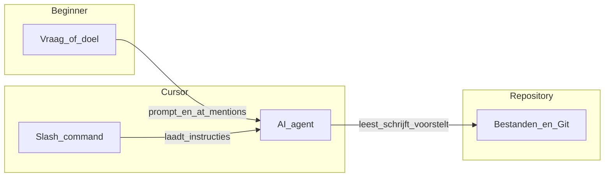

**Volgende secties**: **rules**, **`/`** en **`@`** in detail, daarna de **aanbevolen keten** (`/prep-repo-context` → …), **Cursor-praktijk** en tot slot **waar de output landt** (**§16** — agent-artifacten).

---

## 13. Cursor: rules, `/` commands, `@` context

| Bron | Rol |
|------|-----|
| [`.cursor/rules/`](../.cursor/rules/) (`*.mdc`) | **Rules**: voorwaarden voor de agent (o.a. `globs`, `alwaysApply`). |
| [`.cursor/commands/`](../.cursor/commands/) (`*.md`) | **Commands**: type **`/`** in de chat. Bestandsnaam zonder `.md` ≈ command-naam. |
| **`@`** | Bestanden of mappen aan het gesprek koppelen. |

Documentatie is zelden het leukste werk — een goed **`/`**-command en duidelijke **`@`**-context besparen tijd. **Controleer** altijd zelf de output.

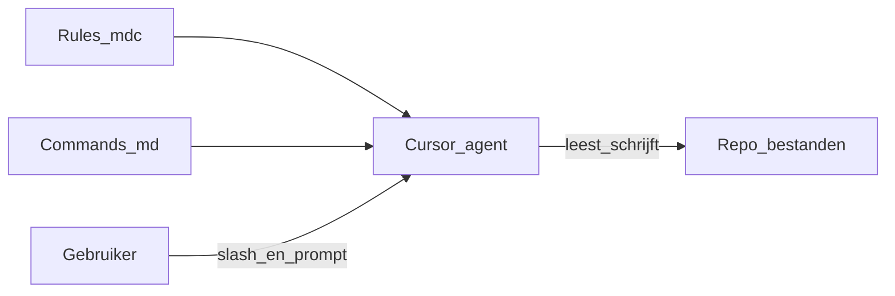

---

## 14. Agent workflows (aanbevolen keten)

1. **`/prep-repo-context`** — eerst de repo begrijpen: [`.cursor/commands/prep-repo-context.md`](../.cursor/commands/prep-repo-context.md) (bestand mag je ook **`@`**-en).
2. **`/project-aanvraag`** — iteratieve projectaanvraag → **`architecture/agent-artifacts/project-requests/`** (frontmatter + human authors). Zie [`.cursor/commands/project-aanvraag.md`](../.cursor/commands/project-aanvraag.md).
3. **`/maak-plan`** — featureplan uit dat document → **`architecture/agent-artifacts/feature-plans/`** (`$ARGUMENTS`: pad bronbestand).
4. **`/ontwerp-document`** — ontwerp per feature → **`architecture/agent-artifacts/design-docs/`** (`$ARGUMENTS`: welke feature / welk plan). Zie [`.cursor/commands/ontwerp-document.md`](../.cursor/commands/ontwerp-document.md).

**Details** over mappen, bestandsnamen, YAML-frontmatter en asynchroon verder werken: **§16**.

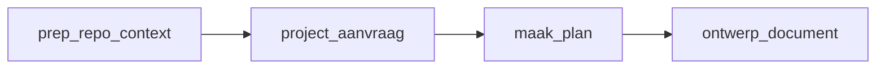

**Commands verbeteren?** Dien een **pull request** in en vraag om **review** — [`CONTRIBUTING.md`](../CONTRIBUTING.md).

---

## 15. Cursor IDE praktisch (Git, terminal, bestanden)

- **Source Control** (tak-icoon links): dezelfde **commit / push**-flow als in [§7](#7-git-lokaal-clone-werken-remote-commit-en-push) — visueel naast de terminal.
- **Terminal**: dezelfde `git`-commando’s als in [§7](#7-git-lokaal-clone-werken-remote-commit-en-push).
- **Bestanden**: nieuwe of gewijzigde files in de **juiste map** (o.a. `architecture/agent-artifacts/`, `doc/`), daarna stagen en committen. Zie **§16** voor conventies rond agent-artifacten.
- **Grote binaries**: eerst **afstemmen** met het team (LFS of andere afspraak).
- **Kennis-repo**: AI-suggesties **inhoudelijk controleren** (juistheid, privacy, geen vertrouwelijke data).
- **PlantUML**: kan naast **Mermaid**; op **GitHub** renderen we **Mermaid** in markdown betrouwbaar.

---

# Deel C — Agent-artifacten (traceerbaarheid)

## 16. Waar landen plannen en ontwerpdocumenten?

Output van de slash-commands voor **project → plan → design** wordt opgeslagen onder [`architecture/agent-artifacts/`](../architecture/agent-artifacts/):

| Map | Command |
|-----|---------|
| `project-requests/` | `/project-aanvraag` |
| `feature-plans/` | `/maak-plan` |
| `design-docs/` | `/ontwerp-document` |

Zie [`architecture/agent-artifacts/README.md`](../architecture/agent-artifacts/README.md) voor **bestandsnamen** (`YYYYMMDD_HHmm_slug.md`) en **verplichte YAML frontmatter**: `created`, `updated`, **`human_authors`** (mensen die verantwoordelijk zijn — geen “de AI”), `agent_command`, optioneel `related_issues` en `source_paths`.

**Asynchroon**: na elke sessie **`updated`** bijwerken; optioneel een korte **sessiestatus** onderaan zodat een volgende mens/agent verder kan.

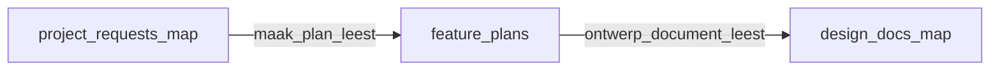

---

# Deel D — Verdieping en contact

## 17. Ontwerp- en standaardprincipes

**Design first**, **OEAPI**, **machine-interpreteerbare formaten**, **show don't tell / diagram-first**: [`architecture/docs/principes.md`](../architecture/docs/principes.md).

---

## 18. Referenties

- **Git**: [Pro Git](https://git-scm.com/book/en/v2) — [NL (deels)](https://git-scm.com/book/nl/v2)
- **GitHub**: [Getting started](https://docs.github.com/en/get-started)
- **Branches / PR / Issues**: [Branches](https://docs.github.com/en/pull-requests/collaborating-with-pull-requests/proposing-changes-to-your-work-with-pull-requests/about-branches) · [PR](https://docs.github.com/en/pull-requests/collaborating-with-pull-requests/proposing-changes-to-your-work-with-pull-requests/about-pull-requests) · [Issues](https://docs.github.com/en/issues/tracking-your-work-with-issues/about-issues)
- **OEAPI**: [openonderwijsapi.nl](https://openonderwijsapi.nl/) — [v6.0](https://openonderwijsapi.nl/v6.0/)
- **Cursor**: [docs.cursor.com](https://docs.cursor.com/)
- **Collaborative design (Agile, achtergrond)**: [Atlassian — collaborative design in agile teams](https://www.atlassian.com/agile/design/collaborative-design-in-agile-teams-video)

---

## 19. Contact

**niek.derksen@surf.nl** — zie ook [`CONTRIBUTING.md`](../CONTRIBUTING.md).
