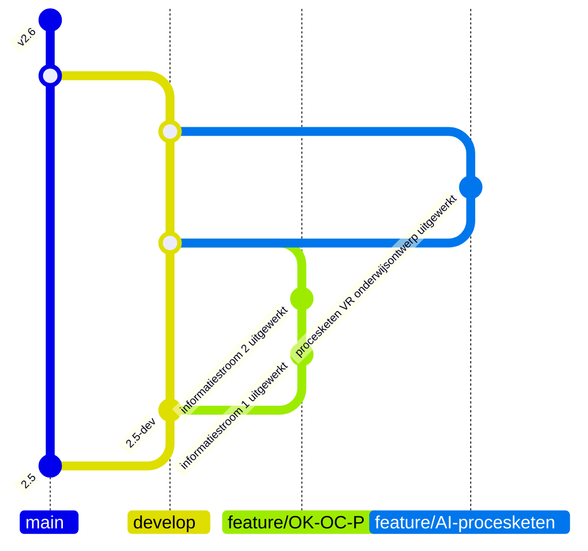
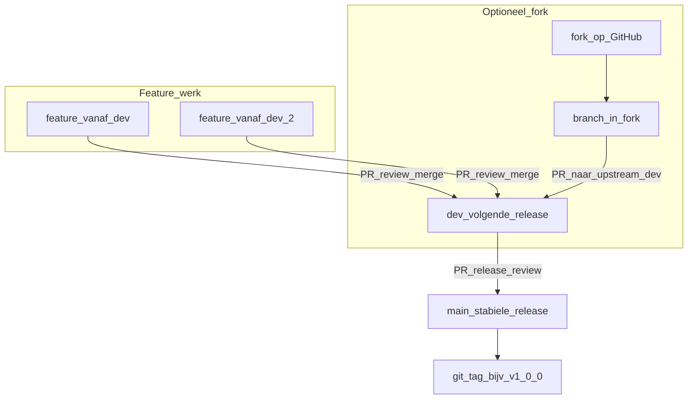
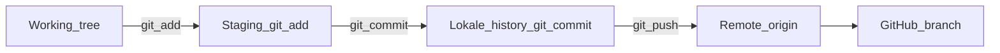
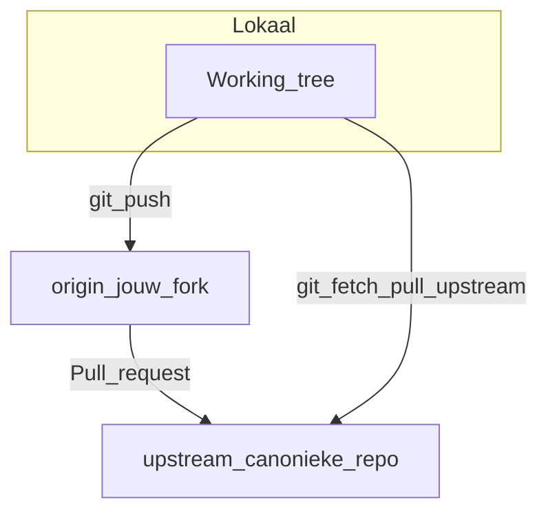
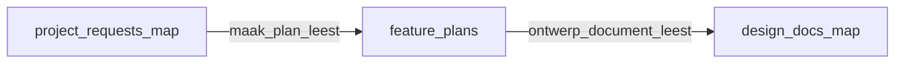
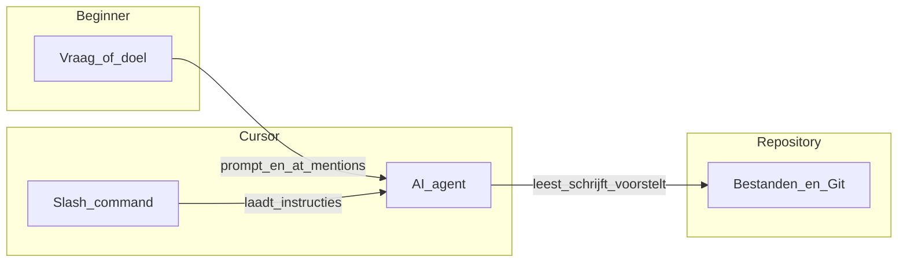
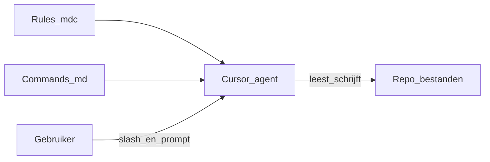
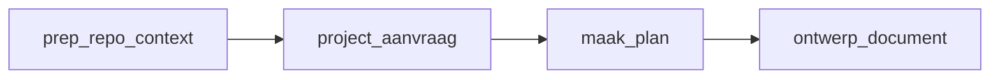

# Bijdragen aan OKx-meta — handleiding voor beginners

Dit document staat **in deze repository** (onder `doc/`), zodat het mee versioneert en later eenvoudig mee kan bij een eventuele migratie (bijv. naar self-hosted GitLab). Concepten als branches, issues en merge requests zijn daar hetzelfde; alleen de knoppen en URL’s verschillen.

**Kort**: lees eerst [`CONTRIBUTING.md`](../CONTRIBUTING.md) voor governance.

Neem ook [`Privacy-meetings-en-transcriptie.md`](Privacy-meetings-en-transcriptie.md) door als je **deelneemt aan OKx-meetings** waarvan inhoud in deze repo kan terugkomen (opname, AI-transcriptie, publiek karakter).

**Leeswijzer**: eerst **Git & GitHub** (samenwerking in de repo), daarna **agent-artifacten** en **Cursor/agents**, tot slot **principes** en **referenties**.

---

## 1. Woordenlijst (heel kort)

| Term | Betekenis |
|------|-----------|
| **Repository (repo)** | De map met alle bestanden + de geschiedenis van wijzigingen. |
| **Git** | Programma dat wijzigingen bijhoudt (lokaal op je computer). |
| **GitHub** | Website waar de repo staat: issues, pull requests, review, projectborden. |
| **Branch** | Een “tak” van de code/docs om veilig te experimenteren zonder `main` direct te wijzigen. |
| **Commit** | Een opgeslagen bundel wijzigingen met een korte boodschap. |
| **Pull request (PR)** | Verzoek om jouw branch te laten samenvoegen; anderen kunnen reviewen. |
| **Issue** | Een ticket: vraag, bug, voorstel of taak — met nummer (`#12`) om te linken. |
| **Cursor** | Editor (gebaseerd op VS Code) met AI-ondersteuning; ondersteunt Git en terminals. |
| **IDE** | Integrated Development Environment: editor + terminal + Git (en meer) in één programma. |
| **Agent** | In Cursor: de AI-assistent die in stappen met je repo werkt — jij houdt de regie. |

---

# Deel A — Git en GitHub

## 2. OKx-projectaanpak en collaborative design

In [`OKx_Projectoverzicht.md`](OKx_Projectoverzicht.md) staat de **projectaanpak**: **begrijpen** → **ontwerpen** → **realiseren**, met samenwerking tussen **sector** en **leveranciers** en **MOKA-koppelvlakspecificaties** als kader.

**Collaborative design** in OKx:

- Vragen en ideeën in **issues**; uitwerkingen in **branches** + **pull requests**.
- Belangrijke besluiten als **ADR’s** in `architecture/dr/` waar dat past.

---

## 3. Governance en rollen (samenvatting)

Zie [`CONTRIBUTING.md`](../CONTRIBUTING.md). In het kort:

- **Iedereen** mag issues en PR’s; **OKx-teamleden** mergen (tenzij anders afgesproken).
- **Kernteam OKx** en **kerngroep techniek** dragen bij; grote impact → extra **SI-team**-review (Teams).

---

## 4. Projectplanning: epics → issues → uitvoering

| Laag | Wat het is | Voorbeeld |
|------|------------|-----------|
| **Epic / thema** | Grote hap of doellijn (bord/label) | “Informatiestroom SVS ↔ examensysteem” |
| **Issue** | Concrete taak of voorstel | “Paragraaf X aanvullen” |
| **PR** | Wijziging in de repo | Gekoppeld aan `#123` |

**Sprints**: soms **sprintachtige periodes**; **duur variabel** — ritme en focus, geen strikt Scrum.

**Tip**: PR’s koppelen aan issues (`Fixes #…` / `See also #…`).

---

## 5. Issues: wanneer wat?

- **Issue eerst** bij inhoud/richting/afstemming.
- **Issue templates**: `.github/ISSUE_TEMPLATE/`.
- **Discussions** = breed; **issues** = concrete vervolgstappen.

---

## 6. Branchstrategie: `main`, `dev`, feature branches, tags

| Branch / ref | Rol |
|--------------|-----|
| **`main`** | Stabiele **release**-lijn. |
| **`dev`** | Integratie **volgende release**. |
| **`feature/…`** | Vanaf **`dev`**, PR terug naar **`dev`**. |
| **Tags** (op `main`) | Release-labels (bijv. `v1.0.0`). |

**Hotfix**: branch vanaf `main` → PR naar `main` én terug naar `dev`.



### Stroom van werk (PR’s)



**Let op**: bestaat `dev` nog niet? Overleg met team of branch tijdelijk vanaf `main`. Geen ongecoördineerde directe commits op `main`.

---

## 7. Pull requests (GitHub)

1. Wijzigingen op een **branch** (niet op `main`).
2. **Push**.
3. **Pull request** → base **`dev`** (tenzij hotfix → `main`).
4. Beschrijving + **issues** linken.
5. **Review** + feedback verwerken.
6. Na **merge**: branch opruimen.

**Grote impact**: ook **SI-team** (Teams) — zie [`CONTRIBUTING.md`](../CONTRIBUTING.md).

---

## 8. Git lokaal: werkmap, commit, push, remote



**Fork**: **`origin`** = jouw fork; **`upstream`** = canonieke repo. PR: fork → upstream `dev`.



```bash
git checkout dev && git pull && git checkout -b feature/jouw-naam
# ... wijzigingen ...
git add . && git commit -m "Onderwerp" && git push -u origin feature/jouw-naam
```

`git status` · `git diff` · `git log --oneline -10` → daarna PR naar **`dev`**.

---

## 9. Fork (geen schrijfrecht op upstream)

1. Fork op GitHub → clone **jouw fork**.
2. **`upstream`** toevoegen (eenmalig).
3. Branch, commit, push naar **jouw fork**.
4. PR naar **upstream `dev`** (of `main` bij hotfix).

[GitHub — Working with forks](https://docs.github.com/en/pull-requests/collaborating-with-pull-requests/working-with-forks)

---

# Deel B — Agent-artifacten (traceerbaarheid)

## 10. Waar landen plannen en ontwerpdocumenten?

Output van de slash-commands voor **project → plan → design** wordt opgeslagen onder [`architecture/agent-artifacts/`](../architecture/agent-artifacts/):

| Map | Command |
|-----|---------|
| `project-requests/` | `/project-aanvraag` |
| `feature-plans/` | `/maak-plan` |
| `design-docs/` | `/ontwerp-document` |

Zie [`architecture/agent-artifacts/README.md`](../architecture/agent-artifacts/README.md) voor **bestandsnamen** (`YYYYMMDD_HHmm_slug.md`) en **verplichte YAML frontmatter**: `created`, `updated`, **`human_authors`** (mensen die verantwoordelijk zijn — geen “de AI”), `agent_command`, optioneel `related_issues` en `source_paths`.

**Asynchroon**: na elke sessie **`updated`** bijwerken; optioneel een korte **sessiestatus** onderaan zodat een volgende mens/agent verder kan.



---

# Deel C — Cursor en agents

## 11. IDE, Cursor en AI-agents (basis)

### Wat is een IDE?

Een **IDE** (*Integrated Development Environment*) is een **programmeeromgeving** waarin je in één venster kunt **bewerken** (teksteditor), **uitvoeren** (terminal), **versiebeheer** (Git) en vaak **debuggen** en **extensies** gebruiken. Voor deze repo werk je vooral met **markdown**, **mappen** en **Git** — geen volledige applicatie-build nodig, maar dezelfde werkwijze.

### Hoe verschilt Cursor van een “gewone” editor?

| | Klassieke editor (bv. kladblok, basis tekst) | **Cursor** |
|---|---------------------------------------------|------------|
| **Focus** | Vooral typen en opslaan | Typen + **AI in de workflow** |
| **Context** | Jij opent zelf bestanden | Je kunt de **repo** of **mappen** aan een gesprek koppelen (**`@`**-mentions) |
| **Herhaling** | Zelf stappen en templates onthouden | **Commands** (**`/`**) met vaste instructies uit [`.cursor/commands/`](../.cursor/commands/) |
| **Basis** | — | Gebouwd op **VS Code** — herkenbare Git- en terminalbediening |

Kortom: Cursor is een IDE waarin **taalmodellen** helpen bij lezen, schrijven en structureren. **Jij** bepaalt wat uiteindelijk in Git komt.

### Wat is een agent (in Cursor)?

Een **agent** is hier de **AI-assistent** die in **stappen** met je project kan werken: bestanden **inzien**, **tekstvoorstellen** doen, en — afhankelijk van modus en instellingen — **wijzigingen** of **terminalacties** uitvoeren na jouw **bevestiging** waar dat zo is ingesteld.

- Het is **geen** zelfstandig programma met eigen doelen: jij geeft **doelen**, **context** en **grenzen**.
- **Chat / Composer**: kortere interacties.
- **Agent** (naar gelang Cursor-versie): meer “doorloop de codebase en werk dit bij” — nog steeds onder jouw regie.

Voor **OKx-meta**: behandel alles als **concept** tot jij (of de reviewer) het **inhoudelijk** goedkeurt — ook i.r.t. privacy en publieke repo.

### Van agent naar slash-commands

**Commands** zijn opgeslagen **opdrachtteksten** (markdown in [`.cursor/commands/`](../.cursor/commands/)). Je start ze met **`/`** in de chat. Zo hoef je niet elke keer dezelfde lange instructie te typen — handig voor **documentatie** en **vaste workflows**.



**Volgende secties**: **rules**, **`/`** en **`@`** in detail, daarna de **aanbevolen keten** (`/prep-repo-context` → …).

---

## 12. Cursor: rules, `/` commands, `@` context

| Bron | Rol |
|------|-----|
| [`.cursor/rules/`](../.cursor/rules/) (`*.mdc`) | **Rules**: voorwaarden voor de agent (o.a. `globs`, `alwaysApply`). |
| [`.cursor/commands/`](../.cursor/commands/) (`*.md`) | **Commands**: type **`/`** in de chat. Bestandsnaam zonder `.md` ≈ command-naam. |
| **`@`** | Bestanden of mappen aan het gesprek koppelen. |

Documentatie is zelden het leukste werk — een goed **`/`**-command en duidelijke **`@`**-context besparen tijd. **Controleer** altijd zelf de output.



---

## 13. Agent workflows (aanbevolen keten)

1. **`/prep-repo-context`** — eerst de repo begrijpen: [`.cursor/commands/prep-repo-context.md`](../.cursor/commands/prep-repo-context.md) (bestand mag je ook **`@`**-en).
2. **`/project-aanvraag`** — iteratieve projectaanvraag → **`architecture/agent-artifacts/project-requests/`** (frontmatter + human authors). Zie [`.cursor/commands/project-aanvraag.md`](../.cursor/commands/project-aanvraag.md).
3. **`/maak-plan`** — featureplan uit dat document → **`architecture/agent-artifacts/feature-plans/`** (`$ARGUMENTS`: pad bronbestand).
4. **`/ontwerp-document`** — ontwerp per feature → **`architecture/agent-artifacts/design-docs/`** (`$ARGUMENTS`: welke feature / welk plan). Zie [`.cursor/commands/ontwerp-document.md`](../.cursor/commands/ontwerp-document.md).



**Commands verbeteren?** Dien een **pull request** in en vraag om **review** — [`CONTRIBUTING.md`](../CONTRIBUTING.md).

---

## 14. Cursor IDE praktisch (Git, terminal, bestanden)

- **Source Control** (tak-icoon links): dezelfde **commit / push**-flow als in [§8](#8-git-lokaal-werkmap-commit-push-remote) — visueel naast de terminal.
- **Terminal**: dezelfde `git`-commando’s als in [§8](#8-git-lokaal-werkmap-commit-push-remote).
- **Bestanden**: nieuwe of gewijzigde files in de **juiste map** (o.a. `architecture/agent-artifacts/`, `doc/`), daarna stagen en committen.
- **Grote binaries**: eerst **afstemmen** met het team (LFS of andere afspraak).
- **Kennis-repo**: AI-suggesties **inhoudelijk controleren** (juistheid, privacy, geen vertrouwelijke data).
- **PlantUML**: kan naast **Mermaid**; op **GitHub** renderen we **Mermaid** in markdown betrouwbaar.

---

# Deel D — Verdieping en contact

## 15. Ontwerp- en standaardprincipes

**Design first**, **OEAPI**, **machine-interpreteerbare formaten**, **show don't tell / diagram-first**: [`architecture/docs/principes.md`](../architecture/docs/principes.md).

---

## 16. Referenties

- **Git**: [Pro Git](https://git-scm.com/book/en/v2) — [NL (deels)](https://git-scm.com/book/nl/v2)
- **GitHub**: [Getting started](https://docs.github.com/en/get-started)
- **Branches / PR / Issues**: [Branches](https://docs.github.com/en/pull-requests/collaborating-with-pull-requests/proposing-changes-to-your-work-with-pull-requests/about-branches) · [PR](https://docs.github.com/en/pull-requests/collaborating-with-pull-requests/proposing-changes-to-your-work-with-pull-requests/about-pull-requests) · [Issues](https://docs.github.com/en/issues/tracking-your-work-with-issues/about-issues)
- **OEAPI**: [openonderwijsapi.nl](https://openonderwijsapi.nl/) — [v6.0](https://openonderwijsapi.nl/v6.0/)
- **Cursor**: [docs.cursor.com](https://docs.cursor.com/)

---

## 17. Contact

**niek.derksen@surf.nl** — zie ook [`CONTRIBUTING.md`](../CONTRIBUTING.md).
