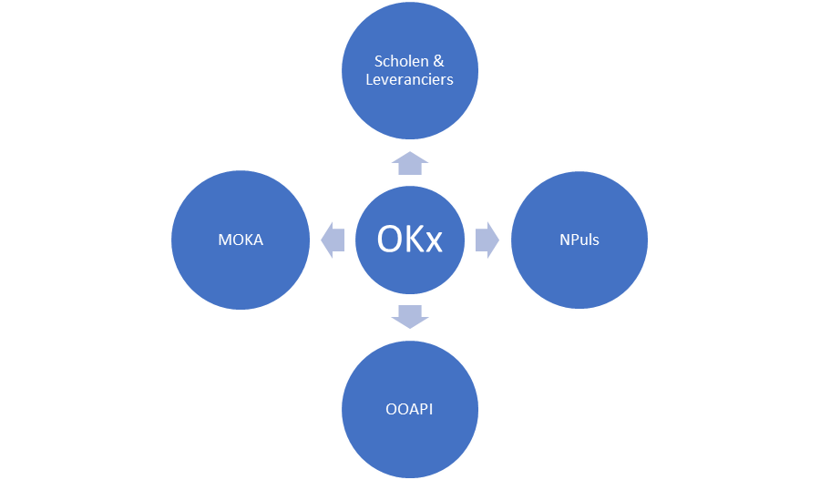
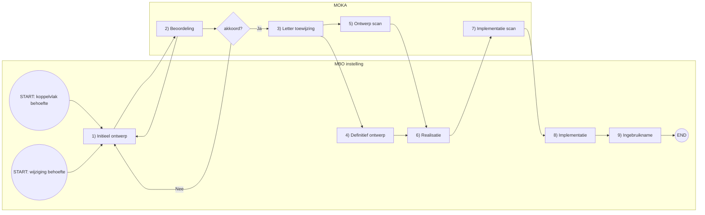
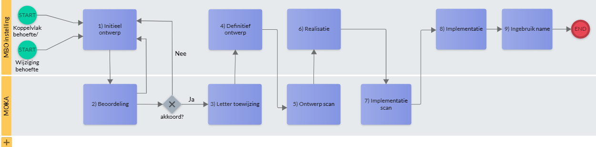
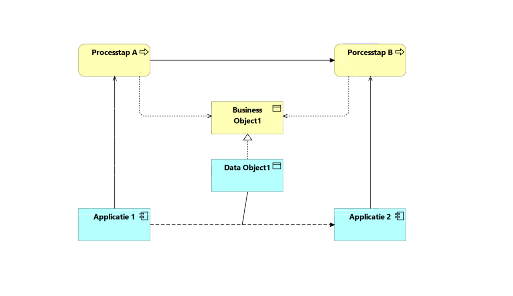

# OKx guidelines

**Richtlijnen inrichting systeemintegraties MBO**

| **Versie** | **Datum** |
|---|---|
| 1.0 | 1 september 2025 |

> Origineel document: `doc/OKx guidelines v01-09-25(1).docx`  
> Afbeeldingen: `img/`

## Revisiehistorie

| **Versie** | **Omschrijving** | **Auteur** | **Datum** |
|---|---|---|---|
| 1.0 | De eerste officiële versie uitgegeven vanuit de MOKA. | E. Zwankhuizen / Werkgroep MOKA | 1 september 2025 |

## Beheer

- **Beheerder**: Werkgroep MOKA
- **Bijdragen**: Jos van der Arend, Hans Swart, Kees van Ginkel, Patrick van der Veer

## Distributielijst

| **Versie** | **Datum** | **Ontvanger(s)** |
|---|---|---|
| 1.0 | 01 september 2025 | MOKA werkgroepleden |

## Inhoudsopgave

- [OKx guidelines](#okx-guidelines)
  - [Revisiehistorie](#revisiehistorie)
  - [Beheer](#beheer)
  - [Distributielijst](#distributielijst)
  - [Inhoudsopgave](#inhoudsopgave)
  - [1. Inleiding](#1-inleiding)
  - [2. Kaders en richtlijnen (Guidelines OKx)](#2-kaders-en-richtlijnen-guidelines-okx)
    - [2.1. Okx initiatie](#21-okx-initiatie)
    - [2.2. Guidelines en volgende versies](#22-guidelines-en-volgende-versies)
    - [2.3. Werkwijze](#23-werkwijze)
    - [2.4. Transparantie en draagvlak](#24-transparantie-en-draagvlak)
    - [2.5. Specificaties](#25-specificaties)
    - [2.6. OKx ecosysteem](#26-okx-ecosysteem)
  - [Bijlagen](#bijlagen)

---

## 1. Inleiding

Dit document betreft de uitwerking van kaders en richtlijnen voor het ontwikkelen van systeemintegraties binnen de MBO sector. Veel integraties kunnen gerealiseerd worden op basis van OOAPI m.b.t. specificaties en implementaties. Door richtlijnen te hanteren kan vaart worden gehouden in de ontwikkeling van koppelingen en tegelijkertijd de kwaliteit van die koppelingen worden ondersteund en bewaakt. De verzamelnaam voor toekomstige integraties voor het MBO is OKx. Hierbij staat OK voor onderwijskoppeling en de x betreft een nader uit te geven letter die een specifieke integratie duidt.  

Een bijkomend doel van OKx is dat nieuwe partijen makkelijk kunnen toetreden tot de onderwijsmarkt, zonder langlopende standaardisatietrajecten. Daarmee kunnen de drempels voor het instappen worden verlaagd.  

Basis voor deze uitwerking zijn de vele lessen die uit het OKE-traject (Onderwijs Koppelingen Examinering) van de afgelopen jaren zijn getrokken en de inzichten die de MOKA (MBO onderwijs koppel architectuur) sinds haar oprichting heeft opgedaan. Het betreft richtlijnen voor ontwikkeling van nieuwe koppelingen en koppelvlakken.  

Verder staat er in deze inleiding een korte samenvatting van de belangrijke ontwikkelingen die ten grondslag liggen aan de OKx trajecten: het gebruik van de OOAPI-standaard op basis van het beleid ‘OOAPI, tenzij’, omdat we verwachten dat niet alle te ontwikkelen functionaliteit binnen de OOAPI standaard zou kunnen vallen.

## 2. Kaders en richtlijnen (Guidelines OKx)

*Figuur 1: betrokken partijen Okx*

Bij de totstandkoming van een OKx koppelvlak zijn veelal voorgenoemde partijen betrokken. De MOKA ziet toe op dat het koppelvlak aansluit bij de referentie architectuur die borgt dat er een generieke inrichting wordt gehanteerd die toekomstbestendig is en bruikbaar is voor alle MBO instellingen in de vorm van kaders en richtlijnen. Npuls ondersteunt onderwijsprojecten die generiek toepasbaar zijn binnen de onderwijssector (MBO overstijgend). OOAPI ontwikkelt en beheert een technische standaard voor data uitwisseling voor het onderwijs. Scholen en leveranciers betreffen respectievelijk de opdrachtgevers en fabrikanten van de daadwerkelijke koppelvlakken. 

### 2.1. Okx initiatie

Het benoemen van de koppelingen (De **letter ‘x’ van de OKx**) worden uitgedeeld door de MOKA-werkgroep om wildgroei te voorkomen. Dit geeft ook gelijk coördinatie en zichtbaarheid en mogelijkheden voor verbinding met de referentiearchitectuur. 

Deze **MOKA-werkgroep** is ook een belangrijk aanspreekpunt voor vragen en/of begeleiding. En voor kwesties die niet gemakkelijk onderling kunnen worden opgelost, of voor zaken die in relatie tot de OOAPI-werkgroep spelen.

Bij de definities en uitwerking in OOAPI is het verstandig om bij uitbreidingen in een vroeg stadium een klankboard te zoeken in de **OOAPI-werkgroep**. Hiermee wordt indirect ook het HO betrokken. Dit mede om te checken of de uitbreidingen passen in de visie van OOAPI en dus potentieel kunnen leiden tot uitbreiding van de OOAPI standaard (versie 6.0 en verder). 

Hiermee kan OKx direct vanuit OOAPI ontwikkeld worden (indien het past, scoping en fit zal nog moeten plaatsvinden) en uitgebracht worden als een nieuwe OOAPI release (met mogelijk/waarschijnlijk een OKx consumer). 

Dit mede om te checken of de uitbreidingen passen in de visie van OOAPI en dus potentieel kunnen leiden tot uitbreiding van de OOAPI standaard (versie 6.0 en verder).

Doel van de ontwikkeling is ook om de OKx specificaties als onderdeel van OOAPI **in beheer** te laten nemen bij Edustandaard. Implementeren en testen is aan de betrokken partners onderling; definieer hiervoor één of meer pilots. Als de standaard in beheer genomen wordt kan er ook gevalideerd moeten worden.

### 2.2. Guidelines en volgende versies

Dit guidelines document is een eerste versie; dit document is opgesteld om initiatiefnemers snel enige duidelijkheid te bieden. Het document is echter nog in ontwikkeling. Van OKx initiatieven wordt verwacht dat ze zich zullen committeren aan volgende versies van dit document; waarbij uiteraard overlegd zal worden over de timing van de bijbehorende inspanningen.

### 2.3. Werkwijze

Nieuwe initiatieven melden zich bij de werkgroep MOKA, met een korte beschrijving van hun initiatief (scope en doelstelling van het initiatief). Initiatiefnemers committeren zich aan werken onder architectuur. Dit wordt bevestigd in een afspraak tussen de werkgroep MOKA en initiatienemer. De afspraak betekent onder andere: 

1. Commitment aan dit guidelines document en volgende versies hiervan. 
2. Voorleggen van het ontwerp voor de OKx koppeling ter goedkeuring werkgroep MOKA en werkgroep OOAPI.
3. Overdracht van de specificaties na implementatie, test en oplevering. Deze overdracht is aan de werkgroep MOKA die vanaf dat moment verantwoordelijk wordt voor onderhoud (volgende versies) van de specificatie (hieraan kan de betreffende OKx initiatiefnemer uiteraard weer meewerken, maar dit zal mogelijk verschillend worden opgepakt).
4. Geschillen worden voorgelegd aan de architectuurraad mbo/hbo en via deze eventueel aan de CIO-raad mbo/ho.

Figuur 2 geeft het proces, van idee tot live gang, weer. De MBO instelling is als realisatiepartij weergegeven. In de praktijk is dit een samenwerking van instellingen en leveranciers. Het heeft de voorkeur dat een instelling de kartrekker is en tevens aanspreekpartij voor de MOKA is. Indien wenselijk kan dit ook een leverancier zijn.

*Figuur 2: Koppelvlak proces (Mermaid-variant)*

*Figuur 2b: Koppelvlak proces (origineel)*

Om volgens een gestructureerde aanpak tot bouwbare specificaties te komen wordt aanbevolen de **AMIGO-aanpak** te volgen. De [Edustandaard AMIGO-aanpak](https://www.edustandaard.nl/amigo/) (Aanpak voor Modulair opgebouwde Interacties en Gegevensstructuren in het Onderwijs) is bedoeld voor leveranciers en andere belanghebbenden van digitale diensten in het onderwijs: of ze nu publiek of privaat zijn. Zij kunnen met behulp van de AMIGO-aanpak afspraken maken over gegevensuitwisselingen in het onderwijs. De AMIGO-aanpak bestaat uit de zes stappen: Scenario-analyse, Gegevensanalyse, Interactie-analyse, Technologiekeuze, Berichtspecificatie en Interfacespecificatie.

Maak in de OKx specificaties duidelijk welke **processen** betrokken en gebaat zijn bij de informatiestromen (flows). Gebruik hiervoor het [MORA hoofdprocesmodel](https://mora.mbodigitaal.nl/index.php/Hoofdpagina#Hoofdprocesmodel). 

Geef bij de informatiestromen aan welke **informatieobjecten** zijn betrokken. Gebruik hiervoor het [MORA informatiemodel](https://mora.mbodigitaal.nl/index.php/Informatiemodel) en modeleer de koppelvlakken overeenkomstig het metamodel als in figuur 3.

*Figuur 3: Metamodel koppelvlak*

Bepaal per informatiestroom de interactiepatronen die worden gebruikt om de informatie over te dragen. Denk hierbij aan ophalen (Pull) of brengen (Push), eventueel voorafgegaan door een notificatie.

### 2.4. Transparantie en draagvlak

Partijen die een OKx willen ontwikkelen moeten dat doen op een **open manier** zodat er al in een vroeg stadium door andere geïnteresseerden meegekeken kan worden. De ontwikkeling zal via een centrale, publieke repository worden gedocumenteerd. Daarbij wordt gedacht aan GitHub (zoals [Onderwijs-Koppelingen-OKx op GitHub](https://github.com/orgs/Onderwijs-Koppelingen-OKx/repositories)); preciezere GitHub-locatie en uitwerking in GitHub volgt later.  
Direct en regelmatige interactie tussen initiatiefnemers en de  MOKA zorgt ervoor dat communicatie richting belanghebbenden en geïnteresseerden via MOKA kan en zal plaatsvinden.

Uitgangspunt is dat partijen die een OKx ontwikkelen, **geld en/of tijd beschikbaar stellen** om deze te implementeren. Dit kunnen zowel scholen als marktpartijen zijn. Bij voorkeur zijn er meerdere implementaties van dezelfde onderdelen, zodat beter kan worden geborgd dat de oplossing generieker toepasbaar is.

Het streven is om verschillende partijen (ook andere marktpartijen) **mee te laten kijken** bij de realisatie van een koppeling. Als dit actief in een vroeg stadium plaatsvindt, werken we aan een zo groot mogelijk draagvlak voor de te realiseren koppeling en dat voorkomen wordt dat er meerdere versies ontstaan. 

Stel de OKx **technische specificaties publiek** beschikbaar volgens OAS (Open API Specification) in YAML en in een begeleidend specificatiedocument voor de niet-technici om beter inzicht in de verbinding van functionaliteit naar techniek. De beide specificatie-uitwerkingen moeten vrij beschikbaar en vrij van auteursrechten zijn. Deze combinatie van technische specificaties en specificatiedocument zorgt voor een gemeenschappelijk beeld bij alle betrokkenen, zowel vanuit verschillende functies/rollen als vanuit de betrokken ketenpartijen.

### 2.5. Specificaties

Iedere OKx met gebruik van OOAPI moet gebaseerd zijn op de **OOAPI** v5 (of hogere versie indien dit wordt besloten in de Technische Werkgroep OOAPI). Kies alleen OOAPI als basis voor een uitwisseling indien OOAPI bruikbaar is. Gebruik OOAPI niet voor zaken waar het niet voor is bedoeld, zoals learning analytics of leermiddelen. OOAPI is geen duizend-dingen-doekje! Het beleid is: “OOAPI, tenzij...”. Kies in andere gevallen de juiste alternatieve standaard als basis.

OOAPI omvat een gegevensmodel en interfacemodel waarbij REST-JSON wordt toegepast. De specificatie schrijft voor beveiliging geen keuze voor, maar geeft als best-practice voor de beveiliging OAuth2 aan. 

Iedere OKx omvat een deelverzameling van de **benodigde onderdelen van OOAPI**; d.w.z. een specifieke selectie uit de beschikbare (optionele) endpoints, operaties, resources, objecten, attributen, enumeratiewaarden van OOAPI. Deze selectie is per OKx en hoeft niet over alle OKx afspraken heen hetzelfde te zijn.

**Benodigde aanvullingen** op OOAPI (endpoints, operaties, resources, objecten, attributen, enumeraties) passen bij OOAPI en zijn afgestemd met de OOAPI werkgroep: 

- Aanvullende **endpoints** **en resources** op bestaande endpoints vraagt afstemming met de OOAPI werkgroep; deze werkgroep houdt daarmee het overzicht en het helpt alle endpoints en resources consistent en in dezelfde ontwikkellijn te houden.
- Aanvullende **methodes/operaties** op bestaande endpoints kunnen nodig zijn om bepaalde processen te ondersteunen. In OOAPI zijn alleen de leesmethoden (GET-operaties) gedefinieerd.
- Aanvullende **attributen** (properties) in de objecten moeten altijd via het Consumer-mechanisme van OOAPI. Totdat er een officiële registratie van de toepassing heeft plaatsgevonden heeft de consumerkey voorlopig een prefix van “x-“.
- Aanvullende **waarden in een waardelijst** (enumeratiewaarden) mogen alleen bij uitbreidbare waardelijsten en moeten altijd het prefix van “x-“ hebben.

Let op, aanvullingen zijn nooit een vervanging van een bestaand onderdeel van OOAPI. Het is dus niet toegestaan om bepaalde onderdelen, bijvoorbeeld opleidingsaanbod (ProgramOffering) of gebouw (Building), te vervangen door een zelfgemaakte oplossing.

Na het definiëren en beschrijven van informatiestromen, is het goed gebruik gebleken de gegevensobjecten binnen deze informatiestromen uit te werken in een **klassediagram** en de interacties uit te werken in een **sequence diagram**, eventueel aangevuld met **JSON-voorbeelden** te documenteren in samenhang met de interacties en het berichtenverkeer. Het vertrekpunt van de koppeling is een ArchiMate-uitwerking van de koppelingen.[^1]

Maak in de OKx specificaties duidelijk hoe de systemen/applicaties in zijn algemeenheid moeten **reageren op API verzoeken**, zoals bij ontbreken van autorisatie, slecht geformuleerde verzoeken en overbodige verzoeken.

### 2.6. OKx ecosysteem

Iedere OKx definieert één of meerdere **scopes** die worden gebruikt voor autorisatie. Een scope is een samenhangend onderdeel van de uitwisselingsketen die een eigen doelstelling, doelgroep (ketenpartners) en betreffende gegevens hebben die daarmee de beveiliging bepalen. Iedere ketenpartner wisselt gegevens uit in één of meerdere scopes binnen de gehele uitwisselingsketen.

**Technische keuzes** buiten OOAPI (zoals het gebruik van extra benodigde gegevens in consumers, beveiliging, etc.) in eerdere uitwerkingen zijn richtinggevend voor toekomstige uitwerkingen zoals de OKx uitwerkingen. Dus graag dezelfde keuzes aanhouden zodat er ook consistentie in uitwerkingen ontstaat. 

Veelal is het uitgangspunt bij integraties, point to point verbinding tussen de systemen, zonder centrale ketenvoorzieningen (integratieplatform). De toepassing van een centraal integratieplatform zal naar de toekomst toenemen. Zie ook de visie van de sector architectuur (MOSA) hiertoe.

Bij het ontwikkelen van een OKx integratie wordt gevraagd rekening te houden met deze toekomstige te ontwikkelen centrale sectorvoorzieningen. Een integratie dient dus zowel voor point-to-point als met integratieplatform toepasbaar te zijn.

## Bijlagen

Open Onderwijs API (OOAPI) is vanaf 2014 ontwikkeld door Surf in Nederland om onderwijssystemen te verbinden binnen hoger onderwijs, met een focus op open data en onderwijs gerelateerde informatie zoals vakken, roosters en studenteninformatie. Inmiddels is [OOAPI versie 5](https://openonderwijsapi.nl/#/) gepubliceerd en is de [afspraak OOAPI v5](https://www.edustandaard.nl/standaard_afspraken/open-onderwijs-api/open-onderwijs-api-5-0/) bij Edustandaard geregistreerd. Inmiddels is men binnen OOAPI-community aan het nadenken over OOAPI versie 6.

OOAPI is gestart binnen het NL hoger onderwijs en was initieel gericht op samenwerking tussen onderwijsinstellingen onderling, maar wordt inmiddels ook gebruikt voor interne informatiehuishouding en koppelingen. OOAPI heeft een sterke overlap met de Edu-API van 1EdTech (vanaf 2017). Deze soortgelijke internationale standaard is ontworpen voor de gegevensuitwisseling tussen de IT-systemen binnen een instelling. Maar Edu-API heeft nog zeer weinig implementaties.

Belangrijke informatiebronnen van OKx-trajecten zijn:

- Open Education API: [https://openonderwijsapi.nl](https://openonderwijsapi.nl) 
- OOAPI Github repository: [https://github.com/open-education-api](https://github.com/open-education-api) 
- OOAPI v5 datamodel: [https://openonderwijsapi.nl/specification/v5/OOAPIv5_model.png](https://openonderwijsapi.nl/specification/v5/OOAPIv5_model.png) 
- OOAPI OAS-schemadefinities 5.0.0 (technische informatie) in de OOAPI GitHub repository: [https://netwerkexamineringdigitalisering.github.io/NED-OOAPI/specification/v5/docs.html](https://netwerkexamineringdigitalisering.github.io/NED-OOAPI/specification/v5/docs.html), [https://openonderwijsapi.nl/specification/v5/docs.html](https://openonderwijsapi.nl/specification/v5/docs.html)  
- Release 1.0 van de technische specs v5 op 21-09-2022: [https://github.com/open-education-api/specification/releases/tag/release-1](https://github.com/open-education-api/specification/releases/tag/release-1) 
- Edustandaard afspraak OOAPI, versie 5.0 (oktober 2022): [https://www.edustandaard.nl/standaard_afspraken/open-onderwijs-api/open-onderwijs-api-5-0/](https://www.edustandaard.nl/standaard_afspraken/open-onderwijs-api/open-onderwijs-api-5-0/) 
- Issues in de OOAPI Github repository: [https://github.com/open-education-api/specification/issues](https://github.com/open-education-api/specification/issues) 

[^1]: Op moment van schrijven is hier nog een metamodel voor in ontwikkeling en niet vastgesteld.
